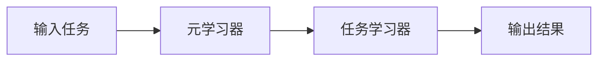
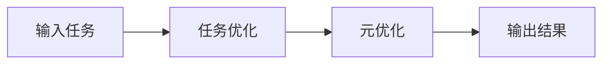
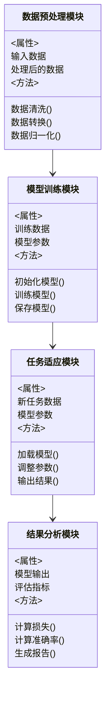
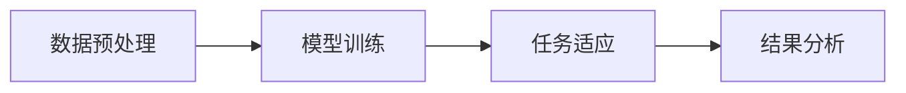
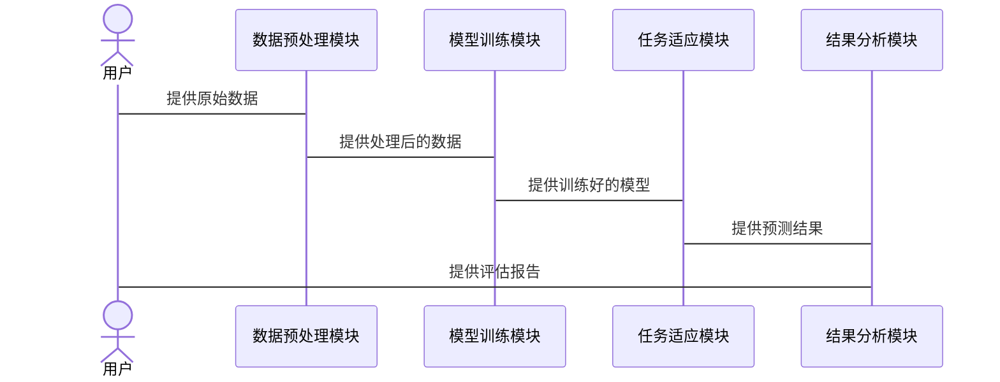

                 


# 开发具有元学习能力的AI Agent

## 关键词：元学习、AI Agent、Meta-LSTM、MAML、系统架构设计

## 摘要：
本文旨在探讨如何开发具有元学习能力的AI Agent。通过详细分析元学习的基本概念、核心算法、系统架构设计及项目实战，本文将为读者提供从理论到实践的全面指导。元学习（Meta-Learning）是一种高级的机器学习方法，允许AI Agent在有限的数据和经验下快速适应新任务。本文将通过Meta-LSTM和MAML等核心算法的详细讲解，结合系统架构设计和实际案例分析，帮助读者掌握开发具有元学习能力的AI Agent的关键技术。

---

# 第一部分: 元学习与AI Agent基础

## 第1章: 元学习与AI Agent概述

### 1.1 元学习的基本概念

#### 1.1.1 元学习的定义与背景
元学习（Meta-Learning）是一种机器学习技术，旨在通过训练模型在多个任务上进行学习，使得模型能够快速适应新任务，即使在数据量有限的情况下。与传统机器学习不同，元学习关注的是如何优化学习过程，而不是具体任务的解决方案。

**元学习的背景**  
在传统机器学习中，模型通常需要大量标注数据来训练特定任务。然而，在实际应用中，数据获取成本高、数据稀疏等问题常常限制了模型的泛化能力。元学习通过在任务层面进行优化，使得模型能够在少量数据下快速适应新任务。

#### 1.1.2 元学习的核心特点
1. **任务层面的优化**：元学习关注如何优化模型在多个任务上的表现，而不仅仅是单一任务。
2. **快速适应能力**：元学习模型能够在新任务上快速调整参数，适应数据分布的变化。
3. **通用性**：元学习模型通常具有较强的泛化能力，适用于多种不同的任务。

#### 1.1.3 元学习与传统机器学习的区别
| 对比维度 | 传统机器学习 | 元学习 |
|----------|--------------|--------|
| 学习目标 | 特定任务的优化 | 多任务的优化 |
| 数据需求 | 需要大量数据 | 数据量有限 |
| 灵活性 | 适应新任务困难 | 易于适应新任务 |

### 1.2 AI Agent的基本概念

#### 1.2.1 AI Agent的定义与分类
AI Agent（人工智能代理）是指能够感知环境、自主决策并执行任务的智能体。AI Agent可以分为以下几类：
1. **简单反射型Agent**：基于当前输入做出反应，不依赖内部状态。
2. **基于模型的反射型Agent**：利用内部模型进行决策，具有一定的规划能力。
3. **目标驱动型Agent**：根据预定义的目标选择行动。
4. **实用驱动型Agent**：通过最大化效用函数来优化决策。

#### 1.2.2 具有元学习能力的AI Agent的特点
1. **快速学习能力**：能够通过少量数据快速适应新任务。
2. **任务泛化能力**：能够在不同任务之间共享学习成果。
3. **自适应能力**：能够根据环境变化动态调整行为。

#### 1.2.3 元学习在AI Agent中的应用价值
元学习为AI Agent提供了以下优势：
1. **减少数据依赖**：在数据稀缺的场景下，元学习能够帮助AI Agent快速学习新任务。
2. **提高灵活性**：元学习使AI Agent能够更好地适应动态变化的环境。
3. **增强泛化能力**：通过多任务学习，AI Agent能够在不同领域中表现出色。

### 1.3 元学习与AI Agent的结合

#### 1.3.1 元学习在AI Agent中的作用
元学习通过优化AI Agent的学习过程，使其能够更快、更高效地适应新任务。具体来说，元学习帮助AI Agent在以下方面表现更好：
1. **快速决策**：在面对新任务时，AI Agent能够快速调整策略，做出最优决策。
2. **任务迁移**：通过共享学习经验，AI Agent能够在不同任务之间切换时保持高效表现。
3. **动态适应**：在动态变化的环境中，元学习使AI Agent能够快速调整行为以适应新情况。

#### 1.3.2 元学习能力对AI Agent性能的提升
1. **提高学习效率**：通过元学习，AI Agent能够在有限的数据下快速掌握新任务。
2. **增强泛化能力**：元学习使AI Agent能够在不同任务中共享学习成果，从而提高整体性能。
3. **降低数据依赖**：在数据稀缺的场景下，元学习使AI Agent能够更好地进行学习和推理。

#### 1.3.3 元学习在AI Agent中的实现方式
元学习在AI Agent中的实现通常包括以下几个步骤：
1. **任务采样**：从多个任务中随机采样，构建训练数据集。
2. **元学习器训练**：通过元学习算法（如Meta-LSTM、MAML等）训练元学习器，使其能够在多个任务上表现良好。
3. **任务适应**：在面对新任务时，元学习器能够快速调整参数，适应新任务。

### 1.4 本章小结
本章介绍了元学习和AI Agent的基本概念，并探讨了元学习在AI Agent中的应用价值。通过元学习，AI Agent能够快速适应新任务，提高学习效率和泛化能力，从而更好地应对复杂多变的环境。

---

# 第二部分: 元学习算法原理

## 第2章: 元学习的核心算法

### 2.1 Meta-LSTM算法

#### 2.1.1 Meta-LSTM的算法原理
Meta-LSTM是一种基于循环神经网络（RNN）的元学习算法，旨在通过在多个任务上进行训练，使得模型能够快速适应新任务。Meta-LSTM的核心思想是通过元学习器和任务学习器的结合，实现对多个任务的联合优化。

**Meta-LSTM的结构**  
Meta-LSTM模型通常包含两个LSTM层：
1. **元学习层（Meta-LSTM）**：负责学习如何调整任务学习层的参数。
2. **任务学习层（Task-LSTM）**：负责具体任务的序列建模。

#### 2.1.2 Meta-LSTM的数学模型
Meta-LSTM的数学模型如下：
$$
\begin{aligned}
h_t &= \text{LSTM}(h_{t-1}, x_t) \\
\theta_{t} &= \text{LSTM}(h_t, \theta_{t-1})
\end{aligned}
$$

其中：
- $h_t$ 表示元学习层的隐藏状态。
- $x_t$ 表示输入序列。
- $\theta_t$ 表示任务学习层的参数。

**Meta-LSTM的实现流程**  


#### 2.1.3 Meta-LSTM的实现细节
1. **输入处理**：将多个任务的数据输入到Meta-LSTM模型中。
2. **元学习层训练**：通过反向传播算法，优化元学习层的参数，使得模型能够在多个任务上表现良好。
3. **任务学习层调整**：在面对新任务时，元学习层能够快速调整任务学习层的参数，适应新任务。

### 2.2 MAML算法

#### 2.2.1 MAML的算法原理
MAML（Meta-Automated Learning）是一种基于梯度的元学习算法，旨在通过在多个任务上进行优化，使得模型能够在新任务上快速收敛。MAML的核心思想是通过最小化任务损失函数的梯度，使得模型能够在多个任务上共享参数。

**MAML的结构**  
MAML模型通常包含两个优化步骤：
1. **任务优化**：在每个任务上，通过对模型参数进行微调，最小化任务损失。
2. **元优化**：通过对任务优化过程中的梯度进行聚合，优化模型的初始参数。

#### 2.2.2 MAML的数学模型
MAML的数学模型如下：
$$
\begin{aligned}
\theta' &= \theta + \alpha \nabla_{\theta} \mathcal{L}_\text{task}(\theta) \\
\mathcal{L}_\text{meta} &= \mathcal{L}_\text{task}(\theta') + \beta \mathcal{L}_\text{task}(\theta)
\end{aligned}
$$

其中：
- $\theta$ 表示模型的初始参数。
- $\theta'$ 表示微调后的参数。
- $\alpha$ 和 $\beta$ 表示超参数。
- $\mathcal{L}_\text{task}$ 表示任务损失函数。

**MAML的实现流程**  


#### 2.2.3 MAML的实现细节
1. **任务优化**：在每个任务上，通过对模型参数进行微调，最小化任务损失。
2. **梯度聚合**：通过计算多个任务的梯度，并对这些梯度进行加权平均，优化模型的初始参数。
3. **元优化**：通过对模型初始参数进行优化，使得模型能够在多个任务上表现良好。

### 2.3 其他元学习算法
除了Meta-LSTM和MAML，还有其他一些元学习算法，如Meta-SGD、Reptile等。这些算法在实现细节和优化策略上有所不同，但在核心思想上都是通过优化多个任务的梯度，使得模型能够在新任务上快速收敛。

---

# 第三部分: 系统架构设计

## 第3章: 元学习AI Agent的系统架构

### 3.1 系统架构设计概述

#### 3.1.1 系统功能模块
1. **数据预处理模块**：负责将输入数据进行清洗、转换和归一化处理。
2. **模型训练模块**：负责训练元学习模型，优化模型参数。
3. **任务适应模块**：负责在新任务上快速调整模型参数，适应新任务。
4. **结果分析模块**：负责对模型输出的结果进行分析和评估。

#### 3.1.2 系统功能设计


#### 3.1.3 系统架构设计


### 3.2 系统接口设计

#### 3.2.1 系统接口概述
系统接口是系统与其他组件之间的交互界面。元学习AI Agent的系统接口设计需要考虑以下几点：
1. **输入接口**：接收多个任务的数据和参数。
2. **输出接口**：输出模型的预测结果和评估指标。
3. **控制接口**：控制模型的训练和推理过程。

#### 3.2.2 接口设计细节
1. **数据预处理接口**：
   ```python
   def preprocess_data(data):
       # 数据清洗和转换逻辑
       return processed_data
   ```
2. **模型训练接口**：
   ```python
   def train_model(train_data, train_labels):
       # 模型训练逻辑
       return model_weights
   ```
3. **任务适应接口**：
   ```python
   def adapt_task(test_data, test_labels, model_weights):
       # 任务适应逻辑
       return adapted_weights
   ```
4. **结果分析接口**：
   ```python
   def analyze_results(predictions, ground_truth):
       # 结果分析逻辑
       return metrics
   ```

### 3.3 系统交互流程

#### 3.3.1 系统交互概述
系统交互流程是指系统在训练和推理过程中，各模块之间的交互过程。元学习AI Agent的系统交互流程如下：
1. 数据预处理模块接收原始数据，并进行清洗和转换。
2. 模型训练模块基于处理后的数据，训练元学习模型，优化模型参数。
3. 任务适应模块在新任务上加载训练好的模型，并快速调整模型参数，适应新任务。
4. 结果分析模块对模型的输出结果进行分析和评估。

#### 3.3.2 系统交互流程图


### 3.4 系统架构优化

#### 3.4.1 系统架构优化概述
为了提高系统的性能和可扩展性，需要对元学习AI Agent的系统架构进行优化。优化的方向包括：
1. **并行计算**：通过并行计算加速模型的训练和推理过程。
2. **分布式训练**：将训练任务分发到多个节点，提高训练效率。
3. **模型压缩**：通过模型压缩技术，减少模型的存储和计算开销。

#### 3.4.2 系统优化策略
1. **并行计算**：
   ```python
   import torch
   # 使用GPU加速计算
   device = torch.device("cuda" if torch.cuda.is_available() else "cpu")
   model = model.to(device)
   ```
2. **分布式训练**：
   ```python
   import torch.distributed as dist
   # 初始化分布式环境
   dist.init_process_group("gloo", rank=rank, world_size=world_size)
   # 分散训练数据
   train_loader = torch.utils.data.distributed.DistributedSampler(train_dataset, num_replicas=world_size, rank=rank)
   ```
3. **模型压缩**：
   ```python
   # 剪枝算法
   def prune_model(model, prune_rate):
       # 剪枝逻辑
       pass
   ```

---

# 第四部分: 项目实战

## 第4章: 元学习AI Agent的实现

### 4.1 项目实战概述

#### 4.1.1 项目目标
本项目旨在实现一个具有元学习能力的AI Agent，能够在多个任务上进行训练，并快速适应新任务。

#### 4.1.2 项目需求
1. **支持多个任务的训练**：模型需要能够在多个任务上进行训练，优化模型参数。
2. **快速适应新任务**：在面对新任务时，模型能够快速调整参数，适应新任务。
3. **提供评估结果**：模型需要提供预测结果和评估指标，帮助用户分析模型性能。

### 4.2 项目环境配置

#### 4.2.1 环境配置概述
为了实现元学习AI Agent，需要配置以下环境：
1. **编程语言**：Python 3.7+
2. **深度学习框架**：TensorFlow或PyTorch
3. **计算资源**：GPU支持（NVIDIA显卡）

#### 4.2.2 安装依赖
```bash
pip install numpy
pip install matplotlib
pip install scikit-learn
pip install torch
pip install transformers
```

### 4.3 系统核心实现

#### 4.3.1 数据预处理实现
```python
import numpy as np
import pandas as pd

def preprocess_data(data):
    # 数据清洗
    data = data.dropna()
    # 数据转换
    data = pd.get_dummies(data)
    # 数据归一化
    data = (data - data.mean()) / data.std()
    return data
```

#### 4.3.2 模型训练实现
```python
import torch
import torch.nn as nn
import torch.optim as optim

class MetaLSTM(nn.Module):
    def __init__(self, input_size, hidden_size):
        super(MetaLSTM, self).__init__()
        self.lstm = nn.LSTM(input_size, hidden_size, batch_first=True)
        self.adapter = nn.Linear(hidden_size, hidden_size)
    
    def forward(self, x, hidden=None):
        out, hidden = self.lstm(x, hidden)
        adapted_out = self.adapter(out)
        return adapted_out, hidden

def train_model(model, train_loader, optimizer, criterion, num_epochs):
    for epoch in range(num_epochs):
        for inputs, labels in train_loader:
            optimizer.zero_grad()
            outputs, _ = model(inputs)
            loss = criterion(outputs, labels)
            loss.backward()
            optimizer.step()
    return model.state_dict()
```

#### 4.3.3 任务适应实现
```python
def adapt_task(model, task_data, task_labels, model_weights):
    model.load_state_dict(model_weights)
    model.eval()
    with torch.no_grad():
        outputs, _ = model(task_data)
    return outputs
```

#### 4.3.4 结果分析实现
```python
def analyze_results(predictions, ground_truth):
    from sklearn.metrics import accuracy_score
    accuracy = accuracy_score(ground_truth, predictions)
    return accuracy
```

### 4.4 项目实战小结
本章通过一个具体的项目实战，详细讲解了如何实现一个具有元学习能力的AI Agent。通过数据预处理、模型训练、任务适应和结果分析四个步骤，读者可以掌握元学习AI Agent的核心实现技术。

---

# 第五部分: 总结与展望

## 第5章: 元学习与AI Agent的未来展望

### 5.1 元学习的重要性和应用前景
元学习作为一种高级的机器学习技术，已经在多个领域展现出巨大的潜力。随着技术的进步，元学习在AI Agent中的应用将更加广泛，尤其是在需要快速适应新任务的场景中，如自动驾驶、智能客服、医疗诊断等。

### 5.2 元学习的未来发展方向
1. **算法优化**：进一步优化元学习算法，提高模型的泛化能力和适应能力。
2. **应用场景扩展**：将元学习技术应用于更多领域，如边缘计算、联邦学习等。
3. **人机协作**：结合人机协作，使得AI Agent能够更好地与人类交互，提供更智能化的服务。

### 5.3 元学习的挑战与解决方案
1. **计算资源限制**：元学习通常需要大量的计算资源，可以通过分布式训练和模型压缩等技术来缓解。
2. **数据稀疏性**：在数据稀缺的场景下，元学习的效果可能不佳，可以通过数据增强和迁移学习等技术来改善。

### 5.4 本章小结
本章探讨了元学习的重要性和未来发展方向，并分析了元学习在应用中可能面临的挑战及解决方案。通过不断的技术创新和实践积累，元学习将在AI Agent的发展中发挥越来越重要的作用。

---

# 第六部分: 最佳实践与注意事项

## 第6章: 元学习开发的注意事项

### 6.1 元学习开发中的常见问题
1. **数据质量问题**：数据质量对元学习模型的性能影响较大，需要对数据进行充分的清洗和预处理。
2. **模型过拟合**：在元学习中，模型容易过拟合训练数据，可以通过正则化和数据增强等技术来缓解。
3. **计算资源不足**：元学习通常需要大量的计算资源，可以通过分布式训练和模型剪枝等技术来优化。

### 6.2 元学习开发中的最佳实践
1. **选择合适的算法**：根据具体任务的需求，选择合适的元学习算法，如Meta-LSTM、MAML等。
2. **充分的实验验证**：在开发过程中，需要进行充分的实验验证，确保模型的性能和泛化能力。
3. **持续优化**：通过持续优化模型参数和算法设计，不断提高模型的性能和适应能力。

### 6.3 元学习开发中的注意事项
1. **数据多样性**：在训练元学习模型时，需要确保数据的多样性，以提高模型的泛化能力。
2. **模型解释性**：元学习模型通常较为复杂，需要关注模型的解释性，以便更好地理解和优化模型。
3. **安全性与隐私保护**：在实际应用中，需要关注模型的安全性和数据隐私保护。

### 6.4 本章小结
本章总结了元学习开发中的常见问题和最佳实践，帮助读者在开发过程中避免常见错误，并提高开发效率。

---

# 结语

开发具有元学习能力的AI Agent是一项具有挑战性的任务，但通过不断的技术创新和实践积累，元学习将在未来发挥越来越重要的作用。本文从元学习的基本概念、核心算法、系统架构设计到项目实战，为读者提供了一条从理论到实践的完整路径。希望本文能够为读者在开发具有元学习能力的AI Agent过程中提供有价值的参考和指导。

