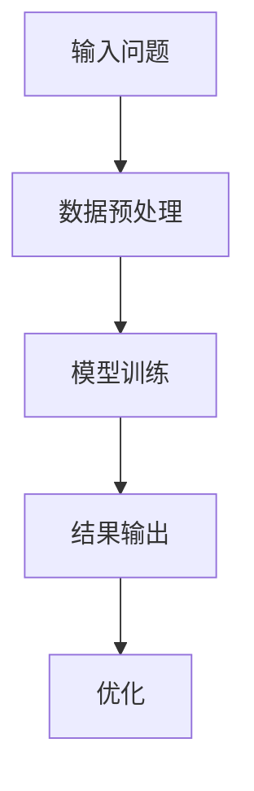

                 


# 开发具有创造性问题重构能力的AI Agent

> 关键词：AI Agent，创造性问题重构，算法原理，系统架构，项目实战

> 摘要：本文探讨了开发具有创造性问题重构能力的AI Agent的关键技术与实现方法，涵盖了从理论到实践的多个方面，包括核心概念、算法原理、系统架构设计和实际案例分析，为读者提供了全面的技术指导。

---

## 第一章: 创造性问题重构能力的AI Agent概述

### 1.1 问题背景
- **AI Agent的发展现状**：当前AI Agent在各个领域的应用广泛，但其问题解决能力多依赖于规则和数据，缺乏真正的创造性。
- **创造性问题重构的重要性**：在复杂场景中，传统方法难以应对非结构化问题，创造性重构能力成为关键。
- **核心要素**：包括问题识别、重构、生成和验证，这些要素共同决定了AI Agent的问题解决能力。

### 1.2 问题解决与重构能力
- **传统方法的局限性**：依赖预设规则，难以应对未知和复杂问题。
- **创造性重构的优势**：能够重新定义问题，发现新的解决方案，提高问题解决的效率和效果。
- **重构能力的作用**：通过重新构造问题，AI Agent能够突破传统思维的限制，找到更优解。

### 1.3 概念结构与核心要素
- **AI Agent的基本构成**：包括感知、决策、执行和学习模块。
- **创造性重构的核心要素**：问题理解、分析、重构和验证。
- **重构能力与性能的关系**：重构能力越强，AI Agent的适应性和创新能力越强。

---

## 第二章: 创造性问题重构能力的核心概念与联系

### 2.1 核心概念原理
- **创造性重构的定义**：通过重新定义问题，生成新的解决方案。
- **问题重构与行为的关系**：重构能力影响AI Agent的行为策略和结果。
- **数学模型**：构建了创造性重构的数学模型，描述了问题重构的过程和方法。

### 2.2 概念属性特征对比
- **表格对比**：列出创造性重构与其他问题解决方法在目标、方法和结果上的差异。
- **图表分析**：通过图表展示各方法的优缺点，帮助读者更直观地理解。

### 2.3 ER实体关系图架构
- **实体关系图的构建**：展示了问题重构过程中涉及的实体及其关系。
- **实体间的关系分析**：描述了各个实体之间的关联和作用。
- **ER图的应用**：通过实际案例，说明ER图在问题重构中的具体应用。

---

## 第三章: 创造性问题重构能力的算法原理

### 3.1 算法原理概述
- **核心算法**：包括生成式模型、注意力机制和强化学习。
- **输入输出关系**：详细说明了算法如何处理输入问题并生成重构后的结果。
- **数学模型**：给出了创造性重构的数学表达式，为算法实现提供了理论基础。

### 3.2 算法实现流程
- **数据预处理**：对输入数据进行清洗和格式化。
- **模型训练**：使用预处理后的数据训练模型，优化参数以提高重构能力。
- **结果输出与优化**：生成重构后的结果，并根据反馈进行模型优化。

### 3.3 算法的数学模型与公式
- **创造性重构的数学表达式**：
  $$ f(x) = \text{创造性重构函数} $$
- **损失函数**：
  $$ L(x) = \sum_{i=1}^{n} (y_i - f(x_i))^2 $$
- **算法优化的推导**：详细解释了如何通过数学推导优化算法性能。

### 3.4 算法的流程图


---

## 第四章: 系统分析与架构设计

### 4.1 系统分析
- **项目背景**：介绍开发AI Agent的背景和目标。
- **系统功能设计**：通过领域模型类图，展示了系统的主要功能模块及其关系。
  ```mermaid
  classDiagram
      class AI-Agent {
          - 感知模块
          - 决策模块
          - 执行模块
          - 学习模块
      }
      class 问题重构模块 {
          - 问题识别
          - 分析
          - 重构
          - 验证
      }
  ```

### 4.2 系统架构设计
- **架构图**：展示了系统的整体架构，包括前端、后端和数据库。
  ```mermaid
  architecture
      Frontend
      Backend
      Database
      API Gateway
  ```

### 4.3 系统接口设计
- **API接口**：定义了系统与其他模块之间的接口，确保各部分协同工作。
- **交互图**：通过序列图展示了系统在问题重构过程中的交互流程。
  ```mermaid
  sequenceDiagram
      AI-Agent -> 问题重构模块: 输入问题
      问题重构模块 -> 数据预处理: 进行数据清洗
      数据预处理 -> 模型训练: 训练重构模型
      模型训练 -> 问题重构模块: 返回重构结果
      问题重构模块 -> AI-Agent: 输出重构结果
  ```

---

## 第五章: 项目实战

### 5.1 环境安装
- **工具安装**：列出开发所需的工具和环境，如Python、TensorFlow、Keras等。
- **依赖管理**：使用虚拟环境和依赖管理工具（如pipenv）来管理项目依赖。

### 5.2 核心代码实现
- **问题重构模块**：实现问题识别、分析和重构的核心代码。
  ```python
  class ProblemReconstructor:
      def __init__(self):
          self.model = self.build_model()

      def build_model(self):
          # 构建创造性重构模型
          pass

      def reconstruct(self, problem):
          # 调用模型进行问题重构
          pass
  ```

### 5.3 案例分析
- **实际案例**：通过具体案例说明AI Agent如何进行问题重构，展示重构过程和结果。
- **代码解读**：详细解释核心代码的功能和实现细节，帮助读者理解。

### 5.4 项目小结
- **项目总结**：回顾项目的主要成果和经验教训。
- **优化建议**：提出进一步优化的方向和建议。

---

## 第六章: 高级应用与挑战

### 6.1 高级应用
- **复杂场景中的应用**：探讨AI Agent在复杂场景中的应用，如多目标优化、动态环境适应等。
- **创造性重构的伦理问题**：分析AI Agent在重构问题时可能引发的伦理问题，如责任归属、决策透明度等。

### 6.2 未来发展方向
- **技术创新**：提出未来可能的技术创新点，如更高效的算法、更强大的模型等。
- **领域扩展**：探讨创造性重构能力在更多领域的应用潜力。

---

## 第七章: 总结与展望

### 7.1 总结
- **主要内容回顾**：总结全书的核心内容和主要观点。
- **最佳实践**：给出开发创造性问题重构AI Agent的最佳实践建议。

### 7.2 小结
- **注意事项**：提醒读者在实际开发中需要注意的关键点。
- **未来展望**：展望创造性重构能力在AI Agent领域的未来发展。

### 7.3 拓展阅读
- **推荐资源**：推荐相关领域的书籍和论文，供读者进一步学习和研究。

---

通过以上章节的详细设计，读者可以系统地学习开发具有创造性问题重构能力的AI Agent所需的技术和方法，从理论到实践，逐步掌握相关知识和技能。

