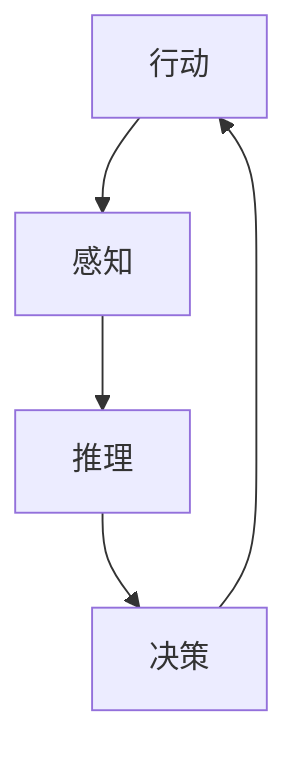
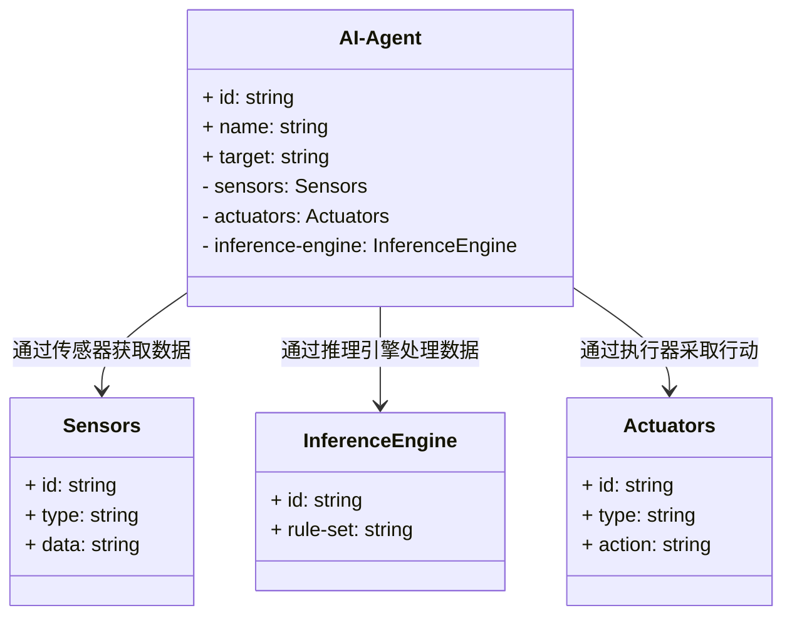
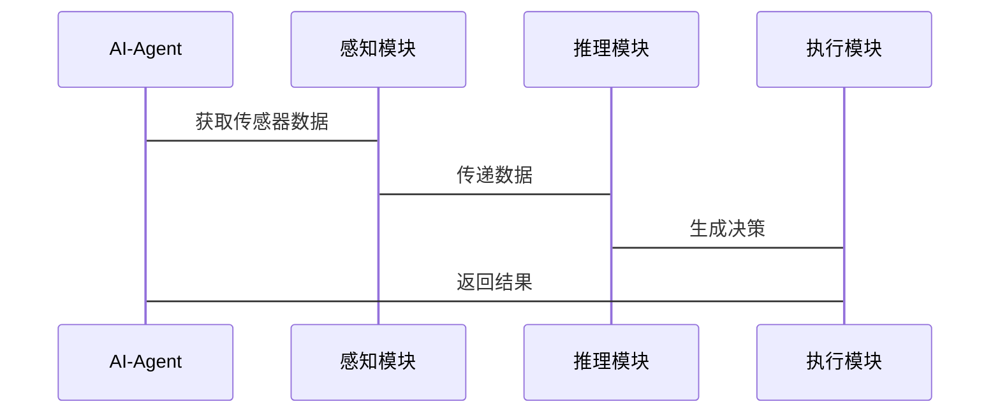

                 


# 开发具有复杂场景理解能力的AI Agent

## 关键词：AI Agent, 复杂场景, 人工智能, 场景理解, 强化学习

## 摘要：  
本文深入探讨了开发具有复杂场景理解能力的AI Agent的各个方面。从背景知识到核心概念，从算法原理到系统架构，从项目实战到最佳实践，系统地介绍了如何构建一个能够理解和处理复杂场景的AI代理。通过详细的技术分析和实际案例，本文为AI开发者和研究人员提供了宝贵的指导和启示。

---

# 第一部分: AI Agent 的背景与核心概念

## 第1章: AI Agent 的基本概念与背景

### 1.1 AI Agent 的定义与特点
#### 1.1.1 AI Agent 的定义
AI Agent（人工智能代理）是一种能够感知环境、做出决策并采取行动的智能实体。它通过与环境交互，利用传感器获取信息，利用推理能力解决问题，并通过执行器采取行动来实现目标。

#### 1.1.2 AI Agent 的核心特点
- **自主性**：能够在没有外部干预的情况下自主运行。
- **反应性**：能够实时感知环境并做出反应。
- **目标导向**：以实现特定目标为导向进行决策和行动。
- **学习能力**：能够通过经验改进自身的性能。

#### 1.1.3 AI Agent 与传统AI 的区别
- 传统AI（如专家系统）依赖于规则和知识库，而AI Agent更注重实时交互和自主决策。
- AI Agent具有更强的适应性和灵活性，能够处理动态变化的环境。

### 1.2 复杂场景理解的必要性
#### 1.2.1 场景理解的核心挑战
- 复杂场景通常涉及多目标、多参与者和多约束条件。
- 场景中的信息可能不完整、模糊或动态变化。
- 需要同时处理感知、推理和决策的多重任务。

#### 1.2.2 复杂场景理解的定义与范围
- 复杂场景理解是指AI Agent能够解析和理解复杂环境中的信息，并生成有意义的表示。
- 包括对空间、时间、因果关系和语义信息的理解。

#### 1.2.3 场景理解的边界与外延
- 边界：AI Agent的能力受限于其传感器和计算能力。
- 外延：复杂场景理解可以扩展到更高层次的抽象和推理。

### 1.3 AI Agent 在复杂场景中的应用
#### 1.3.1 复杂场景理解的典型应用领域
- 智能助手（如Siri、Alexa）
- 自动驾驶
- 智能客服
- 游戏AI

#### 1.3.2 AI Agent 在这些领域的优势
- 能够实时感知和响应用户需求。
- 可以处理动态变化的环境。
- 能够优化决策以提高效率。

#### 1.3.3 当前技术的局限性与未来发展方向
- 局限性：处理复杂场景时的计算资源消耗大，推理能力有限。
- 发展方向：加强多模态感知、跨领域知识整合和自适应学习能力。

### 1.4 本章小结
本章介绍了AI Agent的基本概念、复杂场景理解的必要性以及其在实际应用中的优势和挑战。理解这些内容是开发复杂场景AI Agent的基础。

---

## 第2章: AI Agent 的核心概念与联系

### 2.1 AI Agent 的核心概念
#### 2.1.1 问题背景与问题描述
复杂场景理解的核心问题是：如何让AI Agent在多变和复杂的环境中准确感知、推理和决策。

#### 2.1.2 问题解决的思路与方法
- **感知层**：通过传感器获取环境信息。
- **推理层**：基于感知信息进行逻辑推理。
- **决策层**：根据推理结果制定行动策略。

#### 2.1.3 核心概念的结构与组成
AI Agent的核心结构包括感知模块、推理模块和执行模块。

### 2.2 核心概念的属性特征对比
#### 2.2.1 核心概念的属性列表
| 属性 | 描述 |
|------|------|
| 自主性 | 独立运行的能力 |
| 反应性 | 实时响应环境变化的能力 |
| 目标导向 | 以目标为导向的决策能力 |
| 学习能力 | 通过经验改进的能力 |

#### 2.2.2 通过表格展示核心概念之间的关系
| 概念 | 关系描述 |
|------|----------|
| 感知模块 | 与环境直接交互 |
| 推理模块 | 基于感知信息进行逻辑推理 |
| 执行模块 | 根据推理结果采取行动 |

### 2.3 ER 实体关系图架构
```mermaid
erd
    entity AI-Agent {
        id: string
        name: string
        target: string
        sensors: Sensors
        actuators: Actuators
        inference-engine: InferenceEngine
    }
    entity Sensors {
        id: string
        type: string
        data: string
    }
    entity Actuators {
        id: string
        type: string
        action: string
    }
    entity InferenceEngine {
        id: string
        rule-set: string
    }
    AI-Agent -[通过传感器获取数据]-> Sensors
    AI-Agent -[通过推理引擎处理数据]-> InferenceEngine
    AI-Agent -[通过执行器采取行动]-> Actuators
```

### 2.4 本章小结
本章通过核心概念和ER实体关系图，详细分析了AI Agent的结构和组成部分，为后续章节的深入分析奠定了基础。

---

## 第3章: AI Agent 的算法原理

### 3.1 强化学习算法
#### 3.1.1 强化学习的基本原理
强化学习是一种通过试错机制来优化决策的算法。AI Agent通过与环境交互，学习最优策略以最大化累积奖励。

#### 3.1.2 Q-learning 算法的实现
Q-learning是一种经典的强化学习算法，其核心是通过更新Q值表来学习状态-动作值函数。

$$ Q(s,a) = Q(s,a) + \alpha [r + \gamma \max Q(s',a') - Q(s,a)] $$

#### 3.1.3 Deep Q-Networks (DQN) 的原理
DQN通过深度神经网络近似Q值函数，解决高维状态空间下的强化学习问题。

#### 3.1.4 算法的数学模型与公式
$$ r = \text{奖励函数} $$
$$ \gamma = \text{折扣因子} $$
$$ \alpha = \text{学习率} $$

#### 3.1.5 通过 mermaid 流程图展示算法流程


### 3.2 图神经网络在场景理解中的应用
#### 3.2.1 图神经网络的基本原理
图神经网络通过处理图结构数据，能够有效地建模复杂场景中的关系。

#### 3.2.2 图神经网络的数学模型
$$ Z = G \times X $$

其中，Z是输出，G是图的邻接矩阵，X是输入特征矩阵。

### 3.3 本章小结
本章通过强化学习和图神经网络的原理，详细介绍了AI Agent在复杂场景理解中的算法基础。

---

## 第4章: AI Agent 的系统架构设计

### 4.1 问题场景介绍
复杂场景理解需要AI Agent具备多模态感知、推理和决策能力。

### 4.2 系统功能设计
#### 4.2.1 领域模型 mermaid 类图


### 4.3 系统架构设计
#### 4.3.1 系统架构 mermaid 架构图


### 4.4 系统接口设计
#### 4.4.1 接口设计
- 感知模块接口：接收传感器数据。
- 推理模块接口：处理数据并生成决策。
- 执行模块接口：执行决策并返回结果。

### 4.5 系统交互 mermaid 序列图


### 4.6 本章小结
本章通过系统架构设计，详细分析了AI Agent的各个功能模块及其交互流程。

---

## 第5章: 项目实战

### 5.1 环境安装
- 安装Python、TensorFlow、Keras等开发工具。

### 5.2 系统核心实现源代码
```python
class AI-Agent:
    def __init__(self):
        self.sensors = Sensors()
        self.actuators = Actuators()
        self.inference_engine = InferenceEngine()

    def perceive(self):
        return self.sensors.get_data()

    def decide(self, data):
        return self.inference_engine.inference(data)

    def act(self, action):
        self.actuators.execute(action)
```

### 5.3 代码应用解读与分析
- `AI-Agent`类包含感知、推理和执行三个模块。
- `perceive`方法获取传感器数据。
- `decide`方法进行推理并生成决策。
- `act`方法执行决策。

### 5.4 实际案例分析
以智能客服为例，AI Agent可以根据用户输入生成合适的回复。

### 5.5 本章小结
本章通过实际项目案例，详细介绍了AI Agent的开发过程和实现细节。

---

## 第6章: 最佳实践与总结

### 6.1 最佳实践 tips
- 确保传感器的准确性。
- 优化推理引擎的效率。
- 提高执行模块的响应速度。

### 6.2 小结
本文系统地介绍了开发具有复杂场景理解能力的AI Agent的各个方面，从背景知识到系统架构，从算法原理到项目实战。

### 6.3 注意事项
- 处理复杂场景时，需注意计算资源的消耗。
- 需要不断优化算法和系统架构。

### 6.4 拓展阅读
- 推荐阅读《强化学习入门》和《图神经网络原理与应用》。

---

# 结语
开发具有复杂场景理解能力的AI Agent是一项具有挑战性的任务，但通过系统化的分析和实践，我们可以逐步实现这一目标。未来，随着技术的进步，AI Agent将在更多领域发挥重要作用。

