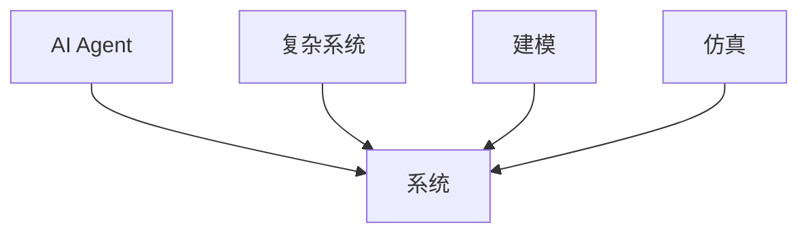
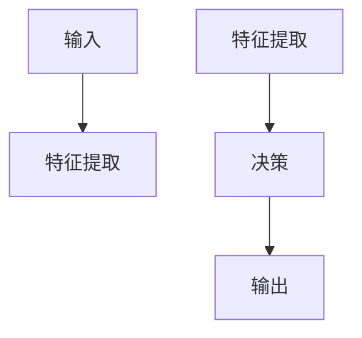
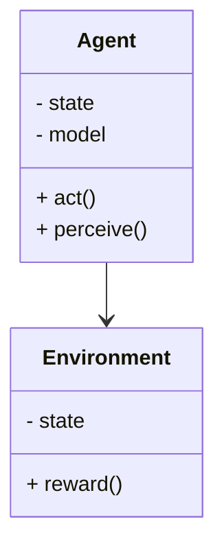
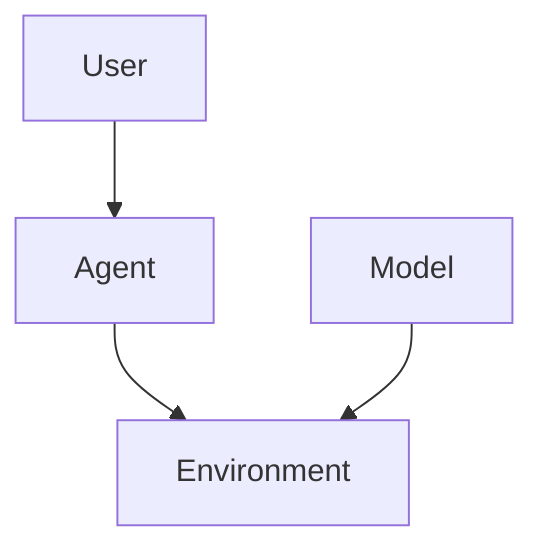

                 


# 开发具有复杂系统建模与仿真能力的AI Agent

## 关键词：AI Agent, 复杂系统, 系统建模, 仿真, 生成式AI, 强化学习, 图神经网络

## 摘要：本文将详细介绍如何开发具有复杂系统建模与仿真能力的AI Agent。通过逐步分析AI Agent的核心概念、算法原理、系统架构设计以及实际项目案例，读者将能够理解并掌握如何构建一个能够有效处理复杂系统建模与仿真的AI代理。文章内容涵盖了生成式AI、强化学习和图神经网络等关键技术，并通过系统化的讲解和实际案例分析，帮助读者从理论到实践全面掌握AI Agent的开发方法。

---

# 第1章: AI Agent与复杂系统建模概述

## 1.1 问题背景与目标

### 1.1.1 传统系统建模的局限性
传统的系统建模方法依赖于数学模型和确定性假设，但在面对复杂系统时，其局限性逐渐显现。复杂系统的动态性、不确定性以及多因素交互作用使得传统的建模方法难以捕捉系统的真实行为。

### 1.1.2 AI Agent在复杂系统建模中的优势
AI Agent具备感知环境、自主决策和学习能力，能够更好地处理复杂系统的动态性和不确定性。通过结合生成式AI和强化学习，AI Agent可以在复杂系统中实现更高效的建模与仿真。

### 1.1.3 本书的目标与意义
本书旨在通过理论与实践相结合的方式，系统地讲解如何开发具有复杂系统建模与仿真能力的AI Agent。通过本书的学习，读者将能够掌握AI Agent的核心技术，并能够将其应用于实际问题中。

## 1.2 核心概念与定义

### 1.2.1 AI Agent的定义与特点
AI Agent是一种能够感知环境、自主决策并执行任务的智能实体。其特点包括自主性、反应性、目标导向性和学习能力。

### 1.2.2 复杂系统的定义与特征
复杂系统是指由多个相互作用的组件组成的系统，具有动态性、不确定性、涌现性和不可分割性。

### 1.2.3 系统建模与仿真的概念对比
系统建模是指通过数学模型描述系统的行为；系统仿真则是指通过模型模拟系统的实际运行过程。两者共同构成了AI Agent进行复杂系统分析的基础。

## 1.3 本章小结
本章介绍了AI Agent与复杂系统建模的基本概念和特点，为后续章节的深入讲解奠定了基础。

---

# 第2章: AI Agent的核心概念与联系

## 2.1 核心概念原理

### 2.1.1 AI Agent的感知与决策机制
AI Agent通过感知环境信息，利用生成式AI生成可能的决策方案，并通过强化学习优化决策策略。

### 2.1.2 复杂系统的动态性与不确定性
复杂系统的动态性使其难以用静态模型描述，而其不确定性则要求AI Agent具备适应性和鲁棒性。

### 2.1.3 系统建模与仿真的数学基础
系统建模与仿真依赖于概率论、统计学和优化算法等数学工具。

## 2.2 概念属性特征对比

| 特征       | AI Agent                     | 复杂系统                  | 系统建模与仿真         |
|------------|-------------------------------|---------------------------|------------------------|
| 自主性      | 高                           | 低                       | 低                     |
| 动态性      | 中                           | 高                       | 高                     |
| 可预测性    | 低                           | 低                       | 中                     |

## 2.3 ER实体关系图架构



## 2.4 本章小结
本章详细讲解了AI Agent与复杂系统建模的核心概念及其相互关系，为后续章节的算法和系统设计提供了理论基础。

---

# 第3章: AI Agent的算法原理讲解

## 3.1 算法原理概述

### 3.1.1 生成式AI的基本原理
生成式AI通过深度学习模型生成新的数据，例如使用变分自编码器（VAE）或生成对抗网络（GAN）。

### 3.1.2 强化学习在AI Agent中的应用
强化学习通过奖励机制训练AI Agent，使其能够在复杂环境中做出最优决策。

### 3.1.3 图神经网络在复杂系统建模中的作用
图神经网络能够处理复杂系统的网络结构，有效捕捉系统组件之间的关系。

## 3.2 算法流程图



## 3.3 算法数学模型

### 3.3.1 生成式AI的数学公式
$$P(x) = \frac{1}{Z} \sum_{i} e^{x_i}$$

### 3.3.2 强化学习的数学公式
$$Q(s,a) = r + \gamma \max_{a'} Q(s',a')$$

### 3.3.3 图神经网络的数学公式
$$H = G \cdot X$$

## 3.4 本章小结
本章通过数学公式和流程图详细讲解了生成式AI、强化学习和图神经网络的算法原理及其在AI Agent中的应用。

---

# 第4章: 系统分析与架构设计方案

## 4.1 问题场景介绍

### 4.1.1 复杂系统建模的典型场景
以交通流模拟为例，AI Agent需要实时感知交通状况并做出优化决策。

### 4.1.2 AI Agent在系统仿真中的应用案例
通过AI Agent模拟城市交通网络，优化交通流量和减少拥堵。

## 4.2 系统功能设计

### 4.2.1 领域模型类图



## 4.3 系统架构设计

### 4.3.1 系统架构图



## 4.4 本章小结
本章通过系统分析与架构设计，详细讲解了如何构建一个能够处理复杂系统建模与仿真的AI Agent系统。

---

# 第5章: 项目实战

## 5.1 环境安装

### 5.1.1 安装Python与相关库
```bash
pip install numpy
pip install tensorflow
pip install keras
pip install pymermaid
```

## 5.2 系统核心实现源代码

### 5.2.1 生成式AI实现
```python
import numpy as np
import tensorflow as tf

class GAN:
    def __init__(self):
        self.generator = self.build_generator()
        self.discriminator = self.build_discriminator()

    def build_generator(self):
        # 定义生成器网络
        pass

    def build_discriminator(self):
        # 定义判别器网络
        pass

    def train(self, data):
        # 训练GAN模型
        pass
```

### 5.2.2 强化学习实现
```python
class Agent:
    def __init__(self, state_space, action_space):
        self.state_space = state_space
        self.action_space = action_space
        self.model = self.build_model()

    def build_model(self):
        # 定义强化学习模型
        pass

    def act(self, state):
        # 根据状态做出决策
        pass
```

## 5.3 代码应用解读与分析

### 5.3.1 生成式AI代码解读
生成式AI模型通过生成对抗网络实现，生成器和判别器交替训练以优化生成效果。

### 5.3.2 强化学习代码解读
强化学习模型通过与环境交互获得奖励，逐步优化决策策略。

## 5.4 实际案例分析

### 5.4.1 交通流模拟案例
通过AI Agent模拟交通流，优化信号灯控制以减少拥堵。

## 5.5 项目小结
本章通过实际项目案例，详细讲解了AI Agent在复杂系统建模与仿真中的具体实现。

---

# 第6章: 最佳实践与总结

## 6.1 关键点总结

### 6.1.1 核心技术
- 生成式AI
- 强化学习
- 图神经网络

### 6.1.2 系统架构设计
- 领域模型设计
- 系统架构优化
- 交互设计

## 6.2 注意事项

### 6.2.1 数据质量
确保数据的准确性和完整性。

### 6.2.2 模型调参
合理调参以提高模型性能。

## 6.3 拓展阅读

### 6.3.1 推荐书籍
- 《生成式AI: 原理与应用》
- 《强化学习: 理论与算法》

### 6.3.2 推荐博客
- AI Agent技术博客
- 复杂系统建模与仿真技术博客

## 6.4 本章小结
本章总结了开发AI Agent的关键点，并提供了实际应用中的注意事项和拓展阅读建议。

---

# 结语

开发具有复杂系统建模与仿真能力的AI Agent是一个复杂而有趣的过程。通过理论学习与实践结合，读者可以逐步掌握AI Agent的核心技术，并将其应用于实际问题中。希望本书能够为读者提供有价值的指导和启发。

--- 

本文通过系统化的讲解和实际案例分析，帮助读者从理论到实践全面掌握AI Agent的开发方法。

