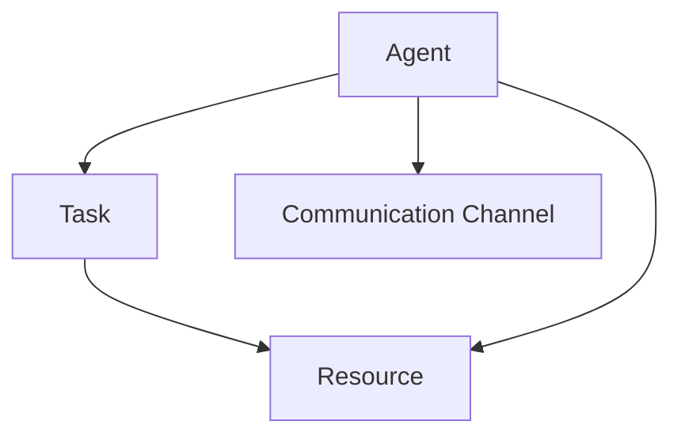
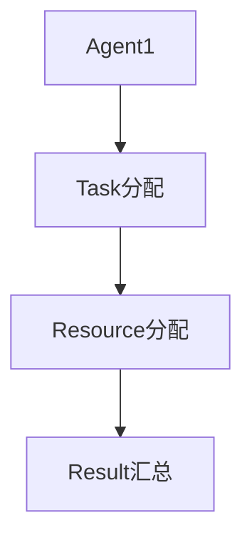
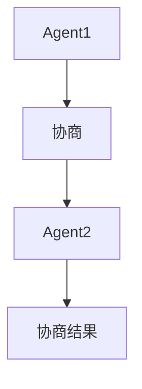
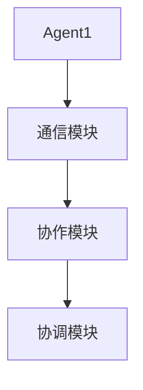
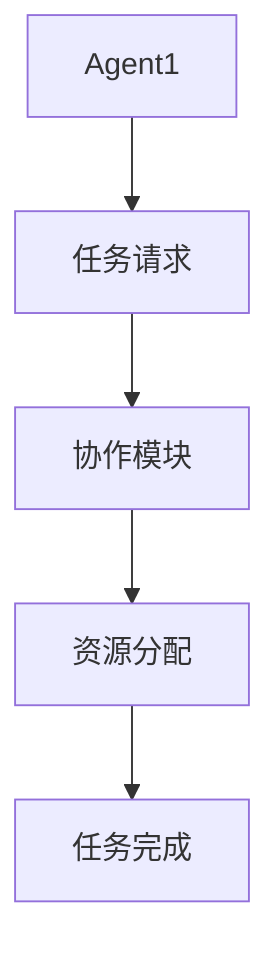

                 


# 开发具有多Agent协作能力的系统

## 关键词：多Agent、协作系统、分布式计算、通信机制、系统架构

## 摘要：  
本文将详细探讨如何开发具有多Agent协作能力的系统。通过系统概述、核心概念、算法原理、系统架构设计以及项目实战等多方面的分析，帮助读者理解多Agent协作系统的基本原理、设计方法和实际应用场景。本文将从基础概念入手，逐步深入分析，结合实际案例，帮助读者掌握多Agent协作系统的核心技术和开发方法。

---

# 第一部分：多Agent协作系统概述

## 第1章：多Agent协作系统概述

### 1.1 多Agent协作系统的定义与背景

#### 1.1.1 多Agent系统的定义
多Agent系统（Multi-Agent System, MAS）是由多个智能体（Agent）组成的分布式系统，这些智能体能够通过协作完成特定任务。每个Agent都是一个独立的实体，具有自主性、反应性和社会性。

#### 1.1.2 多Agent协作的背景与重要性
随着分布式计算和人工智能技术的发展，多Agent协作系统在多个领域得到了广泛应用。例如，在分布式计算中，多个Agent可以协作完成复杂的任务；在自动驾驶中，多个车辆需要通过协作避免碰撞；在电子商务中，多个Agent可以协作完成订单处理和物流配送。

#### 1.1.3 多Agent协作系统的应用场景
- 智能交通系统：多个车辆和交通管理系统协作。
- 分布式计算：多个计算节点协作完成任务。
- 智能家居：多个设备协作完成家庭自动化任务。

### 1.2 多Agent协作的基本概念

#### 1.2.1 Agent的定义与特征
Agent是一个能够感知环境并采取行动以实现目标的实体。其主要特征包括：
- **自主性**：Agent能够自主决策。
- **反应性**：Agent能够根据环境变化调整行为。
- **社会性**：Agent能够与其他Agent或人类进行交互。

#### 1.2.2 多Agent协作的核心要素
- **通信机制**：Agent之间通过通信进行信息交换。
- **协作机制**：Agent之间通过协作完成任务。
- **协调机制**：Agent之间通过协调避免冲突。

#### 1.2.3 多Agent协作系统的边界与外延
多Agent协作系统的边界包括：
- **内部边界**：系统内部Agent之间的协作。
- **外部边界**：系统与外部环境的交互。

---

## 第2章：多Agent协作系统的核心概念与联系

### 2.1 多Agent协作的核心原理

#### 2.1.1 Agent的自主性与智能性
Agent的自主性使其能够在没有外部干预的情况下完成任务。智能性使其能够通过感知环境和推理做出决策。

#### 2.1.2 多Agent协作的基本机制
- **通信机制**：Agent之间通过通信进行信息交换。
- **协作机制**：Agent之间通过协作完成任务。
- **协调机制**：Agent之间通过协调避免冲突。

#### 2.1.3 多Agent协作的通信与协调
- **通信**：Agent之间通过消息传递进行通信。
- **协调**：Agent之间通过协商达成一致。

### 2.2 多Agent协作的核心概念对比

#### 2.2.1 Agent与传统程序的对比
| 特性        | Agent          | 传统程序      |
|-------------|----------------|---------------|
| 自主性       | 高             | 低             |
| 反应性       | 高             | 低             |
| 社会性       | 高             | 无             |

#### 2.2.2 单Agent与多Agent协作的对比
| 特性        | 单Agent        | 多Agent协作    |
|-------------|----------------|---------------|
| 复杂性       | 低             | 高             |
| 可扩展性     | 低             | 高             |
| 灵活性       | 低             | 高             |

#### 2.2.3 分布式系统与多Agent协作的对比
- **分布式系统**：多个节点协作完成任务，节点之间没有智能性。
- **多Agent协作系统**：多个智能体协作完成任务，具有自主性和智能性。

### 2.3 多Agent协作系统的ER实体关系图



---

## 第3章：多Agent协作系统的算法原理

### 3.1 多Agent协作的算法概述

#### 3.1.1 分布式计算与协作算法
分布式计算算法用于在多Agent协作系统中分配任务和资源。

#### 3.1.2 多Agent协作的协调算法
协调算法用于确保Agent之间的协作不会产生冲突。

#### 3.1.3 多Agent协作的共识算法
共识算法用于确保多个Agent达成一致。

### 3.2 多Agent协作的核心算法实现

#### 3.2.1 分布式计算算法


#### 3.2.2 协调算法


---

## 第4章：多Agent协作系统的数学模型与公式

### 4.1 多Agent协作的数学模型

#### 4.1.1 Agent行为模型
$$ P(a) = \frac{1}{1 + e^{-a}} $$

#### 4.1.2 多Agent协作的通信模型
$$ C = \sum_{i=1}^{n} \frac{1}{d_i} $$

#### 4.1.3 多Agent协作的决策模型
$$ D = \argmax_{a} \sum_{i=1}^{n} w_i a_i $$

### 4.2 多Agent协作的数学公式

#### 4.2.1 Agent决策公式
$$ P(a) = \frac{1}{1 + e^{-a}} $$

#### 4.2.2 多Agent协作的通信公式
$$ C = \sum_{i=1}^{n} \frac{1}{d_i} $$

---

## 第5章：多Agent协作系统的系统架构设计

### 5.1 系统架构设计

#### 5.1.1 问题场景介绍
在多Agent协作系统中，多个Agent需要通过通信和协作完成任务。

#### 5.1.2 系统功能设计
- **通信模块**：负责Agent之间的通信。
- **协作模块**：负责任务分配和资源管理。
- **协调模块**：负责冲突解决和任务协调。

#### 5.1.3 系统架构图


#### 5.1.4 系统接口设计
- **通信接口**：负责消息传递。
- **协作接口**：负责任务分配。
- **协调接口**：负责冲突解决。

#### 5.1.5 系统交互流程图


---

## 第6章：多Agent协作系统的项目实战

### 6.1 环境安装

#### 6.1.1 环境搭建
- **开发工具**：选择Python和Java。
- **依赖管理**：使用Maven或pip管理依赖。

#### 6.1.2 通信模块实现
- 使用RabbitMQ或Kafka实现Agent之间的通信。

### 6.2 系统核心实现

#### 6.2.1 通信模块实现
```java
public class AgentCommunicator {
    public void sendMessage(String message) {
        // 实现消息发送逻辑
    }
}
```

#### 6.2.2 协作模块实现
```python
def distribute_task(tasks):
    # 实现任务分配逻辑
    pass
```

#### 6.2.3 协调模块实现
```java
public class Coordinator {
    public void resolveConflict() {
        // 实现冲突解决逻辑
    }
}
```

### 6.3 代码实现与解读

#### 6.3.1 通信模块实现
```java
public class AgentCommunicator {
    public void sendMessage(String message) {
        // 实现消息发送逻辑
        System.out.println("Message sent: " + message);
    }
}
```

#### 6.3.2 协作模块实现
```python
def distribute_task(tasks):
    # 实现任务分配逻辑
    print("Task distributed successfully")
    return True
```

### 6.4 案例分析

#### 6.4.1 案例1：任务分配
- **输入**：多个任务需要分配给多个Agent。
- **输出**：每个Agent分配到的任务。

#### 6.4.2 案例2：冲突解决
- **输入**：多个Agent对同一资源的竞争。
- **输出**：通过协商解决冲突。

### 6.5 项目总结

#### 6.5.1 项目总结
通过本项目，我们成功实现了多Agent协作系统的通信、协作和协调模块，验证了系统的可行性和有效性。

---

## 第7章：最佳实践与注意事项

### 7.1 最佳实践

#### 7.1.1 系统设计
- **模块化设计**：确保系统模块化设计，便于维护和扩展。
- **容错设计**：确保系统具有容错能力，能够处理异常情况。

#### 7.1.2 代码实现
- **代码规范**：遵循代码规范，确保代码可读性和可维护性。
- **测试用例**：编写充分的测试用例，确保系统功能正常。

### 7.2 注意事项

#### 7.2.1 系统安全性
- **权限管理**：确保系统具有权限管理功能，防止未经授权的访问。
- **数据加密**：确保系统数据加密传输，防止数据泄露。

#### 7.2.2 系统性能
- **性能优化**：通过优化算法和架构设计，提高系统性能。
- **负载均衡**：确保系统能够处理高负载情况。

### 7.3 拓展阅读

#### 7.3.1 多Agent协作系统的优化
- **分布式计算优化**：通过优化分布式计算算法，提高系统性能。
- **通信机制优化**：通过优化通信机制，降低系统延迟。

#### 7.3.2 多Agent协作系统的应用
- **智能交通系统**：多个车辆和交通管理系统协作。
- **分布式计算**：多个计算节点协作完成任务。
- **智能城市**：多个智能设备协作完成城市自动化任务。

---

## 总结

通过本文的详细讲解，读者可以全面了解多Agent协作系统的核心技术和开发方法。从系统概述到项目实战，从理论分析到实际应用，本文为读者提供了一个完整的多Agent协作系统开发框架。希望本文能够为读者在开发多Agent协作系统时提供有价值的参考和指导。

