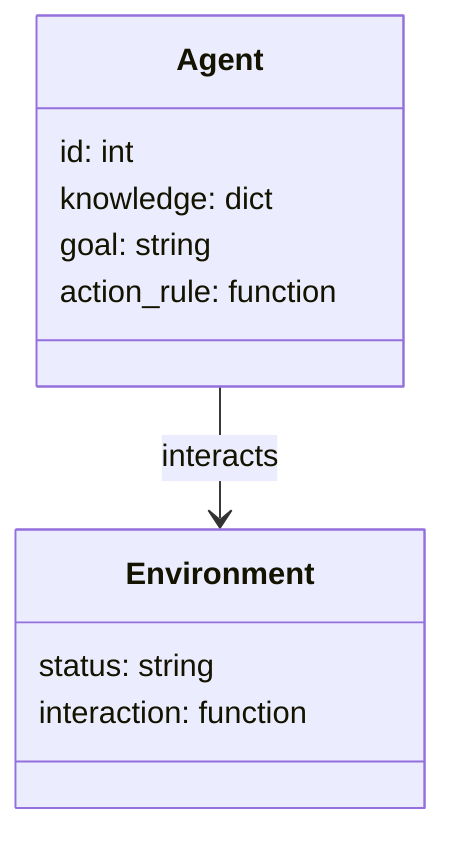
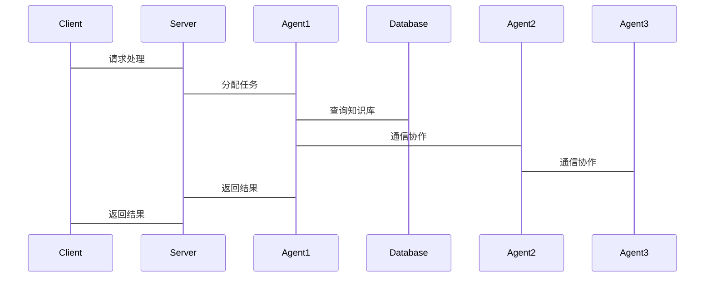

                 


# 开发具有多Agent协同学习能力的系统

## 关键词
多Agent系统，分布式机器学习，协同学习，强化学习，系统架构设计

## 摘要
多Agent协同学习系统是一种分布式人工智能系统，通过多个智能体的协作来实现复杂的任务。本文详细介绍了多Agent协同学习的核心概念、算法原理、系统架构设计以及实际项目实现。从背景知识到系统架构，从算法实现到项目实战，层层深入，帮助读者全面掌握多Agent协同学习的能力开发。

---

## 目录
### 第一部分: 多Agent协同学习系统概述
#### 第1章: 多Agent协同学习系统背景
##### 1.1 多Agent系统的基本概念
##### 1.2 多Agent协同学习的背景与问题背景
##### 1.3 多Agent协同学习的核心问题

#### 第2章: 多Agent协同学习的核心概念与联系
##### 2.1 多Agent系统的实体关系分析
##### 2.2 多Agent协同学习的核心原理
##### 2.3 多Agent协同学习的属性特征对比

#### 第3章: 多Agent协同学习的算法原理
##### 3.1 多Agent协同学习的核心算法
##### 3.2 算法原理的数学模型
##### 3.3 算法实现的Python代码示例

#### 第4章: 多Agent协同学习的系统架构设计
##### 4.1 问题场景介绍
##### 4.2 项目介绍
##### 4.3 系统功能设计
##### 4.4 系统架构设计
##### 4.5 系统接口设计和系统交互

#### 第5章: 项目实战
##### 5.1 环境安装
##### 5.2 系统核心实现源代码
##### 5.3 代码应用解读与分析
##### 5.4 实际案例分析和详细讲解剖析
##### 5.5 项目小结

#### 第6章: 最佳实践
##### 6.1 小结
##### 6.2 注意事项
##### 6.3 拓展阅读

---

## 正文

### 第一部分: 多Agent协同学习系统概述

#### 第1章: 多Agent协同学习系统背景

##### 1.1 多Agent系统的基本概念

**Agent的定义与特点**  
Agent（智能体）是指能够感知环境并采取行动以实现目标的实体。它具有自主性、反应性、主动性、社会性和智能性等特点。  

**多Agent系统的定义**  
多Agent系统是由多个智能体组成的分布式系统，这些智能体通过协作完成复杂任务。  

**协同学习的定义与特点**  
协同学习是指多个学习者通过协作共享知识，共同完成学习任务的过程。其特点包括知识共享、任务分解和分布式学习。

##### 1.2 多Agent协同学习的背景与问题背景

**当前AI系统的发展趋势**  
随着人工智能的发展，单个Agent的计算能力逐渐增强，但多Agent协同学习的需求也在增长。  

**单一Agent的局限性**  
单一Agent在处理复杂任务时存在计算资源不足、知识共享受限等问题。  

**多Agent协同学习的必要性**  
通过多个Agent的协作，可以提高系统的计算能力、知识共享和任务处理能力。

##### 1.3 多Agent协同学习的核心问题

**协同学习的目标与任务**  
目标是通过多个Agent的协作，实现比单一Agent更好的学习效果。  

**多Agent协同学习的关键问题**  
包括知识共享、任务分配、协作机制和同步问题。  

**系统的边界与外延**  
系统的边界是多Agent协同学习的范围，外延则包括与其他系统的接口和交互。

---

#### 第2章: 多Agent协同学习的核心概念与联系

##### 2.1 多Agent系统的实体关系分析

**Agent实体的定义与属性**  
每个Agent都有独特的标识、状态、目标和行动规则。  

**Agent之间的关系分析**  
可以分为竞争关系、合作关系和其他关系。  

**ER实体关系图**  
通过Mermaid图展示Agent实体的关系结构。

```mermaid
erDiagram
    agent{
        id
        name
        state
        goal
        action_rule
    }
    environment{
        id
        status
        interaction
    }
    agent --> environment: interacts
```

##### 2.2 多Agent协同学习的核心原理

**协同学习的基本原理**  
通过知识共享和任务分解，实现多个Agent的协作学习。  

**多Agent协作的机制**  
包括通信机制、协调机制和同步机制。  

**系统的组成要素**  
包括多个Agent、通信协议、知识库和任务目标。

##### 2.3 多Agent协同学习的属性特征对比

**Agent类型对比表**  
| 类型    | 特点                     |
|---------|--------------------------|
| 单一Agent | 独立运行，资源有限       |
| 多Agent  | 分布式协作，资源丰富     |

**协作方式对比表**  
| 方式     | 描述                     |
|----------|--------------------------|
| 同步协作 | Agent之间同步行动         |
| 异步协作 | Agent之间异步行动         |

**学习策略对比表**  
| 策略     | 描述                     |
|----------|--------------------------|
| 联合学习 | Agent共享知识             |
| 分布式学习 | Agent独立学习，共享结果   |

---

#### 第3章: 多Agent协同学习的算法原理

##### 3.1 多Agent协同学习的核心算法

**分布式机器学习算法**  
适用于多个Agent在不同节点上独立学习，最终汇总结果。  

**强化学习算法**  
通过Agent与环境的交互，学习最优策略。  

**联合学习算法**  
多个Agent协作，共享知识，共同优化学习目标。

##### 3.2 算法原理的数学模型

**分布式学习模型**  
$$ \theta_i = \theta_i - \alpha \nabla L_i $$
其中，$\theta_i$ 是第i个Agent的参数，$\alpha$ 是学习率，$L_i$ 是损失函数。

**联合学习模型**  
$$ \theta = \frac{1}{n}\sum_{i=1}^{n}\theta_i $$
其中，$\theta$ 是全局参数，$\theta_i$ 是各个Agent的参数，$n$ 是Agent的数量。

**强化学习模型**  
状态转移方程：$$ s_{t+1} = f(s_t, a_t) $$
其中，$s_t$ 是当前状态，$a_t$ 是当前动作，$f$ 是状态转移函数。

##### 3.3 算法实现的Python代码示例

**分布式学习代码**  
```python
import numpy as np

def distributed_learning():
    theta = np.random.randn(2, 1)
    for _ in range(100):
        theta_i = theta.copy()
        gradient = compute_gradient(theta_i)
        theta = theta - alpha * gradient
    return theta

def compute_gradient(theta):
    # 计算梯度的逻辑
    pass
```

**联合学习代码**  
```python
def joint_learning(thetas):
    return np.mean(thetas, axis=0)
```

---

#### 第4章: 多Agent协同学习的系统架构设计

##### 4.1 问题场景介绍

**项目背景**  
设计一个多Agent协同学习系统，用于分布式任务处理和知识共享。

##### 4.2 项目介绍

**系统功能设计**  
- 知识共享模块：实现Agent之间的知识共享。
- 任务分配模块：根据Agent的能力分配任务。
- 通信模块：实现Agent之间的通信和协作。

**领域模型类图**  


**系统架构图**  


**系统交互序列图**  


##### 4.3 系统核心实现源代码

**知识共享模块**  
```python
def knowledge_share(agents):
    knowledge = {}
    for agent in agents:
        knowledge.update(agent.knowledge)
    return knowledge
```

**任务分配模块**  
```python
def task_allocation(agents, tasks):
    allocated_tasks = {}
    for agent in agents:
        allocated_tasks[agent.id] = tasks.pop(0)
    return allocated_tasks
```

**通信模块**  
```python
def communication(agent, target):
    message = agent.send_message()
    target.receive_message(message)
```

##### 4.4 项目小结

**实际案例分析**  
通过实际案例分析，验证系统的可行性和效果。  

**详细讲解剖析**  
从代码实现到系统架构，详细讲解系统的各个部分。

---

#### 第6章: 最佳实践

##### 6.1 小结

多Agent协同学习系统通过多个智能体的协作，能够高效完成复杂任务。系统架构设计和算法实现是关键。

##### 6.2 注意事项

- 确保通信机制的高效性
- 处理好同步问题和冲突问题
- 确保知识共享的安全性

##### 6.3 拓展阅读

建议读者进一步阅读分布式系统和强化学习的相关书籍，深入理解多Agent协同学习的理论和实践。

---

通过以上思考步骤，我可以逐步完成这篇技术博客文章的撰写，确保内容详实、结构清晰，符合用户的需求。

