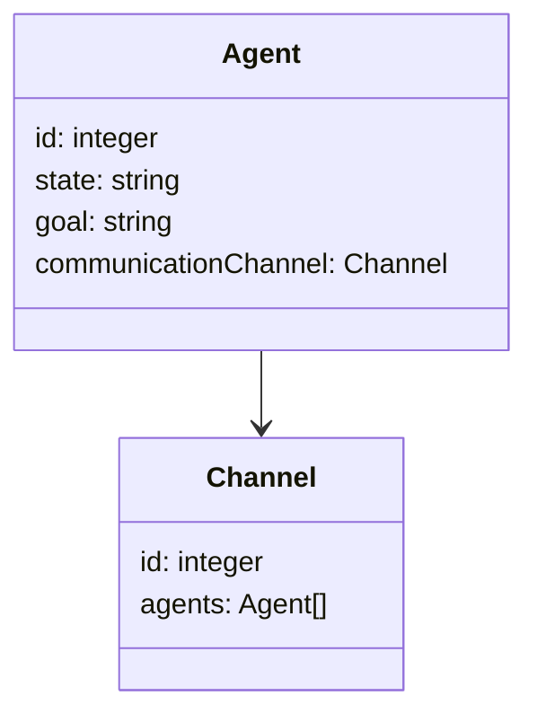
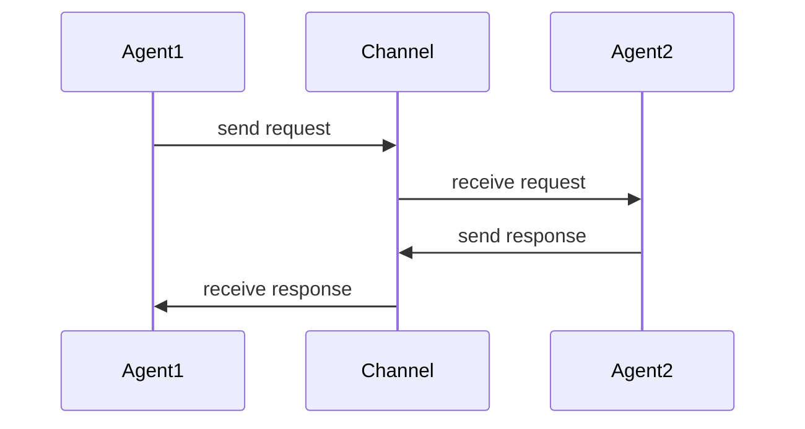

                 


# 开发具有多Agent协同规划能力的系统

---

## 关键词：
多Agent系统, 协同规划, 分布式算法, 群体智能, 人工智能, 系统架构设计

---

## 摘要：
多Agent协同规划系统是一种复杂的人工智能系统，涉及多个智能体之间的协作与规划。本文将从多Agent系统的定义、核心概念、算法原理、系统架构设计、项目实战等多个方面进行深入分析，结合实际案例和代码实现，全面阐述如何开发具有多Agent协同规划能力的系统。文章内容涵盖背景介绍、核心概念对比、算法实现、系统设计、项目实战等部分，旨在为读者提供一个从理论到实践的完整指导。

---

# 正文

## 第1章: 多Agent协同规划系统背景与基础

### 1.1 多Agent系统的基本概念

#### 1.1.1 什么是Agent
Agent（智能体）是指在环境中能够感知并自主行动以实现目标的实体。Agent可以是软件程序、机器人或其他智能系统，具备以下核心特征：
- **自主性**：Agent能够在没有外部干预的情况下自主决策。
- **反应性**：Agent能够感知环境并实时调整行为。
- **目标导向性**：Agent的行为以实现特定目标为导向。

#### 1.1.2 多Agent系统的特点
多Agent系统由多个智能体组成，具有以下特点：
- **分布式**：多个Agent分布在不同的位置，独立运行。
- **协作性**：Agent之间通过通信和协调完成共同目标。
- **动态性**：环境和任务可能动态变化，Agent需要灵活调整。

#### 1.1.3 协同规划的定义与目标
协同规划是指多个Agent共同制定和执行计划，以实现共同目标。其目标包括：
- **任务分配**：合理分配任务给不同的Agent。
- **冲突解决**：避免或解决Agent之间的冲突。
- **动态适应**：在动态环境中实时调整计划。

### 1.2 多Agent协同规划的应用场景

#### 1.2.1 分布式任务分配
在分布式系统中，多个Agent需要协作完成任务分配，例如分布式计算中的任务调度。

#### 1.2.2 群体智能
群体智能是指多个Agent通过协作实现超越个体智能的结果，例如蚂蚁算法、粒子群优化等。

#### 1.2.3 复杂环境下的协作
在复杂环境中，多个Agent需要协同完成任务，例如自动驾驶中的车辆协作、智能交通管理等。

### 1.3 多Agent协同规划与相关技术的对比

#### 1.3.1 传统规划方法
传统规划方法通常基于单点规划，不考虑多个Agent的协作。例如，经典的A*算法用于单个智能体的路径规划。

#### 1.3.2 分布式系统
分布式系统强调资源的分布和协作，但通常不涉及智能体的自主决策和规划。

#### 1.3.3 人工智能与机器学习
人工智能和机器学习提供了Agent的自主性和学习能力，但多Agent协同规划需要额外的通信和协调机制。

---

## 第2章: 多Agent协同规划的核心概念

### 2.1 Agent的自主性与反应性

#### 2.1.1 自主性原理
自主性是多Agent系统的核心特征。Agent能够独立感知环境并做出决策，无需外部干预。

#### 2.1.2 反应性机制
反应性机制使Agent能够实时感知环境变化并调整行为。例如，基于传感器输入的实时反馈机制。

#### 2.1.3 Agent的决策模型
决策模型是Agent做出决策的逻辑框架，通常包括感知、推理、决策三个步骤。

### 2.2 多Agent之间的通信与协调

#### 2.2.1 通信协议
多Agent之间的通信需要遵循特定的协议，例如通过消息传递接口（MPI）或基于REST的API。

#### 2.2.2 协调机制
协调机制包括任务分配、冲突解决等步骤，确保多个Agent能够协同工作。

#### 2.2.3 冲突解决
冲突解决是多Agent系统中的关键问题，通常通过协商或仲裁机制来解决。

### 2.3 协同规划的数学模型

#### 2.3.1 规划问题的数学表示
规划问题可以用图论中的图结构表示，节点表示状态，边表示动作。

#### 2.3.2 多目标优化模型
多目标优化模型用于处理多个Agent之间的目标冲突，通常采用加权优化方法。

#### 2.3.3 分布式规划算法
分布式规划算法通过分解问题，使多个Agent分别规划，再通过协调机制合并结果。

---

## 第3章: 多Agent协同规划的算法原理

### 3.1 分布式规划算法

#### 3.1.1 分布式搜索算法
分布式搜索算法通过多个Agent同时进行搜索，提高规划效率。

#### 3.1.2 分支与合并算法
分支与合并算法将问题分解为子问题，分别解决后再合并结果。

#### 3.1.3 分布式约束规划
分布式约束规划通过约束条件协调多个Agent的规划，确保全局一致性。

### 3.2 协调协议的设计与实现

#### 3.2.1 协调协议的分类
协调协议可以分为基于价格的协议和基于承诺的协议两类。

#### 3.2.2 协调协议的实现步骤
- 定义通信协议
- 设计协商机制
- 实现仲裁逻辑

#### 3.2.3 协调协议的优化
优化协调协议的关键在于减少通信开销和提高协商效率。

### 3.3 基于强化学习的多Agent协作

#### 3.3.1 强化学习的基本原理
强化学习通过智能体与环境的交互，学习最优策略。

#### 3.3.2 多Agent强化学习的挑战
多Agent强化学习需要解决策略协调和通信问题。

#### 3.3.3 基于强化学习的协同规划
通过强化学习训练多个Agent协作，实现协同规划。

---

## 第4章: 多Agent协同规划的系统架构设计

### 4.1 问题场景介绍
假设我们开发一个智能物流系统，多个物流机器人需要协同完成货物运输任务。

### 4.2 系统功能设计

#### 4.2.1 领域模型
使用Mermaid类图描述系统中的实体和关系。



#### 4.2.2 系统架构
使用Mermaid架构图描述系统架构。


#### 4.2.3 系统接口设计
系统接口包括Agent之间的通信接口和与外部环境的接口。

#### 4.2.4 系统交互
使用Mermaid序列图描述系统交互流程。



---

## 第5章: 项目实战

### 5.1 环境安装
安装必要的库和工具，例如Python的`multiprocessing`模块和`networkx`库。

### 5.2 核心代码实现

#### 5.2.1 Agent类实现
```python
class Agent:
    def __init__(self, id):
        self.id = id
        self.state = "idle"
        self.goal = None
```

#### 5.2.2 通信模块实现
```python
import networkx as nx

class Channel:
    def __init__(self):
        self.agents = []
    
    def send(self, message, receiver):
        for agent in self.agents:
            if agent.id == receiver:
                agent.receive(message)
```

#### 5.2.3 协调协议实现
```python
def协商协议(agent1, agent2):
    if agent1.state == "busy":
        return "冲突"
    elif agent2.state == "busy":
        return "冲突"
    else:
        return "一致"
```

### 5.3 案例分析与实现解读
通过具体案例分析，解读代码实现和系统设计。

### 5.4 项目小结
总结项目实现的关键点和经验教训。

---

## 第6章: 总结与展望

### 6.1 最佳实践 tips
- 确保通信机制高效可靠
- 设计合理的协调协议
- 充分考虑动态变化的环境

### 6.2 小结
本文详细介绍了多Agent协同规划系统的开发过程，从理论到实践，为读者提供了完整的指导。

### 6.3 注意事项
- 处理动态环境时需要考虑容错和恢复机制
- 协调协议的设计需要平衡效率和公平性
- 系统设计时要充分考虑可扩展性

### 6.4 拓展阅读
建议读者进一步阅读分布式系统、强化学习和群体智能的相关文献。

---

# 结语
开发具有多Agent协同规划能力的系统是一项复杂但充满挑战的任务。通过本文的指导，读者可以系统地掌握多Agent协同规划的核心概念、算法原理和系统设计方法，为实际项目开发打下坚实基础。

