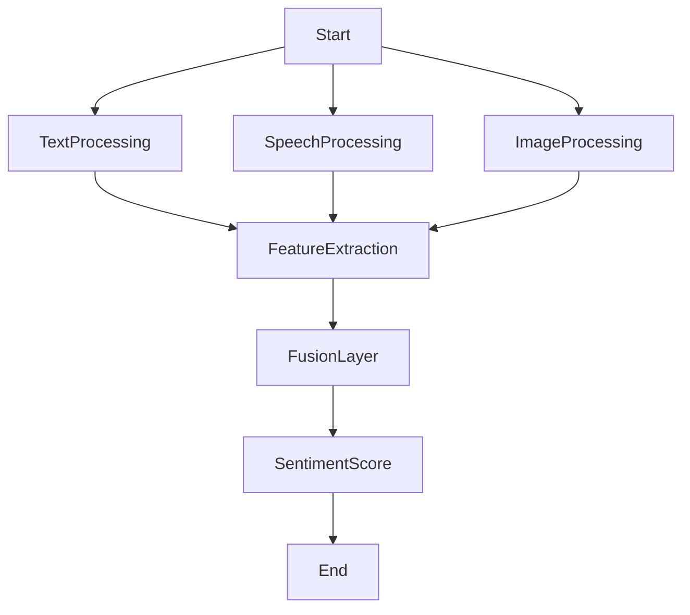
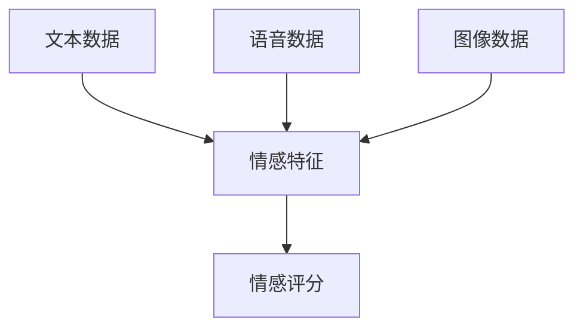
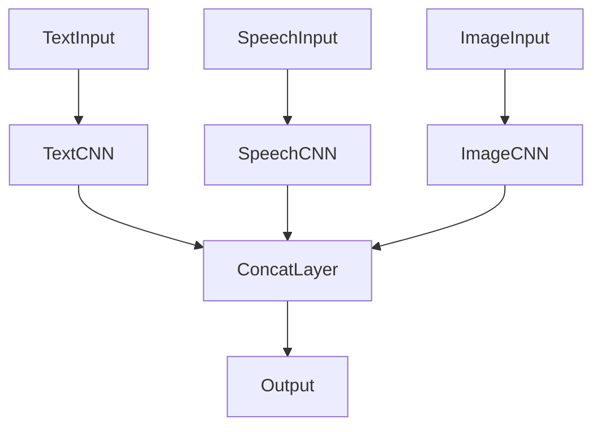
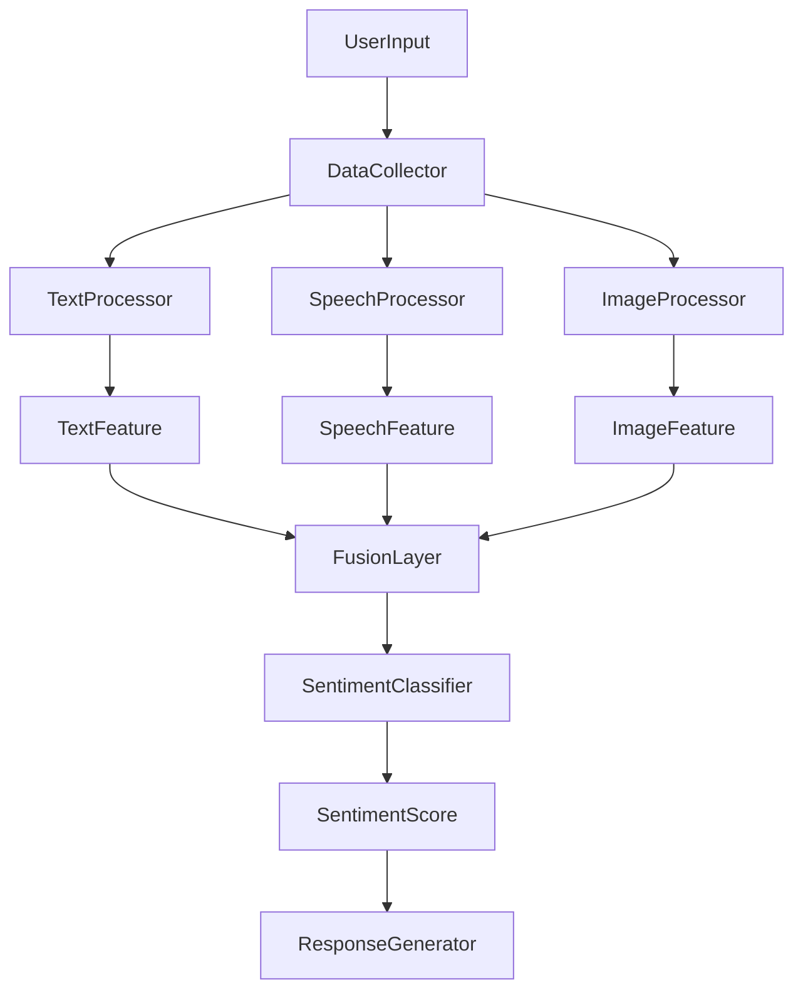
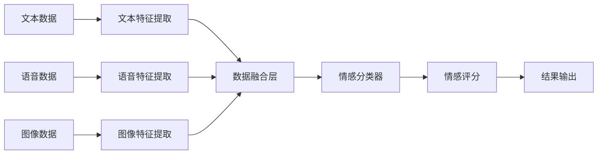
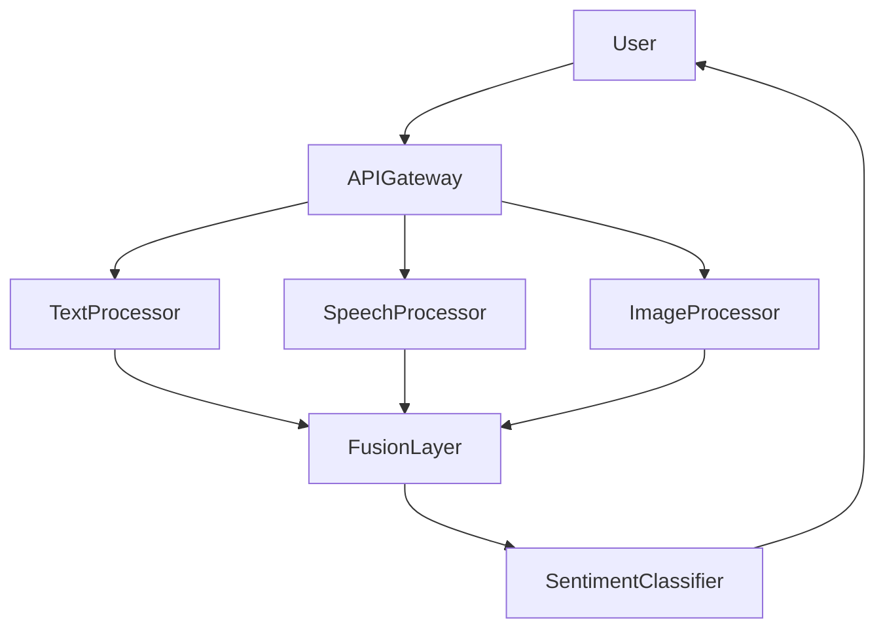

                 


# 开发具有多模态情感分析能力的AI Agent

> 关键词：多模态情感分析，AI Agent，情感计算，数据融合，深度学习

> 摘要：本文详细探讨了开发具有多模态情感分析能力的AI Agent的各个方面，包括背景、核心概念、算法原理、系统架构设计、项目实战以及最佳实践。通过逐步分析，展示了如何结合文本、语音和图像等多种模态数据，利用深度学习和数据融合技术，构建一个高效准确的情感分析系统。

---

# 第一部分: 多模态情感分析的背景与核心概念

## 第1章: 多模态情感分析的背景与问题定义

### 1.1 多模态情感分析的背景

#### 1.1.1 从单模态到多模态的情感分析演进
情感分析是自然语言处理（NLP）中的一个经典任务，最初主要基于文本数据进行。然而，随着人工智能技术的发展，单一模态的分析已难以满足复杂场景的需求。例如，在客服系统中，用户的情感不仅体现在文字中，还可能通过语音语调和面部表情传递。因此，多模态情感分析应运而生。

#### 1.1.2 多模态数据在情感分析中的重要性
多模态数据指的是多种类型的数据，如文本、语音、图像等。在情感分析中，结合这些数据可以更全面地捕捉用户的情感状态。例如，用户在发送一条带有图片的消息时，图片中的视觉信息可能与文本传达的情感相辅相成。

#### 1.1.3 多模态情感分析的定义与目标
多模态情感分析是一种通过整合多种数据模态（如文本、语音、图像）来分析和理解用户情感状态的技术。其目标是提高情感分析的准确性和鲁棒性，特别是在复杂和多样化的应用场景中。

---

### 1.2 多模态情感分析的核心问题

#### 1.2.1 情感分析的基本概念
情感分析旨在判断一段文本、语音或图像所表达的情感倾向，通常分为正面、负面和中性三类。多模态情感分析则需要同时处理多种数据类型，以更准确地判断情感。

#### 1.2.2 多模态数据的融合挑战
多模态数据的融合是一个复杂的过程，需要考虑以下问题：
- 数据模态之间的关联性：如何将文本、语音和图像等不同模态的数据有效结合。
- 数据异质性：不同模态的数据具有不同的特征和表示方式，如何统一处理。
- 信息冗余：某些信息在多个模态中可能重复，如何避免冗余。

#### 1.2.3 多模态情感分析的应用场景
多模态情感分析可以应用于多个领域：
- **客服系统**：通过分析用户的文本、语音和表情图片，提供更智能的服务。
- **社交媒体分析**：结合用户的文本评论和表情图片，分析整体情感倾向。
- **智能助手**：通过语音和面部表情分析用户的意图和情感。

---

### 1.3 当前技术现状与挑战

#### 1.3.1 单模态情感分析的局限性
单模态情感分析仅依赖一种数据类型，难以捕捉复杂的用户情感。例如，仅分析文本可能无法识别用户语气中的 sarcasm（讽刺）。

#### 1.3.2 多模态数据融合的技术难点
- 数据表示的多样性：如何将不同模态的数据统一表示，以便融合。
- 融合方法的选择：特征级融合、决策级融合等方法各有优劣，如何选择合适的融合策略。
- 计算资源的消耗：处理多模态数据通常需要更多的计算资源，如何优化资源使用。

#### 1.3.3 多模态情感分析的未来发展方向
随着AI技术的进步，多模态情感分析将更加智能化和个性化。未来的研究方向包括：
- 更高效的多模态数据融合方法。
- 结合生成模型（如GPT、Diffusion）生成更具情感表达的多模态内容。
- 在边缘计算环境中的应用，实时处理多模态数据。

---

## 第2章: 多模态情感分析的核心概念与联系

### 2.1 多模态数据的特征分析

#### 2.1.1 文本数据的特征
文本数据的情感特征主要体现在以下方面：
- **词汇选择**：使用积极或消极的词汇。
- **句子结构**：复杂的句子可能表达更强烈的情感。
- **情感词**：特定的情感词（如“happy”、“sad”）的出现频率。

#### 2.1.2 语音数据的特征
语音数据的情感特征包括：
- **语调**：高升调通常表示积极情感。
- **语速**：较快的语速可能表示激动或焦虑。
- **音高变化**：音高的波动可以反映情感的起伏。

#### 2.1.3 图像数据的特征
图像数据的情感特征涉及：
- **颜色分布**：暖色调通常与积极情感相关。
- **面部表情**：笑容、皱眉等表情直接反映情感。
- **纹理和形状**：图像的纹理和形状可能间接反映情感。

---

### 2.2 多模态数据融合的原理

#### 2.2.1 数据融合的基本概念
数据融合是指将来自不同源的数据进行结合，以获得更全面的信息。在情感分析中，数据融合可以帮助捕捉到单一模态无法提供的信息。

#### 2.2.2 多模态数据融合的方法
多模态数据融合可以分为以下几种方法：
- **特征级融合**：在特征提取阶段将不同模态的特征向量进行融合。
- **决策级融合**：分别对各模态进行情感分类，然后将结果进行融合。
- **混合融合**：结合特征级和决策级的融合方法。

#### 2.2.3 数据融合的优缺点对比

| 融合方法 | 优点 | 缺点 |
|----------|------|------|
| 特征级融合 | 高准确性，捕捉多模态信息 | 计算复杂度高，需要处理异质数据 |
| 决策级融合 | 计算简单，易于实现 | 可能丢失部分模态信息 |
| 混合融合 | 结合两者优点 | 实现复杂，需要平衡各部分权重 |

---

#### 2.2.4 多模态数据流的处理流程



---

### 2.3 多模态数据融合的实体关系图



---

## 第3章: 多模态情感分析的算法原理

### 3.1 多模态数据融合的算法框架

#### 3.1.1 基于深度学习的融合方法

##### 3.1.1.1 多模态卷积神经网络（MM-CNN）
MM-CNN是一种将多个模态的数据输入到卷积神经网络中进行融合的方法。其结构如下：



##### 3.1.1.2 多模态循环神经网络（MM-RNN）
MM-RNN适用于序列数据的情感分析，结合文本、语音和图像的时序特征进行融合。

##### 3.1.1.3 多模态变换器（MM-Transformer）
MM-Transformer将不同模态的数据转换为统一的表示，然后通过自注意力机制进行融合。

---

#### 3.1.2 基于注意力机制的融合方法

##### 3.1.2.1 多模态注意力网络（MM-Attention）
MM-Attention通过在每个模态内部和模态之间引入注意力机制，动态调整各模态的权重。

##### 3.1.2.2 模态间注意力（Inter-Modal Attention）
Inter-Modal Attention允许不同模态的数据相互影响，例如，文本注意力受语音和图像的影响。

---

### 3.2 多模态情感分析的数学模型

#### 3.2.1 情感评分函数
情感评分函数可以表示为：

$$
E = f(T, S, I)
$$

其中，\( T \) 是文本特征，\( S \) 是语音特征，\( I \) 是图像特征，\( E \) 是情感评分。

#### 3.2.2 注意力机制的数学表达
注意力机制可以表示为：

$$
\alpha_i = \frac{\exp(w_i^T x_i)}{\sum_{j} \exp(w_j^T x_j)}
$$

其中，\( \alpha_i \) 是第 \( i \) 个模态的注意力权重，\( x_i \) 是输入特征，\( w_i \) 是权重参数。

---

### 3.3 实际案例分析

#### 3.3.1 案例背景
假设我们有一个客服对话系统，用户在对话中发送了一条带有图片的消息。我们需要分析用户的话语文本、语音语调以及图片内容，以判断用户的情感状态。

#### 3.3.2 数据预处理
- 文本数据：将对话内容进行分词和词向量化。
- 语音数据：提取语音的特征，如音高、语速等。
- 图像数据：将图片转换为特征向量，例如使用CNN提取图像特征。

#### 3.3.3 数据融合
将文本、语音和图像的特征向量进行融合，可以采用加性融合或加权融合的方法。

#### 3.3.4 情感分类
基于融合后的特征，使用深度学习模型（如LSTM或Transformer）进行情感分类，输出情感评分。

---

## 第4章: 多模态情感分析的系统架构设计

### 4.1 问题场景介绍
在客服系统中，用户可能通过文本、语音或图像表达情感。仅依赖单一模态可能会遗漏重要信息，因此需要一个多模态的情感分析系统来准确判断用户情感。

---

### 4.2 系统功能设计

#### 4.2.1 系统功能模块
- **数据采集模块**：收集用户输入的文本、语音和图像数据。
- **数据预处理模块**：对各模态数据进行清洗和标准化处理。
- **特征提取模块**：提取各模态的特征。
- **数据融合模块**：将各模态的特征进行融合。
- **情感分类模块**：基于融合后的特征进行情感分类。
- **结果输出模块**：输出情感评分，并根据情感结果提供相应的反馈。

#### 4.2.2 系统功能流程



---

### 4.3 系统架构设计

#### 4.3.1 系统架构图



---

### 4.4 系统接口设计

#### 4.4.1 API接口
- **输入接口**：接收文本、语音和图像数据。
- **输出接口**：返回情感评分和相关反馈。

#### 4.4.2 数据格式
- 文本数据：字符串格式。
- 语音数据：音频文件（如WAV格式）。
- 图像数据：图片文件（如JPEG格式）。

---

### 4.5 系统交互流程

#### 4.5.1 交互流程图



---

## 第5章: 项目实战

### 5.1 环境安装

#### 5.1.1 安装必要的Python库
```bash
pip install numpy
pip install pandas
pip install tensorflow
pip install keras
pip install opencv-python
pip install scikit-learn
```

---

### 5.2 核心代码实现

#### 5.2.1 数据预处理代码

```python
import numpy as np
import tensorflow as tf
from tensorflow.keras.preprocessing.text import Tokenizer
from tensorflow.keras.preprocessing.sequence import pad_sequences
from tensorflow.keras.layers import Input, Dense, LSTM, Concatenate
from tensorflow.keras.models import Model

# 文本数据预处理
tokenizer = Tokenizer(num_words=1000)
tokenizer.fit_on_texts(text_data)
text_sequences = tokenizer.texts_to_sequences(text_data)
text_sequences = pad_sequences(text_sequences, maxlen=100)

# 语音数据预处理
speech_features = speech_data.reshape(-1, 50, 1)

# 图像数据预处理
image_features = image_data.reshape(-1, 3, 32, 32)
```

---

#### 5.2.2 数据融合与情感分类代码

```python
text_input = Input(shape=(100,))  # 文本特征维度
speech_input = Input(shape=(50,))  # 语音特征维度
image_input = Input(shape=(3,))    # 图像特征维度

# 特征融合
merged = Concatenate()([text_input, speech_input, image_input])
dense_layer = Dense(64, activation='relu')(merged)
output_layer = Dense(1, activation='sigmoid')(dense_layer)

# 定义模型
model = Model(inputs=[text_input, speech_input, image_input], outputs=output_layer)
model.compile(loss='binary_crossentropy', optimizer='adam', metrics=['accuracy'])

# 训练模型
model.fit([text_sequences, speech_features, image_features], labels, epochs=10, batch_size=32)
```

---

### 5.3 代码解读与分析

#### 5.3.1 文本数据预处理
- 使用`Tokenizer`将文本数据转换为序列。
- 使用`pad_sequences`将序列填充到固定长度。

#### 5.3.2 语音数据预处理
- 将语音数据 reshape 为适合LSTM输入的格式。

#### 5.3.3 图像数据预处理
- 将图像数据 reshape 为适合卷积层输入的格式。

#### 5.3.4 数据融合与情感分类
- 使用`Concatenate`层将不同模态的特征向量进行拼接。
- 使用Dense层进行特征变换和降维。
- 使用sigmoid激活函数进行二分类。

---

### 5.4 实际案例分析

#### 5.4.1 案例背景
假设我们有一个客服对话系统，用户发送了一条包含文本、语音和图片的消息。我们需要分析用户的情感状态。

#### 5.4.2 数据处理
- 文本数据：用户的话语内容。
- 语音数据：用户的语调和音高变化。
- 图像数据：用户发送的表情图片。

#### 5.4.3 模型训练
- 使用预处理后的数据训练模型，得到情感评分。

#### 5.4.4 模型评估
- 使用测试数据评估模型的准确率、召回率和F1分数。

---

## 第6章: 最佳实践与小结

### 6.1 最佳实践

#### 6.1.1 数据预处理
- 确保各模态数据的标准化和一致性。
- 处理缺失数据和异常值。

#### 6.1.2 特征选择
- 选择具有代表性的特征，避免信息冗余。
- 使用特征选择算法（如PCA）优化特征维度。

#### 6.1.3 模型调优
- 使用交叉验证和网格搜索优化模型参数。
- 调整学习率和批量大小，防止过拟合和欠拟合。

---

### 6.2 小结

多模态情感分析通过结合文本、语音和图像等多种数据源，能够更全面地理解用户情感。本文详细探讨了多模态情感分析的背景、核心概念、算法原理、系统架构设计和项目实战。通过逐步分析，展示了如何利用深度学习和数据融合技术，构建一个高效准确的情感分析系统。

---

### 6.3 注意事项

#### 6.3.1 数据隐私
在处理用户数据时，必须遵守相关隐私保护法规，确保数据安全。

#### 6.3.2 模型可解释性
多模态情感分析模型的可解释性较差，需要在实际应用中进行充分的验证和解释。

#### 6.3.3 计算资源
处理多模态数据需要较多的计算资源，建议在云计算或边缘计算环境中部署。

---

### 6.4 拓展阅读

#### 6.4.1 深度学习中的多模态融合方法
- 多模态对比学习（Contrastive Learning）。
- 多模态生成模型（如Diffusion模型）。

#### 6.4.2 情感分析的前沿技术
- 基于Transformer的多模态情感分析。
- 情感增强生成（Emotion-Augmented Generation）。

---

通过以上详细分析和实践，我们可以开发出具有多模态情感分析能力的AI Agent，为各种应用场景提供更智能、更人性化的服务。

