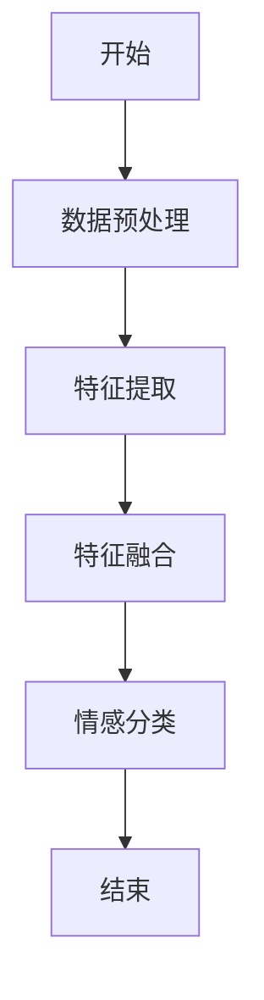
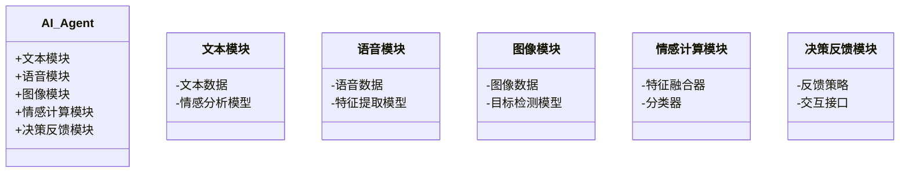
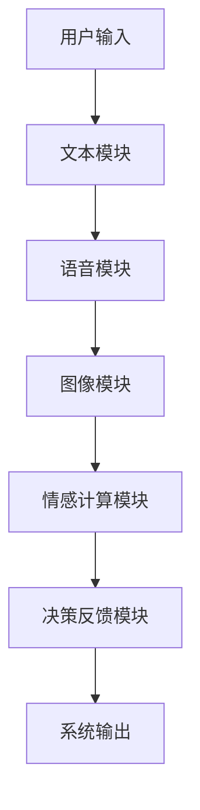

                 


# 开发具有多模态情感识别能力的AI Agent

## 关键词：多模态情感识别，AI Agent，深度学习，文本语音图像融合，人机交互

## 摘要：  
本文深入探讨了开发具有多模态情感识别能力的AI Agent的技术细节。首先，我们介绍了多模态情感识别的背景与核心概念，分析了文本、语音和图像三种模态数据的特点及其在情感识别中的作用。接着，我们详细讲解了多模态情感识别的算法原理，包括数据预处理、特征提取和分类器设计，并通过Mermaid流程图和Python代码示例进行了直观展示。然后，我们从系统架构的角度分析了AI Agent的模块划分、类图设计和接口交互，并通过实际案例展示了如何构建一个基于多模态情感识别的AI Agent系统。最后，我们总结了开发过程中需要注意的最佳实践和未来的研究方向。

---

# 第一部分: 多模态情感识别的背景与概述

# 第1章: 多模态情感识别的背景与概念

## 1.1 情感识别的背景与问题背景

### 1.1.1 情感识别的定义与核心问题
情感识别（Emotion Recognition）是人工智能领域中的一个重要研究方向，旨在通过分析多模态数据（如文本、语音、图像等）来识别和理解人类的情感状态。情感识别的核心问题在于如何准确捕捉和解析人类在不同情境下的情感表达。

### 1.1.2 单模态与多模态情感识别的对比
单模态情感识别仅依赖一种数据类型（如文本或语音）进行情感分析，而多模态情感识别则结合多种数据源，通过融合不同模态的信息来提高情感识别的准确性和鲁棒性。例如，结合文本和语音数据可以更好地捕捉用户的整体情感状态。

### 1.1.3 多模态情感识别的必要性与优势
在实际应用中，单模态情感识别往往存在局限性，例如文本分析可能无法捕捉到语气和语调中的情感信息，而语音分析可能无法提供上下文信息。通过多模态数据的融合，可以更全面地理解用户的情感状态，从而提高AI Agent的交互能力和用户体验。

---

## 1.2 多模态情感识别的核心概念

### 1.2.1 多模态数据的定义与特征
多模态数据是指来自不同感官渠道的数据，如文本、语音、图像等。每种模态数据都有其独特的特征和优势：
- **文本数据**：包含丰富的语义信息，但缺乏情感的语调和语气信息。
- **语音数据**：包含情感的语调、语速和音高信息，但缺乏上下文信息。
- **图像数据**：包含面部表情和肢体语言信息，但难以直接提取情感特征。

### 1.2.2 情感识别的维度与层次
情感识别可以从多个维度进行分析，例如：
- **微情感分析**：对短文本中的情感倾向进行分析。
- **宏观情感分析**：对长文本中的整体情感进行分类。
- **情感强度分析**：量化情感的强烈程度。

### 1.2.3 多模态情感识别的边界与外延
多模态情感识别的边界在于如何有效地融合不同模态的数据，并提取出与情感相关的特征。其外延则涉及如何将情感识别结果应用于实际场景，例如智能客服、教育科技和健康医疗等领域。

---

## 1.3 多模态情感识别的技术优势

### 1.3.1 提高情感识别的准确性
通过融合多模态数据，可以有效减少单模态数据的局限性，提高情感识别的准确性。

### 1.3.2 多场景应用的可能性
多模态情感识别可以应用于多种场景，例如智能音箱、虚拟助手、教育机器人等，为这些场景提供更智能化的交互体验。

### 1.3.3 人机交互的自然性提升
通过多模态情感识别，AI Agent可以更自然地理解和回应用户的情感需求，从而提升人机交互的自然性和流畅性。

---

## 1.4 多模态情感识别的应用场景

### 1.4.1 智能客服
通过多模态情感识别，智能客服系统可以更准确地理解用户的情感状态，提供更个性化的服务。

### 1.4.2 教育科技
在教育科技中，多模态情感识别可以帮助教师更好地了解学生的情感状态，提供个性化的教学方案。

### 1.4.3 健康医疗
在健康医疗领域，多模态情感识别可以用于心理健康评估和疾病辅助诊断。

### 1.4.4 娱乐互动
在娱乐互动场景中，多模态情感识别可以提升用户体验，例如在游戏和虚拟现实中实现更自然的互动。

---

## 1.5 本章小结

通过本章的介绍，我们了解了多模态情感识别的背景、核心概念和技术优势，以及其在多个场景中的应用潜力。接下来，我们将深入探讨多模态情感识别的核心概念与联系。

---

# 第二部分: 多模态情感识别的核心概念与联系

# 第2章: 多模态数据的特征与处理

## 2.1 文本数据的情感特征

### 2.1.1 文本情感分析的基本原理
文本情感分析是通过分析文本内容来判断情感倾向的过程。常用的方法包括基于词袋模型、词嵌入（如Word2Vec、GloVe）和深度学习模型（如LSTM、BERT）。

### 2.1.2 常见的文本特征提取方法
- **词袋模型**：基于词频（TF-IDF）提取文本特征。
- **词嵌入**：将文本转化为低维密集向量（如Word2Vec、GloVe）。
- **深度学习模型**：使用LSTM或Transformer模型提取文本特征。

### 2.1.3 文本数据的预处理步骤
- **分词**：将文本分割成词语或短语。
- **去停用词**：去除常见但无意义的词语（如“的”、“是”）。
- **词干提取或词形还原**：将词语转换为基本形式（如“running”还原为“run”）。

---

## 2.2 语音数据的情感特征

### 2.2.1 语音信号的基本特征
语音信号可以通过时域和频域特征进行分析，例如：
- **时域特征**：音调、音速、能量。
- **频域特征**：基频、谐波、频带。

### 2.2.2 基于语音的特征提取方法
- **Mel频率倒谱系数（MFCC）**：提取语音的频域特征。
- **声学特征**：提取音调、音速和能量特征。

### 2.2.3 语音数据的预处理步骤
- **降噪**：去除环境噪音。
- **分段**：将语音信号分割成短时段进行分析。
- **标准化**：对特征进行归一化处理。

---

## 2.3 图像数据的情感特征

### 2.3.1 面部表情分析
面部表情是图像数据中重要的情感特征，可以通过计算机视觉技术（如OpenCV）进行分析。

### 2.3.2 姿势和动作分析
通过分析图像中的姿势和动作，可以进一步判断情感状态。

### 2.3.3 图像数据的预处理步骤
- **图像增强**：调整图像亮度、对比度等。
- **目标检测**：检测面部区域。
- **特征提取**：提取面部表情特征（如眼距、嘴角角度）。

---

## 2.4 多模态数据的融合框架

### 2.4.1 融合方法
- **特征级融合**：将不同模态的特征向量进行融合。
- **决策级融合**：将不同模态的情感识别结果进行融合。

### 2.4.2 融合流程
1. 对不同模态的数据进行预处理和特征提取。
2. 将提取的特征进行融合，例如通过加权平均或投票机制。
3. 对融合后的特征进行情感分类。

---

## 2.5 本章小结

通过本章的介绍，我们了解了文本、语音和图像数据的特征及其处理方法，并探讨了多模态数据融合的框架和方法。接下来，我们将深入探讨多模态情感识别的算法原理。

---

# 第三部分: 多模态情感识别的算法原理

# 第3章: 多模态情感识别的算法原理

## 3.1 情感计算的算法概述

### 3.1.1 数据预处理
- 文本数据：分词、去停用词、词嵌入。
- 语音数据：降噪、分段、特征提取。
- 图像数据：图像增强、目标检测、特征提取。

### 3.1.2 特征提取
- 文本：词袋模型、词嵌入、深度学习模型。
- 语音：MFCC、声学特征。
- 图像：面部表情分析、姿势分析。

### 3.1.3 分类器设计
- 传统机器学习模型：SVM、随机森林。
- 深度学习模型：CNN、RNN、Transformer。

---

## 3.2 多模态情感识别的流程图



---

## 3.3 情感分类器的数学模型

### 3.3.1 传统机器学习模型
**支持向量机（SVM）**：
$$ \text{目标函数} = \sum_{i=1}^{n} \alpha_i y_i (w \cdot x_i + b) + C \sum_{i=1}^{n} \alpha_i $$
其中，$\alpha_i$ 是拉格朗日乘子，$y_i$ 是标签，$w$ 是权重向量，$b$ 是偏置项。

### 3.3.2 深度学习模型
**卷积神经网络（CNN）**：
$$ \text{卷积层} = \max\left( \sum_{k=1}^{K} w_{k} x_{k} + b \right) $$
**池化层**：
$$ \text{池化层} = \max\left( f_{i,j}, f_{i+1,j+1} \right) $$
**全连接层**：
$$ \text{输出} = \sigma(w \cdot x + b) $$
其中，$\sigma$ 是sigmoid函数。

---

## 3.4 本章小结

通过本章的介绍，我们了解了多模态情感识别的算法原理和数学模型，并通过Mermaid流程图展示了整个识别过程。接下来，我们将探讨如何将这些算法应用于实际的系统设计中。

---

# 第四部分: 系统架构设计

# 第4章: 多模态情感识别的系统架构设计

## 4.1 系统功能设计

### 4.1.1 领域模型设计


### 4.1.2 系统架构设计


---

## 4.2 系统接口设计

### 4.2.1 API设计
- `/api/text/emotion`：接收文本数据，返回情感分析结果。
- `/api/voice/emotion`：接收语音数据，返回情感分析结果。
- `/api/image/emotion`：接收图像数据，返回情感分析结果。

### 4.2.2 接口交互流程
1. 用户通过API发送多模态数据。
2. 系统分别处理文本、语音和图像数据。
3. 情感计算模块融合特征并进行情感分类。
4. 决策反馈模块生成反馈策略并返回结果。

---

## 4.3 本章小结

通过本章的介绍，我们了解了多模态情感识别系统的功能设计和架构设计，并通过Mermaid图展示了系统的模块划分和接口交互流程。接下来，我们将通过实际案例展示如何实现一个多模态情感识别的AI Agent系统。

---

# 第五部分: 项目实战

# 第5章: 多模态情感识别的AI Agent实现

## 5.1 环境配置

### 5.1.1 安装依赖库
```bash
pip install numpy pandas scikit-learn librosa cv2
```

## 5.2 核心代码实现

### 5.2.1 文本模块实现
```python
from sklearn.feature_extraction.text import TfidfVectorizer
from sklearn.svm import SVC

# 文本数据预处理
def preprocess_text(text):
    # 分词
    words = text.split()
    # 去停用词
    filtered_words = [word for word in words if word not in stop_words]
    return ' '.join(filtered_words)

# 文本特征提取
vectorizer = TfidfVectorizer()
X_text = vectorizer.fit_transform(text_list)
```

### 5.2.2 语音模块实现
```python
import librosa

# 语音特征提取
def extract_voice_features(audio_path):
    audio, sr = librosa.load(audio_path, sr=None)
    mfccs = librosa.feature.mfcc(y=audio, sr=sr, n_mfcc=13)
    return mfccs.T
```

### 5.2.3 图像模块实现
```python
import cv2

# 图像特征提取
def extract_face_features(image_path):
    image = cv2.imread(image_path)
    gray = cv2.cvtColor(image, cv2.COLOR_BGR2GRAY)
    face_cascade = cv2.CascadeClassifier(cv2.data.haarcascades + 'haarcascade_frontalface_default.xml')
    faces = face_cascade.detectMultiScale(gray, 1.3, 5)
    if len(faces) == 0:
        return None
    (x, y, w, h) = faces[0]
    face_image = gray[y:y+h, x:x+w]
    return face_image
```

### 5.2.4 情感计算模块实现
```python
from sklearn.ensemble import VotingClassifier

# 特征融合
X = np.concatenate([X_text, X_voice, X_image], axis=1)

# 情感分类器
classifier = VotingClassifier([
    ('svm', SVC()),
    ('rf', RandomForestClassifier())
])
classifier.fit(X, y)
```

## 5.3 项目测试与优化

### 5.3.1 测试用例设计
- **文本数据**：正面、负面、中性句子。
- **语音数据**：不同音调和语速的语音片段。
- **图像数据**：不同面部表情的图像。

### 5.3.2 模型评估
- **准确率**：分类正确的样本数占总样本数的比例。
- **召回率**：正确分类的正样本数占实际正样本数的比例。
- **F1分数**：准确率和召回率的调和平均数。

---

## 5.4 本章小结

通过本章的实践，我们了解了如何配置开发环境并实现一个多模态情感识别的AI Agent系统。接下来，我们将总结开发过程中需要注意的最佳实践和未来的研究方向。

---

# 第六部分: 最佳实践与未来展望

# 第6章: 最佳实践与未来展望

## 6.1 开发中的注意事项

### 6.1.1 数据质量问题
- 确保数据的多样性和代表性。
- 处理数据中的噪声和偏差。

### 6.1.2 模型优化技巧
- 使用数据增强技术提高模型的泛化能力。
- 调参优化模型性能。

### 6.1.3 系统设计建议
- 采用模块化设计，便于功能扩展和维护。
- 确保系统的可扩展性和可维护性。

---

## 6.2 未来研究方向

### 6.2.1 模型优化
- 引入更先进的深度学习模型（如Transformer）。
- 研究多模态数据的自适应融合方法。

### 6.2.2 多语言支持
- 研究多语言情感识别技术。
- 构建多语言情感识别模型。

### 6.2.3 伦理与隐私问题
- 研究情感识别中的隐私保护问题。
- 探讨情感识别技术的伦理应用。

---

## 6.3 本章小结

通过本章的总结，我们了解了开发多模态情感识别AI Agent系统需要注意的最佳实践，并展望了未来的研究方向。希望本文能为读者提供有价值的参考和启发。

---

# 附录

## 附录A: 代码实现细节

### 文本模块
```python
# 示例代码：文本模块
from sklearn.feature_extraction.text import TfidfVectorizer
from sklearn.svm import SVC

text_list = ["I love this!", "I hate this!", "It's okay."]
vectorizer = TfidfVectorizer()
X_text = vectorizer.fit_transform(text_list)
model = SVC()
model.fit(X_text, ['positive', 'negative', 'neutral'])
```

### 语音模块
```python
# 示例代码：语音模块
import librosa

audio_path = "audio.wav"
audio, sr = librosa.load(audio_path, sr=None)
mfccs = librosa.feature.mfcc(y=audio, sr=sr, n_mfcc=13)
print(mfccs.shape)
```

### 图像模块
```python
# 示例代码：图像模块
import cv2

image_path = "face.jpg"
face_cascade = cv2.CascadeClassifier(cv2.data.haarcascades + 'haarcascade_frontalface_default.xml')
image = cv2.imread(image_path)
gray = cv2.cvtColor(image, cv2.COLOR_BGR2GRAY)
faces = face_cascade.detectMultiScale(gray, 1.3, 5)
print(faces)
```

---

## 附录B: 系统架构图


---

## 附录C: 参考文献

1. 情感分析相关论文
2. 多模态数据融合相关文献
3. 深度学习模型相关研究

---

通过以上目录结构，您可以开始撰写详细的正文内容，确保每个章节和子章节都涵盖关键点，并使用技术语言和图表来增强可读性。希望这个大纲对您有所帮助！

