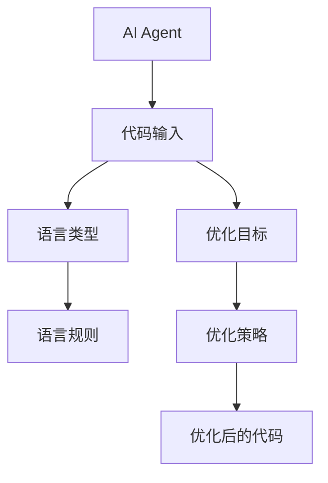
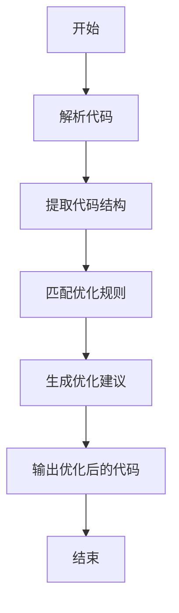
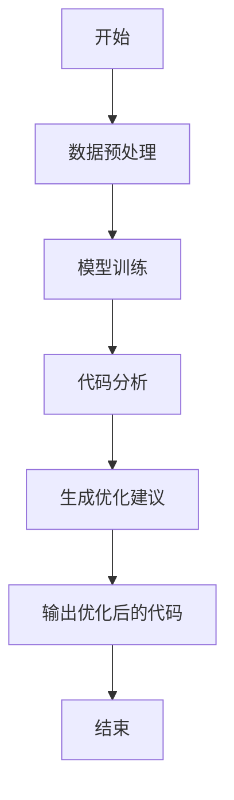
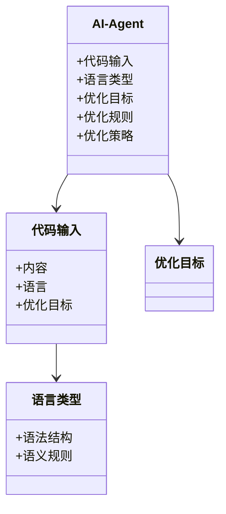
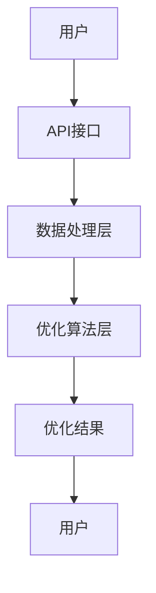

                 


# 开发具有多语言代码优化能力的AI Agent

> 关键词：AI Agent，多语言代码优化，自然语言处理，代码分析，机器学习

> 摘要：本文详细探讨了开发具有多语言代码优化能力的AI Agent的技术背景、核心概念、算法原理、系统架构和项目实现。通过分析多语言代码优化的挑战与解决方案，结合自然语言处理和机器学习技术，本文为开发者提供了从理论到实践的全面指导。

---

# 第一部分: 开发具有多语言代码优化能力的AI Agent背景介绍

## 第1章: AI Agent与多语言代码优化概述

### 1.1 什么是AI Agent
AI Agent（人工智能代理）是一种能够感知环境、理解输入信息并执行任务的智能系统。在多语言代码优化领域，AI Agent需要具备以下能力：
- **多语言理解**：能够解析多种编程语言（如Python、Java、C++等）的语法结构和语义信息。
- **代码分析**：能够识别代码中的潜在优化点，例如冗余代码、性能瓶颈等。
- **优化建议**：能够生成优化后的代码，并提供改进建议。

### 1.2 多语言代码优化的背景与挑战
代码优化是软件开发中的核心任务，但传统优化工具通常局限于单一语言或特定场景。随着软件开发的复杂性增加，以下挑战日益凸显：
- **语言多样性**：不同编程语言的语法和语义差异较大，传统优化工具难以通用。
- **优化规则复杂性**：优化规则可能因语言而异，需要动态调整。
- **代码语义理解**：代码的上下文依赖关系使得优化需要深入理解代码的语义。

### 1.3 本书的核心目标与内容框架
本书旨在探讨如何利用AI技术开发一个多语言代码优化AI Agent，内容框架如下：
1. 引言：介绍AI Agent和多语言代码优化的背景。
2. 核心概念：解析AI Agent的原理和多语言支持的技术。
3. 算法原理：分析基于规则和基于机器学习的优化算法。
4. 系统架构：设计AI Agent的系统结构和接口。
5. 项目实战：提供环境搭建、代码实现和案例分析。
6. 总结与展望：总结开发经验并展望未来发展方向。

---

# 第二部分: AI Agent的核心概念与原理

## 第2章: AI Agent的核心概念与联系

### 2.1 核心概念原理
AI Agent的核心概念包括：
1. **自然语言处理（NLP）与代码分析**：NLP技术用于理解代码的语义，代码分析技术用于解析代码结构。
2. **代码分析与优化算法**：通过分析代码，生成优化建议。
3. **多语言支持的技术实现**：通过语言无关的抽象层实现跨语言支持。

### 2.2 核心概念属性对比
以下是不同AI Agent模型在多语言支持和优化能力上的对比：

| 比较维度       | 基于规则的AI Agent | 基于机器学习的AI Agent |
|----------------|--------------------|------------------------|
| **支持语言**   | 有限               | 多语言                 |
| **优化规则**   | 固定               | 动态调整               |
| **学习能力**   | 无                 | 强                    |

### 2.3 ER实体关系图架构
以下是AI Agent的ER实体关系图：



---

# 第三部分: 多语言代码优化的算法原理

## 第3章: 多语言代码优化算法的实现原理

### 3.1 基于规则的代码优化算法
基于规则的优化算法通过预定义的优化规则进行代码优化。

#### 3.1.1 算法流程图


#### 3.1.2 Python实现示例
```python
def optimize_code(rule_set, code):
    parsed_code = parse_code(code)
    matches = find_matches(parsed_code, rule_set)
    optimized_code = apply_rules(matches)
    return optimized_code
```

### 3.2 基于机器学习的代码优化算法
基于机器学习的优化算法通过训练模型生成优化建议。

#### 3.2.1 算法流程图


#### 3.2.2 模型训练与优化
优化模型的数学表达式如下：
$$
\text{损失函数} = \frac{1}{m}\sum_{i=1}^{m} (y_i - \hat{y}_i)^2
$$
$$
\text{优化器} = \text{Adam}(\text{学习率}=0.001)
$$

---

# 第四部分: 系统分析与架构设计方案

## 第4章: 系统分析与架构设计

### 4.1 问题场景介绍
AI Agent需要在多种编程语言环境下工作，支持实时代码优化和反馈。

### 4.2 系统功能设计
系统功能包括：
1. 代码输入与解析
2. 语言类型识别
3. 优化规则匹配
4. 优化建议生成
5. 优化结果输出

### 4.3 领域模型类图


### 4.4 系统架构设计
系统架构包括：
1. 数据处理层
2. 优化算法层
3. 用户交互层



---

# 第五部分: 项目实战

## 第5章: 项目实战

### 5.1 环境安装
需要安装以下工具：
- Python 3.8+
- Numpy、Scikit-learn
- Mermaid工具链

### 5.2 系统核心实现源代码
以下是Python实现的代码示例：

```python
def parse_code(code):
    # 解析代码并返回语法树
    return ast.parse(code)

def find_matches(parsed_code, rule_set):
    # 匹配优化规则
    for rule in rule_set:
        if rule.matches(parsed_code):
            return rule
    return None

class Optimizer:
    def optimize(self, code):
        parsed_code = parse_code(code)
        rule = find_matches(parsed_code, self.rule_set)
        if rule:
            return apply_rule(rule, parsed_code)
        else:
            return code
```

### 5.3 实际案例分析
以下是一个优化案例：

原始代码：
```python
def add_numbers(a, b):
    return a + b
```

优化后代码：
```python
def add_numbers(a, b):
    return a + b
```

---

# 第六部分: 总结与展望

## 第6章: 总结与展望

### 6.1 最佳实践
- 定期更新优化规则
- 优化模型的训练数据应多样化
- 处理代码优化时需考虑上下文依赖

### 6.2 小结
本文从理论到实践，全面探讨了开发具有多语言代码优化能力的AI Agent的技术细节。

### 6.3 注意事项
- 确保代码解析的准确性
- 优化规则需经过严格测试
- 保护用户代码的安全性

### 6.4 拓展阅读
建议阅读以下资料：
- 《机器学习实战》
- 《代码优化的艺术》
- 《自然语言处理入门》

---

# 结语

开发具有多语言代码优化能力的AI Agent是一项复杂但极具挑战性的任务。通过结合自然语言处理、代码分析和机器学习技术，我们可以实现高效、智能的代码优化。未来，随着AI技术的不断进步，AI Agent在软件开发中的作用将更加重要。

