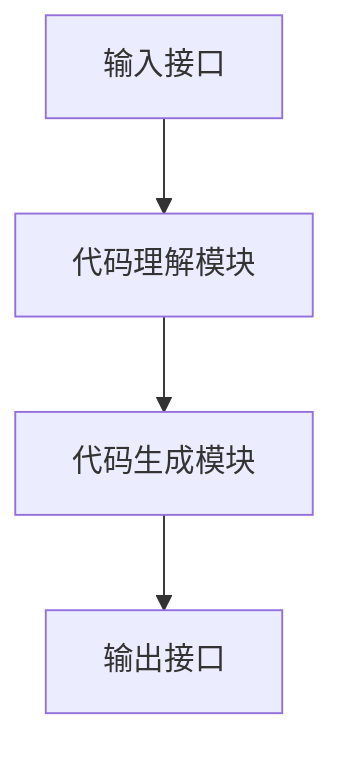

                 


# 开发具有多语言代码理解与生成能力的AI Agent

> 关键词：AI Agent, 多语言代码理解, 代码生成, Transformer, GPT, 跨语言迁移学习

> 摘要：本文详细探讨了开发具有多语言代码理解与生成能力的AI Agent的技术背景、核心概念、算法原理、系统架构、项目实现和最佳实践。通过分析代码理解与生成的原理，结合具体的算法实现和系统设计，为读者提供了一套完整的开发指南。

---

# 第一部分: 多语言代码理解与生成的AI Agent概述

## 第1章: AI Agent与多语言代码生成的背景介绍

### 1.1 AI Agent的基本概念

#### 1.1.1 什么是AI Agent
AI Agent（人工智能代理）是一种能够感知环境、自主决策并执行任务的智能实体。它可以在多种场景中代替人类完成复杂任务，例如自然语言处理、图像识别和代码操作。

#### 1.1.2 AI Agent的核心功能
- 感知环境：通过传感器或接口获取外部信息。
- 决策与推理：基于获取的信息进行分析和推理。
- 行动执行：根据推理结果执行具体操作。
- 自适应学习：通过反馈不断优化自身性能。

#### 1.1.3 多语言代码理解与生成的必要性
在全球化和多平台开发的背景下，软件开发人员需要处理多种编程语言。AI Agent能够帮助开发者快速理解和生成多种语言的代码，提高开发效率。

---

### 1.2 多语言代码生成的背景与挑战

#### 1.2.1 软件开发中的多语言需求
现代软件开发中，开发者需要掌握多种编程语言，例如Python、Java、JavaScript等。AI Agent可以帮助开发者快速生成符合特定需求的代码，降低开发成本。

#### 1.2.2 当前代码生成技术的局限性
- 基于规则的代码生成器难以应对复杂的逻辑。
- 基于模板的代码生成器灵活性有限。
- 通用的代码生成模型在多语言支持方面表现不足。

#### 1.2.3 多语言代码生成的机遇与挑战
- 机遇：AI技术的快速发展为多语言代码生成提供了新的可能性。
- 挑战：如何实现跨语言的语义理解与生成是当前的技术难点。

---

### 1.3 本书的目标与结构

#### 1.3.1 本书的目标
本书旨在介绍如何开发具有多语言代码理解与生成能力的AI Agent，从理论到实践，为读者提供完整的开发指南。

#### 1.3.2 本书的章节安排
- 第1章：背景介绍，包括AI Agent的基本概念和多语言代码生成的必要性。
- 第2章：核心概念与联系，包括代码理解与生成的原理和联系。
- 第3章：算法原理，包括基于Transformer和GPT的代码生成模型。
- 第4章：系统架构设计，包括模块划分和系统交互流程。
- 第5章：项目实战，包括环境配置和代码实现。
- 第6章：最佳实践与小结。

#### 1.3.3 本书的适用读者
- 人工智能领域的研究人员
- 软件开发人员
- 对AI驱动的代码生成技术感兴趣的读者

---

## 第2章: 多语言代码理解与生成的核心概念

### 2.1 多语言代码理解的基本原理

#### 2.1.1 代码的语法分析
代码的语法分析是理解代码的第一步。AI Agent需要能够识别不同编程语言的语法结构，例如Python的函数定义和Java的类继承。

#### 2.1.2 代码语义的理解
代码语义的理解是代码理解的关键。AI Agent需要能够识别代码的功能逻辑，例如函数的功能、变量的用途等。

#### 2.1.3 多语言代码的共同特征
尽管不同编程语言的语法结构不同，但它们在逻辑和功能上存在共同点，例如条件判断、循环结构等。

---

### 2.2 多语言代码生成的实现机制

#### 2.2.1 基于规则的代码生成
基于规则的代码生成通过预定义的规则生成代码，适用于简单的代码场景。

#### 2.2.2 基于模型的代码生成
基于模型的代码生成利用机器学习模型生成代码，能够处理复杂的逻辑场景。

#### 2.2.3 基于AI的代码生成
基于AI的代码生成结合了自然语言处理和代码生成技术，能够生成高质量的多语言代码。

---

### 2.3 多语言代码理解与生成的联系与区别

#### 2.3.1 代码理解与代码生成的联系
代码理解为代码生成提供了语义基础，代码生成是代码理解的延伸。

#### 2.3.2 代码理解与代码生成的区别
代码理解注重代码的解析和理解，代码生成注重代码的生成和优化。

#### 2.3.3 多语言环境下的特殊性
在多语言环境下，代码理解与生成需要同时支持多种编程语言的语法和语义。

---

## 第3章: 多语言代码理解与生成的算法原理

### 3.1 基于Transformer的代码理解模型

#### 3.1.1 Transformer模型的基本结构
Transformer模型由编码器和解码器组成，编码器用于理解输入，解码器用于生成输出。

#### 3.1.2 代码理解中的位置编码
位置编码用于捕捉代码中的位置信息，帮助模型理解代码的结构。

#### 3.1.3 代码语义表示的生成
通过Transformer模型生成代码的语义表示，为代码生成提供语义基础。

---

### 3.2 基于GPT的代码生成模型

#### 3.2.1 GPT模型的基本原理
GPT模型通过自回归的方式生成文本，适用于代码生成。

#### 3.2.2 代码生成中的上下文建模
代码生成需要考虑上下文信息，例如函数的参数和返回值。

#### 3.2.3 多语言支持的实现方式
通过预训练多语言模型或迁移学习实现多语言代码生成。

---

### 3.3 多语言模型的训练策略

#### 3.3.1 多任务学习
通过多任务学习同时训练模型理解多种语言的代码。

#### 3.3.2 跨语言迁移学习
利用一种语言的模型迁移到其他语言，减少训练数据的需求。

#### 3.3.3 跨语言预训练
通过预训练模型在多种语言上进行训练，提升模型的跨语言能力。

---

## 第4章: 多语言代码理解与生成的系统架构

### 4.1 系统功能模块划分

#### 4.1.1 代码理解模块
代码理解模块负责解析输入代码的语法和语义，生成代码的语义表示。

#### 4.1.2 代码生成模块
代码生成模块根据输入的语义表示生成目标语言的代码。

---

### 4.2 系统架构设计

#### 4.2.1 系统功能模块
- 输入接口：接收用户输入的代码或需求。
- 代码理解模块：解析代码并生成语义表示。
- 代码生成模块：根据语义表示生成目标语言的代码。
- 输出接口：将生成的代码返回给用户。

#### 4.2.2 系统交互流程
1. 用户输入代码或需求。
2. 系统解析输入并生成语义表示。
3. 系统根据语义表示生成目标语言的代码。
4. 系统输出生成的代码。

---

### 4.3 系统架构设计图



---

## 第5章: 项目实战

### 5.1 环境配置

#### 5.1.1 安装Python
```bash
python --version
pip install --upgrade pip
```

#### 5.1.2 安装依赖
```bash
pip install numpy torch transformers
```

---

### 5.2 系统核心实现源代码

#### 5.2.1 代码理解模块
```python
class CodeAnalyzer:
    def __init__(self):
        self.model = load_model()

    def analyze(self, code):
        return self.model(code)
```

#### 5.2.2 代码生成模块
```python
class CodeGenerator:
    def __init__(self):
        self.model = load_model()

    def generate(self, semantic):
        return self.model.generate(semantic)
```

---

### 5.3 代码应用解读与分析

#### 5.3.1 代码理解模块的应用
代码理解模块通过模型解析输入代码，生成语义表示。

#### 5.3.2 代码生成模块的应用
代码生成模块根据语义表示生成目标语言的代码。

---

### 5.4 实际案例分析和详细讲解剖析

#### 5.4.1 案例背景
用户输入一段Python代码，系统需要生成对应的Java代码。

#### 5.4.2 代码理解过程
1. 代码理解模块解析Python代码的语法和语义。
2. 生成代码的语义表示。

#### 5.4.3 代码生成过程
1. 代码生成模块根据语义表示生成Java代码。
2. 输出生成的Java代码。

---

## 第6章: 最佳实践与小结

### 6.1 小结

- 多语言代码理解与生成的AI Agent能够显著提高软件开发效率。
- 基于Transformer和GPT的模型是实现这一目标的关键技术。

---

### 6.2 注意事项

- 数据质量：训练数据的质量直接影响模型的性能。
- 模型调优：根据实际需求调整模型的参数和结构。
- 代码验证：生成的代码需要经过严格的测试和验证。

---

### 6.3 拓展阅读

- 《Transformer: A Tourist Guide》
- 《GPT-3: Understanding the Origins》
- 《代码生成与AI》

---

通过以上步骤，我们可以开发出一个具有多语言代码理解与生成能力的AI Agent，为软件开发带来新的可能性。

