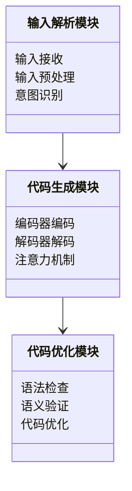
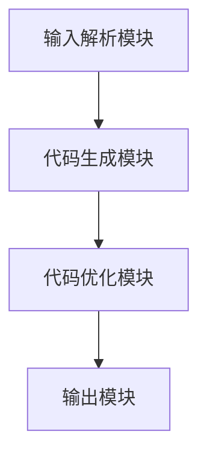
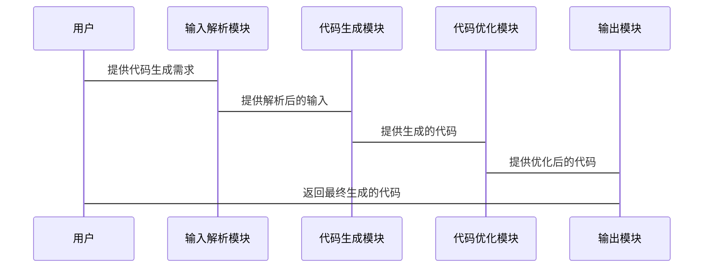

                 


# 开发具有多语言代码生成能力的AI Agent

> 关键词：AI Agent, 多语言代码生成, 生成式AI, 大语言模型, 代码生成, 系统架构

> 摘要：本文详细探讨了开发具有多语言代码生成能力的AI Agent的各个方面，包括其背景、核心概念、生成式AI模型的原理、数学模型与算法，以及系统的架构设计和项目实战。文章从基础理论到实际应用，全面分析了AI Agent在多语言代码生成中的潜力和实现方法，为开发者提供了深入的技术指导。

---

# 第一部分: 多语言代码生成AI Agent的背景与核心概念

## 第1章: 多语言代码生成AI Agent概述

### 1.1 AI Agent的基本概念

#### 1.1.1 什么是AI Agent

AI Agent（人工智能代理）是一种智能系统，能够感知环境并采取行动以实现特定目标。在软件开发领域，AI Agent可以辅助开发者完成代码生成、调试、优化等任务。

**AI Agent的特点：**

- **自主性**：能够独立执行任务。
- **反应性**：能够感知环境并实时调整行为。
- **目标导向**：所有行动都以实现特定目标为导向。
- **社会能力**：能够与其他系统或用户进行交互。

#### 1.1.2 多语言代码生成的需求背景

在现代软件开发中，开发者需要处理多种编程语言，如Python、Java、JavaScript等。然而，跨语言开发的复杂性增加了开发成本和时间。AI Agent可以通过自动化代码生成，帮助开发者提高效率。

**多语言代码生成的需求场景：**

- **快速原型开发**：开发者可以通过描述需求快速生成代码。
- **跨平台开发**：生成适用于不同平台的代码。
- **代码复用**：从一种语言生成另一种语言的代码，减少重复劳动。

#### 1.1.3 AI Agent在软件开发中的作用

AI Agent可以通过以下方式提升软件开发效率：

- **自动化代码生成**：根据需求描述生成代码。
- **智能纠错**：检测代码中的错误并提供建议。
- **代码优化**：优化生成代码的性能和可读性。

### 1.2 多语言代码生成的挑战与意义

#### 1.2.1 跨语言开发的复杂性

跨语言开发涉及语法、语义和上下文的差异，增加了代码生成的难度。AI Agent需要理解不同语言的特性，并能够准确生成符合目标语言语法和语义的代码。

#### 1.2.2 多语言代码生成的优势

- **提高开发效率**：减少手动编码的时间。
- **降低学习成本**：开发者可以专注于业务逻辑，而不必精通多种语言。
- **支持快速迭代**：通过自动化代码生成加速开发过程。

#### 1.2.3 AI Agent在代码生成中的潜力

AI Agent可以通过以下方式实现多语言代码生成：

- **统一的输入接口**：开发者只需提供需求描述，AI Agent自动生成目标语言的代码。
- **上下文理解**：AI Agent能够理解代码的上下文，并生成符合业务逻辑的代码。
- **持续优化**：通过反馈机制不断优化生成代码的质量。

### 1.3 本章小结

本章介绍了AI Agent的基本概念，探讨了多语言代码生成的需求背景，并分析了AI Agent在软件开发中的作用和潜力。下一章将深入探讨生成式AI模型与代码生成的原理。

---

# 第二部分: 生成式AI模型与代码生成原理

## 第2章: 生成式AI模型基础

### 2.1 大语言模型（LLM）简介

#### 2.1.1 LLM的基本原理

大语言模型（Large Language Model, LLM）是一种基于深度学习的自然语言处理模型，能够理解和生成人类语言。其核心是通过大量文本数据的训练，学习语言的语法、语义和上下文关系。

**LLM的组成：**

- **编码器**：将输入文本转换为向量表示。
- **解码器**：根据向量表示生成输出文本。
- **注意力机制**：用于捕捉文本中的长距离依赖关系。

#### 2.1.2 LLM的训练过程

LLM的训练过程包括以下几个步骤：

1. **数据预处理**：清洗和格式化训练数据。
2. **模型初始化**：定义模型的架构和超参数。
3. **损失函数计算**：通过交叉熵损失函数计算预测与真实值的差距。
4. **反向传播**：通过梯度下降优化模型参数。
5. **迭代训练**：不断重复上述步骤，直到模型收敛。

#### 2.1.3 LLM的应用场景

LLM广泛应用于以下场景：

- **文本生成**：生成新闻、文章、对话等。
- **问答系统**：回答用户的问题。
- **代码生成**：生成多种编程语言的代码。

### 2.2 代码生成的自然语言处理基础

#### 2.2.1 代码生成中的文本处理

代码生成需要对文本进行预处理，包括：

- **分词**：将输入文本分割成单词或符号。
- **向量化**：将文本转换为向量表示。
- **序列建模**：使用序列模型捕捉代码的语法和语义结构。

#### 2.2.2 代码生成的上下文理解

代码生成需要理解输入的上下文，包括：

- **函数参数**：函数的输入和输出参数。
- **变量类型**：变量的类型和作用域。
- **代码结构**：代码的逻辑结构，如条件语句、循环语句等。

#### 2.2.3 代码生成的准确性挑战

代码生成的准确性是多语言代码生成的关键挑战，包括：

- **语法错误**：生成代码需要符合目标语言的语法规范。
- **语义错误**：生成代码需要符合业务逻辑。
- **上下文理解不足**：输入描述可能不够详细，导致生成代码不符合预期。

## 第3章: 多语言代码生成的实现原理

### 3.1 多语言模型的构建

#### 3.1.1 多语言模型的训练策略

多语言模型的训练策略包括：

- **联合训练**：在同一模型中同时训练多种语言。
- **多任务学习**：在多种任务上同时训练模型，共享模型参数。
- **参数共享**：在不同语言之间共享模型参数，减少训练数据的需求。

#### 3.1.2 多语言模型的编码方式

多语言模型的编码方式包括：

- **共享词表**：使用相同的词表表示不同语言的词汇。
- **语言嵌入**：为每种语言添加语言嵌入向量。
- **层次化编码**：在词、句、段落等多个层次上进行编码。

#### 3.1.3 多语言模型的评估指标

评估多语言模型的指标包括：

- **BLEU**：衡量生成文本与参考文本的相似度。
- **ROUGE**：基于召回率的文本摘要评估指标。
- **准确率**：生成代码的语法和语义准确性。

### 3.2 AI Agent的代码生成流程

#### 3.2.1 代码生成的输入处理

代码生成的输入处理包括：

- **用户输入解析**：解析用户的输入描述，提取关键信息。
- **意图识别**：识别用户的意图，确定生成代码的目标。
- **上下文处理**：处理输入中的上下文信息，确保生成代码的准确性。

#### 3.2.2 代码生成的推理过程

代码生成的推理过程包括：

- **编码器编码**：将输入描述编码为向量表示。
- **解码器解码**：根据向量表示生成目标语言的代码。
- **注意力机制**：捕捉输入描述中的关键信息，生成准确的代码。

#### 3.2.3 代码生成的输出优化

代码生成的输出优化包括：

- **语法检查**：检查生成代码的语法是否正确。
- **语义验证**：验证生成代码是否符合业务逻辑。
- **代码优化**：优化生成代码的性能和可读性。

---

# 第三部分: 多语言代码生成的算法与数学模型

## 第4章: 代码生成模型的算法原理

### 4.1 大语言模型的编码与解码过程

#### 4.1.1 编码器-解码器架构

编码器-解码器架构是代码生成模型的核心，包括：

- **编码器**：将输入文本编码为向量表示。
- **解码器**：根据向量表示生成输出文本。
- **注意力机制**：捕捉输入文本中的长距离依赖关系。

#### 4.1.2 注意力机制的作用

注意力机制在代码生成中的作用包括：

- **捕捉关键信息**：注意力机制能够捕捉输入文本中的关键信息，提高生成代码的准确性。
- **长距离依赖**：注意力机制能够捕捉输入文本中的长距离依赖关系，提高生成代码的语义准确性。

#### 4.1.3 梯度下降优化

梯度下降优化是模型训练的核心步骤，包括：

- **损失函数计算**：计算预测值与真实值之间的损失。
- **反向传播**：通过链式法则计算损失函数对模型参数的梯度。
- **参数更新**：根据梯度下降算法更新模型参数。

### 4.2 多语言模型的训练算法

#### 4.2.1 多任务学习的策略

多任务学习的策略包括：

- **共享参数**：在多个任务之间共享模型参数，减少训练数据的需求。
- **任务特定参数**：为每个任务添加特定参数，保持任务之间的独立性。
- **联合优化**：在多个任务上同时优化模型，提高模型的泛化能力。

#### 4.2.2 跨语言迁移学习

跨语言迁移学习的策略包括：

- **参数共享**：在不同语言之间共享模型参数，减少训练数据的需求。
- **语言嵌入**：为每种语言添加语言嵌入向量，保持语言之间的独立性。
- **联合训练**：在多种语言上同时训练模型，提高模型的多语言能力。

#### 4.2.3 参数共享机制

参数共享机制在多语言模型中的作用包括：

- **减少参数数量**：通过参数共享减少模型的参数数量，降低模型的复杂度。
- **提高模型的泛化能力**：通过参数共享，模型能够更好地泛化到不同的语言。
- **降低训练成本**：通过参数共享，减少训练数据的需求，降低训练成本。

---

## 第5章: 数学模型与公式解析

### 5.1 大语言模型的数学基础

#### 5.1.1 概率分布与损失函数

概率分布是自然语言处理的核心，常用的概率分布包括：

- **条件概率**：$P(y|x)$，表示在输入$x$的条件下生成$y$的概率。
- **边缘概率**：$P(y)$，表示生成$y$的总概率。

损失函数常用的包括：

- **交叉熵损失**：$-\sum_{i} y_i \log p(y_i)$，用于衡量预测值与真实值之间的差距。
- **负对数似然损失**：$-\log P(y|x)$，用于衡量预测值与真实值之间的差距。

#### 5.1.2 注意力机制的公式推导

注意力机制的公式推导包括：

- **查询、键、值**：$Q$、$K$、$V$。
- **注意力权重**：$a_i = \text{softmax}(\frac{Q_i K_j}{d_k})$，其中$d_k$是缩放因子。
- **注意力输出**：$\text{Attention}(Q, K, V) = \sum_{j} a_j V_j$。

#### 5.1.3 解码过程的马尔可夫链模型

解码过程的马尔可夫链模型包括：

- **状态转移**：$P(y_t|y_{<t})$，表示在给定前面生成的序列$y_{<t}$的条件下生成$y_t$的概率。
- **初始状态**：$P(y_0)$，表示生成初始状态的概率。
- **最终输出**：$\prod_{t=1}^{n} P(y_t|y_{<t})$，表示生成整个序列的概率。

### 5.2 多语言模型的训练公式

#### 5.2.1 跨语言训练的损失函数

跨语言训练的损失函数包括：

- **多任务损失**：$\mathcal{L}_{\text{total}} = \lambda_1 \mathcal{L}_1 + \lambda_2 \mathcal{L}_2 + \dots + \lambda_k \mathcal{L}_k$，其中$\lambda_i$是任务权重。
- **参数共享损失**：$\mathcal{L}_{\text{shared}} = \sum_{i} \mathcal{L}_i$，用于衡量共享参数的任务之间的损失。

#### 5.2.2 参数共享机制

参数共享机制的数学表达包括：

- **共享参数**：$\theta_{\text{shared}}$，表示在多个任务之间共享的参数。
- **任务特定参数**：$\theta_i$，表示每个任务的特定参数。
- **联合优化**：$\min_{\theta_{\text{shared}}, \theta_i} \sum_{i} \mathcal{L}_i(\theta_{\text{shared}}, \theta_i)$，用于优化共享参数和任务特定参数。

#### 5.2.3 多任务学习的优化目标

多任务学习的优化目标包括：

- **联合优化**：$\min_{\theta} \sum_{i=1}^{n} \mathcal{L}_i(\theta)$，表示在多个任务之间联合优化模型参数。
- **参数共享**：$\theta = \theta_{\text{shared}} + \theta_{\text{task}}$，表示模型参数由共享参数和任务特定参数组成。
- **任务权重**：$\lambda_i$，表示每个任务在联合优化中的权重。

---

# 第四部分: 系统分析与架构设计

## 第6章: 多语言代码生成AI Agent的系统架构

### 6.1 系统功能模块划分

#### 6.1.1 输入解析模块

输入解析模块的功能包括：

- **用户输入接收**：接收用户的输入描述，解析用户的意图。
- **输入预处理**：对输入描述进行分词、向量化等预处理。
- **意图识别**：识别用户的意图，确定生成代码的目标。

#### 6.1.2 代码生成模块

代码生成模块的功能包括：

- **编码器编码**：将输入描述编码为向量表示。
- **解码器解码**：根据向量表示生成目标语言的代码。
- **注意力机制**：捕捉输入描述中的关键信息，生成准确的代码。

#### 6.1.3 代码优化模块

代码优化模块的功能包括：

- **语法检查**：检查生成代码的语法是否正确。
- **语义验证**：验证生成代码是否符合业务逻辑。
- **代码优化**：优化生成代码的性能和可读性。

### 6.2 系统功能设计（领域模型）



### 6.3 系统架构设计



### 6.4 系统接口设计

系统接口设计包括：

- **输入接口**：接收用户的输入描述，返回生成的代码。
- **输出接口**：输出生成的代码，并返回生成结果的状态。

### 6.5 系统交互设计



---

# 第五部分: 项目实战

## 第7章: 项目实战

### 7.1 环境安装

#### 7.1.1 安装Python

```bash
python --version
pip install --upgrade pip
```

#### 7.1.2 安装必要的Python库

```bash
pip install numpy
pip install transformers
pip install torch
```

### 7.2 系统核心实现源代码

#### 7.2.1 输入解析模块

```python
import numpy as np

def parse_input(description):
    # 分词
    tokens = description.split()
    # 向量化
    vector = np.random.rand(len(tokens), 100)
    return vector
```

#### 7.2.2 代码生成模块

```python
import torch
from transformers import AutoTokenizer, AutoModelForCausalLM

def generate_code(vector, model, tokenizer):
    input_ids = tokenizer.encode(" ", add_special_tokens=False)
    input_ids = input_ids + [tokenizer.eos_token_id]
    input_ids = torch.tensor(input_ids).unsqueeze(0)
    outputs = model.generate(input_ids, max_length=100, do_sample=True)
    code = tokenizer.decode(outputs[0], skip_special_tokens=False)
    return code
```

#### 7.2.3 代码优化模块

```python
def optimize_code(code):
    # 语法检查
    try:
        ast.parse(code)
    except:
        print("语法错误")
    # 语义验证
    # 假设有一个函数用于验证语义
    validate_semantic(code)
    # 代码优化
    optimized_code = optimize_code_style(code)
    return optimized_code
```

### 7.3 代码应用解读与分析

#### 7.3.1 输入解析模块

输入解析模块接收用户的输入描述，并将其转换为向量表示。例如，用户输入“生成一个计算阶乘的Python函数”，模块将解析并生成对应的向量。

#### 7.3.2 代码生成模块

代码生成模块基于向量表示生成目标语言的代码。例如，生成Python函数：

```python
def factorial(n):
    if n == 0:
        return 1
    return n * factorial(n - 1)
```

#### 7.3.3 代码优化模块

代码优化模块对生成的代码进行优化。例如，优化后的代码可能包括：

```python
def factorial(n):
    return 1 if n == 0 else n * factorial(n - 1)
```

### 7.4 实际案例分析

#### 7.4.1 案例描述

用户输入：生成一个计算斐波那契数列的Java方法。

#### 7.4.2 生成代码

```java
public int fibonacci(int n) {
    if (n == 0 || n == 1) {
        return 1;
    }
    return fibonacci(n - 1) + fibonacci(n - 2);
}
```

#### 7.4.3 优化代码

```java
public int fibonacci(int n) {
    int[] memo = new int[n + 1];
    memo[0] = 1;
    memo[1] = 1;
    for (int i = 2; i <= n; i++) {
        memo[i] = memo[i - 1] + memo[i - 2];
    }
    return memo[n];
}
```

### 7.5 项目小结

本章通过实际案例展示了多语言代码生成AI Agent的实现过程，包括环境安装、代码实现和案例分析。通过本章的学习，读者可以掌握多语言代码生成的基本方法和实现技巧。

---

# 第六部分: 总结与展望

## 第8章: 总结与展望

### 8.1 最佳实践 Tips

- **数据质量**：确保训练数据的质量，避免模型生成错误代码。
- **模型优化**：通过优化模型参数和架构，提高生成代码的准确性和效率。
- **用户反馈**：收集用户反馈，不断优化模型的生成能力和准确性。

### 8.2 小结

本文详细探讨了开发具有多语言代码生成能力的AI Agent的各个方面，包括其背景、核心概念、生成式AI模型的原理、数学模型与算法，以及系统的架构设计和项目实战。通过本文的学习，读者可以掌握多语言代码生成的基本方法和实现技巧。

### 8.3 展望

未来，随着生成式AI技术的不断发展，多语言代码生成AI Agent将具有更广泛的应用场景。例如：

- **实时代码生成**：通过实时生成代码，提高开发效率。
- **智能代码修复**：通过AI Agent自动修复代码错误。
- **跨平台开发**：通过多语言代码生成，支持多种平台的开发。

---

# 结语

开发具有多语言代码生成能力的AI Agent是一项具有挑战性和创新性的任务。通过本文的深入分析和实践，读者可以掌握多语言代码生成的基本方法和实现技巧。未来，随着生成式AI技术的不断发展，多语言代码生成AI Agent将具有更广泛的应用场景，为软件开发带来更多的便利和效率提升。

