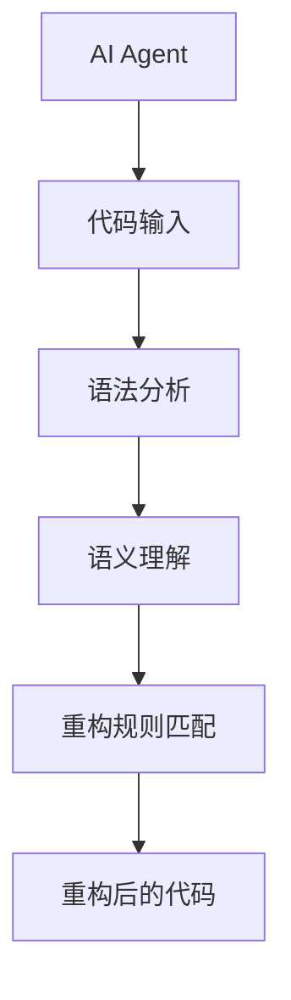
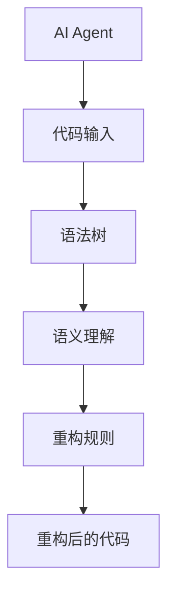
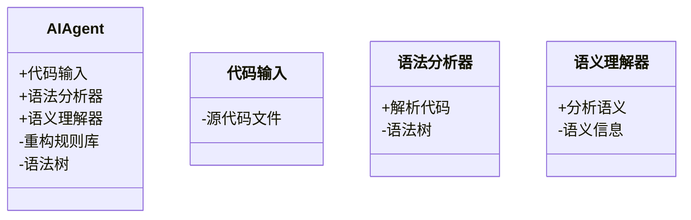
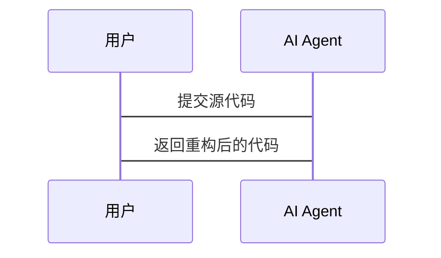

                 


# 开发具有多语言代码重构能力的AI Agent

---

## 关键词：AI Agent, 多语言代码重构, 代码分析, 机器学习, 跨语言转换

---

## 摘要

本文详细探讨了开发具有多语言代码重构能力的AI Agent的技术细节。从背景介绍、核心概念到算法原理、系统架构，再到项目实战，系统地阐述了如何利用AI技术实现跨语言代码重构。文章通过丰富的案例分析和详细的代码实现，展示了AI Agent在代码重构中的强大能力，并为读者提供了实用的开发建议和未来研究方向。

---

# 第一部分: 开发具有多语言代码重构能力的AI Agent背景介绍

## 第1章: 问题背景与描述

### 1.1 问题背景

#### 1.1.1 软件开发中的代码重构挑战

在软件开发过程中，代码重构是一个关键环节，旨在提高代码的可读性、可维护性和可扩展性。然而，随着项目规模的扩大和开发语言的多样化，代码重构的复杂性急剧增加。开发人员需要在多种编程语言（如Python、Java、JavaScript等）之间进行代码转换和优化，这对人工操作提出了更高的要求。

#### 1.1.2 多语言开发的复杂性

现代软件开发常常涉及多种编程语言，尤其是在跨国团队或混合开发环境中。不同语言的语法、语义和编程范式差异显著，使得代码重构变得更加复杂。例如，将Java代码转换为Python代码时，需要处理类型系统、语法结构和语义差异。

#### 1.1.3 AI在代码重构中的潜力

人工智能技术的快速发展为代码重构提供了新的可能性。基于机器学习的代码分析和生成技术可以自动化处理代码重构任务，提高开发效率和代码质量。AI Agent能够通过学习大量代码样本，掌握不同语言的语法和编程习惯，从而实现高效的多语言代码重构。

### 1.2 问题描述

#### 1.2.1 代码重构的核心目标

代码重构的目标包括提高代码可读性、消除代码异味、优化性能、提高代码复用性等。这些目标在单一语言环境下已经面临挑战，而在多语言环境下更加复杂。

#### 1.2.2 多语言代码重构的难点

多语言代码重构的难点主要体现在以下几点：

1. **语法和语义差异**：不同语言的语法结构和语义规则差异显著，导致代码转换过程中容易出错。
2. **跨语言转换的复杂性**：将代码从一种语言转换为另一种语言需要处理语法、库和API的差异。
3. **上下文依赖**：代码重构往往依赖于上下文信息，跨语言重构需要同时理解源语言和目标语言的上下文。

#### 1.2.3 AI Agent在代码重构中的角色

AI Agent在代码重构中的角色是通过自动化技术，辅助或完全替代人工代码重构工作。AI Agent能够理解多种编程语言的语法和语义，基于上下文信息生成重构后的代码，从而提高开发效率和代码质量。

### 1.3 问题解决思路

#### 1.3.1 AI驱动代码重构的可行性分析

基于机器学习的代码分析技术已经取得了显著进展。AI Agent可以通过对大量代码样本的学习，掌握不同语言的语法和编程习惯，从而实现高效的代码重构。

#### 1.3.2 多语言支持的技术挑战

多语言支持需要解决语法分析、语义理解和跨语言转换等问题。这些问题可以通过结合自然语言处理（NLP）和编译器技术来实现。

#### 1.3.3 基于AI的代码重构解决方案

基于AI的代码重构解决方案包括以下几个步骤：

1. **代码输入与解析**：将源代码输入AI Agent，并进行语法和语义分析。
2. **代码向量化表示**：将代码转换为向量表示，以便机器学习模型处理。
3. **重构规则匹配**：基于上下文信息匹配重构规则，生成重构后的代码。
4. **代码验证与优化**：验证重构后的代码是否符合预期，并进行优化。

### 1.4 问题的边界与外延

#### 1.4.1 代码重构的边界定义

代码重构的边界是指AI Agent能够处理的代码范围。例如，AI Agent可以处理函数级别的重构，但可能无法处理大规模的架构重构。

#### 1.4.2 多语言支持的范围

AI Agent可以支持多种编程语言，但需要针对每种语言进行语法和语义分析。目前，大多数AI Agent支持主流编程语言，如Python、Java和JavaScript。

#### 1.4.3 AI Agent的能力限制

AI Agent目前的能力主要集中在代码分析和重构，无法处理复杂的业务逻辑和领域知识。因此，在实际应用中，仍需要人工干预。

### 1.5 概念结构与核心要素

#### 1.5.1 AI Agent的基本构成

AI Agent由以下几部分构成：

1. **代码输入接口**：接收源代码输入。
2. **语法分析器**：对代码进行语法和语义分析。
3. **重构规则库**：包含各种重构规则和策略。
4. **代码重构引擎**：基于规则生成重构后的代码。
5. **输出接口**：输出重构后的代码和日志信息。

#### 1.5.2 多语言代码重构的关键要素

多语言代码重构的关键要素包括：

1. **语法分析**：准确解析代码的语法结构。
2. **语义理解**：理解代码的语义和上下文。
3. **跨语言转换**：将代码从一种语言转换为另一种语言。
4. **重构规则**：基于上下文匹配重构规则。

#### 1.5.3 问题解决的流程模型

以下是代码重构的流程模型：



---

## 第2章: 核心概念与联系

### 2.1 AI Agent的核心原理

#### 2.1.1 AI Agent的基本工作原理

AI Agent通过接收源代码输入，利用语法分析和语义理解技术，生成重构后的代码。其核心在于代码分析和重构规则匹配。

#### 2.1.2 基于机器学习的代码分析

基于机器学习的代码分析技术可以自动识别代码模式和结构。例如，使用Transformer模型进行代码向量化表示，以便后续处理。

#### 2.1.3 自然语言处理在代码理解中的应用

自然语言处理技术可以用于代码注释的理解和生成。通过NLP技术，AI Agent可以更好地理解代码的意图和上下文。

### 2.2 多语言代码重构的关键技术

#### 2.2.1 语法分析与语义理解

语法分析是代码重构的基础，通过解析代码的语法结构，生成语法树。语义理解则基于语法树分析代码的语义信息。

#### 2.2.2 跨语言代码转换的实现

跨语言代码转换需要处理语法和语义差异。例如，将Java代码转换为Python代码时，需要处理类型系统和语法结构的差异。

#### 2.2.3 基于上下文的重构策略

基于上下文的重构策略可以根据代码的上下文信息，选择最合适的重构规则。例如，在特定的业务场景下，选择性能优化的重构规则。

### 2.3 核心概念的ER实体关系图

以下是核心概念的ER实体关系图：



---

## 第3章: 算法原理讲解

### 3.1 基于机器学习的代码分析算法

#### 3.1.1 代码向量化表示

代码向量化表示是将代码转换为向量表示，以便机器学习模型处理。常用的向量化方法包括词袋模型和深度学习模型。

#### 3.1.2 语法树的构建与分析

语法树的构建是代码分析的重要步骤。通过解析代码生成语法树，可以更好地理解代码的结构和语法关系。

#### 3.1.3 基于Transformer的代码理解模型

基于Transformer的代码理解模型可以自动识别代码中的模式和结构。例如，使用Transformer模型进行代码生成和修复。

### 3.2 多语言代码重构算法

#### 3.2.1 跨语言代码转换的实现步骤

跨语言代码转换的实现步骤包括语法分析、语义映射和代码生成。

#### 3.2.2 基于上下文的重构规则匹配

基于上下文的重构规则匹配需要考虑代码的上下文信息，以选择最合适的重构规则。

#### 3.2.3 代码重构的验证与优化

代码重构的验证与优化是确保重构后代码正确性和优化性的关键步骤。可以通过单元测试和性能分析来验证重构结果。

### 3.3 算法的数学模型与公式

#### 代码向量化表示的数学模型

代码向量化的数学模型可以表示为：

$$ \text{代码向量} = f_{\text{编码器}}(代码输入) $$

#### 基于Transformer的注意力机制

注意力机制的数学表达式为：

$$ \text{注意力权重} = \text{softmax}(\frac{QK^T}{\sqrt{d_k}}) $$

#### 重构规则匹配的相似度计算

相似度计算公式为：

$$ \text{相似度} = \frac{\sum_{i=1}^{n} w_i x_i}{\sum_{i=1}^{n} w_i} $$

---

## 第4章: 系统分析与架构设计方案

### 4.1 问题场景介绍

#### 4.1.1 开发环境配置

开发环境配置包括安装必要的工具和库，例如Python、Java SDK、代码编辑器等。

#### 4.1.2 代码输入与输出流程

代码输入与输出流程包括代码解析、重构规则匹配、代码生成和验证。

#### 4.1.3 多语言支持的实现

多语言支持的实现需要针对每种语言进行语法和语义分析，确保代码转换的准确性。

### 4.2 系统功能设计

#### 4.2.1 领域模型设计

以下是领域模型设计的类图：



#### 4.2.2 系统架构设计

以下是系统架构设计的架构图：


#### 4.2.3 系统接口设计

系统接口设计包括代码输入接口、重构规则接口和代码输出接口。

#### 4.2.4 系统交互序列图

以下是系统交互的序列图：



---

## 第5章: 项目实战

### 5.1 环境安装

项目实战需要安装以下环境和工具：

1. Python 3.8+
2. Java JDK 8+
3. pip 和 virtualenv
4. IDE（如PyCharm、VS Code）

### 5.2 核心代码实现

以下是核心代码实现的示例：

```python
def code_reconstructor(source_code, target_language):
    # 语法分析
    syntax_tree = parse(source_code)
    # 语义理解
    semantic_info = analyze(syntax_tree)
    # 重构规则匹配
    matched_rules = match_rules(semantic_info, target_language)
    # 代码生成
    reconstructed_code = generate_code(matched_rules)
    return reconstructed_code
```

### 5.3 代码应用解读与分析

代码应用解读与分析包括代码的语法结构、语义信息和重构规则的匹配过程。

### 5.4 实际案例分析

实际案例分析包括具体的代码重构案例，展示AI Agent的应用和效果。

### 5.5 项目小结

项目小结总结了项目的实现过程和成果，强调了AI Agent在多语言代码重构中的优势。

---

## 第6章: 最佳实践、小结、注意事项和拓展阅读

### 6.1 最佳实践

1. **数据预处理**：确保代码样本的多样性和质量。
2. **模型调优**：通过实验优化模型参数和结构。
3. **错误处理**：在代码重构过程中，添加充分的错误处理机制。

### 6.2 小结

本文详细探讨了开发具有多语言代码重构能力的AI Agent的技术细节。通过理论分析和实践案例，展示了AI Agent在代码重构中的强大能力。

### 6.3 注意事项

1. **数据隐私**：注意保护代码样本中的敏感信息。
2. **模型局限性**：AI Agent目前无法处理复杂的业务逻辑。
3. **性能优化**：在实际应用中，注意优化模型的性能。

### 6.4 拓展阅读

1. **相关书籍**：推荐阅读《代码重构》和《机器学习实战》。
2. **技术论文**：推荐阅读相关领域的技术论文，如《基于机器学习的代码分析与重构》。
3. **工具推荐**：推荐使用GitHub Copilot、Amazon CodeWhisperer等AI代码助手工具。

---

## 总结

开发具有多语言代码重构能力的AI Agent是一项具有挑战性的任务，但也具有重要的现实意义。通过结合机器学习、自然语言处理和编译器技术，AI Agent能够显著提高代码重构的效率和质量。未来，随着技术的不断进步，AI Agent在代码重构领域的应用前景将更加广阔。

