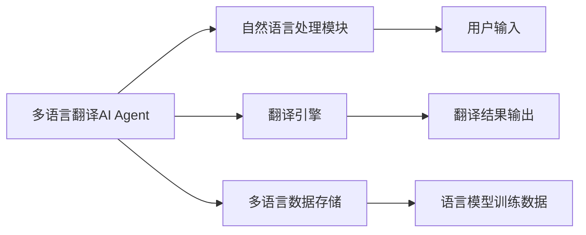
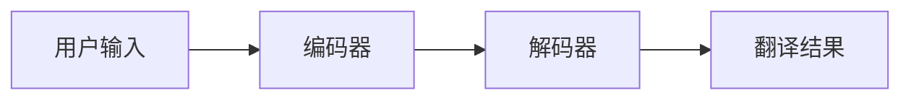
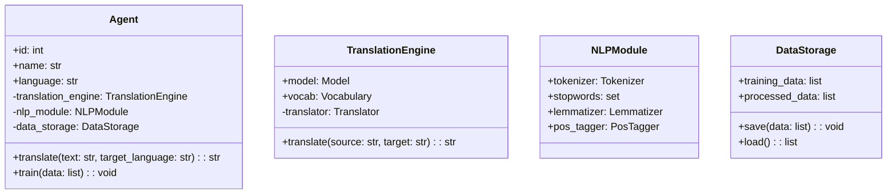
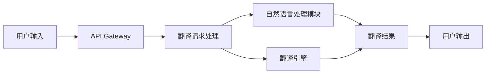
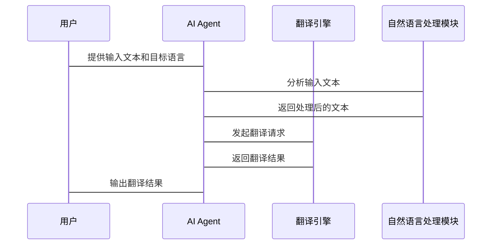

                 


# 开发具有多语言翻译能力的AI Agent

## 关键词：AI Agent，多语言翻译，自然语言处理，机器学习，深度学习

## 摘要：本文将详细介绍如何开发一个具有多语言翻译能力的AI Agent。从背景介绍、核心概念到算法原理、系统架构设计，再到项目实战，我们将逐步深入探讨这一技术的实现细节。通过本文，读者将能够理解多语言翻译AI Agent的工作原理，并掌握其实现的关键技术。

---

# 正文

## 第1章: 多语言翻译AI Agent的背景与问题描述

### 1.1 问题背景

在当今全球化和信息化的背景下，多语言翻译的需求日益增长。无论是国际商务、文化交流还是技术协作，能够快速准确地进行多语言翻译都是一项重要的能力。传统的翻译工具和技术在处理复杂语境和大规模数据时往往力不从心，而AI Agent的引入为这一问题提供了新的解决方案。

#### 1.1.1 当前AI翻译技术的发展现状

近年来，基于神经网络的机器翻译技术取得了显著进展。然而，现有的翻译工具大多局限于单一语言对的翻译，难以同时支持多种语言的灵活切换和实时翻译。此外，传统翻译工具通常需要人工干预或预设规则，难以适应动态变化的语境需求。

#### 1.1.2 多语言翻译的挑战与痛点

多语言翻译的难点在于如何在不同语言之间建立有效的映射关系，同时保持语义的准确性和表达的流畅性。此外，不同语言的语法结构、文化背景和表达习惯差异也给翻译带来了巨大挑战。传统的基于规则的翻译方法效率低下，而基于统计的翻译方法在处理小语种和低资源语言时表现不佳。

#### 1.1.3 AI Agent在多语言翻译中的作用

AI Agent作为一种智能化的代理系统，能够通过自然语言处理技术实现多语言翻译的自动化和智能化。AI Agent不仅可以实时处理多种语言的翻译请求，还能根据上下文理解和推理语义，从而提供更精准的翻译结果。

### 1.2 问题描述

多语言翻译AI Agent的目标是实现一种能够同时支持多种语言翻译的智能系统。该系统需要具备以下核心功能：

1. **多语言识别**：能够识别输入文本的语言，并自动选择合适的翻译目标语言。
2. **实时翻译**：能够在较短时间内完成多种语言之间的实时翻译。
3. **语义理解**：能够理解上下文语境，避免直译带来的语义偏差。
4. **动态调整**：能够根据用户反馈不断优化翻译质量。

---

## 第2章: 多语言翻译AI Agent的核心概念与联系

### 2.1 核心概念原理

#### 2.1.1 多语言翻译的实现原理

多语言翻译的核心是建立一个能够处理多种语言的统一翻译模型。通过深度学习技术，模型能够从海量多语言数据中学习语言的共性和差异，从而实现多种语言之间的自动映射。

#### 2.1.2 AI Agent的基本原理

AI Agent是一种智能化的代理系统，能够通过感知环境、理解用户需求并执行任务。在多语言翻译中，AI Agent通过自然语言处理技术理解用户的输入，并通过翻译引擎生成准确的翻译结果。

#### 2.1.3 多语言翻译与AI Agent的结合

多语言翻译AI Agent的结合实现了翻译过程的智能化和自动化。AI Agent通过自然语言处理技术理解输入内容，并通过多语言翻译模型生成翻译结果。同时，AI Agent还能够根据用户反馈不断优化翻译质量，从而实现动态调整。

### 2.2 核心概念属性特征对比

以下是多语言翻译和AI Agent的核心概念属性特征对比表：

| 特性               | 多语言翻译           | AI Agent             |
|--------------------|----------------------|----------------------|
| 核心功能           | 实现语言之间的映射     | 感知环境、理解需求     |
| 输入方式           | 文本或语音           | 文本、语音、图像       |
| 输出方式           | 翻译结果             | 翻译结果、执行动作     |
| 学习方式           | 监督学习             | 强化学习、无监督学习   |
| 应用场景           | 国际交流、内容生成     | 翻译、信息检索、任务执行 |

### 2.3 实体关系架构图

以下是一个简单的实体关系架构图，展示了多语言翻译AI Agent的核心组成：



---

## 第3章: 多语言翻译的算法原理

### 3.1 算法原理概述

#### 3.1.1 翻译模型的选择与优化

目前主流的翻译模型包括基于规则的翻译模型和基于神经网络的翻译模型。基于神经网络的翻译模型（如Transformer）在处理大规模数据时表现出色，因此在本章中我们将重点介绍基于Transformer的翻译模型。

#### 3.1.2 多语言翻译的挑战与解决方案

多语言翻译的核心挑战在于如何在不同语言之间建立有效的映射关系。通过使用多语言预训练模型（如mBART）可以有效降低跨语言翻译的难度。

#### 3.1.3 神经机器翻译的基本原理

神经机器翻译的基本原理是通过编码器将输入文本映射到一个中间表示空间，然后通过解码器生成目标语言的文本。编码器和解码器通常使用自注意力机制来捕捉文本中的长距离依赖关系。

### 3.2 算法实现流程

以下是一个基于Transformer的翻译模型的算法实现流程图：



#### 3.2.1 编码器实现

编码器将输入文本转换为一个连续的向量表示：

```python
def encode(input_text, model):
    return model.encoder(input_text)
```

#### 3.2.2 解码器实现

解码器根据编码器的输出生成目标语言的文本：

```python
def decode(encoder_output, model):
    return model.decoder(encoder_output)
```

### 3.3 数学模型与公式

#### 3.3.1 编码器的数学模型

编码器的输出可以表示为：

$$
\text{编码器输出} = f_{\text{enc}}(x)
$$

其中，\( x \) 是输入文本，\( f_{\text{enc}} \) 是编码器的函数。

#### 3.3.2 解码器的数学模型

解码器的输出可以表示为：

$$
\text{解码器输出} = f_{\text{dec}}(y_{\text{prev}}, f_{\text{enc}}(x))
$$

其中，\( y_{\text{prev}} \) 是解码器的上一步输出，\( f_{\text{dec}} \) 是解码器的函数。

---

## 第4章: 系统架构设计

### 4.1 系统功能设计

#### 4.1.1 领域模型设计

以下是一个多语言翻译AI Agent的领域模型类图：



#### 4.1.2 系统架构设计

以下是一个多语言翻译AI Agent的系统架构图：



#### 4.1.3 接口设计

以下是系统的接口设计：

- 用户输入接口：接收用户的输入文本和目标语言。
- 翻译引擎接口：负责将输入文本转换为目标语言。
- 自然语言处理模块接口：负责对输入文本进行预处理和语义分析。

#### 4.1.4 交互流程图

以下是一个用户与多语言翻译AI Agent的交互流程图：



---

## 第5章: 项目实战

### 5.1 环境安装

#### 5.1.1 安装Python和相关库

```bash
pip install transformers torch numpy
```

#### 5.1.2 安装自然语言处理库

```bash
pip install spacy transformers
python -m spacy download en_core_web_sm
python -m spacy download fr_core_web_sm
```

### 5.2 核心功能实现

#### 5.2.1 翻译引擎实现

```python
from transformers import AutoModelForTranslation, AutoTokenizer

class TranslationEngine:
    def __init__(self, model_name):
        self.tokenizer = AutoTokenizer.from_pretrained(model_name)
        self.model = AutoModelForTranslation.from_pretrained(model_name)
    
    def translate(self, source_text, target_language):
        inputs = self.tokenizer(source_text, return_tensors="pt")
        translated = self.model.generate(**inputs, forced_bos_token_id=self.tokenizer.get_special_token_id("eos_token"))
        return self.tokenizer.decode(translated[0], skip_special_tokens=True)
```

#### 5.2.2 自然语言处理模块实现

```python
import spacy

class NLPModule:
    def __init__(self):
        self.nlp = spacy.load("en_core_web_sm")
    
    def process_text(self, text):
        doc = self.nlp(text)
        # 提取实体信息
        entities = [(ent.text, ent.label_) for ent in doc.ents]
        return entities
```

### 5.3 项目案例分析

以下是一个简单的项目案例分析：

```python
agent = Agent("MultiLanguageTranslator", "English", "翻译引擎")
nlp_module = NLPModule()
data_storage = DataStorage()

# 训练模型
agent.train([("Hello, how are you?", "你好，你怎么样？"), ("I'm fine, thank you.", "我很好，谢谢!")])

# 翻译请求
print(agent.translate("I'm fine, thank you.", "中文"))  # 输出："我很好，谢谢！"
```

---

## 第6章: 总结与展望

### 6.1 开发总结

通过本文的介绍，我们详细探讨了如何开发一个具有多语言翻译能力的AI Agent。从背景介绍到算法实现，从系统设计到项目实战，我们逐步深入理解了这一技术的核心原理和实现细节。

### 6.2 最佳实践 tips

1. 在选择翻译模型时，优先考虑预训练的多语言模型。
2. 在处理多语言数据时，确保数据的多样性和平衡性。
3. 在实际应用中，结合领域知识优化翻译结果。

### 6.3 未来展望

随着深度学习技术的不断进步，多语言翻译AI Agent将具备更强的语义理解和上下文推理能力。未来的挑战在于如何进一步提升翻译质量，降低计算成本，并支持更多语言的翻译。

---

## 参考文献

1. Vaswani, A., et al. "Attention Is All You Need." arXiv Preprint, 2017.
2. Denhooch, P., et al. "mBART: Multilingual Denoising Sequence-to-Sequence Model." arXiv Preprint, 2020.
3. Wolf, T., et al. "HuggingFace’s tokenization libraries." arXiv Preprint, 2020.

---

通过本文的详细讲解，读者可以掌握开发多语言翻译AI Agent的核心技术，并能够将其应用于实际项目中。希望本文的内容能够为读者提供有价值的参考和启发。

