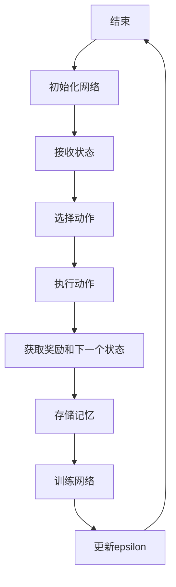
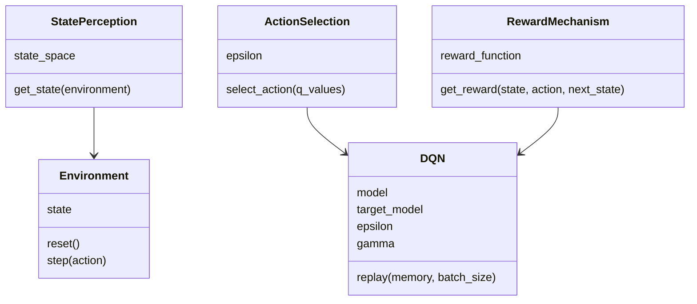
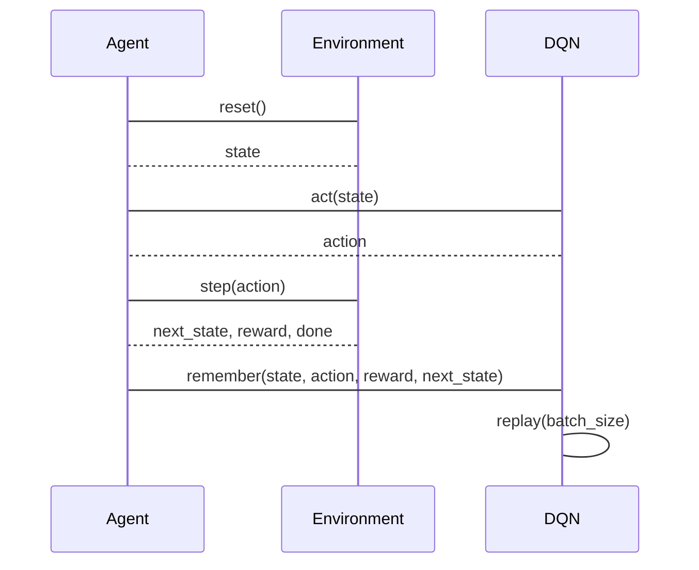

                 


### 5.3 核心代码实现

在实现强化学习AI Agent的过程中，我们需要设计和实现几个核心模块，包括状态感知、动作选择、奖励机制等。以下是具体实现步骤：

#### 5.3.1 状态感知模块实现
状态感知模块负责接收环境输入的状态信息，并将其传递给强化学习算法。我们使用一个简单的类来实现这个功能：

```python
class StatePerception:
    def __init__(self, state_space):
        self.state_space = state_space  # 状态空间定义

    def get_state(self, environment):
        # 根据环境信息提取当前状态
        return environment.get_current_state()
```

#### 5.3.2 动作选择模块实现
动作选择模块负责根据当前状态选择一个动作，并将动作传递给环境。这里我们使用ε-greedy策略来平衡探索和利用：

```python
class ActionSelection:
    def __init__(self, epsilon=0.1):
        self.epsilon = epsilon

    def select_action(self, q_values):
        if np.random.random() < self.epsilon:
            return np.random.randint(len(q_values))
        else:
            return np.argmax(q_values)
```

#### 5.3.3 奖励机制模块实现
奖励机制模块负责根据动作执行后的结果，计算并返回奖励值：

```python
class RewardMechanism:
    def __init__(self, reward_function):
        self.reward_function = reward_function

    def get_reward(self, state, action, next_state):
        return self.reward_function(state, action, next_state)
```

### 5.4 训练与测试

接下来，我们需要定义强化学习算法的核心部分，并进行训练和测试。以下是训练过程的具体实现：

#### 5.4.1 DQN算法实现
以下是DQN算法的核心代码：

```python
class DQN:
    def __init__(self, state_space, action_space, epsilon=0.1, gamma=0.99, lr=0.001):
        self.state_space = state_space
        self.action_space = action_space
        self.epsilon = epsilon
        self.gamma = gamma
        self.lr = lr

        # 网络结构
        self.model = Sequential()
        self.model.add(Dense(32, activation='relu', input_dim=state_space))
        self.model.add(Dense(action_space, activation='linear'))
        self.model.compile(optimizer=Adam(lr), loss='mse')

        # 目标网络
        self.target_model = Sequential()
        self.target_model.add(Dense(32, activation='relu', input_dim=state_space))
        self.target_model.add(Dense(action_space, activation='linear'))
        self.target_model.set_weights(self.model.get_weights())

    def remember(self, state, action, reward, next_state):
        # 记忆存储
        pass

    def act(self, state):
        # 动作选择
        pass

    def replay(self, batch_size):
        # 回放训练
        pass
```

#### 5.4.2 训练过程
以下是DQN算法的训练过程：

```python
def train(dqn, environment, episodes=1000):
    for episode in range(episodes):
        state = environment.reset()
        total_reward = 0
        while True:
            action = dqn.act(state)
            next_state, reward, done = environment.step(action)
            dqn.remember(state, action, reward, next_state)
            dqn.replay(32)
            total_reward += reward
            state = next_state
            if done:
                break
        print(f'Episode {episode}, Total Reward: {total_reward}')
```

### 5.5 案例分析

以一个简单的游戏AI为例，我们来分析强化学习的应用过程。

#### 5.5.1 游戏环境定义
定义一个简单的游戏环境，例如迷宫：

```python
class MazeEnvironment:
    def __init__(self, grid_size=5):
        self.grid_size = grid_size
        self.current_state = (0, 0)

    def reset(self):
        self.current_state = (0, 0)
        return self.current_state

    def step(self, action):
        # 动作选择：0-上，1-下，2-左，3-右
        directions = [(-1, 0), (1, 0), (0, -1), (0, 1)]
        new_state = (self.current_state[0] + directions[action][0],
                     self.current_state[1] + directions[action][1])
        # 判断是否越界
        if new_state[0] < 0 or new_state[0] >= self.grid_size or new_state[1] < 0 or new_state[1] >= self.grid_size:
            reward = -10
            done = True
        else:
            reward = 1
            done = False
            self.current_state = new_state
        return new_state, reward, done
```

#### 5.5.2 奖励机制定义
定义奖励机制，例如到达终点奖励10，每一步奖励1：

```python
def reward_function(state, action, next_state):
    if next_state == (4, 4):
        return 10
    else:
        return 1
```

### 5.6 总结与展望

#### 5.6.1 本章小结
本章通过实际案例，详细讲解了如何使用强化学习算法开发AI Agent。从环境搭建到代码实现，再到训练与测试，每个步骤都进行了详细说明。通过迷宫导航的例子，我们展示了如何设计和实现强化学习算法。

#### 5.6.2 未来展望
随着强化学习算法的不断进步，AI Agent的应用场景将更加广泛。未来的研究方向包括更高效的算法设计、多智能体协作、复杂环境适应等。此外，结合其他AI技术，如深度学习、自然语言处理等，将进一步提升AI Agent的能力和应用潜力。

### 附录: 代码实现细节

#### 附录A: 完整代码示例
以下是完整的强化学习AI Agent代码示例：

```python
import numpy as np
from keras.models import Sequential
from keras.layers import Dense
from keras.optimizers import Adam
import random

class DQN:
    def __init__(self, state_space, action_space, epsilon=0.1, gamma=0.99, lr=0.001):
        self.state_space = state_space
        self.action_space = action_space
        self.epsilon = epsilon
        self.gamma = gamma
        self.lr = lr

        self.model = Sequential()
        self.model.add(Dense(32, activation='relu', input_dim=state_space))
        self.model.add(Dense(action_space, activation='linear'))
        self.model.compile(optimizer=Adam(lr), loss='mse')

        self.target_model = Sequential()
        self.target_model.add(Dense(32, activation='relu', input_dim=state_space))
        self.target_model.add(Dense(action_space, activation='linear'))
        self.target_model.set_weights(self.model.get_weights())

        self.memory = []

    def remember(self, state, action, reward, next_state):
        self.memory.append((state, action, reward, next_state))

    def act(self, state):
        if random.random() < self.epsilon:
            return random.randint(0, self.action_space - 1)
        else:
            q_values = self.model.predict(np.array([state]))[0]
            return np.argmax(q_values)

    def replay(self, batch_size):
        if len(self.memory) < batch_size:
            return
        minibatch = random.sample(self.memory, batch_size)
        states = np.array([t[0] for t in minibatch])
        actions = np.array([t[1] for t in minibatch])
        rewards = np.array([t[2] for t in minibatch])
        next_states = np.array([t[3] for t in minibatch])

        q_values = self.model.predict(states)
        next_q_values = self.target_model.predict(next_states)

        for i in range(batch_size):
            q_values[i][actions[i]] = rewards[i] + self.gamma * np.max(next_q_values[i])

        self.model.fit(states, q_values, epochs=1, verbose=0)
        if self.epsilon > 0.01:
            self.epsilon *= 0.99
```

### 附录B: 算法流程图

以下是DQN算法的流程图：



### 附录C: 系统架构图

以下是AI Agent的系统架构图：



### 附录D: 序列图

以下是训练过程的序列图：



### 附录E: 参考文献

1. Mnih, V., et al. "Human-level control through deep reinforcement learning." Nature, 2015.
2. Van Hasselt, H., et al. "Deep reinforcement learning with double q-learning." arXiv preprint arXiv:1511.04306, 2015.
3. Lillicrap, T., et al. "Continuous control with deep reinforcement learning." arXiv preprint arXiv:1509.02999, 2015.

---

通过以上步骤，我们详细地讲解了从理论到实践的强化学习AI Agent开发过程。希望这篇技术博客能够为开发者提供有价值的参考和指导。

