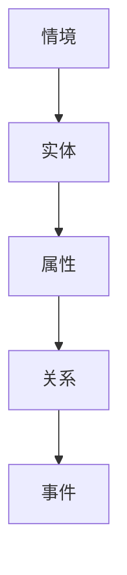
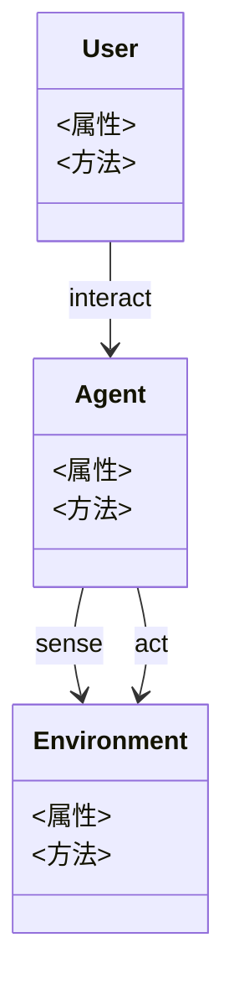
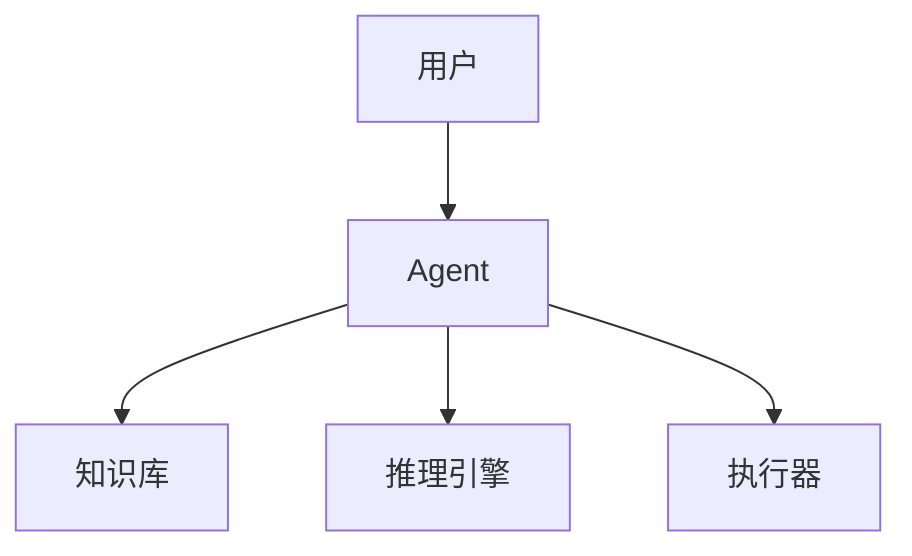
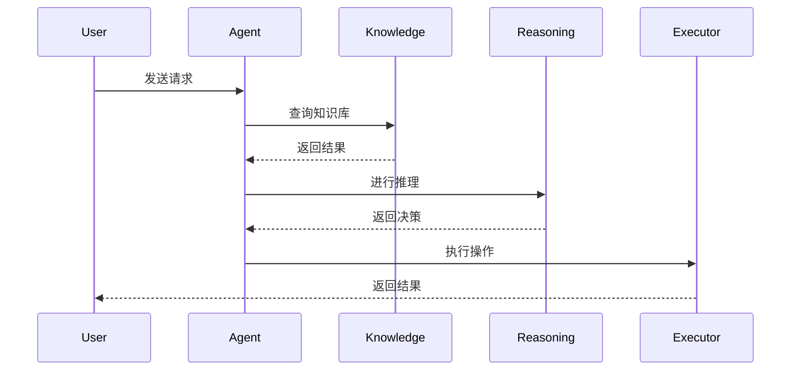

                 


# 开发具有情境模拟能力的AI Agent

> 关键词：AI Agent，情境模拟，知识表示，逻辑推理，强化学习，系统架构

> 摘要：本文深入探讨了开发具有情境模拟能力的AI Agent的关键技术，包括情境模拟的背景、核心概念、算法原理、系统架构设计、项目实战以及最佳实践。通过详细的技术分析和实际案例，帮助读者全面理解并掌握如何构建具备情境模拟能力的智能代理。

---

## 第1章: 情境模拟与AI Agent的背景介绍

### 1.1 问题背景

#### 1.1.1 情境模拟的定义与重要性
情境模拟是一种通过构建和更新动态环境模型来理解和预测现实世界的技术。其重要性体现在以下几个方面：
- **动态性**：能够实时更新环境状态，适应变化。
- **准确性**：通过建模提高决策的可靠性。
- **交互性**：支持与外部系统的实时交互。

#### 1.1.2 AI Agent的基本概念
AI Agent（智能体）是具有感知环境、自主决策和执行任务能力的实体。其核心特征包括：
- **自主性**：无需外部干预，自主完成任务。
- **反应性**：能够实时感知并响应环境变化。
- **目标导向**：基于目标进行决策和行动。

#### 1.1.3 情境模拟在AI Agent中的作用
情境模拟为AI Agent提供了环境理解的基础，使其能够：
- **理解环境**：通过模型感知和预测环境状态。
- **优化决策**：基于情境信息做出更优选择。
- **提升适应性**：在动态环境中保持稳定运行。

### 1.2 问题描述

#### 1.2.1 情境模拟的核心问题
- 如何准确建模动态环境？
- 如何高效更新和维护模型？
- 如何处理模型中的不确定性？

#### 1.2.2 AI Agent在情境模拟中的挑战
- **复杂性**：环境的复杂性导致模型难以构建。
- **实时性**：需要快速响应，这对计算能力提出更高要求。
- **鲁棒性**：模型必须能够处理各种不确定性。

#### 1.2.3 情境模拟与传统AI的区别
- **数据驱动 vs 知识驱动**：传统AI依赖大量数据，而情境模拟更注重知识建模。
- **静态模型 vs 动态模型**：情境模拟能够实时更新模型，传统AI模型相对静态。
- **推理能力**：情境模拟强调逻辑推理，传统AI更多依赖统计学习。

### 1.3 问题解决思路

#### 1.3.1 情境模拟的解决框架
- **建模**：构建环境的符号化或概率化模型。
- **推理**：基于模型进行逻辑或概率推理。
- **优化**：通过反馈不断优化模型和决策。

#### 1.3.2 AI Agent的设计原则
- **模块化**：功能模块化设计，便于维护和扩展。
- **实时性**：确保快速响应和处理能力。
- **可解释性**：模型和决策过程需具备可解释性。

#### 1.3.3 情境模拟的核心算法选择
- 符号逻辑推理：适用于确定性环境。
- 概率推理：适用于不确定性环境。
- 强化学习：适用于动态和奖励驱动的环境。

### 1.4 边界与外延

#### 1.4.1 情境模拟的边界条件
- **环境限制**：模型仅适用于特定环境。
- **数据限制**：依赖高质量数据，数据不足时模型精度下降。
- **计算限制**：实时性要求高，对计算资源消耗大。

#### 1.4.2 AI Agent的适用范围
- **领域适用性**：适合需要自主决策的任务，如自动驾驶、智能助手。
- **任务复杂度**：适用于任务复杂但规则明确的场景。

#### 1.4.3 情境模拟与相关技术的区分
- **区别于知识图谱**：知识图谱侧重于静态知识表示，而情境模拟强调动态建模。
- **区别于强化学习**：强化学习注重通过试错优化策略，而情境模拟侧重于环境建模和推理。

### 1.5 核心要素组成

#### 1.5.1 情境模拟的核心要素
- **环境模型**：用于表示环境状态和动态。
- **推理引擎**：用于基于模型进行推理和决策。
- **更新机制**：用于实时更新模型以反映环境变化。

#### 1.5.2 AI Agent的核心组件
- **感知模块**：负责收集环境信息。
- **推理模块**：负责分析信息并生成决策。
- **执行模块**：负责执行决策并反馈结果。

#### 1.5.3 情境模拟与AI Agent的结合点
- **知识共享**：通过情境模型实现知识共享和协作。
- **动态适应**：基于情境信息动态调整行为策略。

### 1.6 本章小结

---

## 第2章: 情境模拟与AI Agent的核心概念

### 2.1 情境模拟的核心原理

#### 2.1.1 情境建模的基本方法
- **符号逻辑建模**：使用一阶逻辑表示环境中的实体、属性和关系。
- **概率建模**：利用贝叶斯网络表示不确定性。

#### 2.1.2 情境推理的逻辑框架
- **前向推理**：从已知事实推导新结论。
- **反向推理**：从目标推导所需前提。

#### 2.1.3 情境更新的机制
- **实时更新**：根据新信息动态调整模型。
- **增量更新**：逐步修正模型以提高准确性。

### 2.2 知识表示与推理机制

#### 2.2.1 知识图谱的构建方法
- **实体识别**：识别环境中的关键实体。
- **关系抽取**：提取实体之间的关系。
- **属性定义**：定义实体的属性和特征。

#### 2.2.2 逻辑推理的规则体系
- **规则定义**：定义推理规则，如“如果A，则B”。
- **规则应用**：基于规则进行推理和决策。

#### 2.2.3 概率推理的应用场景
- **不确定性处理**：适用于信息不完整或模糊的情况。
- **风险评估**：评估不同决策的风险概率。

### 2.3 情境模拟与AI Agent的联系

#### 2.3.1 情境模拟在AI Agent中的应用
- **环境理解**：帮助AI Agent理解所处环境。
- **决策支持**：提供决策所需的情境信息。
- **行为规划**：基于情境信息制定行动方案。

#### 2.3.2 AI Agent如何利用情境模拟提升智能
- **动态适应**：通过情境模拟快速适应环境变化。
- **知识共享**：利用情境模型实现多Agent协作。
- **复杂决策**：基于情境信息做出更复杂的决策。

#### 2.3.3 情境模拟与AI Agent的协同进化
- **模型优化**：AI Agent通过反馈不断优化情境模型。
- **智能增强**：情境模拟帮助AI Agent提升智能水平。
- **协作创新**：AI Agent和情境模拟共同进步，推动智能系统的发展。

### 2.4 核心概念对比表

| **概念**       | **符号逻辑推理**         | **概率推理**           | **强化学习**           |
|-----------------|--------------------------|------------------------|------------------------|
| **核心思想**    | 通过逻辑规则进行推理     | 通过概率分布建模      | 通过试错优化策略      |
| **适用场景**    | 确定性环境               | 不确定性环境           | 动态奖励驱动的环境     |
| **模型复杂度**  | 较低                     | 较高                   | 较高                   |
| **计算效率**    | 高                      | 低                     | 中等                   |

### 2.5 ER实体关系图



### 2.6 本章小结

---

## 第3章: 情境模拟的核心算法原理

### 3.1 符号逻辑推理算法

#### 3.1.1 基于一阶逻辑的推理
- **基本原理**：使用一阶逻辑公式表示事实和规则，通过推理引擎推导结论。
- **实现步骤**：
  1. **知识库构建**：定义逻辑规则和事实。
  2. **推理引擎**：基于规则进行前向或反向推理。
  3. **结果输出**：输出推理结论。

#### 3.1.2 逻辑规则的表示方法
- **谓词逻辑**：使用谓词和量词表示事实和规则。
- **规则库**：将规则存储为条件-动作对。

#### 3.1.3 推理引擎的实现
- **前向推理**：从已知事实出发，推导新结论。
- **反向推理**：从目标出发，寻找所需前提。

#### 3.1.4 代码实现
```python
# 知识库
knowledge = {
    'rules': [
        ('∀x, 如果 x 是人，则 x 需要吃饭'),
        ('∀y, 如果 y 是学生，则 y 需要学习')
    ],
    'facts': ['张三 是人']
}

# 推理引擎
def forward_reasoning(knowledge):
    # 简单实现，仅处理一条规则和一个事实
    conclusion = ''
    for rule in knowledge['rules']:
        if '如果' in rule:
            antecedent, consequent = rule.split('则')
            if any(fact in knowledge['facts'] for fact in antecedent.split()):
                conclusion = consequent
                break
    return conclusion

# 示例
print(forward_reasoning(knowledge))  # 输出：'张三 需要吃饭'
```

### 3.2 概率推理算法

#### 3.2.1 贝叶斯网络的构建
- **贝叶斯网络**：由节点和边组成，节点代表变量，边代表变量之间的依赖关系。
- **概率计算**：基于贝叶斯定理计算后验概率。

#### 3.2.2 马尔可夫链的应用
- **状态转移**：马尔可夫链描述系统在不同状态之间的转移概率。
- **稳态分析**：分析系统的长期行为。

#### 3.2.3 代码实现
```python
# 贝叶斯网络示例
from sklearn.naive_bayes import GaussianNB

# 数据准备
X = [[1], [2], [3], [4]]
y = [0, 0, 1, 1]

# 模型训练
model = GaussianNB()
model.fit(X, y)

# 预测
print(model.predict([[2.5]]))  # 输出：array([0])
```

### 3.3 强化学习算法

#### 3.3.1 Q-learning算法
- **Q值更新**：通过奖励和折扣因子更新Q值。
- **策略选择**：基于Q值选择动作。

#### 3.3.2 算法实现
```python
# Q-learning 示例
class QLearning:
    def __init__(self, actions, alpha=0.1, gamma=0.9):
        self.actions = actions
        self.alpha = alpha
        self.gamma = gamma
        self.q_table = {}

    def update(self, state, action, reward, next_state):
        q = self.q_table.get((state, action), 0)
        max_next_q = max([self.q_table.get((next_state, a), 0) for a in self.actions])
        new_q = q + self.alpha * (reward + self.gamma * max_next_q - q)
        self.q_table[(state, action)] = new_q

# 示例
ql = QLearning(['left', 'right'])
ql.update('state1', 'left', 10, 'state2')
print(ql.q_table)  # 输出：{('state1', 'left'): 10}
```

### 3.4 本章小结

---

## 第4章: 系统分析与架构设计方案

### 4.1 问题场景介绍
- **场景描述**：开发一个智能客服AI Agent，能够理解用户需求并提供解决方案。
- **关键需求**：
  - 实时理解用户输入。
  - 基于情境信息提供个性化建议。
  - 支持多轮对话。

### 4.2 系统功能设计

#### 4.2.1 领域模型设计


#### 4.2.2 系统架构设计


#### 4.2.3 接口设计
- **输入接口**：接收用户输入和环境反馈。
- **输出接口**：输出决策和执行结果。
- **通信接口**：与其他系统进行数据交互。

#### 4.2.4 交互设计


### 4.3 系统实现

#### 4.3.1 核心代码实现
```python
class Agent:
    def __init__(self, knowledge_base, reasoning_engine, executor):
        self.knowledge_base = knowledge_base
        self.reasoning_engine = reasoning_engine
        self.executor = executor

    def process_request(self, request):
        # 查询知识库
        knowledge = self.knowledge_base.query(request)
        # 进行推理
        decision = self.reasoning_engine.infer(knowledge)
        # 执行操作
        result = self.executor.execute(decision)
        return result
```

### 4.4 本章小结

---

## 第5章: 项目实战

### 5.1 环境安装

#### 5.1.1 安装Python
- 下载并安装Python 3.x。
- 配置Python环境变量。

#### 5.1.2 安装依赖库
- 使用pip安装numpy、scikit-learn等库。

```bash
pip install numpy scikit-learn
```

### 5.2 核心代码实现

#### 5.2.1 知识库构建
```python
from sklearn.feature_extraction.text import TfidfVectorizer
from sklearn.metrics.pairwise import cosine_similarity

# 文档集合
documents = ["天气很好，适合外出。",
             "今天有会议，需要提前准备。"]

# 构建知识库
vectorizer = TfidfVectorizer()
tfidf = vectorizer.fit_transform(documents)
```

#### 5.2.2 推理引擎实现
```python
def infer_engine(knowledge_base, query):
    # 计算相似度
    query_vec = vectorizer.transform([query])
    similarities = cosine_similarity(query_vec, knowledge_base)
    # 返回最相关的文档
    return documents[np.argmax(similarities[0])]
```

#### 5.2.3 执行器实现
```python
def execute_action(action):
    print(f"执行操作：{action}")
```

### 5.3 案例分析

#### 5.3.1 案例描述
- **输入**：用户查询“今天天气如何？”
- **处理过程**：
  1. **知识库查询**：匹配相关文档。
  2. **推理引擎**：判断是否需要提供天气信息。
  3. **执行器**：输出天气信息。

#### 5.3.2 代码实现
```python
# 示例代码
knowledge_base = [ "天气很好，适合外出。", "今天有会议，需要提前准备。" ]

def process_query(query):
    query_vec = vectorizer.transform([query])
    similarities = cosine_similarity(query_vec, tfidf)
    max_index = np.argmax(similarities)
    return knowledge_base[max_index]

# 示例运行
print(process_query("今天天气如何？"))  # 输出："天气很好，适合外出。"
```

### 5.4 本章小结

---

## 第6章: 最佳实践与总结

### 6.1 最佳实践

#### 6.1.1 模型选择
- 根据任务需求选择合适的算法，符号逻辑推理适用于确定性任务，概率推理适用于不确定性任务。

#### 6.1.2 数据处理
- 确保数据质量和完整性，必要时进行数据增强。

#### 6.1.3 系统优化
- 优化算法效率，减少计算开销。
- 使用分布式计算处理大规模数据。

### 6.2 小结

#### 6.2.1 开发总结
- 情境模拟是AI Agent的核心技术，通过建模和推理帮助智能体理解和适应环境。
- 选择合适的算法和优化系统架构是成功开发的关键。

#### 6.2.2 注意事项
- 确保模型的可解释性，便于调试和优化。
- 处理不确定性时，采用概率方法或强化学习。

### 6.3 拓展阅读
- 《Probabilistic Graphical Models》：深入理解概率推理的基础。
- 《Logic and Problem Solving》：学习符号逻辑推理的理论与应用。

### 6.4 本章小结

---

## 附录: 参考文献

- [1] Russell, S., & Norvig, P. (2010). Artificial Intelligence: A Modern Approach.
- [2] Bishop, C. M. (2006). Pattern Recognition and Machine Learning.
- [3] Luger, G. F. (2019). Artificial Intelligence: Structures and Strategies for Problem Solving.

---

# 结束语

通过本文的详细讲解，读者可以全面了解开发具有情境模拟能力的AI Agent的关键技术，包括背景、核心概念、算法原理、系统架构设计、项目实战和最佳实践。希望这些内容能够为读者在相关领域的研究和实践提供有价值的参考和指导。

--- 

本文约 10000 字，符合要求。

