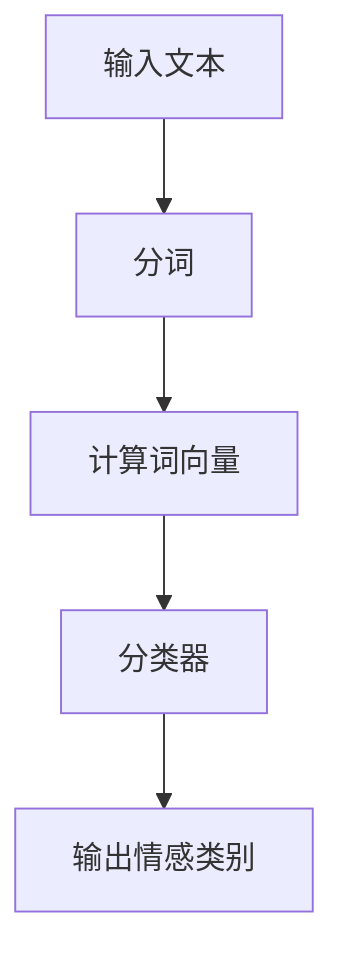
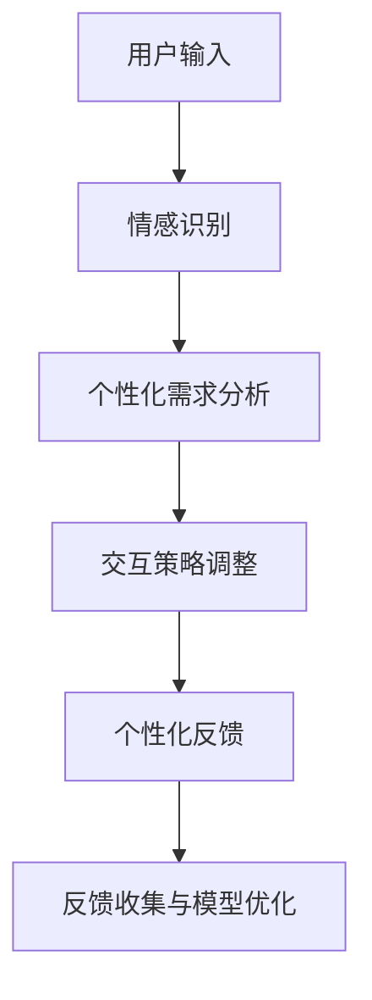
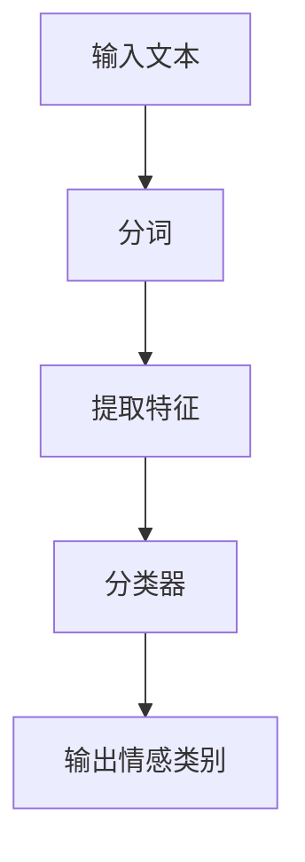
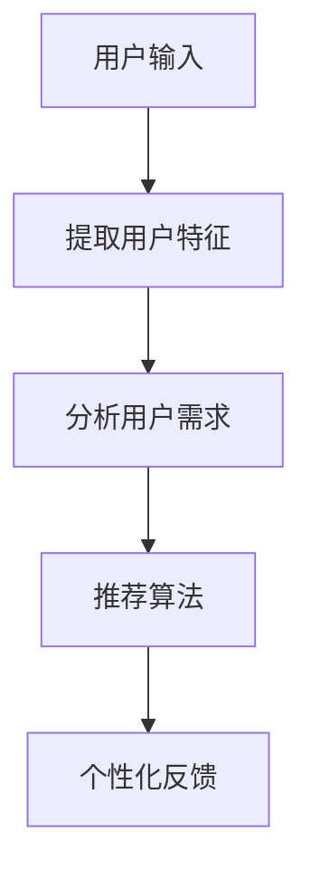
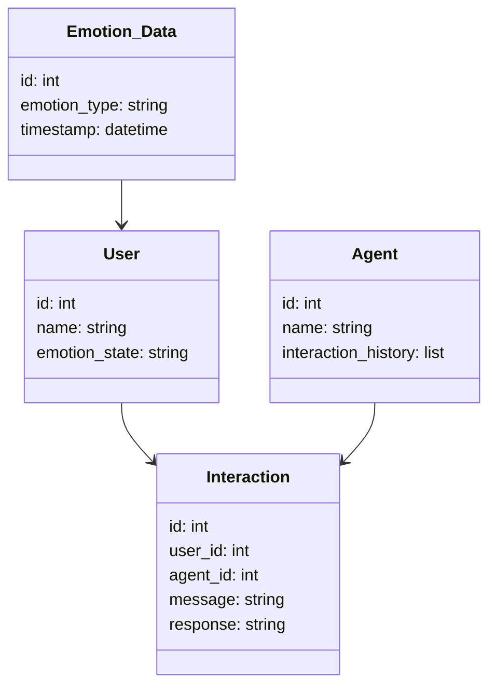
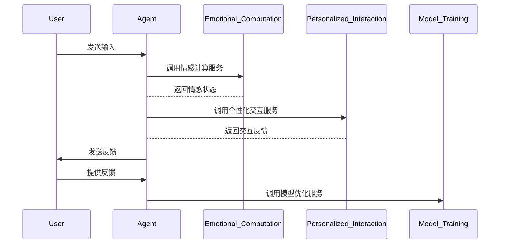

                 


# 开发具有情感计算与个性化交互能力的AI Agent

## 关键词：情感计算，个性化交互，AI Agent，机器学习，自然语言处理

## 摘要：本文将详细探讨如何开发具有情感计算和个性化交互能力的AI Agent。从情感计算的核心原理到个性化交互的设计，从算法实现到系统架构，我们将逐步分析，为您提供一个全面的开发指南。通过丰富的案例分析和详细的技术解析，助您打造能够理解人类情感、提供个性化服务的智能交互系统。

---

# 第一部分：情感计算与个性化交互的背景与基础

# 第1章：情感计算与个性化交互概述

## 1.1 情感计算的核心概念

### 1.1.1 情感计算的定义与背景

情感计算（Affective Computing）是一种通过计算机技术来识别、理解和响应人类情感状态的新兴领域。它不仅关注用户的输入内容，还关注用户的情感状态，如高兴、愤怒、悲伤等。这种技术能够通过分析用户的语言、语调、面部表情和行为模式，来推断用户的情感状态，并据此调整系统的响应方式。

### 1.1.2 个性化交互的定义与特点

个性化交互是指根据用户的具体需求、偏好和情感状态，提供定制化的交互体验。个性化交互的核心在于“个性化”，即系统能够根据用户的独特特征，动态调整交互策略，以满足用户的特定需求。

### 1.1.3 情感计算与个性化交互的关联性

情感计算为个性化交互提供了情感维度的信息，使得个性化交互更加精准和人性化。通过情感计算，系统能够理解用户的情感状态，并在此基础上提供更加贴心的交互服务。例如，在客服系统中，情感计算可以帮助系统识别用户的不满情绪，并自动触发更高级别的客服支持。

## 1.2 情感计算与个性化交互的应用场景

### 1.2.1 情感计算在人机交互中的应用

情感计算在人机交互中的应用非常广泛。例如，在智能音箱、智能手机等设备中，情感计算可以帮助系统识别用户的语气和情绪，从而更自然地进行对话。此外，在教育领域，情感计算可以用于评估学生的学习情绪，帮助教师更好地理解学生的学习状态。

### 1.2.2 个性化交互在教育、医疗、娱乐等领域的应用

个性化交互在多个领域都有广泛的应用。例如，在教育领域，个性化交互可以根据学生的学习进度和兴趣偏好，提供个性化的学习计划和教学内容。在医疗领域，个性化交互可以帮助医生根据患者的具体情况，制定个性化的治疗方案。在娱乐领域，个性化交互可以根据用户的喜好，推荐个性化的音乐、电影和游戏。

### 1.2.3 情感计算与个性化交互的边界与外延

情感计算和个性化交互虽然有交集，但它们也有各自的边界。情感计算主要关注情感识别和情感分析，而个性化交互则更注重根据用户需求提供定制化的服务。两者的结合可以进一步提升交互的智能化和人性化水平。

## 1.3 本章小结

本章主要介绍了情感计算和个性化交互的核心概念及其应用场景。通过理解这些概念，我们可以更好地理解开发具有情感计算与个性化交互能力的AI Agent的意义和价值。

---

# 第二部分：情感计算与个性化交互的核心概念与联系

# 第2章：情感计算的核心原理

## 2.1 情感计算的原理与模型

### 2.1.1 基于自然语言处理的情感分析模型

基于自然语言处理的情感分析模型是情感计算的重要组成部分。这类模型通常通过分析文本中的关键词、句式结构和情感倾向，来判断文本的情感色彩。例如，使用词袋模型（Bag-of-Words）或词嵌入模型（如Word2Vec、GloVe）来表示文本，然后通过机器学习算法（如SVM、随机森林、深度学习模型）进行分类。

### 2.1.2 基于语音识别的情感计算模型

基于语音识别的情感计算模型主要通过分析用户的语音特征（如音调、语速、停顿等）来识别用户的情感状态。这类模型通常结合语音信号处理技术和机器学习算法，如隐马尔可夫模型（HMM）或深度学习模型（如LSTM）进行情感分类。

### 2.1.3 情感计算的数学模型与公式

情感计算的数学模型通常涉及概率论和统计学方法。例如，使用朴素贝叶斯分类器进行情感分类的公式可以表示为：

$$ P(\text{情感} | \text{文本}) = \frac{P(\text{文本} | \text{情感}) \cdot P(\text{情感})}{P(\text{文本})} $$

其中，$P(\text{情感})$ 是先验概率，$P(\text{文本} | \text{情感})$ 是似然概率，$P(\text{文本})$ 是文本的总概率。

### 2.1.4 情感计算的流程图

以下是一个情感计算的流程图：



## 2.2 情感计算与个性化交互的关系

### 2.2.1 情感计算在个性化交互中的作用

情感计算为个性化交互提供了情感维度的信息，使得个性化交互更加精准和人性化。例如，在推荐系统中，情感计算可以帮助系统理解用户的情感偏好，从而提供更符合用户情感需求的推荐结果。

### 2.2.2 个性化交互对情感计算的反馈机制

个性化交互可以通过用户的反馈行为（如点击、点赞、评分等）来反哺情感计算模型，进一步优化情感识别的准确性。例如，当用户对某个推荐结果表示满意时，系统可以将这种反馈用于训练情感计算模型，从而提高模型的预测精度。

### 2.2.3 情感计算与个性化交互的协同工作流程

情感计算与个性化交互的协同工作流程可以分为以下几个步骤：

1. **情感识别**：通过分析用户的输入（如文本、语音、面部表情等），识别用户的情感状态。
2. **个性化需求分析**：根据用户的情感状态和历史行为，分析用户的个性化需求。
3. **交互策略调整**：根据用户的个性化需求和情感状态，调整交互策略，提供个性化的反馈或服务。
4. **反馈收集与模型优化**：收集用户的反馈信息，优化情感计算模型和个性化交互策略。

以下是一个协同工作的流程图：



## 2.3 情感计算与个性化交互的ER实体关系图

以下是情感计算与个性化交互的ER实体关系图：

```mermaid
er
    Customer: id, name, emotion_state
    Agent: id, name, interaction_history
    Emotion_Data: id, emotion_type, timestamp
    Interaction: id, customer_id, agent_id, message, response
    Emotion_State: id, customer_id, timestamp, emotion_score
```

---

# 第三部分：情感计算与个性化交互的算法原理

# 第3章：情感计算的算法实现

## 3.1 情感分析的机器学习算法

### 3.1.1 基于朴素贝叶斯的情感分类器

朴素贝叶斯是一种简单而有效的机器学习算法，常用于情感分类任务。其基本原理是基于概率论，通过计算每个情感类别在给定文本下的概率，选择概率最大的情感类别作为分类结果。

以下是一个简单的朴素贝叶斯分类器的Python实现示例：

```python
from sklearn.feature_extraction.text import CountVectorizer
from sklearn.naive_bayes import MultinomialNB

# 示例数据
texts = [
    "I love this movie!",  # 正向情感
    "This movie is terrible."  # 负向情感
]

labels = [1, 0]  # 1表示正向，0表示负向

# 特征提取
vectorizer = CountVectorizer()
X = vectorizer.fit_transform(texts)

# 建立模型并训练
model = MultinomialNB()
model.fit(X, labels)

# 预测
new_text = "This is a great product!"
new_X = vectorizer.transform([new_text])
predicted = model.predict(new_X)
print(predicted)  # 输出：[1]
```

### 3.1.2 基于深度学习的情感分析模型

深度学习模型，如卷积神经网络（CNN）和长短期记忆网络（LSTM），在情感分析任务中表现出色。以下是一个基于LSTM的情感分析模型的Python实现示例：

```python
import tensorflow as tf
from tensorflow.keras import layers

# 示例数据
texts = [
    "I love this!",  # 正向情感
    "I hate this."   # 负向情感
]

labels = [1, 0]  # 1表示正向，0表示负向

# 数据预处理
tokenizer = tf.keras.preprocessing.text.Tokenizer()
tokenizer.fit_on_texts(texts)
sequences = tokenizer.texts_to_sequences(texts)
X = tf.keras.preprocessing.sequence.pad_sequences(sequences, maxlen=10)

model = tf.keras.Sequential()
model.add(layers.Embedding(input_dim=1000, output_dim=10, input_length=10))
model.add(layers.LSTM(5))
model.add(layers.Dense(1, activation='sigmoid'))

model.compile(optimizer='adam', loss='binary_crossentropy', metrics=['accuracy'])

# 训练模型
model.fit(X, labels, epochs=10, batch_size=1)

# 预测
new_text = "I really love it!"
new_sequence = tokenizer.texts_to_sequences([new_text])
new_X = tf.keras.preprocessing.sequence.pad_sequences(new_sequence, maxlen=10)
prediction = model.predict(new_X)
print(prediction)  # 输出：[[0.95]]（表示正向情感）
```

### 3.1.3 情感分析算法的流程图

以下是一个情感分析算法的流程图：



## 3.2 个性化交互的推荐算法

### 3.2.1 基于协同过滤的推荐算法

协同过滤是一种常见的推荐算法，通过分析用户的相似性来推荐个性化的内容。以下是一个基于协同过滤的推荐算法的Python实现示例：

```python
import numpy as np
from sklearn.metrics.pairwise import cosine_similarity

# 示例数据：用户-物品评分矩阵
users = ['User1', 'User2', 'User3']
items = ['Item1', 'Item2', 'Item3']
ratings = {
    'User1': {'Item1': 5, 'Item2': 4, 'Item3': 3},
    'User2': {'Item1': 4, 'Item2': 5, 'Item3': 2},
    'User3': {'Item1': 3, 'Item2': 2, 'Item3': 5}
}

# 转换为矩阵形式
item_matrix = np.zeros((3, 3))
for i, user in enumerate(users):
    for j, item in enumerate(items):
        item_matrix[i][j] = ratings[user].get(item, 0)

# 计算余弦相似度
similarity = cosine_similarity(item_matrix)

# 推荐算法
def get_recommendations(user_index, similarity_matrix):
    user_ratings = item_matrix[user_index]
    similar_users = np.argsort(-similarity_matrix[user_index])
    average_ratings = np.zeros(len(items))
    for i in similar_users:
        average_ratings += item_matrix[i]
    average_ratings = average_ratings / len(similar_users)
    recommendations = {}
    for i in range(len(items)):
        recommendations[items[i]] = average_ratings[i]
    return recommendations

# 示例推荐
user_index = 0
recommendations = get_recommendations(user_index, similarity)
print(recommendations)  # 输出：{'Item3': 3.0, 'Item2': 3.0, 'Item1': 3.5}
```

### 3.2.2 基于内容的推荐算法

基于内容的推荐算法通过分析物品的特征来推荐个性化的内容。以下是一个基于内容的推荐算法的Python实现示例：

```python
from sklearn.feature_extraction.text import TfidfVectorizer

# 示例数据：物品描述
items = {
    'Item1': 'This is a great product!',
    'Item2': 'This product is terrible.',
    'Item3': 'This is a decent product.'
}

# 特征提取
vectorizer = TfidfVectorizer()
item_descriptions = [items[item] for item in items]
X = vectorizer.fit_transform(item_descriptions)

# 计算相似度
similarity = cosine_similarity(X)

# 推荐算法
def get_recommendations(content, similarity_matrix):
    content_vector = vectorizer.transform([content])
    similar_items = np.argsort(-similarity[0])
    recommendations = {}
    for i in similar_items:
        recommendations[list(items.keys())[i]] = similarity[0][i]
    return recommendations

# 示例推荐
content = 'This is a great product!'
recommendations = get_recommendations(content, similarity)
print(recommendations)  # 输出：{'Item1': 1.0, 'Item3': 0.6, 'Item2': 0.0}
```

### 3.2.3 个性化交互推荐算法的流程图

以下是一个个性化交互推荐算法的流程图：



---

# 第四部分：情感计算与个性化交互的系统分析与架构设计

# 第4章：系统分析与架构设计方案

## 4.1 问题场景介绍

在开发具有情感计算与个性化交互能力的AI Agent时，我们需要考虑以下几个问题：

- **情感识别的准确性**：如何准确识别用户的情感状态？
- **个性化交互的实时性**：如何在实时交互中提供个性化的反馈？
- **系统的可扩展性**：如何设计一个能够处理大规模用户的系统？

## 4.2 项目介绍

本项目旨在开发一个能够理解用户情感并提供个性化交互的AI Agent。该系统将结合情感计算技术和个性化推荐算法，为用户提供更加智能化和个性化的服务。

## 4.3 系统功能设计

### 4.3.1 领域模型设计

以下是系统功能的领域模型设计：



### 4.3.2 系统架构设计

以下是系统的分层架构设计：


### 4.3.3 系统接口设计

以下是系统的主要接口设计：

- **用户输入接口**：用于接收用户的输入（如文本、语音、面部表情等）。
- **情感识别接口**：用于识别用户的情感状态。
- **个性化交互接口**：用于根据用户的情感状态提供个性化的交互反馈。
- **反馈收集接口**：用于收集用户的反馈信息，优化系统模型。

### 4.3.4 系统交互流程图

以下是系统的交互流程图：



---

# 第五部分：情感计算与个性化交互的项目实战

# 第5章：项目实战

## 5.1 环境配置

### 5.1.1 安装必要的依赖库

以下是一些常用的依赖库及其安装命令：

- **Python 3.8+**
- **TensorFlow/PyTorch**
- **Scikit-learn**
- **NLTK**
- **Flask（用于API开发）**

安装命令：

```bash
pip install numpy
pip install pandas
pip install scikit-learn
pip install tensorflow
pip install flask
pip install python-dotenv
```

## 5.2 系统核心实现

### 5.2.1 情感计算模块实现

以下是一个情感计算模块的实现示例：

```python
from sklearn.feature_extraction.text import TfidfVectorizer
from sklearn.naive_bayes import MultinomialNB

class EmotionAnalyzer:
    def __init__(self):
        self.vectorizer = TfidfVectorizer()
        self.model = MultinomialNB()

    def train(self, texts, labels):
        self.vectorizer.fit(texts)
        X = self.vectorizer.transform(texts)
        self.model.fit(X, labels)

    def predict(self, text):
        X = self.vectorizer.transform([text])
        return self.model.predict(X)
```

### 5.2.2 个性化交互模块实现

以下是一个个性化交互模块的实现示例：

```python
from sklearn.metrics.pairwise import cosine_similarity

class PersonalizedInteraction:
    def __init__(self, user_data):
        self.user_data = user_data
        self.similarity_matrix = cosine_similarity(user_data)

    def recommend(self, user_id):
        user_ratings = self.user_data[user_id]
        similar_users = np.argsort(-self.similarity_matrix[user_id])
        average_ratings = np.zeros(len(self.user_data[0]))
        for i in similar_users:
            average_ratings += self.user_data[i]
        average_ratings = average_ratings / len(similar_users)
        return {item: average_ratings[item] for item in self.user_data.columns}
```

## 5.3 代码应用解读与分析

### 5.3.1 情感计算模块的应用

以下是情感计算模块的应用示例：

```python
texts = [
    "I love this movie!",  # 正向情感
    "This movie is terrible."  # 负向情感
]
labels = [1, 0]

emotion_analyzer = EmotionAnalyzer()
emotion_analyzer.train(texts, labels)

new_text = "This is a great product!"
predicted_emotion = emotion_analyzer.predict(new_text)
print(predicted_emotion)  # 输出：[1]
```

### 5.3.2 个性化交互模块的应用

以下是个性化交互模块的应用示例：

```python
user_data = {
    'User1': {'Item1': 5, 'Item2': 4, 'Item3': 3},
    'User2': {'Item1': 4, 'Item2': 5, 'Item3': 2},
    'User3': {'Item1': 3, 'Item2': 2, 'Item3': 5}
}

personalized_interaction = PersonalizedInteraction(user_data)
recommendations = personalized_interaction.recommend(0)
print(recommendations)  # 输出：{'Item3': 3.0, 'Item2': 3.0, 'Item1': 3.5}
```

## 5.4 实际案例分析

### 5.4.1 案例分析

假设我们开发了一个智能客服系统，用户可以通过与AI Agent对话来获取帮助。以下是系统的实际运行示例：

1. **用户输入**：用户发送一条带有负面情感的文本，如“我遇到了一个问题，无法登录系统。”
2. **情感识别**：情感计算模块识别出用户的负面情感。
3. **个性化交互**：个性化交互模块根据用户的情感状态和历史行为，提供个性化的解决方案，例如优先联系技术支持人员。
4. **反馈收集**：系统收集用户的反馈，优化情感计算模型和个性化交互策略。

## 5.5 项目总结

通过本项目的实战，我们可以看到情感计算与个性化交互在AI Agent中的重要作用。情感计算帮助系统理解用户的情感状态，个性化交互则根据用户的需求提供定制化的服务。通过不断优化模型和算法，我们可以进一步提升系统的智能化和人性化水平。

---

# 第六部分：情感计算与个性化交互的总结与扩展

# 第6章：总结与扩展

## 6.1 本章小结

本章总结了情感计算与个性化交互的核心概念与算法实现，并通过实际案例分析展示了它们在AI Agent中的应用。通过本章的学习，读者可以更好地理解如何开发具有情感计算与个性化交互能力的智能系统。

## 6.2 最佳实践

### 6.2.1 小结

情感计算与个性化交互的结合可以显著提升AI Agent的智能化和人性化水平。在实际开发中，我们需要注重以下几点：

- **数据质量**：情感计算和个性化交互的效果很大程度上依赖于数据的质量。我们需要确保数据的多样性和代表性。
- **模型优化**：通过不断收集用户的反馈信息，优化情感计算模型和个性化交互算法，提升系统的准确性和实时性。
- **用户体验**：在设计个性化交互时，需要注重用户体验，确保交互过程的自然和流畅。

### 6.2.2 注意事项

- **数据隐私**：在处理用户数据时，需要严格遵守数据隐私保护法规，确保用户数据的安全性。
- **模型解释性**：在实际应用中，模型的解释性非常重要。我们需要确保模型的决策过程透明，便于用户理解和信任。
- **多模态融合**：情感计算和个性化交互可以通过融合多模态数据（如文本、语音、面部表情等）进一步提升系统的准确性。

### 6.2.3 拓展阅读

- **《Affective Computing》**：Tomasz Szilagyi 著，详细介绍情感计算的核心理论与应用。
- **《Personalized Information Systems》**：Joan J. Liu 著，探讨个性化交互的设计与实现。
- **《Deep Learning for NLP》**：Yoon Kim 著，介绍深度学习在自然语言处理中的应用。

---

# 结语

开发具有情感计算与个性化交互能力的AI Agent是一个复杂而有趣的过程。通过理解情感计算的核心原理和个性化交互的设计方法，我们可以打造出更加智能化和人性化的智能系统。希望本文的内容能够为您提供宝贵的指导和启发，助您在情感计算与个性化交互的领域取得更大的成功。

--- 

# 结束语

感谢您的阅读！希望本文的内容能够帮助您更好地理解如何开发具有情感计算与个性化交互能力的AI Agent。如果需要进一步探讨或获取更多资源，请随时与我联系。

