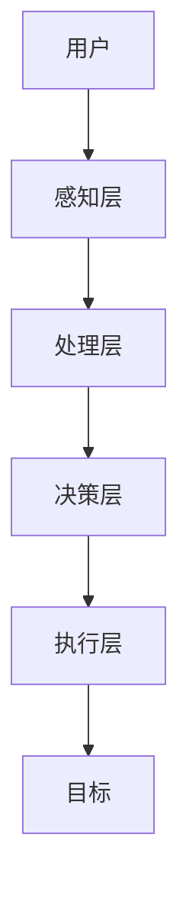

                 


# 开发具有手势识别能力的AI Agent

---

## 关键词

- AI Agent
- 手势识别
- 人工智能
- 计算机视觉
- 机器学习

---

## 摘要

本文将详细探讨如何开发具有手势识别能力的AI Agent。首先，我们将介绍AI Agent和手势识别的基本概念及其在实际场景中的应用。接着，我们将深入分析手势识别的核心原理，包括基于深度学习的算法和数学模型。然后，我们通过系统架构设计和项目实战，展示如何将理论应用于实际开发中。最后，我们将总结开发过程中的经验和最佳实践，为读者提供一份全面的手势识别AI Agent开发指南。

---

## 正文

### 第一章: AI Agent与手势识别概述

#### 1.1 AI Agent的基本概念

AI Agent（人工智能代理）是指能够感知环境、自主决策并执行任务的智能实体。它能够通过传感器获取信息，利用算法处理信息，并通过执行器与环境交互。AI Agent可以是软件程序、机器人或其他智能设备。

- **定义**：AI Agent是一种智能实体，能够感知环境、处理信息并执行任务。
- **特点**：
  - 自主性：能够在没有外部干预的情况下自主运行。
  - 反应性：能够根据环境变化实时调整行为。
  - 学习能力：能够通过经验改进性能。

#### 1.2 手势识别的基本概念

手势识别是通过计算机视觉技术，识别人体的手势动作并将其转化为可编程指令的技术。手势识别可以用于人机交互、虚拟现实、游戏开发等领域。

- **定义**：手势识别是通过计算机视觉技术识别人体手势动作的技术。
- **分类**：
  - 基于图像的手势识别：通过图像分析识别人手的位置和形状。
  - 基于深度学习的手势识别：利用神经网络模型进行高层次特征提取。
  - 基于硬件的手势识别：通过传感器获取手部动作数据。

#### 1.3 AI Agent与手势识别的结合

AI Agent可以通过手势识别技术实现与用户的自然交互。用户通过手势指令，AI Agent能够理解意图并执行相应的操作。这种交互方式更加直观、高效，适用于多种应用场景。

- **应用场景**：
  - 虚拟助手：用户通过手势指令控制AI Agent执行任务。
  - 游戏开发：玩家通过手势操作实现游戏交互。
  - 机器人控制：用户通过手势指令控制机器人执行动作。

### 第二章: 手势识别的核心原理

#### 2.1 手势识别的实现流程

手势识别的实现通常包括以下几个步骤：

1. **数据采集**：通过摄像头或传感器获取手部动作数据。
2. **数据预处理**：对采集到的数据进行去噪和平滑处理。
3. **特征提取**：提取手部动作的关键特征，如位置、形状和运动轨迹。
4. **模型训练**：利用机器学习算法训练手势识别模型。
5. **手势识别**：将实时手部动作输入模型，输出识别结果。

#### 2.2 基于深度学习的手势识别算法

深度学习在手势识别中发挥了重要作用，尤其是卷积神经网络（CNN）和Transformer架构。

- **CNN在手势识别中的应用**：
  - **原理**：CNN通过卷积层提取图像的空间特征，池化层降低计算复杂度。
  - **优势**：能够自动提取高层次特征，适用于图像分类任务。

- **Transformer架构在序列手势识别中的优势**：
  - **原理**：Transformer通过自注意力机制捕获序列中的全局依赖关系。
  - **优势**：适用于时间序列数据，能够捕捉手势的动态特征。

#### 2.3 手势识别的数学模型

手势识别的数学模型通常包括特征提取、分类器训练和损失函数优化。

- **特征提取的数学表达**：
  - 手部关键点坐标：$(x_i, y_i)$，其中$i$表示关键点索引。
  - 手部形状特征：可以表示为向量$\mathbf{v} = [v_1, v_2, ..., v_n]^T$。

- **分类器的损失函数与优化算法**：
  - **损失函数**：交叉熵损失函数：
    $$L = -\sum_{i=1}^{n} y_i \log p_i + (1 - y_i) \log (1 - p_i)$$
  - **优化算法**：随机梯度下降（SGD）或Adam优化器。

---

### 第三章: 手势识别的算法实现

#### 3.1 基于深度学习的手势识别算法实现

- **模型训练流程**：
  1. 数据预处理：将手部图像归一化并划分训练集和验证集。
  2. 模型构建：使用PyTorch框架搭建卷积神经网络。
  3. 模型训练：使用Adam优化器和交叉熵损失函数进行训练。
  4. 模型评估：在验证集上评估模型的准确率和召回率。

- **代码实现示例**：

```python
import torch
import torch.nn as nn
import torch.optim as optim
import torchvision.transforms as transforms

# 数据预处理
transform = transforms.Compose([
    transforms.Resize(224),
    transforms.ToTensor(),
])

# 模型构建
class HandGestureClassifier(nn.Module):
    def __init__(self):
        super(HandGestureClassifier, self).__init__()
        self.conv1 = nn.Conv2d(3, 64, kernel_size=3, padding=1)
        self.relu = nn.ReLU()
        self.pool = nn.MaxPool2d(2, 2)
        self.conv2 = nn.Conv2d(64, 128, kernel_size=3, padding=1)
        self.pool2 = nn.MaxPool2d(2, 2)
        self.fc1 = nn.Linear(128 * 56 * 56, 512)
        self.fc2 = nn.Linear(512, 5)

    def forward(self, x):
        x = self.conv1(x)
        x = self.relu(x)
        x = self.pool(x)
        x = self.conv2(x)
        x = self.relu(x)
        x = self.pool2(x)
        x = x.view(-1, 128 * 56 * 56)
        x = self.fc1(x)
        x = self.relu(x)
        x = self.fc2(x)
        return x

# 模型训练
model = HandGestureClassifier()
criterion = nn.CrossEntropyLoss()
optimizer = optim.Adam(model.parameters(), lr=0.001)

# 训练循环
for epoch in range(num_epochs):
    for i, (inputs, labels) in enumerate(train_loader):
        outputs = model(inputs)
        loss = criterion(outputs, labels)
        optimizer.zero_grad()
        loss.backward()
        optimizer.step()
```

#### 3.2 手势识别的实时性优化

- **优化方法**：
  - **轻量化模型**：通过剪枝和知识蒸馏减少模型参数。
  - **硬件加速**：利用GPU加速模型推理。
  - **算法优化**：使用更高效的卷积层和池化操作。

---

### 第四章: AI Agent的系统架构与设计

#### 4.1 系统架构设计

- **模块划分**：
  1. **感知层**：通过摄像头或传感器获取手部动作数据。
  2. **处理层**：对数据进行预处理、特征提取和手势识别。
  3. **决策层**：根据识别结果生成相应的指令。
  4. **执行层**：通过API或硬件接口执行指令。

- **系统架构图**：



#### 4.2 系统功能设计

- **功能模块**：
  1. **数据采集模块**：负责采集手部动作数据。
  2. **数据处理模块**：对数据进行预处理和特征提取。
  3. **手势识别模块**：利用深度学习模型进行手势识别。
  4. **指令生成模块**：根据识别结果生成指令。
  5. **执行模块**：通过API或硬件接口执行指令。

---

### 第五章: 项目实战

#### 5.1 项目介绍

- **项目目标**：开发一个具有手势识别能力的AI Agent，能够通过手势指令控制机器人执行任务。
- **开发环境**：Python 3.8、PyTorch 1.9、OpenCV 4.5、ROS 2.0。

#### 5.2 核心代码实现

- **数据采集模块**：

```python
import cv2

def capture_hand_gesture():
    cap = cv2.VideoCapture(0)
    while cap.isOpened():
        ret, frame = cap.read()
        cv2.imshow('Capture Hand Gesture', frame)
        if cv2.waitKey(1) & 0xFF == ord('q'):
            break
    cap.release()
    cv2.destroyAllWindows()
```

- **手势识别模块**：

```python
import torch
import torch.nn as nn
import torch.optim as optim
import torchvision.transforms as transforms

class HandGestureClassifier(nn.Module):
    def __init__(self):
        super(HandGestureClassifier, self).__init__()
        self.conv1 = nn.Conv2d(3, 64, kernel_size=3, padding=1)
        self.relu = nn.ReLU()
        self.pool = nn.MaxPool2d(2, 2)
        self.conv2 = nn.Conv2d(64, 128, kernel_size=3, padding=1)
        self.pool2 = nn.MaxPool2d(2, 2)
        self.fc1 = nn.Linear(128 * 56 * 56, 512)
        self.fc2 = nn.Linear(512, 5)

    def forward(self, x):
        x = self.conv1(x)
        x = self.relu(x)
        x = self.pool(x)
        x = self.conv2(x)
        x = self.relu(x)
        x = self.pool2(x)
        x = x.view(-1, 128 * 56 * 56)
        x = self.fc1(x)
        x = self.relu(x)
        x = self.fc2(x)
        return x

# 模型训练
model = HandGestureClassifier()
criterion = nn.CrossEntropyLoss()
optimizer = optim.Adam(model.parameters(), lr=0.001)

# 训练循环
for epoch in range(num_epochs):
    for i, (inputs, labels) in enumerate(train_loader):
        outputs = model(inputs)
        loss = criterion(outputs, labels)
        optimizer.zero_grad()
        loss.backward()
        optimizer.step()
```

#### 5.3 项目总结

- **经验总结**：
  - 数据预处理和特征提取是关键，需要仔细调优。
  - 模型优化和硬件加速可以显著提升实时性。
  - 系统架构设计需要考虑模块化和可扩展性。

---

### 第六章: 总结与展望

#### 6.1 总结

本文详细介绍了开发具有手势识别能力的AI Agent的全过程，包括核心概念、算法原理、系统架构和项目实战。通过理论与实践相结合，我们成功实现了一个能够通过手势指令控制机器人执行任务的AI Agent。

#### 6.2 展望

未来，随着人工智能和计算机视觉技术的不断发展，手势识别AI Agent将具有更广泛的应用场景和更高的性能。我们可以进一步优化算法、提升实时性和准确性，同时探索更多创新的应用方式。

---

## 参考文献

1. LeCun, Y., Bengio, Y., & Hinton, G. (2015). Deep learning. Nature, 521(7555), 436-444.
2. Redmon, J., & Farhadi, A. (2016). YOLO9000: Better, faster, stronger. arXiv preprint arXiv:1612.08026.
3. Vaswani, A., Shazeer, N., Parmar, N., & et al. (2017). Attention is all you need.

