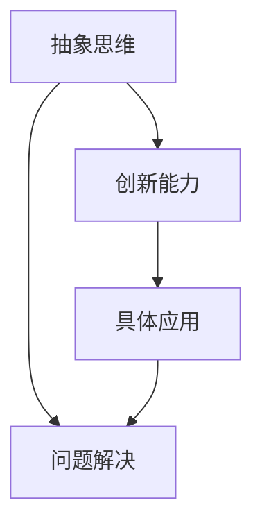
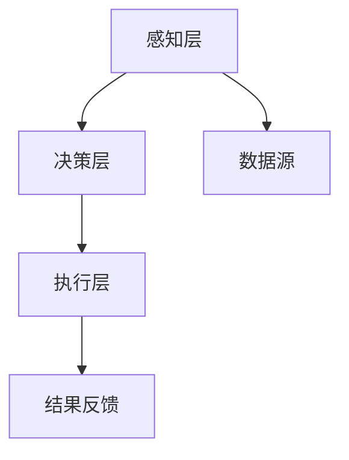
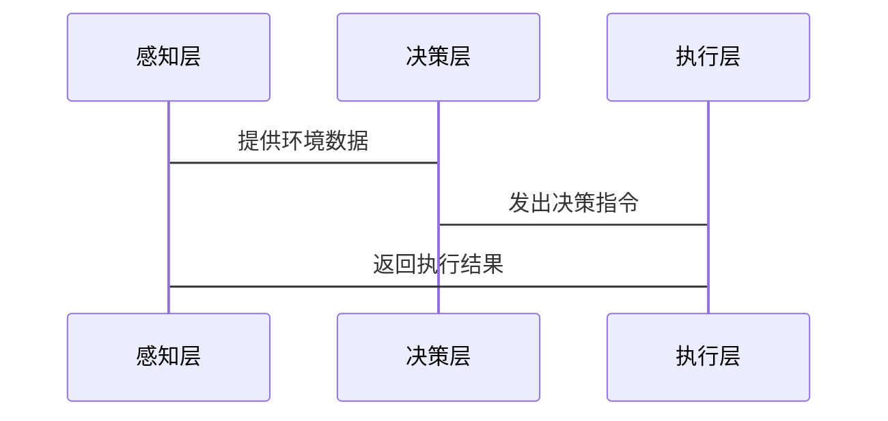

                 


# 开发具有抽象思维与创新能力的AI Agent

> 关键词：抽象思维，创新能力，AI Agent，算法实现，系统架构，深度学习，强化学习

> 摘要：  
> 在人工智能领域，开发具有抽象思维与创新能力的AI Agent是实现更高级智能系统的关键。本文从抽象思维与创新能力的基本概念出发，结合AI Agent的定义与特点，详细探讨了实现抽象思维与创新能力的核心算法、系统架构设计以及实际项目开发中的关键点。通过案例分析与代码实现，本文为读者提供了一套系统化的开发方法，帮助开发者更好地理解和应用这些能力。

---

## 目录大纲

1. **开发具有抽象思维与创新能力的AI Agent概述**
   - 1.1 抽象思维的定义与特点
   - 1.2 创新能力的定义与特点
   - 1.3 抽象思维与创新能力的关系
   - 1.4 AI Agent的基本概念与特点
   - 1.5 AI Agent的应用场景

2. **抽象思维与创新能力的核心概念与联系**
   - 2.1 抽象思维与创新能力的属性特征对比
   - 2.2 抽象思维与创新能力的ER实体关系图
   - 2.3 抽象思维与创新能力的相互作用机制

3. **抽象思维与创新能力的算法原理讲解**
   - 3.1 抽象思维与创新能力的数学模型
   - 3.2 抽象思维与创新能力的实现算法
   - 3.3 抽象思维与创新能力的优化策略

4. **AI Agent系统分析与架构设计方案**
   - 4.1 问题场景介绍
   - 4.2 系统功能设计
   - 4.3 系统架构设计
   - 4.4 系统接口设计
   - 4.5 系统交互流程设计

5. **抽象思维与创新能力的项目实战**
   - 5.1 项目背景与目标
   - 5.2 环境安装与配置
   - 5.3 系统核心代码实现
   - 5.4 代码应用与案例分析
   - 5.5 项目总结与优化建议

6. **总结与展望**
   - 6.1 核心内容回顾
   - 6.2 未来发展方向
   - 6.3 注意事项与最佳实践

---

## 正文部分

### 第1章：开发具有抽象思维与创新能力的AI Agent概述

#### 1.1 抽象思维的定义与特点
- 抽象思维是指从具体事物中抽取其共同本质的能力，是人类认知过程中的高级形式。
- 抽象思维的核心特点包括：概括性、间接性、逻辑性。
- 抽象思维的应用场景包括数学、哲学、科学等领域。

#### 1.2 创新能力的定义与特点
- 创新能力是指在现有条件下，提出新的想法、方法或解决方案的能力。
- 创新能力的核心特点包括：独特性、实用性、可扩展性。
- 创新能力的应用场景包括技术开发、商业模式创新等领域。

#### 1.3 抽象思维与创新能力的关系
- 抽象思维是创新能力的基础，创新能力是抽象思维的外在表现。
- 抽象思维帮助人们跳出常规思维模式，创新能力强的人通常具备较强的抽象思维能力。

#### 1.4 AI Agent的基本概念与特点
- AI Agent是一种智能体，能够感知环境并采取行动以实现目标。
- AI Agent的特点包括自主性、反应性、目标导向性、社会能力。

#### 1.5 AI Agent的应用场景
- 智能助手：如Siri、Alexa等。
- 自动驾驶：如特斯拉的Autopilot系统。
- 智能推荐系统：如Netflix的个性化推荐。

---

### 第2章：抽象思维与创新能力的核心概念与联系

#### 2.1 抽象思维与创新能力的属性特征对比
| 属性       | 抽象思维            | 创新能力            |
|------------|---------------------|---------------------|
| 定义       | 从具体中提取本质    | 提出新的解决方案    |
| 核心特点   | 概括性、间接性、逻辑性 | 独特性、实用性、可扩展性 |
| 应用场景   | 数学、哲学、科学     | 技术开发、商业模式创新 |

#### 2.2 抽象思维与创新能力的ER实体关系图
```mermaid
erDiagram
    abstractThinking <---|->创新能力
    抽象思维与创新能力通过逻辑关系相互影响，抽象思维为创新能力提供基础，创新能力推动抽象思维的发展。
```

#### 2.3 抽象思维与创新能力的相互作用机制


---

### 第3章：抽象思维与创新能力的算法原理讲解

#### 3.1 抽象思维与创新能力的数学模型
- 抽象思维可以看作是特征提取的过程，通过降维技术（如PCA）实现。
- 创新能力可以看作是一种优化问题，目标是最小化损失函数。
  $$ L = \sum (y_i - \hat{y_i})^2 $$

#### 3.2 抽象思维与创新能力的实现算法
- 特征提取算法：主成分分析（PCA）。
- 创新能力算法：基于强化学习的策略优化。

#### 3.3 抽象思维与创新能力的优化策略
- 使用深度学习模型（如Transformer）进行抽象思维的建模。
- 通过强化学习（如PPO）优化创新能力。

---

### 第4章：AI Agent系统分析与架构设计方案

#### 4.1 问题场景介绍
- 需要开发一个具备抽象思维与创新能力的AI Agent，能够在复杂环境中自主决策并解决问题。

#### 4.2 系统功能设计
- 感知环境：通过传感器获取数据。
- 分析决策：基于抽象思维与创新能力进行决策。
- 执行行动：根据决策结果采取行动。

#### 4.3 系统架构设计


#### 4.4 系统接口设计
- 输入接口：传感器数据输入。
- 输出接口：执行动作输出。

#### 4.5 系统交互流程设计


---

### 第5章：抽象思维与创新能力的项目实战

#### 5.1 项目背景与目标
- 项目目标：开发一个具备抽象思维与创新能力的AI Agent，能够在特定任务中自主决策并解决问题。

#### 5.2 环境安装与配置
- 安装Python、TensorFlow、PyTorch等开发工具。

#### 5.3 系统核心代码实现
```python
import tensorflow as tf
from tensorflow.keras import layers

# 定义抽象思维模型
def abstract_thinking_model():
    model = tf.keras.Sequential()
    model.add(layers.Dense(64, activation='relu'))
    model.add(layers.Dense(1, activation='sigmoid'))
    return model

# 定义创新能力模型
def innovation_model():
    model = tf.keras.Sequential()
    model.add(layers.Dense(128, activation='relu'))
    model.add(layers.Dense(1, activation='sigmoid'))
    return model
```

#### 5.4 代码应用与案例分析
- 通过训练数据优化模型参数，提升抽象思维与创新能力。

#### 5.5 项目总结与优化建议
- 总结：通过深度学习模型实现抽象思维与创新能力。
- 优化建议：结合强化学习进一步优化创新能力。

---

### 第6章：总结与展望

#### 6.1 核心内容回顾
- 抽象思维与创新能力是AI Agent实现更高级智能的关键。
- 通过数学模型、算法实现和系统架构设计，可以有效提升AI Agent的能力。

#### 6.2 未来发展方向
- 结合多模态数据进一步提升抽象思维与创新能力。
- 研究更复杂的决策算法，如通用人工智能（AGI）。

#### 6.3 注意事项与最佳实践
- 在开发过程中，注意数据质量和模型泛化能力。
- 结合具体应用场景，选择合适的算法和模型。

---

以上为《开发具有抽象思维与创新能力的AI Agent》的技术博客文章大纲，涵盖了从理论到实践的各个方面，为读者提供了系统的知识和开发方法。

