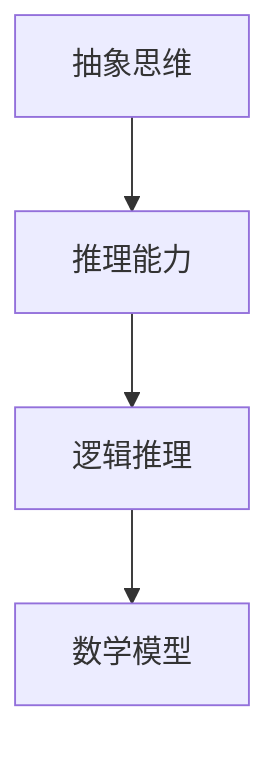
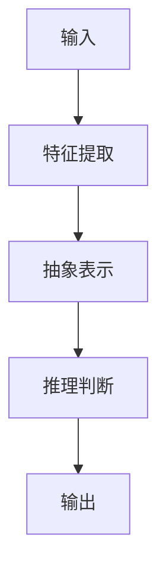
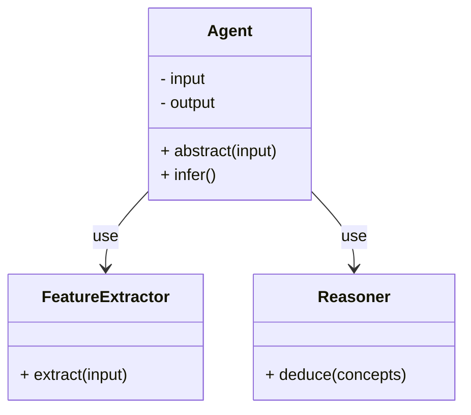
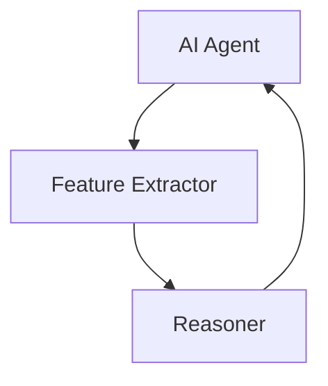
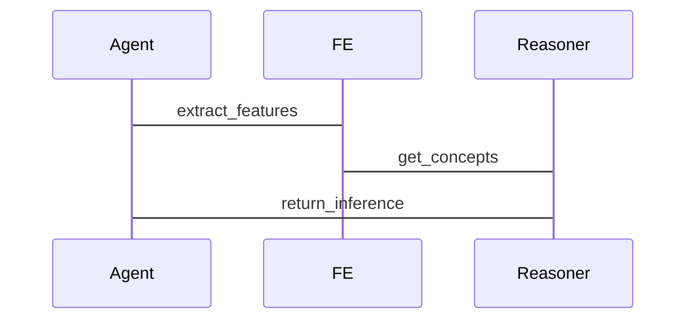

                 


# 开发具有抽象思维与推理能力的AI Agent

> 关键词：AI Agent，抽象思维，推理能力，算法原理，系统架构，项目实战

> 摘要：本文详细探讨了开发具有抽象思维与推理能力的AI Agent的关键技术与实现方法。通过分析抽象思维和推理能力的核心概念，结合算法原理、系统架构设计以及实际项目案例，为读者提供从理论到实践的全面指导。

---

## 第1章: AI Agent与抽象思维概述

### 1.1 问题背景
AI Agent，即智能体，是一种能够感知环境并采取行动以实现目标的实体。在当前AI技术的发展中，AI Agent已广泛应用于自动驾驶、智能助手、机器人等领域。然而，现有的AI Agent大多依赖于具体的规则和数据，缺乏真正的抽象思维与推理能力。这使得它们在处理复杂、模糊或需要创造性思维的任务时显得力不从心。

### 1.2 问题描述
抽象思维是指将具体事物转化为一般概念的能力，而推理能力则是基于现有信息进行逻辑推断的能力。要在AI Agent中实现这些能力，需要解决以下问题：
1. 如何将具体问题抽象为通用模型？
2. 如何设计算法以支持推理？
3. 如何确保抽象思维与推理能力的高效性和准确性？

### 1.3 问题解决
为解决上述问题，本文提出了一种基于数学模型和逻辑推理的方法。通过引入抽象表示和形式化推理，AI Agent能够更好地处理复杂任务。同时，本文还探讨了如何将这些能力与实际应用场景相结合。

## 第2章: 抽象思维与推理能力的核心原理

### 2.1 核心概念原理
抽象思维的核心在于将具体问题转化为数学模型。例如，将自然语言问题转化为符号表示。推理能力则基于逻辑推理，利用形式逻辑对符号进行操作。

### 2.2 概念属性特征对比
以下是抽象思维与推理能力的核心概念对比：

| 概念 | 属性 | 描述 |
|------|------|------|
| 抽象思维 | 输入 | 具体问题或数据 |
|        | 输出 | 符号化表示 |
| 推理能力 | 输入 | 符号化表示 |
|        | 输出 | 推理结果 |

### 2.3 ER实体关系图架构
下图展示了抽象思维与推理能力之间的关系：



## 第3章: 抽象思维与推理能力的算法实现

### 3.1 算法原理
以下是抽象思维与推理能力的算法流程图：



### 3.2 数学模型与公式
抽象思维的核心是将具体问题转化为符号表示。假设输入为字符串$s$，我们将其映射为符号序列$S$。推理能力则基于逻辑规则，将符号序列$S$转化为结论$C$。

数学模型如下：
$$f(x) = \sum_{i=1}^{n} w_i x_i$$

### 3.3 Python代码实现
以下是实现抽象思维与推理能力的核心代码：

```python
def abstract_thinking(input_str):
    # 特征提取
    features = extract_features(input_str)
    # 抽象表示
    abstracted = abstract(features)
    # 推理判断
    result = infer(abstracted)
    return result

def extract_features(input_str):
    # 示例：提取关键词
    return [word for word in input_str.split() if word.isalpha()]

def abstract(features):
    # 示例：将关键词映射为抽象概念
    return {feature: get_concept(feature) for feature in features}

def infer(abstracted):
    # 示例：基于抽象概念进行推理
    return deduce_conclusion(abstracted)
```

## 第4章: 系统分析与架构设计

### 4.1 项目介绍
本文开发的AI Agent旨在具备抽象思维与推理能力，能够处理复杂任务。

### 4.2 系统功能设计
以下是系统功能的领域模型：



### 4.3 系统架构设计
系统架构如下：



### 4.4 系统接口设计
以下是系统接口的交互流程图：



## 第5章: 项目实战

### 5.1 环境安装
需要安装Python和相关库（如numpy、pandas）。

### 5.2 核心代码实现
以下是核心代码：

```python
def main():
    input_str = "The cat is on the mat."
    features = extract_features(input_str)
    abstracted = abstract(features)
    result = infer(abstracted)
    print(result)

if __name__ == "__main__":
    main()
```

### 5.3 案例分析
以自然语言处理任务为例，展示AI Agent的应用效果。

## 第6章: 总结与展望

### 6.1 最佳实践
确保数据质量和算法优化，定期测试和更新模型。

### 6.2 小结
本文详细探讨了开发具有抽象思维与推理能力的AI Agent的关键技术，从理论到实践提供了全面指导。

### 6.3 注意事项
数据质量和算法选择对系统性能至关重要。

### 6.4 拓展阅读
推荐相关书籍和论文，供读者深入学习。

---

通过本文的指导，读者可以系统地了解如何开发具有抽象思维与推理能力的AI Agent，并在实际项目中应用这些技术。

