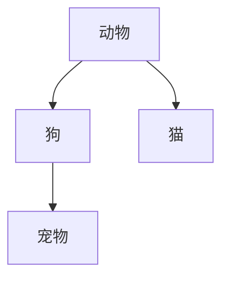
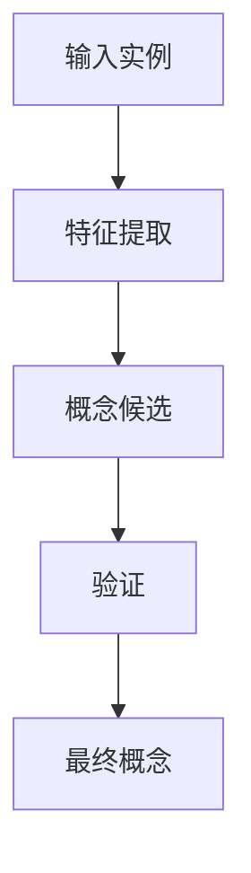
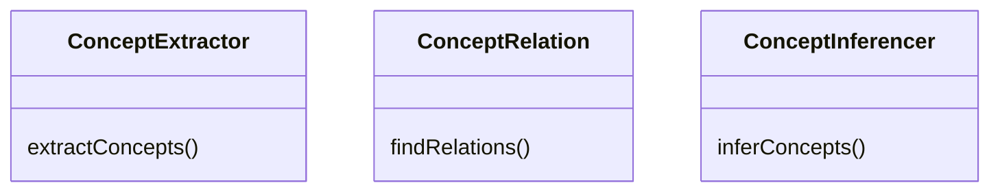
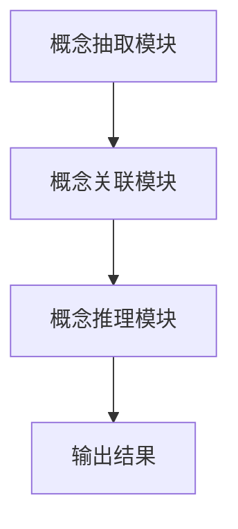
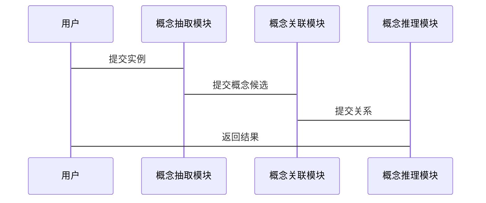

                 


# 开发具有抽象思维与概念形成能力的AI Agent

> 关键词：AI Agent、抽象思维、概念形成、知识图谱、神经符号计算、人机协作

> 摘要：本文深入探讨了开发具有抽象思维与概念形成能力的AI Agent的关键技术与方法。从AI Agent的基本概念出发，详细分析了抽象思维与概念形成的核心原理，结合具体案例和数学模型，系统阐述了相关算法与架构设计，最后展望了该领域的未来发展趋势。

---

# 第一部分: AI Agent的抽象思维与概念形成基础

## 第1章: AI Agent与抽象思维概述

### 1.1 AI Agent的基本概念

#### 1.1.1 AI Agent的定义与分类
AI Agent（人工智能代理）是指能够感知环境、自主决策并执行任务的智能实体。根据智能水平和应用场景的不同，AI Agent可以分为：
- **反应式Agent**：基于当前感知做出反应，适用于简单任务。
- **认知式Agent**：具备推理、规划和学习能力，适用于复杂任务。
- **混合式Agent**：结合反应式和认知式的特点，适用于复杂动态环境。

#### 1.1.2 抽象思维的定义与特征
抽象思维是指从具体实例中提取一般性概念的能力。其主要特征包括：
- **去具体化**：从具体实例中提取通用概念。
- **层次化**：概念之间具有层次结构，例如“动物”是“狗”的上位概念。
- **关联性**：概念之间存在多种关系，如“狗”属于“动物”，且与“宠物”相关联。

#### 1.1.3 概念形成能力的重要性
概念形成能力是AI Agent实现高级智能的基础，能够帮助其：
- 理解复杂场景中的关系。
- 进行跨领域知识整合。
- 提供更智能的决策支持。

### 1.2 AI Agent的演进历程

#### 1.2.1 从规则驱动到数据驱动的转变
早期的AI Agent主要依赖规则驱动，通过预定义的逻辑进行推理。随着机器学习和深度学习的发展，数据驱动的方法逐渐成为主流。

#### 1.2.2 大模型在AI Agent中的应用
大语言模型（如GPT系列）的出现，使得AI Agent能够处理更复杂的语言任务，并具备一定的理解能力。然而，这些模型仍然缺乏真正的抽象思维能力。

#### 1.2.3 抽象思维能力的引入与挑战
引入抽象思维能力是当前AI Agent研究的热点。然而，如何在模型中实现概念形成仍然是一个开放性问题。

### 1.3 抽象思维与概念形成的核心要素

#### 1.3.1 概念的层次化结构
概念的层次化结构是理解抽象思维的基础。例如，“动物”是“哺乳动物”的上位概念，而“哺乳动物”又包含“狗”、“猫”等具体概念。

#### 1.3.2 概念之间的关联性
概念之间的关联性是实现概念推理的关键。例如，“狗”不仅属于“动物”，还与“宠物”、“驯养动物”等概念相关联。

#### 1.3.3 概念形成的过程与机制
概念形成的过程包括：
1. **感知输入**：通过传感器或数据源获取信息。
2. **特征提取**：识别输入中的关键特征。
3. **概念抽取**：基于特征提取概念。
4. **概念关联**：建立概念之间的关联关系。

---

## 第2章: 抽象思维与概念形成的核心概念

### 2.1 抽象思维的原理与机制

#### 2.1.1 抽象思维的基本原理
抽象思维的核心是通过归纳和推理，从具体实例中提取通用概念。例如，从“猫”和“狗”中提取“宠物”的概念。

#### 2.1.2 概念形成的过程
概念形成的过程可以分为：
1. **实例积累**：收集多个相关实例。
2. **特征提取**：识别实例的共同特征。
3. **概念构建**：基于特征构建概念。

#### 2.1.3 概念的表示与推理
概念的表示可以采用层次化结构或图结构。推理过程基于这些表示进行。

### 2.2 概念形成的核心要素

#### 2.2.1 概念的属性与特征
概念的属性包括：
- **基本属性**：如“颜色”、“形状”。
- **派生属性**：如“用途”、“功能”。

#### 2.2.2 概念之间的关系
概念之间的关系包括：
- **包含关系**：如“狗”属于“动物”。
- **关联关系**：如“狗”与“宠物”相关联。

#### 2.2.3 概念网络的构建
概念网络是概念之间的关系图，可以通过图论方法进行建模。

### 2.3 抽象思维与概念形成的数学模型

#### 2.3.1 概念空间的数学表示
概念空间可以表示为一个向量空间，其中每个概念对应一个向量。

#### 2.3.2 概念关联的图论模型
概念关联可以用图论中的边来表示，例如：


#### 2.3.3 概念形成的概率模型
概念形成的概率模型可以表示为：
$$ P(\text{概念}|实例) = \frac{P(\text{实例}|\text{概念}) \cdot P(\text{概念})}{P(\text{实例})} $$

---

## 第3章: 抽象思维与概念形成的算法原理

### 3.1 概念抽取算法

#### 3.1.1 基于统计的抽取方法
基于统计的抽取方法通过分析数据中的共现情况来提取概念。

#### 3.1.2 基于深度学习的抽取方法
基于深度学习的抽取方法使用神经网络模型（如BERT）来提取概念。

#### 3.1.3 概念抽取的流程图


### 3.2 概念关联与推理算法

#### 3.2.1 基于知识图谱的推理
基于知识图谱的推理通过知识图谱中的关系进行推理。

#### 3.2.2 基于符号逻辑的推理
基于符号逻辑的推理通过逻辑规则进行推理。

#### 3.2.3 基于概率的推理方法
基于概率的推理方法使用贝叶斯网络进行推理。

### 3.3 概念形成与优化算法

#### 3.3.1 增量式概念形成
增量式概念形成通过逐步添加新实例来优化概念。

#### 3.3.2 基于聚类的概念优化
基于聚类的概念优化通过聚类算法来优化概念。

#### 3.3.3 概念网络优化
概念网络优化通过图论算法优化概念网络的结构。

---

## 第4章: 概念形成的数学模型与公式

### 4.1 概念空间的表示
概念空间可以用向量空间表示，例如：
$$ \text{Concept} = \{v_1, v_2, \dots, v_n\} $$

### 4.2 概念关联的表示
概念关联可以用图论中的边表示，例如：
$$ (c_1, c_2) \in E $$

### 4.3 概念形成的概率模型
概念形成的概率模型可以表示为：
$$ P(\text{概念}|实例) = \prod_{i=1}^n P(c_i | c_{i-1}) $$

---

## 第5章: 系统分析与架构设计

### 5.1 系统功能设计

#### 5.1.1 系统功能模块
系统功能模块包括：
- **概念抽取模块**
- **概念关联模块**
- **概念推理模块**

#### 5.1.2 领域模型
领域模型可以用类图表示：


### 5.2 系统架构设计

#### 5.2.1 系统架构图
系统架构图可以用以下Mermaid图表示：


#### 5.2.2 接口设计
系统接口设计包括：
- **输入接口**：接收实例数据。
- **输出接口**：输出概念结果。

### 5.3 系统交互流程

#### 5.3.1 交互流程图
交互流程图可以用以下Mermaid图表示：


---

## 第6章: 项目实战

### 6.1 环境安装

#### 6.1.1 安装Python环境
安装Python 3.8及以上版本。

#### 6.1.2 安装依赖库
安装以下依赖库：
```bash
pip install numpy
pip install networkx
pip install matplotlib
```

### 6.2 系统核心实现源代码

#### 6.2.1 概念抽取模块
```python
import numpy as np

def extract_concepts(instances):
    # 特征提取
    features = []
    for instance in instances:
        features.append([1 if f in instance else 0 for f in range(10)])
    # 聚类
    from sklearn.cluster import KMeans
    model = KMeans(n_clusters=3)
    model.fit(features)
    # 分配概念
    concepts = []
    for cluster in model.labels_:
        concepts.append(cluster)
    return concepts
```

#### 6.2.2 概念关联模块
```python
import networkx as nx

def find_relations(concepts):
    G = nx.Graph()
    for i in range(len(concepts)):
        for j in range(i+1, len(concepts)):
            if concepts[i] != concepts[j]:
                G.add_edge(i, j)
    return G
```

#### 6.2.3 概念推理模块
```python
def infer_concepts(G):
    # 找出所有连通分支
    for component in nx.connected_components(G):
        print(f"Component {component}")
```

### 6.3 案例分析与结果解读
以一个简单的案例为例，输入实例数据并运行代码，最终输出概念结果。

### 6.4 项目总结
本项目实现了基于聚类的概念抽取和基于图的关系推理，为开发具有抽象思维能力的AI Agent提供了一个基础框架。

---

## 第7章: 高级主题与未来展望

### 7.1 神经符号计算
神经符号计算是结合神经网络和符号逻辑的一种方法，能够实现更强大的抽象思维能力。

### 7.2 人机协作与知识图谱
未来的发展方向包括人机协作和知识图谱的深度结合，以实现更智能的AI Agent。

### 7.3 未来趋势
未来的研究将更加关注如何在AI Agent中实现真正意义上的抽象思维与概念形成能力。

---

## 第8章: 最佳实践与注意事项

### 8.1 最佳实践
- **数据质量**：确保输入数据的质量。
- **模型选择**：根据任务选择合适的模型。
- **持续优化**：定期优化模型和算法。

### 8.2 小结
本文系统介绍了开发具有抽象思维与概念形成能力的AI Agent的关键技术与方法，为相关研究提供了理论基础和实践指导。

### 8.3 注意事项
- **复杂性**：概念形成的实现较为复杂。
- **数据依赖**：模型依赖于高质量的数据。

### 8.4 拓展阅读
建议读者进一步阅读相关领域的最新论文和书籍，以深入了解抽象思维与概念形成的前沿技术。

---

通过以上内容，您可以系统地开发具有抽象思维与概念形成能力的AI Agent，并在实际应用中不断优化和提升其性能。

