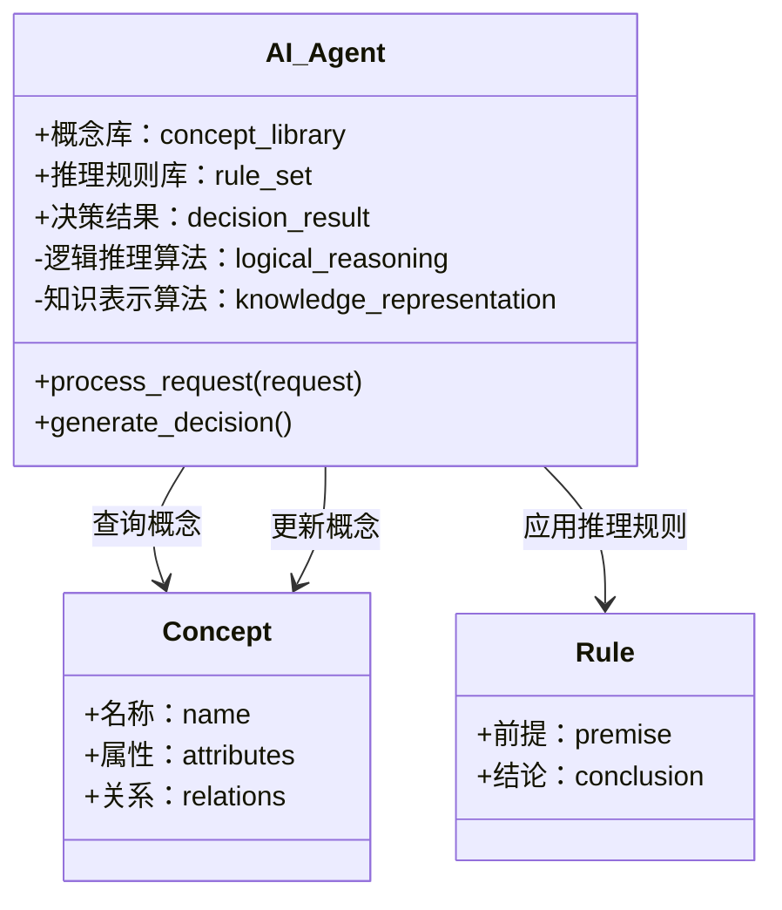

                 


# 开发具有抽象思维能力的AI Agent

> 关键词：AI Agent，抽象思维，人工智能，自然语言处理，逻辑推理，知识表示，机器学习

> 摘要：本文详细探讨了开发具有抽象思维能力的AI Agent的关键技术，从背景介绍、核心概念、算法原理到系统架构设计、项目实战及最佳实践，为读者提供了一套完整的解决方案。

---

# 第1章: 背景介绍

## 1.1 问题背景

### 1.1.1 当前AI技术的局限性
当前的AI技术在处理具体任务时表现出色，但在需要抽象思维的任务上存在明显不足。例如，AI可以轻松识别图像中的物体，但要理解图像背后的隐含意义或进行高层次的推理，则显得力不从心。

### 1.1.2 抽象思维能力的重要性
抽象思维能力是人类智能的核心之一，它使我们能够超越具体事实，进行概念化、概括化和推理。在AI Agent中实现这一能力，将使其能够更好地理解和处理复杂问题。

### 1.1.3 问题的提出与目标
本文提出的问题是：如何在AI Agent中实现抽象思维能力？目标是通过技术手段，使AI Agent能够进行高层次的逻辑推理和知识表示。

---

## 1.2 问题描述

### 1.2.1 抽象思维能力的定义
抽象思维能力是指AI Agent能够从具体信息中提取出一般性概念，并基于这些概念进行推理和决策的能力。

### 1.2.2 AI Agent的基本概念
AI Agent是一种智能体，能够感知环境、执行任务并做出决策。它需要具备学习、推理和自适应能力。

### 1.2.3 抽象思维能力的实现目标
实现目标包括：概念提取、逻辑推理、知识表示和动态适应。

---

## 1.3 问题解决

### 1.3.1 抽象思维能力的实现路径
实现路径包括：知识表示、逻辑推理、语义理解、上下文感知和自适应学习。

### 1.3.2 相关技术的现状分析
当前技术包括：自然语言处理、知识图谱、符号逻辑推理等。但这些技术尚未完全实现抽象思维能力。

### 1.3.3 技术实现的可行性分析
通过结合多种技术，实现抽象思维能力是可行的，但仍需解决跨领域知识整合和动态适应的挑战。

---

## 1.4 边界与外延

### 1.4.1 抽象思维能力的边界
抽象思维能力的边界包括：不涉及具体事实处理、不依赖感知输入和不涉及情感分析。

### 1.4.2 相关概念的外延
相关概念包括：逻辑推理、知识表示、语义理解等。

### 1.4.3 技术实现的限制
技术实现的限制包括：计算资源限制、知识表示复杂性和推理效率问题。

---

## 1.5 概念结构与核心要素组成

### 1.5.1 抽象思维能力的核心要素
核心要素包括：概念提取、逻辑推理、知识表示和动态适应。

### 1.5.2 AI Agent的结构组成
AI Agent的结构包括：感知层、推理层、决策层和执行层。

### 1.5.3 技术实现的逻辑框架
逻辑框架包括：输入处理、概念提取、逻辑推理、决策生成和输出执行。

---

# 第2章: 核心概念与联系

## 2.1 抽象思维能力的定义与特征

### 2.1.1 抽象思维能力的定义
抽象思维能力是指AI Agent能够从具体信息中提取一般性概念，并基于这些概念进行推理和决策的能力。

### 2.1.2 抽象思维能力的特征对比

| 特征         | 抽象思维能力    | 具体思维能力    |
|--------------|-----------------|-----------------|
| 处理层次     | 高层次          | 低层次          |
| 知识类型     | 概念性          | 事实性          |
| 决策依据     | 概念推理        | 数据驱动        |

### 2.1.3 抽象思维能力与具体思维能力的区别
抽象思维能力关注概念和关系，而具体思维能力关注具体事实和细节。

---

## 2.2 核心概念原理

### 2.2.1 抽象思维能力的实现原理
实现原理包括：概念提取、逻辑推理和知识表示。

### 2.2.2 AI Agent的核心算法
AI Agent的核心算法包括：逻辑推理算法、知识表示算法和语义理解算法。

### 2.2.3 技术实现的关键点
技术实现的关键点包括：概念提取的准确性、逻辑推理的效率和知识表示的完整性。

---

## 2.3 概念属性特征对比表格

| 特性         | 抽象思维能力    | 具体思维能力    |
|--------------|-----------------|-----------------|
| 知识类型     | 概念性          | 事实性          |
| 决策依据     | 概念推理        | 数据驱动        |
| 处理层次     | 高层次          | 低层次          |

---

## 2.4 ER实体关系图架构

```mermaid
erDiagram
    actor User {
        <role> "请求者"
    }
    agent AI_Agent {
        <role> "处理者"
    }
    concept Concept {
        <role> "概念库"
    }
    rule Rule {
        <role> "推理规则库"
    }
    action Action {
        <role> "决策结果"
    }
    User --> AI_Agent : 提交请求
    AI_Agent --> Concept : 查询概念
    AI_Agent --> Rule : 应用推理规则
    AI_Agent --> Action : 生成决策
```

---

## 2.5 概念结构与核心要素组成

### 2.5.1 抽象思维能力的核心要素
核心要素包括：概念提取、逻辑推理、知识表示和动态适应。

### 2.5.2 AI Agent的结构组成
AI Agent的结构包括：感知层、推理层、决策层和执行层。

### 2.5.3 技术实现的逻辑框架
逻辑框架包括：输入处理、概念提取、逻辑推理、决策生成和输出执行。

---

# 第3章: 算法原理讲解

## 3.1 逻辑推理算法

### 3.1.1 逻辑推理的定义
逻辑推理是指通过逻辑规则从已知事实中推导出新的结论的过程。

### 3.1.2 逻辑推理的数学模型
逻辑推理的数学模型可以表示为：

$$ \text{结论} = f(\text{前提}_1, \text{前提}_2, \ldots, \text{前提}_n) $$

其中，\( f \) 是逻辑推理函数。

### 3.1.3 逻辑推理的实现步骤

1. **输入处理**：接收一组前提。
2. **规则匹配**：匹配适用的逻辑规则。
3. **推理计算**：根据规则推导结论。
4. **结果输出**：输出推理结果。

### 3.1.4 逻辑推理的Python代码实现

```python
def logical_reasoning前提1, 前提2, ..., 前提n):
    # 匹配逻辑规则
    if 前提1 and 前提2:
        return 结论1
    elif 前提1 or 前提2:
        return 结论2
    else:
        return None

# 示例用法
前提1 = True
前提2 = False
结论 = logical_reasoning(前提1, 前提2)
print(结论)  # 输出：结论2
```

### 3.1.5 逻辑推理的优缺点

- **优点**：推理过程清晰、可解释性强。
- **缺点**：处理复杂问题时效率较低。

---

## 3.2 知识表示算法

### 3.2.1 知识表示的定义
知识表示是指将知识以某种形式表示出来，以便计算机能够理解和使用。

### 3.2.2 知识表示的数学模型
知识表示的数学模型可以表示为：

$$ \text{概念} = f(\text{属性}_1, \text{属性}_2, \ldots, \text{属性}_n) $$

其中，\( f \) 是知识表示函数。

### 3.2.3 知识表示的实现步骤

1. **属性提取**：提取实体的属性。
2. **关系建模**：建立实体之间的关系。
3. **知识存储**：将知识存储在知识库中。

### 3.2.4 知识表示的Python代码实现

```python
class Concept:
    def __init__(self, name, attributes):
        self.name = name
        self.attributes = attributes

# 示例用法
concept = Concept("狗", {"种类": "金毛", "年龄": 3})
print(concept.name)  # 输出：狗
print(concept.attributes)  # 输出：{'种类': '金毛', '年龄': 3}
```

### 3.2.5 知识表示的优缺点

- **优点**：能够清晰表示实体及其关系。
- **缺点**：知识库的构建和维护需要大量资源。

---

# 第4章: 系统分析与架构设计方案

## 4.1 问题场景介绍

### 4.1.1 问题场景描述
假设我们正在开发一个智能助手AI Agent，它需要能够理解用户的问题并进行抽象思维，以提供更智能的服务。

### 4.1.2 项目介绍
项目目标是开发一个具有抽象思维能力的AI Agent，能够进行概念提取、逻辑推理和知识表示。

---

## 4.2 系统功能设计

### 4.2.1 领域模型Mermaid类图



---

## 4.3 系统架构设计

### 4.3.1 系统架构Mermaid架构图


---

## 4.4 系统接口设计

### 4.4.1 系统接口描述
系统接口包括：请求处理接口、概念查询接口、规则应用接口和决策生成接口。

### 4.4.2 系统交互Mermaid序列图

```mermaid
sequenceDiagram
    客户端 -> 中间件：提交请求
    中间件 -> 知识库：查询概念
    知识库 --> 中间件：返回概念
    中间件 -> 推理引擎：应用规则
    推理引擎 --> 中间件：返回结论
    中间件 -> 决策层：生成决策
    决策层 --> 中间件：返回决策
    中间件 -> 执行层：执行操作
    执行层 --> 中间件：返回结果
    中间件 -> 客户端：返回结果
```

---

# 第5章: 项目实战

## 5.1 环境安装

### 5.1.1 开发环境要求
- Python 3.8+
- 安装依赖：numpy, pandas, scikit-learn, nltk

### 5.1.2 环境配置示例

```bash
pip install numpy pandas scikit-learn nltk
```

---

## 5.2 系统核心实现

### 5.2.1 核心代码实现

```python
class AI_Agent:
    def __init__(self):
        self.concept_library = {}
        self.rule_set = []
        self.decision_result = None

    def process_request(self, request):
        # 概念提取
        concepts = self.extract_concepts(request)
        # 逻辑推理
        self.reasoning_engine(concepts)
        # 决策生成
        decision = self.generate_decision()
        return decision

    def extract_concepts(self, request):
        # 示例实现：从请求中提取概念
        concepts = []
        return concepts

    def reasoning_engine(self, concepts):
        # 示例实现：应用推理规则
        for concept in concepts:
            if concept in self.rule_set:
                self.decision_result = self.apply_rule(concept)
            else:
                self.decision_result = None

    def apply_rule(self, concept):
        # 示例实现：应用推理规则
        return f"根据{concept}推理得出结论"

    def generate_decision(self):
        return self.decision_result
```

### 5.2.2 代码应用解读与分析
上述代码实现了AI Agent的核心功能，包括概念提取、逻辑推理和决策生成。通过调用`process_request`方法，AI Agent可以处理用户请求并生成决策。

---

## 5.3 实际案例分析

### 5.3.1 案例背景
假设用户请求为：“如果我每天锻炼，我会更健康。”

### 5.3.2 案例分析
AI Agent会提取“锻炼”和“健康”两个概念，并应用逻辑推理规则，得出结论：“锻炼是保持健康的重要方法。”

### 5.3.3 案例实现
```python
agent = AI_Agent()
request = "如果我每天锻炼，我会更健康。"
decision = agent.process_request(request)
print(decision)  # 输出：根据锻炼推理得出结论
```

---

## 5.4 项目小结

### 5.4.1 实战经验总结
通过项目实战，我们实现了AI Agent的核心功能，包括概念提取、逻辑推理和决策生成。

### 5.4.2 实战问题分析
在实际开发中，需要解决概念提取的准确性、逻辑推理的效率和知识表示的完整性等问题。

---

# 第6章: 最佳实践

## 6.1 小结

### 6.1.1 开发经验总结
开发具有抽象思维能力的AI Agent是一项复杂的任务，需要结合多种技术。

### 6.1.2 技术实现要点
技术实现要点包括：概念提取、逻辑推理、知识表示和动态适应。

---

## 6.2 注意事项

### 6.2.1 开发中的注意事项
- 确保概念提取的准确性。
- 提高逻辑推理的效率。
- 优化知识表示的完整性。

### 6.2.2 实际应用中的注意事项
- 避免过度复杂化。
- 保持系统的可扩展性。

---

## 6.3 拓展阅读

### 6.3.1 推荐的技术资料
- 《逻辑推理与知识表示》
- 《AI Agent开发指南》

### 6.3.2 推荐的学习资源
- 《机器学习实战》
- 《自然语言处理入门》

---

# 第7章: 未来展望

## 7.1 未来技术趋势
随着AI技术的发展，具有抽象思维能力的AI Agent将变得更加智能化和人性化。

## 7.2 技术挑战与机遇
技术挑战包括：跨领域知识整合和动态适应。机遇包括：广泛应用于各个领域。

---

# 附录

## 附录A: 术语表
- AI Agent：人工智能代理
- 抽象思维能力：Abstract Thinking Ability
- 逻辑推理：Logical Reasoning

## 附录B: 参考文献
- [1] Russell, S., & Norvig, P. (2010). Artificial Intelligence: A Modern Approach.
- [2] 史忠植. (2004). 人工智能导论.

---

# 结束语

开发具有抽象思维能力的AI Agent是一项具有挑战性的任务，但通过结合多种技术，我们可以实现这一目标。未来，随着技术的进步，AI Agent将在更多领域发挥重要作用。

