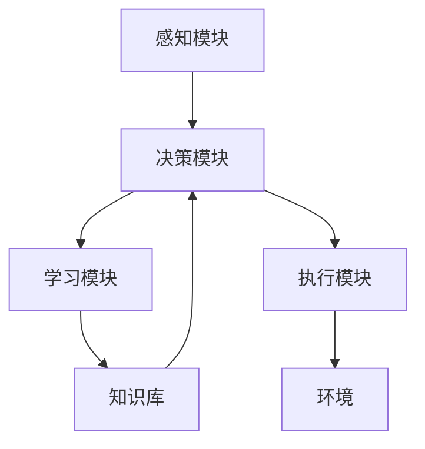
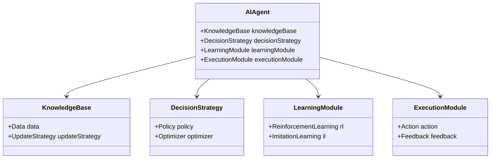

                 


# 开发具有持续适应能力的AI Agent

---

## 关键词
AI Agent, 持续适应能力, 强化学习, 自我优化, 动态环境, 人工智能

---

## 摘要
本文详细探讨了开发具有持续适应能力的AI Agent的核心概念、算法原理、系统架构及实际应用。通过分析AI Agent的持续适应能力，结合强化学习、自我优化算法和动态环境适应策略，提出了一种基于知识表示与更新、自我学习与优化的解决方案。同时，本文通过系统架构设计、项目实战和最佳实践，为读者提供了从理论到实践的全面指导。

---

# 第一部分: AI Agent的基本概念与问题背景

## 第1章: AI Agent的基本概念

### 1.1 AI Agent的定义与特点
#### 1.1.1 AI Agent的定义
AI Agent（人工智能代理）是指能够感知环境、自主决策并执行任务的智能实体。AI Agent可以是软件程序、机器人或其他智能系统，其核心目标是通过与环境的交互来实现特定任务。

#### 1.1.2 AI Agent的核心特点
- **自主性**：AI Agent能够自主决策，无需外部干预。
- **反应性**：能够实时感知环境变化并做出反应。
- **目标导向**：基于目标进行决策和行动。
- **适应性**：能够在动态环境中不断调整策略。

#### 1.1.3 AI Agent与传统程序的区别
传统程序依赖于预定义的规则和逻辑，而AI Agent具备学习和适应能力，能够从经验中优化自身行为。

---

### 1.2 持续适应能力的定义与重要性

#### 1.2.1 持续适应能力的定义
持续适应能力是指AI Agent能够在动态、不确定或复杂的环境中，实时更新知识、优化决策策略并适应新任务的能力。

#### 1.2.2 持续适应能力的重要性
- **应对不确定性**：动态环境中的变化无法完全预测，持续适应能力使AI Agent能够灵活应对。
- **提升任务效率**：通过持续学习，AI Agent能够优化任务执行效率。
- **扩展应用范围**：适应能力使AI Agent能够处理更多样化的任务。

#### 1.2.3 持续适应能力的应用场景
- **自动驾驶**：实时适应交通环境变化。
- **智能助手**：根据用户行为调整服务策略。
- **工业自动化**：适应生产线的动态调整。

---

## 第2章: AI Agent的持续适应能力问题背景

### 2.1 当前AI Agent面临的挑战

#### 2.1.1 动态环境中的适应性问题
动态环境中，环境的变化可能导致AI Agent的原有策略失效，需要实时更新。

#### 2.1.2 不确定性与复杂性带来的挑战
复杂环境中的不确定性使得AI Agent难以预测所有可能的情况，需要具备自适应能力。

#### 2.1.3 现有AI Agent的局限性
- **静态策略**：无法应对环境的快速变化。
- **单任务优化**：难以处理多样化任务。
- **学习效率低**：在复杂环境中学习速度较慢。

---

### 2.2 持续适应能力的核心问题

#### 2.2.1 动态环境下的实时更新
AI Agent需要实时感知环境变化，并快速更新知识库和策略。

#### 2.2.2 多样化任务的处理能力
AI Agent需要具备处理多种任务的能力，能够在不同任务之间动态切换。

#### 2.2.3 自我学习与优化机制
AI Agent需要通过自我学习不断优化自身性能，适应新环境和新任务。

---

## 第3章: 持续适应能力AI Agent的解决方案

### 3.1 知识表示与更新机制

#### 3.1.1 知识表示的多样性
知识表示可以通过符号逻辑、概率分布、神经网络等多种方式实现。

#### 3.1.2 知识更新的策略
- **在线更新**：实时更新知识库。
- **离线更新**：定期批量更新知识库。
- **混合更新**：结合在线和离线更新。

#### 3.1.3 知识表示与更新的实现方法
- **符号逻辑表示**：适用于规则明确的任务。
- **概率分布表示**：适用于不确定性较高的任务。
- **神经网络表示**：适用于复杂非线性关系的学习。

---

### 3.2 自我学习与优化算法

#### 3.2.1 自我学习的基本原理
自我学习是指AI Agent通过与环境的交互，从经验中学习优化自身行为。

#### 3.2.2 优化算法的选择与实现
- **强化学习**：通过奖励机制优化决策策略。
- **模仿学习**：通过模仿人类或其他智能体的行为进行学习。
- **对比学习**：通过对比不同策略的优劣进行优化。

#### 3.2.3 自我学习与优化的结合
AI Agent可以通过强化学习获得奖励，结合模仿学习优化策略，最终实现自我优化。

---

### 3.3 动态环境下的适应性策略

#### 3.3.1 动态环境的监测与分析
AI Agent需要实时监测环境变化，并分析变化的特征和趋势。

#### 3.3.2 适应性策略的制定与执行
- **动态规划**：根据环境变化制定新的决策策略。
- **在线调整**：实时调整策略以应对环境变化。
- **分层控制**：将复杂任务分解为多个子任务，逐层优化。

#### 3.3.3 动态环境下的反馈机制
AI Agent需要通过反馈机制了解环境变化对其策略的影响，并根据反馈调整自身行为。

---

# 第二部分: AI Agent的核心概念与联系

## 第4章: AI Agent的核心概念与原理

### 4.1 感知与决策机制

#### 4.1.1 感知模块的功能与实现
感知模块负责收集环境信息并进行初步处理，为决策提供依据。

#### 4.1.2 决策模块的原理与算法
决策模块基于感知信息和内部知识库，通过算法生成最优决策。

#### 4.1.3 感知与决策的协同作用
感知和决策模块需要协同工作，确保AI Agent能够实时适应环境变化。

---

### 4.2 学习与优化算法

#### 4.2.1 强化学习的基本原理
强化学习通过试错机制，通过与环境的交互获得奖励，优化决策策略。

#### 4.2.2 优化算法的选择与实现
- **Q-learning**：基于值函数的强化学习算法。
- **策略梯度法**：通过优化策略参数的梯度进行学习。

#### 4.2.3 强化学习与持续适应能力的结合
强化学习是实现持续适应能力的重要手段，能够使AI Agent在动态环境中不断优化自身行为。

---

### 4.3 动作与执行机制

#### 4.3.1 动作选择的策略
动作选择需要考虑当前环境状态和目标，选择最优动作。

#### 4.3.2 动作执行的实现
通过执行模块将选择的动作转化为具体操作，与环境进行交互。

#### 4.3.3 动作执行的反馈机制
执行动作后，AI Agent需要通过反馈机制了解执行效果，调整后续策略。

---

## 第5章: AI Agent的核心概念与联系

### 5.1 核心概念的原理
AI Agent的核心概念包括感知、决策、学习和执行，这些概念相互关联，共同实现持续适应能力。

### 5.2 核心概念的属性特征对比

| 核心概念 | 属性 | 特征 |
|----------|------|------|
| 感知     | 数据输入 | 环境信息的采集与处理 |
| 决策     | 策略生成 | 基于感知信息生成最优策略 |
| 学习     | 知识更新 | 通过经验优化知识库和策略 |
| 执行     | 动作输出 | 将决策转化为具体操作 |

### 5.3 ER实体关系图

```mermaid
erd
    title AI Agent核心概念关系图
    UserAgent
    ----| one-to-many |----
    Task
    ----| one-to-many |----
    KnowledgeBase
    ----| one-to-many |----
    DecisionStrategy
    ----| one-to-many |----
    Action
```

---

## 第6章: AI Agent的系统架构与设计

### 6.1 系统架构设计



### 6.2 系统功能设计

#### 6.2.1 领域模型设计


---

## 第7章: 项目实战与实现

### 7.1 环境安装

```bash
pip install numpy
pip install gym
pip install matplotlib
```

---

### 7.2 核心代码实现

```python
import numpy as np
import gym
import random

class AI-Agent:
    def __init__(self, env):
        self.env = env
        self.observation_space = env.observation_space
        self.action_space = env.action_space
        self.q_table = np.zeros([self.observation_space.shape[0], self.action_space.shape[0]])

    def perceive(self, observation):
        return observation

    def decide(self, observation):
        if random.uniform(0, 1) < 0.1:
            return random.randint(0, self.action_space.shape[0]-1)
        else:
            return np.argmax(self.q_table[observation])

    def learn(self, observation, action, reward):
        self.q_table[observation][action] += 0.1 * (reward + np.max(self.q_table[observation]) - self.q_table[observation][action])

    def execute(self, action):
        return self.env.step(action)
```

---

### 7.3 案例分析与实际应用

#### 7.3.1 案例分析
通过在强化学习环境中训练AI Agent，使其能够在动态环境中不断优化策略。

#### 7.3.2 实际应用
将AI Agent应用于智能交通系统，优化交通流量。

---

## 第8章: 总结与展望

### 8.1 总结
本文详细探讨了开发具有持续适应能力的AI Agent的核心概念、算法原理和系统架构，并通过项目实战展示了实现过程。

### 8.2 展望
未来的研究方向包括更高效的自我优化算法、更灵活的知识表示方法以及更强大的动态环境适应能力。

---

## 关键词
AI Agent, 持续适应能力, 强化学习, 自我优化, 动态环境, 人工智能

---

## 摘要
本文详细探讨了开发具有持续适应能力的AI Agent的核心概念、算法原理、系统架构及实际应用。通过分析AI Agent的持续适应能力，结合强化学习、自我优化算法和动态环境适应策略，提出了一种基于知识表示与更新、自我学习与优化的解决方案。同时，本文通过系统架构设计、项目实战和最佳实践，为读者提供了从理论到实践的全面指导。

