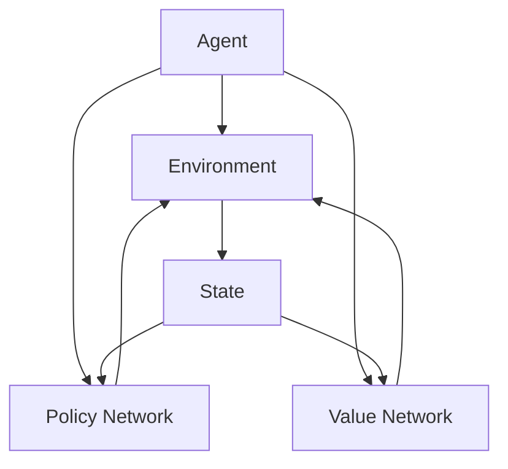

                 


# 开发具有深度强化学习能力的AI Agent

> 关键词：深度强化学习、AI Agent、算法原理、系统架构、项目实战

> 摘要：本文将详细探讨如何开发具有深度强化学习能力的AI Agent。首先介绍深度强化学习和AI Agent的基本概念与应用背景，然后分析深度强化学习的核心原理与算法框架，接着讨论AI Agent的系统架构与设计方法，最后通过一个具体项目实战案例，展示如何实现一个基于深度强化学习的AI Agent，并提供开发过程中的最佳实践与经验总结。

---

## 第一部分: 深度强化学习与AI Agent背景介绍

### 第1章: 问题背景与应用领域

#### 1.1 深度强化学习的核心问题
- 1.1.1 强化学习的基本概念
  - 状态（State）、动作（Action）、奖励（Reward）
- 1.1.2 深度强化学习的优势
  - 处理高维状态空间的能力
- 1.1.3 深度强化学习的核心挑战
  - 稀疏奖励问题
  - 状态空间的不可观测性

#### 1.2 AI Agent的基本概念与特点
- 1.2.1 AI Agent的定义
  - AI Agent是一种能够感知环境并采取行动以实现目标的智能体
- 1.2.2 AI Agent的分类
  - 分离式Agent vs. 智能体
  - 基于模型的Agent vs. 基于模型外的Agent
- 1.2.3 深度强化学习在AI Agent中的应用
  - 游戏AI、自动驾驶、机器人控制

#### 1.3 问题描述与解决方案
- 1.3.1 强化学习的基本框架
  - 环境、Agent、状态、动作、奖励
- 1.3.2 深度强化学习在AI Agent中的应用边界
  - 适用于动态环境中的决策问题
  - 适用于需要实时反馈的场景

---

## 第二部分: 深度强化学习的核心原理

### 第2章: 强化学习的基本原理

#### 2.1 基于值函数的方法
- 2.1.1 Q-learning算法
  - 状态动作值函数$Q(s,a)$
  - 更新公式：$$ Q(s,a) = Q(s,a) + \alpha (r + \gamma \max Q(s',a') - Q(s,a)) $$
- 2.1.2 Deep Q-Networks（DQN）
  - 使用神经网络近似值函数
  - 经验回放机制：存储$(s, a, r, s')$经验并随机采样

#### 2.2 基于策略梯度的方法
- 2.2.1 策略梯度的基本原理
  - 直接优化策略，最大化期望奖励
  - 策略梯度公式：$$ \nabla \theta \log \pi(a|s) \cdot Q(s,a) $$
- 2.2.2 Proximal Policy Optimization（PPO）
  - 使用KL散度约束策略更新
  - 分为两个策略：当前策略$\pi_\theta$和目标策略$\pi_{\theta+\epsilon}$

#### 2.3 统一的深度强化学习框架
- 2.3.1 Actor-Critic架构
  - 同时学习策略（Actor）和价值函数（Critic）
  - 策略网络负责生成动作，价值网络负责评估状态
- 2.3.2 算法选择与优化目标
  - 平衡探索与利用
  - 处理高维状态空间

---

## 第三部分: AI Agent的系统架构与设计

### 第3章: AI Agent的系统架构设计

#### 3.1 系统功能模块划分
- 3.1.1 感知模块
  - 状态观测与环境交互
  - 状态特征提取
- 3.1.2 决策模块
  - 策略网络或值函数网络
  - 动作选择与优化
- 3.1.3 学习模块
  - 经验回放
  - 网络更新与训练

#### 3.2 系统交互流程
- 3.2.1 状态观测与动作选择
  - Agent接收环境状态$s$，输出动作$a$
- 3.2.2 环境反馈与经验存储
  - 环境返回奖励$r$和新状态$s'$
  - 经验$(s, a, r, s')$存储在经验回放缓冲区
- 3.2.3 网络训练与更新
  - 从经验回放中随机采样训练样本
  - 更新神经网络参数以最小化损失函数

#### 3.3 系统架构图（Mermaid）


---

## 第四部分: 项目实战与开发经验

### 第4章: 项目实战案例

#### 4.1 项目背景与目标
- 开发一个基于DQN的AI Agent，用于玩一个简单的迷宫游戏
- 目标：让AI Agent学会从起点走到终点

#### 4.2 环境安装与配置
- 使用Python和深度学习框架（如TensorFlow或PyTorch）
- 安装必要的库：numpy、gym、matplotlib

#### 4.3 核心代码实现
```python
import numpy as np
import gym
import tensorflow as tf

class DQNAgent:
    def __init__(self, state_space, action_space, lr=0.01, gamma=0.99, epsilon=1.0):
        self.state_space = state_space
        self.action_space = action_space
        self.lr = lr
        self.gamma = gamma
        self.epsilon = epsilon
        self.model = self.build_model()

    def build_model(self):
        model = tf.keras.Sequential([
            tf.keras.layers.Dense(24, activation='relu', input_dim=self.state_space.shape[0]),
            tf.keras.layers.Dense(self.action_space.n)
        ])
        model.compile(optimizer=tf.keras.optimizers.Adam(learning_rate=self.lr),
                      loss='mse')
        return model

    def act(self, state):
        if np.random.random() < self.epsilon:
            return self.action_space.sample()
        q_values = self.model.predict(state)
        return np.argmax(q_values[0])
    
    def remember(self, state, action, reward, next_state):
        # 存储经验
        pass

    def replay(self, batch_size):
        # 从经验回放中采样并训练网络
        pass

# 初始化环境和Agent
env = gym.make('迷宫环境')
state = env.reset()
agent = DQNAgent(env.observation_space, env.action_space)

# 训练过程
for episode in range(1000):
    state = env.reset()
    while True:
        action = agent.act(state)
        next_state, reward, done, _ = env.step(action)
        agent.remember(state, action, reward, next_state)
        if len(agent.remembered_experiences) >= agent.batch_size:
            agent.replay(agent.batch_size)
        state = next_state
        if done:
            break
```

#### 4.4 案例分析与优化
- 初始epsilon值的选择
- 网络结构的调整
- 奖励机制的设计

#### 4.5 项目小结
- 通过实战理解深度强化学习的核心实现
- 掌握AI Agent的开发流程与关键点
- 理解如何将理论应用于实际项目

---

## 第五部分: 最佳实践与小结

### 第5章: 最佳实践与开发经验

#### 5.1 开发过程中的注意事项
- 状态空间的设计要尽量简洁
- 动作空间的选择要合理
- 奖励设计要清晰明确
- 网络结构要根据任务特点进行调整

#### 5.2 性能优化技巧
- 使用经验回放机制减少样本偏差
- 采用渐近式策略更新
- 使用双网络结构（Double DQN）

#### 5.3 未来研究方向
- 多智能体协作
- 离线强化学习
- 强化学习的可解释性

---

## 第六部分: 附录

### 附录A: 深度强化学习算法对比表格
| 算法名称       | 核心思想               | 适用场景               |
|----------------|------------------------|------------------------|
| Q-learning     | 建立状态动作值函数       | 离线学习，小环境           |
| DQN            | 使用神经网络近似值函数   | 复杂环境，连续动作空间     |
| PPO            | 策略梯度优化，约束更新   | 多智能体协作，高维动作空间   |
| A3C            | 分布式训练，异步更新     | 并行计算能力             |

### 附录B: 深度强化学习资源推荐
- 教材：《Deep Reinforcement Learning》
- 课程：Coursera上的相关课程
- 开源库：OpenAI Gym、TensorFlow

---

通过以上目录结构，您可以按照每个章节的具体内容逐步展开，撰写一篇详细的、具有深度和逻辑性的技术博客文章。

