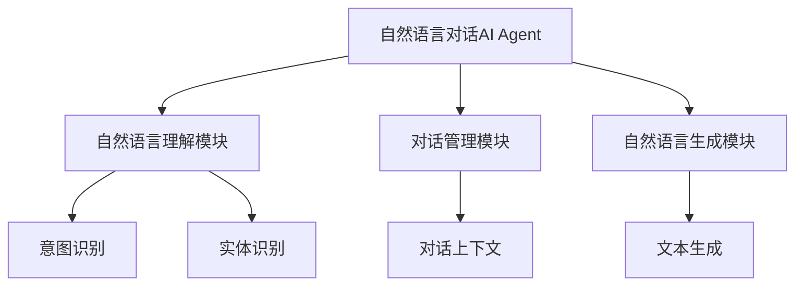
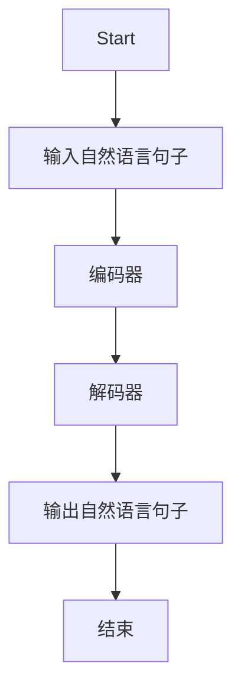
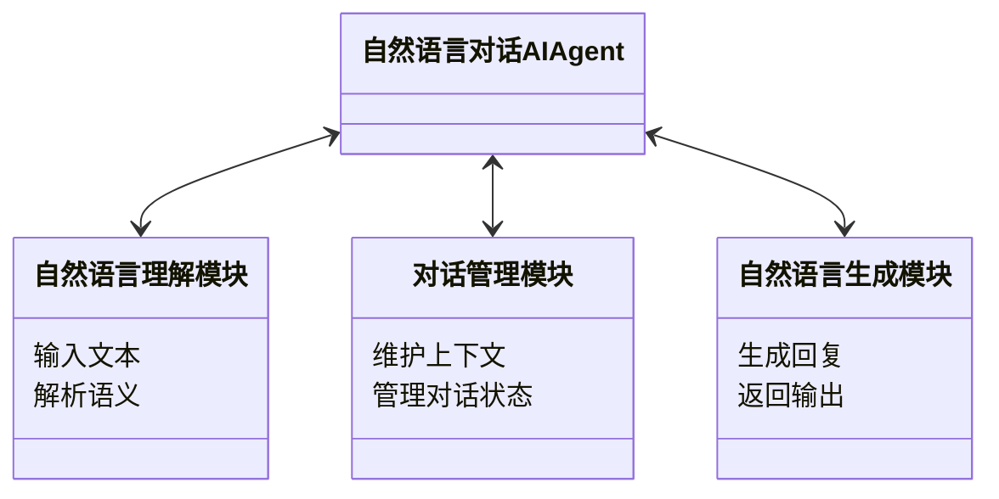
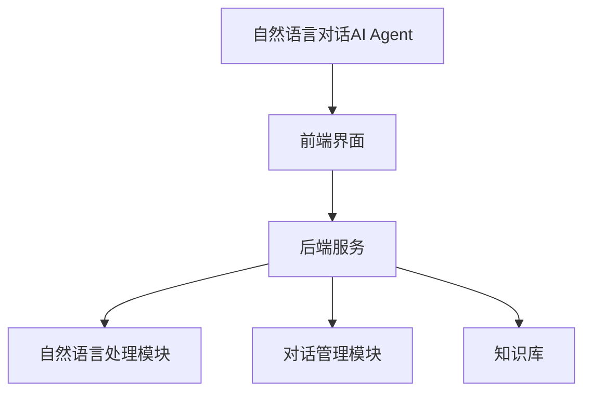
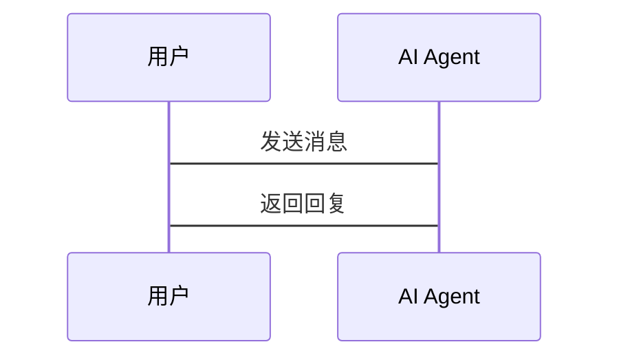

                 


# 开发具有自然语言对话能力的AI Agent

> 关键词：自然语言处理，AI Agent，对话系统，算法原理，系统架构，项目实战

> 摘要：本文详细介绍了如何开发一个具有自然语言对话能力的AI Agent。从基础概念到核心算法，从系统架构到项目实战，全面解析了AI Agent的开发过程。文章首先介绍了自然语言对话AI Agent的背景和核心概念，然后深入探讨了其算法原理和数学模型，接着分析了系统的架构设计，最后通过项目实战展示了如何实现一个简单的自然语言对话AI Agent。

---

## 第1章 自然语言对话AI Agent概述

### 1.1 问题背景与描述

#### 1.1.1 自然语言对话的定义与特点
自然语言对话是指通过自然语言（如中文、英文）进行的交互式对话。与传统的基于规则的对话系统不同，自然语言对话系统能够理解和生成复杂的语言表达，具有更强的语义理解和生成能力。

#### 1.1.2 AI Agent的基本概念与功能
AI Agent（人工智能代理）是一种能够感知环境、执行任务并做出决策的智能系统。它可以通过多种方式与用户交互，包括文本、语音和图形界面等。

#### 1.1.3 自然语言对话AI Agent的典型应用场景
自然语言对话AI Agent广泛应用于智能音箱、聊天机器人、客服系统、智能家居等领域。例如，用户可以通过对话与AI Agent交互，完成查询信息、控制设备、预约服务等任务。

### 1.2 核心概念与问题解决

#### 1.2.1 自然语言处理在AI Agent中的作用
自然语言处理（NLP）是AI Agent实现自然语言对话的核心技术。它包括文本分割、词法分析、句法分析、语义理解等步骤，帮助AI Agent理解用户输入的自然语言文本。

#### 1.2.2 对话系统的实现机制
对话系统通常包括编码器-解码器结构，编码器将输入的自然语言句子编码为向量表示，解码器将向量解码为输出的自然语言句子。此外，还需要考虑对话上下文的管理，以保持对话的连贯性。

#### 1.2.3 AI Agent如何实现自然语言理解与生成
AI Agent通过自然语言处理技术实现对用户输入的理解，生成符合语义的回复。理解过程包括文本解析、意图识别和实体识别等步骤，生成过程则基于预训练的语言模型。

### 1.3 问题的边界与外延

#### 1.3.1 自然语言对话的局限性与挑战
自然语言对话系统目前仍存在一些局限性，例如对上下文的理解能力有限、对复杂语义的处理能力不足等。此外，对话系统还需要处理噪声输入和多语言支持等问题。

#### 1.3.2 AI Agent的性能边界与使用场景限制
AI Agent的性能受限于其算法能力和训练数据的质量。在实际应用中，需要根据具体场景设计合适的对话策略，以提高用户体验。

#### 1.3.3 自然语言对话系统的核心要素与组成结构
自然语言对话系统的核心要素包括自然语言理解模块、对话管理模块和自然语言生成模块。理解模块负责解析用户输入，管理模块负责维护对话状态，生成模块负责生成回复。

---

## 第2章 自然语言对话AI Agent的核心概念与联系

### 2.1 核心概念原理

#### 2.1.1 自然语言处理的基本原理
自然语言处理通过文本预处理、特征提取和模型训练等步骤，实现对自然语言文本的理解和生成。常用的模型包括词嵌入模型（如Word2Vec）和序列模型（如LSTM、Transformer）。

#### 2.1.2 对话系统的实现机制
对话系统基于编码器-解码器结构，结合注意力机制和预训练语言模型（如GPT、BERT）实现自然语言对话。

#### 2.1.3 AI Agent的智能决策过程
AI Agent通过感知环境和用户输入，结合内部知识库和对话策略，生成合适的回复。

### 2.2 核心概念属性特征对比

#### 2.2.1 对比分析表格
以下是自然语言处理和AI Agent的核心概念对比：

| 对比维度 | 自然语言处理 | AI Agent |
|----------|--------------|-----------|
| 核心任务 | 理解和生成文本 | 执行任务和对话 |
| 输入形式 | 文本、语音等 | 文本、语音等 |
| 输出形式 | 文本、语音等 | 文本、语音等 |
| 应用场景 | 信息抽取、文本生成 | 智能对话、任务执行 |

### 2.3 实体关系图

#### 2.3.1 实体关系图（使用Mermaid）



---

## 第3章 自然语言对话AI Agent的算法原理

### 3.1 算法原理概述

#### 3.1.1 基于Transformer的自然语言处理模型
Transformer模型通过自注意力机制和前馈网络实现高效的文本处理。其核心思想是计算每个词与其他词的相关性，从而生成全局语义表示。

#### 3.1.2 对话系统的序列到序列模型
对话系统的编码器将输入句子编码为向量表示，解码器将向量解码为输出句子。通过引入注意力机制，可以更好地捕捉对话的上下文信息。

### 3.2 算法流程图

#### 3.2.1 使用Mermaid绘制的算法流程图



### 3.3 算法实现代码

#### 3.3.1 Python源代码实现（简化版）

```python
import torch
import torch.nn as nn
import torch.optim as optim

class SimpleTransformer(nn.Module):
    def __init__(self, input_dim, hidden_dim, output_dim):
        super(SimpleTransformer, self).__init__()
        self.encoder = nn.Linear(input_dim, hidden_dim)
        self.decoder = nn.Linear(hidden_dim, output_dim)

    def forward(self, x):
        encoded = self.encoder(x)
        decoded = self.decoder(encoded)
        return decoded

# 示例代码
input_dim = 100
hidden_dim = 200
output_dim = 100

model = SimpleTransformer(input_dim, hidden_dim, output_dim)
optimizer = optim.Adam(model.parameters(), lr=0.001)
criterion = nn.MSELoss()

# 假设输入x和目标输出y
x = torch.randn(1, input_dim)
y = torch.randn(1, output_dim)

output = model(x)
loss = criterion(output, y)
loss.backward()
optimizer.step()
```

### 3.4 数学模型与公式

#### 3.4.1 词嵌入模型
词嵌入模型通过将词映射到低维空间，捕捉词义信息。例如，Word2Vec的训练目标是最小化以下损失函数：

$$
\text{loss} = -\log(P(word\_i | word\_j)) 
$$

其中，\( P(word_i | word_j) \) 是在上下文中词 \( word_i \) 在 \( word_j \) 出现的概率。

#### 3.4.2 注意力机制
注意力机制通过计算查询与键之间的相关性，生成注意力权重：

$$
\alpha_{ij} = \frac{\exp(a_i^T b_j)}{\sum_{k} \exp(a_i^T b_k)}
$$

其中，\( a_i \) 是查询的表示，\( b_j \) 是键的表示，\( \alpha_{ij} \) 是注意力权重。

---

## 第4章 系统分析与架构设计

### 4.1 问题场景介绍

#### 4.1.1 自然语言对话AI Agent的应用场景
自然语言对话AI Agent可以应用于智能音箱、聊天机器人、客服系统等场景，为用户提供便捷的交互体验。

#### 4.1.2 系统需要解决的核心问题
系统需要解决的问题包括：如何理解用户的输入、如何生成合适的回复、如何管理对话上下文等。

### 4.2 系统功能设计

#### 4.2.1 领域模型（使用Mermaid类图）



### 4.3 系统架构设计

#### 4.3.1 使用Mermaid绘制的系统架构图



### 4.4 系统接口设计

#### 4.4.1 API接口定义
以下是自然语言对话AI Agent的API接口定义：

```http
POST /api/v1/dialog
Content-Type: application/json

{
    "message": "hello",
    "context": {}
}
```

### 4.5 系统交互设计

#### 4.5.1 使用Mermaid绘制的交互序列图



---

## 第5章 项目实战

### 5.1 环境安装与配置

#### 5.1.1 安装Python和相关库
需要安装以下Python库：

- `torch`
- `transformers`
- `numpy`

安装命令：

```bash
pip install torch transformers numpy
```

#### 5.1.2 安装开发环境
建议使用Jupyter Notebook或PyCharm作为开发环境。

### 5.2 系统核心实现源代码

#### 5.2.1 简单的自然语言对话AI Agent实现

```python
from transformers import AutoTokenizer, AutoModelForSeq2Seq
import torch

# 加载预训练模型
tokenizer = AutoTokenizer.from_pretrained('facebook/m2m-100')
model = AutoModelForSeq2Seq.from_pretrained('facebook/m2m-100')

def chat_bot():
    while True:
        user_input = input("请输入您的消息：")
        inputs = tokenizer(user_input, return_tensors='pt')
        outputs = model.generate(inputs.input_ids, max_length=50)
        response = tokenizer.decode(outputs[0], skip_special_tokens=True)
        print("AI Agent回复：", response)

chat_bot()
```

#### 5.2.2 代码应用解读与分析
上述代码使用了预训练的多语言模型（facebook/m2m-100）实现自然语言对话。用户输入消息后，模型生成回复。

### 5.3 实际案例分析

#### 5.3.1 应用场景分析
以智能音箱为例，用户可以通过对话控制智能家居设备，如“请打开客厅的灯”。

#### 5.3.2 代码实现步骤
1. 安装所需的库。
2. 加载预训练模型。
3. 定义对话函数。
4. 用户输入消息，生成回复。

### 5.4 项目小结

#### 5.4.1 实现思路总结
通过预训练模型实现自然语言对话，结合对话管理模块维护上下文，提升用户体验。

#### 5.4.2 代码实现中的注意事项
- 确保模型和tokenizer版本一致。
- 处理输入和输出时需要考虑编码问题。

---

## 第6章 总结与展望

### 6.1 总结

#### 6.1.1 核心内容回顾
本文详细介绍了自然语言对话AI Agent的开发过程，从概念到实现，涵盖了算法原理、系统架构和项目实战。

#### 6.1.2 关键点总结
- 自然语言处理是AI Agent的核心技术。
- 对话系统的实现需要考虑上下文和对话管理。
- 预训练模型在自然语言对话中的应用越来越广泛。

### 6.2 未来展望

#### 6.2.1 技术发展
随着大语言模型的发展，自然语言对话AI Agent的性能将不断提升，应用场景也将更加广泛。

#### 6.2.2 新技术展望
- 更强的上下文理解能力。
- 多模态对话系统的实现。
- 更高效的对话策略优化算法。

---

通过本文的详细讲解，读者可以全面了解如何开发具有自然语言对话能力的AI Agent，并能够在实际项目中应用这些知识。

