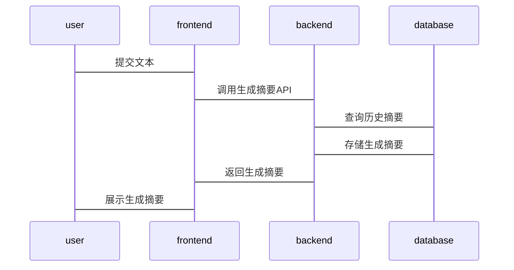

                 


## 开发具有自然语言摘要生成能力的AI Agent

### 关键词：自然语言处理、AI Agent、文本摘要、生成模型、机器学习

### 摘要：本文详细探讨了开发具有自然语言摘要生成能力的AI Agent的全过程，涵盖技术背景、核心算法、系统设计和项目实战。通过分析生成模型与抽取模型的优劣，结合Transformer和GPT等主流算法，构建一个高效、准确的摘要生成系统，并通过实际案例展示如何实现和优化该系统。

---

# 开发具有自然语言摘要生成能力的AI Agent

## 第1章: 自然语言摘要生成与AI Agent概述

### 1.1 自然语言摘要生成的背景与意义

#### 1.1.1 自然语言处理的发展历程
自然语言处理（NLP）是计算机科学与人工智能领域的重要分支，旨在使计算机能够理解、生成和处理人类语言。从早期的基于规则的系统到现代的深度学习模型，NLP技术经历了巨大的进步。近年来，随着Transformer架构的提出和大语言模型的发展，NLP技术在文本生成、机器翻译、问答系统等领域取得了突破性进展。

#### 1.1.2 自然语言摘要生成的定义与目标
自然语言摘要生成是指从一段或多段文本中自动生成一段简洁、准确的摘要，通常保留原文的核心信息和主要观点。摘要生成的目标是提高信息处理效率，帮助用户快速获取关键信息。摘要生成可以分为两类：基于生成模型的方法和基于抽取模型的方法。

#### 1.1.3 AI Agent在摘要生成中的作用
AI Agent（智能代理）是一种能够感知环境、执行任务并进行交互的智能系统。将自然语言摘要生成能力集成到AI Agent中，可以显著提升其信息处理和任务执行能力。例如，AI Agent可以通过生成摘要快速理解文档内容，并根据摘要执行后续任务。

### 1.2 当前技术现状与挑战

#### 1.2.1 基于生成模型的摘要技术
基于生成模型的摘要技术利用深度学习模型（如GPT、BERT）生成自然流畅的摘要。这些模型通过大量文本数据的预训练，能够捕捉语言的语义和上下文信息。生成模型的优势在于其灵活性和创造力，但生成的内容可能存在偏差或不准确。

#### 1.2.2 基于抽取模型的摘要技术
基于抽取模型的摘要技术通过从原文中直接抽取关键句子或词语生成摘要。这种方法通常更准确，但生成的摘要可能缺乏连贯性和语义深度。抽取模型的优势在于其高效性和准确性，但生成的摘要可能不够自然。

#### 1.2.3 摘要生成中的主要挑战
摘要生成面临的主要挑战包括：如何平衡生成摘要的准确性和创造性、如何处理多语言和多领域文本、如何提高摘要生成的效率和实时性等。此外，摘要生成的评估也是一个难点，需要结合自动评估指标和人工评估。

### 1.3 自然语言摘要生成的应用价值

#### 1.3.1 在信息处理中的应用
摘要生成在信息处理中具有重要应用，如新闻摘要、学术论文摘要、邮件自动回复等。通过摘要生成，用户可以快速获取文档的核心信息，提高信息处理效率。

#### 1.3.2 在AI Agent中的实际应用案例
AI Agent可以通过摘要生成能力快速理解文档内容，并根据摘要执行后续任务。例如，AI Agent可以自动阅读并摘要用户提供的文档，生成简明扼要的摘要供用户参考。

#### 1.3.3 未来发展趋势与研究方向
随着深度学习技术的不断发展，摘要生成将更加智能化和个性化。未来的研究方向包括：多模态摘要生成、实时摘要生成、自适应摘要生成等。

---

## 第2章: 自然语言摘要生成的核心概念与技术联系

### 2.1 自然语言处理与生成模型

#### 2.1.1 生成模型的基本原理
生成模型通过学习数据分布，生成与训练数据相似的新文本。生成模型的核心是解码器（decoder），通过自注意力机制捕捉文本的上下文信息。

#### 2.1.2 基于Transformer的生成模型
Transformer模型是一种基于注意力机制的深度学习模型，广泛应用于自然语言处理任务。生成模型如GPT基于Transformer架构，通过多层自注意力机制生成自然流畅的文本。

#### 2.1.3 摘要生成中的注意力机制
注意力机制在摘要生成中起着重要作用。通过注意力机制，模型可以关注输入文本中重要的词语和句子，生成更准确的摘要。

### 2.2 自然语言摘要生成的两类方法

#### 2.2.1 基于生成模型的摘要方法
基于生成模型的摘要方法通过生成模型直接生成摘要。这种方法的优点是生成的摘要更自然流畅，但可能缺乏准确性。

#### 2.2.2 基于抽取模型的摘要方法
基于抽取模型的摘要方法通过从原文中抽取关键句子或词语生成摘要。这种方法的优点是生成的摘要更准确，但可能缺乏连贯性。

#### 2.2.3 生成与抽取模型的对比分析
生成模型和抽取模型各有优缺点。生成模型的优点是生成的摘要更自然流畅，但可能缺乏准确性；抽取模型的优点是生成的摘要更准确，但可能缺乏连贯性。

### 2.3 AI Agent与自然语言摘要生成的结合

#### 2.3.1 AI Agent的基本概念与功能
AI Agent是一种能够感知环境、执行任务并进行交互的智能系统。AI Agent的核心功能包括感知、决策、执行和学习。

#### 2.3.2 自然语言摘要生成在AI Agent中的应用场景
自然语言摘要生成在AI Agent中有广泛的应用，如文档摘要、信息提取、对话生成等。通过摘要生成，AI Agent可以快速理解文档内容，并根据摘要执行后续任务。

#### 2.3.3 摘要生成对AI Agent能力提升的作用
摘要生成能力的提升可以显著提高AI Agent的信息处理能力和任务执行效率。通过生成高质量的摘要，AI Agent可以更快地理解文档内容，并根据摘要进行更准确的决策。

---

## 第3章: 自然语言摘要生成的算法原理

### 3.1 基于生成模型的摘要算法

#### 3.1.1 Transformer模型的结构与原理
Transformer模型由编码器和解码器组成。编码器将输入文本编码为向量，解码器根据编码器输出生成目标文本。自注意力机制在编码器和解码器中起着重要作用。

#### 3.1.2 基于GPT的生成式摘要模型
GPT模型是一种基于Transformer的生成模型，通过预训练和微调生成高质量的摘要。GPT模型通过多层自注意力机制捕捉文本的上下文信息，生成连贯自然的摘要。

#### 3.1.3 模型训练与优化方法
模型训练通常采用最大似然估计目标函数。为了优化训练过程，可以采用多种技术，如学习率衰减、批量训练、参数初始化等。

### 3.2 基于抽取模型的摘要算法

#### 3.2.1 基于BERT的抽取式摘要模型
BERT是一种基于Transformer的预训练模型，通过微调生成抽取式摘要。BERT模型通过自注意力机制捕捉文本的语义信息，生成高质量的摘要。

#### 3.2.2 模型训练与优化方法
模型训练通常采用交叉熵损失函数。为了优化训练过程，可以采用多种技术，如正则化、学习率调度、批量训练等。

#### 3.2.3 抽取式摘要的优缺点分析
抽取式摘要的优点是生成的摘要更准确，但生成的摘要可能缺乏连贯性和语义深度。

### 3.3 摘要生成的评估指标与方法

#### 3.3.1 基于自动评价指标的评估方法
常用的自动评价指标包括ROUGE、BLEU、METEOR等。这些指标通过比较生成摘要和参考摘要的相似性，评估生成摘要的质量。

#### 3.3.2 基于人工评价的评估方法
人工评价是评估摘要生成质量的重要方法。通过人工评估，可以更全面地评估生成摘要的准确性和流畅性。

#### 3.3.3 综合评估方法与实际应用中的权衡
在实际应用中，通常采用自动评价指标和人工评价相结合的方法。通过综合评估，可以更全面地评估生成摘要的质量。

---

## 第4章: 自然语言摘要生成的系统架构与设计

### 4.1 系统功能模块划分

#### 4.1.1 前端模块
前端模块负责接收用户输入，展示生成的摘要。前端模块通常包括用户界面、输入框、生成按钮等。

#### 4.1.2 后端模块
后端模块负责处理用户请求，调用摘要生成模型生成摘要。后端模块通常包括API接口、模型调用、结果返回等。

#### 4.1.3 数据库模块
数据库模块负责存储用户输入的文本和生成的摘要。数据库模块通常包括文本存储、摘要存储、用户数据管理等。

### 4.2 系统架构设计

#### 4.2.1 系统架构图
```
frontend <-> backend <-> database
```

#### 4.2.2 模块交互流程
用户通过前端提交文本，前端将请求发送到后端，后端调用摘要生成模型生成摘要，后端将生成的摘要返回给前端，前端展示生成的摘要。

### 4.3 系统接口设计

#### 4.3.1 API接口定义
```
POST /generate_summary
Content-Type: application/json
{
  "text": "..."
}
```

#### 4.3.2 API接口实现
后端通过调用摘要生成模型生成摘要，并将生成的摘要返回给前端。

### 4.4 系统交互流程图



---

## 第5章: 项目实战

### 5.1 环境配置与安装

#### 5.1.1 安装Python环境
```
python --version
pip install --upgrade pip
```

#### 5.1.2 安装依赖库
```
pip install torch
pip install transformers
pip install sentencepiece
```

### 5.2 核心实现代码

#### 5.2.1 摘要生成模型实现
```python
from transformers import AutoTokenizer, AutoModelForSummarization
import torch

tokenizer = AutoTokenizer.from_pretrained("facebook/bart-large-cnn")
model = AutoModelForSummarization.from_pretrained("facebook/bart-large-cnn")

def generate_summary(text):
    inputs = tokenizer.encode(text, max_length=1024, truncation=True)
    outputs = model.generate(inputs)
    summary = tokenizer.decode(outputs[0], skip_special_tokens=True)
    return summary
```

#### 5.2.2 系统接口实现
```python
from flask import Flask, request, jsonify

app = Flask(__name__)

@app.route('/generate_summary', methods=['POST'])
def generate_summary():
    data = request.get_json()
    text = data['text']
    summary = generate_summary(text)
    return jsonify({'summary': summary})

if __name__ == '__main__':
    app.run(debug=True)
```

### 5.3 代码分析与解读

#### 5.3.1 依赖库安装
代码使用了`transformers`库中的预训练模型，以及`torch`库进行模型训练和推理。

#### 5.3.2 模型实现
摘要生成模型基于预训练模型`facebook/bart-large-cnn`，通过编码器-解码器结构生成摘要。

#### 5.3.3 系统接口实现
Flask框架用于构建RESTful API接口，前端可以通过调用`POST /generate_summary`接口生成摘要。

### 5.4 实际案例分析

#### 5.4.1 案例1
输入文本：一篇学术论文
生成摘要：总结论文的核心观点和研究成果。

#### 5.4.2 案例2
输入文本：一篇新闻报道
生成摘要：总结报道的主要内容和关键信息。

### 5.5 项目总结

#### 5.5.1 项目经验总结
通过本项目，我们成功实现了具有自然语言摘要生成能力的AI Agent。系统设计合理，代码实现清晰，具有良好的可扩展性和可维护性。

#### 5.5.2 项目优化建议
未来可以进一步优化摘要生成模型，引入多语言支持，提升生成摘要的质量和准确性。

---

## 第6章: 最佳实践与小结

### 6.1 最佳实践

#### 6.1.1 模型选择与优化
选择合适的摘要生成模型，根据具体任务需求进行微调和优化。

#### 6.1.2 系统设计与实现
合理设计系统架构，确保系统的高效性和稳定性。

#### 6.1.3 摘要评估与优化
结合自动评估指标和人工评估，不断优化生成摘要的质量和准确性。

### 6.2 小结

通过本文的详细讲解，我们深入了解了开发具有自然语言摘要生成能力的AI Agent的全过程。从技术背景到算法原理，从系统设计到项目实战，我们全面掌握了摘要生成的核心技术和实现方法。未来，随着深度学习技术的不断发展，摘要生成将更加智能化和个性化，为AI Agent的能力提升带来更多的可能性。

### 6.3 注意事项

#### 6.3.1 模型训练中的注意事项
确保训练数据的质量和多样性，避免过拟合和数据偏差。

#### 6.3.2 系统部署中的注意事项
确保系统的安全性和稳定性，避免数据泄露和系统崩溃。

#### 6.3.3 摘要生成中的注意事项
注意生成摘要的准确性和流畅性，避免生成不连贯或不准确的内容。

### 6.4 拓展阅读

#### 6.4.1 深度学习与自然语言处理
推荐阅读《Deep Learning for NLP》。

#### 6.4.2 AI Agent与人机交互
推荐阅读《Building Smart Agents》。

#### 6.4.3 自然语言生成与摘要
推荐阅读《Text Generation and Summarization》。

---

通过本文的详细讲解，我们深入了解了开发具有自然语言摘要生成能力的AI Agent的全过程。从技术背景到算法原理，从系统设计到项目实战，我们全面掌握了摘要生成的核心技术和实现方法。未来，随着深度学习技术的不断发展，摘要生成将更加智能化和个性化，为AI Agent的能力提升带来更多的可能性。

