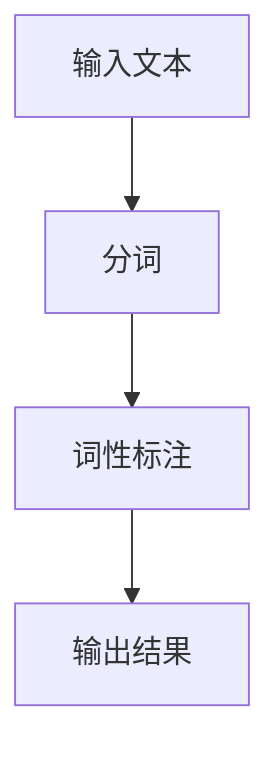
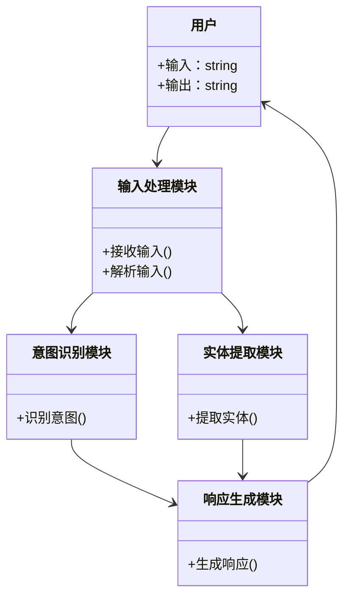
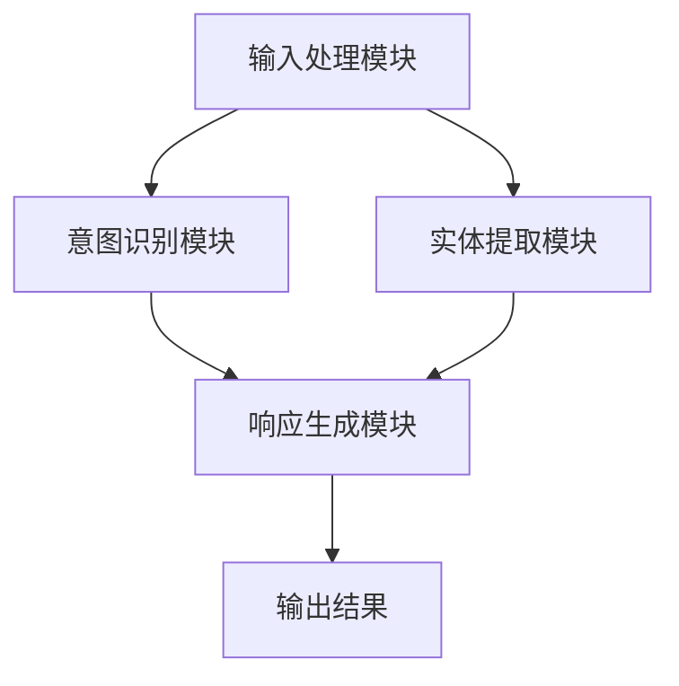
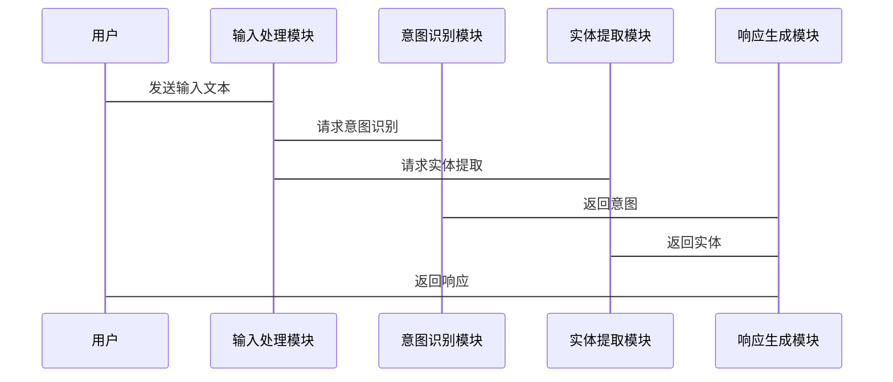

                 


# 开发具有自然语言理解能力的AI Agent

## 关键词：自然语言理解、AI Agent、NLU、深度学习、预训练模型

## 摘要：  
本文将详细探讨如何开发具有自然语言理解能力的AI Agent。从自然语言理解的核心技术到AI Agent的系统架构设计，再到实际项目的实现，我们将逐步分析每一个关键环节。通过结合理论与实践，本文旨在帮助读者掌握开发具备NLU能力AI Agent所需的技能和知识。

---

# 第1章: 自然语言理解与AI Agent概述

## 1.1 自然语言理解的背景与意义

### 1.1.1 自然语言处理的定义与目标  
自然语言处理（NLP）是人工智能领域的重要分支，旨在让计算机能够理解和生成人类语言。其目标是通过算法和模型，实现对文本的语义理解、意图识别、实体提取等功能。

### 1.1.2 自然语言理解在AI Agent中的作用  
AI Agent需要与人类进行交互，而自然语言理解（NLU）是实现这一交互的核心技术。NLU使AI Agent能够理解用户的输入，提取意图和实体，并生成相应的响应。

### 1.1.3 自然语言理解的核心挑战  
- **语义理解的复杂性**：语言的歧义性和上下文依赖性使得语义理解具有挑战性。  
- **数据稀疏性**：某些语言现象在训练数据中可能较少出现，导致模型性能下降。  
- **实时性要求**：在实际应用中，AI Agent需要快速响应，这对计算效率提出了更高要求。

## 1.2 AI Agent的基本概念

### 1.2.1 AI Agent的定义与分类  
AI Agent是一种智能代理，能够感知环境、理解用户需求，并执行任务。根据功能和应用场景，AI Agent可以分为**基于规则的AI Agent**和**基于模型的AI Agent**。

### 1.2.2 AI Agent的功能与应用场景  
AI Agent的功能包括信息检索、任务执行、对话交互等。其应用场景广泛，例如智能音箱、聊天机器人、智能助手等。

### 1.2.3 自然语言理解在AI Agent中的重要性  
NLU是AI Agent与用户交互的核心模块。通过NLU，AI Agent能够理解用户的输入，提取意图和实体，并生成相应的响应。

## 1.3 自然语言理解与AI Agent的结合

### 1.3.1 NLU技术如何赋能AI Agent  
NLU技术帮助AI Agent实现以下功能：  
- **意图识别**：识别用户的意图，例如“我要预订一张去北京的机票”。  
- **实体提取**：从文本中提取关键信息，例如“北京”、“机票”等。  
- **语义理解**：理解文本的深层含义，提供更智能的响应。

### 1.3.2 自然语言理解在AI Agent中的实现流程  
1. **用户输入**：用户通过文本或语音形式输入请求。  
2. **预处理**：对输入进行分词、词性标注等处理。  
3. **意图识别**：识别用户的意图。  
4. **实体提取**：提取文本中的关键实体。  
5. **生成响应**：根据意图和实体生成相应的响应。

### 1.3.3 当前NLU技术在AI Agent中的应用现状  
- **基于规则的NLU**：适用于简单场景，例如关键词匹配。  
- **基于机器学习的NLU**：通过训练数据实现意图识别和实体提取。  
- **基于深度学习的NLU**：利用预训练模型（如BERT、GPT）实现更复杂的语义理解。

## 1.4 本章小结  
本章介绍了自然语言理解（NLU）的基本概念、核心挑战以及在AI Agent中的应用。NLU是AI Agent实现智能交互的关键技术，通过理解用户输入，AI Agent能够提供更高效的服务。

---

# 第2章: 自然语言理解的核心技术

## 2.1 自然语言理解的关键任务

### 2.1.1 词性标注  
词性标注是NLU的基礎任務之一。它涉及将每个词标注其词性，例如名词、动词、形容词等。



**词性标注的作用**：  
- 帮助后续的句法分析和语义理解。  
- 提高文本处理的准确性和效率。

### 2.1.2 命名实体识别

#### 2.1.2.1 实体识别的定义  
命名实体识别（NER）是NLU中的一个关键任务，旨在从文本中提取出具有特定意义的实体，例如人名、地名、组织名等。

**NER的实现流程**：  
1. **分词**：将文本分割成词语。  
2. **特征提取**：提取每个词语的特征，例如词性、上下文信息等。  
3. **模型训练**：使用训练数据训练NER模型。  
4. **实体识别**：对新文本进行实体识别。

**NER的应用场景**：  
- 信息抽取：例如从新闻中提取人名、地名等。  
- 问答系统：帮助理解问题中的实体。

### 2.1.3 语义角色标注

#### 2.1.3.1 语义角色标注的定义  
语义角色标注（Semantic Role Labeling, SRL）是NLU中的一个高级任务，旨在为句子中的每个词语标注其在句中的语义角色，例如主语、谓语、宾语等。

**SRL的实现流程**：  
1. **句法分析**：对句子进行句法分析，生成句法树。  
2. **语义分析**：基于句法树进行语义角色标注。  
3. **结果输出**：输出标注后的语义角色。

**SRL的应用场景**：  
- 信息抽取：例如从句子中提取动作执行者和动作本身。  
- 语义理解：帮助理解句子的深层含义。

### 2.1.4 文本摘要与问答系统

#### 2.1.4.1 文本摘要的定义  
文本摘要是指从长文本中提取关键信息，生成简短的摘要。

**文本摘要的实现方法**：  
1. **基于规则的方法**：根据预设的规则提取关键句子。  
2. **基于统计的方法**：基于句子的重要性评分提取摘要。  
3. **基于深度学习的方法**：使用编码器-解码器模型生成摘要。

**文本摘要的应用场景**：  
- 信息检索：例如从新闻文章中提取摘要。  
- 知识管理：帮助用户快速获取关键信息。

#### 2.1.4.2 问答系统的定义  
问答系统（Question Answering, QA）是一种能够回答用户问题的智能系统。

**问答系统的实现流程**：  
1. **问题理解**：理解用户的问题意图。  
2. **信息检索**：从知识库或文档中检索相关信息。  
3. **生成回答**：根据检索到的信息生成回答。

**问答系统的核心技术**：  
- **问题解析**：理解用户的问题意图。  
- **知识表示**：如何存储和表示知识。  
- **回答生成**：如何根据知识生成回答。

## 2.2 自然语言理解的主流模型

### 2.2.1 传统NLP模型

#### 2.2.1.1 基于统计的NLP模型  
基于统计的NLP模型通过统计语言模型来实现文本处理任务，例如分词、词性标注等。

**基于统计的NLP模型的优缺点**：  
- **优点**：计算效率高，适合小规模数据。  
- **缺点**：依赖于训练数据的质量，对长尾数据表现较差。

#### 2.2.1.2 基于规则的NLP模型  
基于规则的NLP模型通过预设的规则来实现文本处理任务，例如分词、句法分析等。

**基于规则的NLP模型的优缺点**：  
- **优点**：规则明确，易于解释。  
- **缺点**：规则难以覆盖所有语言现象，扩展性差。

### 2.2.2 深度学习模型

#### 2.2.2.1 德尔模型（如LSTM）  
长短期记忆网络（LSTM）是一种深度学习模型，广泛应用于序列数据的处理，例如文本生成、机器翻译等。

**LSTM的工作原理**：  
- LSTM通过记忆单元（Memory Cell）和 gates（输入门、遗忘门、输出门）来控制信息的流动。

**LSTM的应用场景**：  
- 文本生成：例如生成摘要、翻译文本。  
- 语音识别：例如将语音转换为文本。

#### 2.2.2.2 注意力机制（Attention）  
注意力机制是一种深度学习技术，用于模型在处理序列数据时关注某些位置的信息。

**注意力机制的工作原理**：  
- 通过计算查询（Query）与键（Key）之间的相似性，确定哪些位置的信息更重要。

**注意力机制的应用场景**：  
- 机器翻译：例如在翻译长句子时，模型可以关注关键部分。  
- 文本摘要：例如在生成摘要时，模型可以关注重要句子。

### 2.2.3 预训练语言模型（如BERT、GPT）

#### 2.2.3.1 BERT模型  
BERT（Bidirectional Encoder Representations from Transformers）是一种基于Transformer的预训练语言模型，广泛应用于NLU任务。

**BERT模型的核心特点**：  
- **双向编码**：BERT同时考虑单词的左上下文和右上下文信息。  
- **预训练任务**：BERT通过Masked Language Model（遮蔽语言模型）和Next Sentence Prediction（下一步句子预测）任务进行预训练。

**BERT模型的应用场景**：  
- 意图识别：例如在问答系统中识别用户意图。  
- 实体提取：例如从文本中提取人名、地名等。

#### 2.2.3.2 GPT模型  
GPT（Generative Pre-trained Transformer）是一种基于Transformer的预训练语言模型，广泛应用于生成式任务，例如文本生成、对话生成等。

**GPT模型的核心特点**：  
- **自回归生成**：GPT通过自回归的方式生成文本。  
- **上下文依赖**：GPT生成的文本高度依赖上下文信息。

**GPT模型的应用场景**：  
- 对话生成：例如在聊天机器人中生成对话回复。  
- 文本生成：例如生成新闻标题、产品描述等。

## 2.3 自然语言理解的数学模型

### 2.3.1 词向量表示（如Word2Vec）

#### 2.3.1.1 Word2Vec模型的定义  
Word2Vec是一种将词映射为向量的模型，广泛应用于NLP任务。

**Word2Vec模型的核心思想**：  
- 将每个词表示为一个低维向量，向量之间的距离反映了词之间的语义相似性。

**Word2Vec的实现方法**：  
1. **CBOW模型**：通过上下文单词预测目标单词。  
2. **Skip-Gram模型**：通过目标单词预测上下文单词。

**Word2Vec的应用场景**：  
- 分词：例如在中文中，Word2Vec可以用于处理词语的向量化。  
- 相似词计算：例如计算“king”和“queen”的向量相似性。

### 2.3.2 句子表示（如BERT）

#### 2.3.2.1 BERT模型的表示方式  
BERT通过Transformer架构生成句子的向量表示，每个位置的向量反映了该位置的语义信息。

**BERT的表示特点**：  
- **双向表示**：BERT同时考虑单词的左上下文和右上下文信息。  
- **位置编码**：BERT通过位置编码捕捉序列的位置信息。

**BERT的应用场景**：  
- 情感分析：例如分析用户对产品的评价情感。  
- 文本分类：例如将文本分类为不同的类别。

### 2.3.3 注意力机制的数学表达

#### 2.3.3.1 注意力机制的公式  
注意力机制的计算公式如下：

$$
\text{Attention}(Q, K, V) = \text{softmax}\left(\frac{QK^T}{\sqrt{d_k}}\right)V
$$

其中：  
- \( Q \) 是查询向量。  
- \( K \) 是键向量。  
- \( V \) 是值向量。  
- \( d_k \) 是键的维度。

#### 2.3.3.2 注意力机制的实现步骤  
1. **计算查询向量 \( Q \)、键向量 \( K \) 和值向量 \( V \)**。  
2. **计算 \( QK^T \)**。  
3. **对结果进行缩放和Softmax操作**。  
4. **计算最终的注意力输出 \( \text{Attention}(Q, K, V) \)**。

---

# 第3章: AI Agent的系统架构设计

## 3.1 问题场景介绍

### 3.1.1 AI Agent的典型应用场景  
AI Agent广泛应用于智能助手、聊天机器人、智能音箱等领域。

**AI Agent的应用案例**：  
- 智能音箱：例如Alexa、Google Home。  
- 聊天机器人：例如客服机器人、社交机器人。

### 3.1.2 AI Agent的核心需求  
- **高效性**：快速响应用户的请求。  
- **准确性**：准确理解用户的意图。  
- **可扩展性**：支持多种功能和场景。

## 3.2 项目介绍

### 3.2.1 项目目标  
开发一个支持自然语言理解的AI Agent，能够实现意图识别、实体提取等功能。

### 3.2.2 项目范围  
- **功能需求**：支持文本输入、意图识别、实体提取、生成响应。  
- **技术需求**：使用深度学习模型实现NLU任务。

## 3.3 系统功能设计

### 3.3.1 系统功能模块  
AI Agent系统主要包含以下几个功能模块：  
1. **输入处理模块**：接收用户的输入。  
2. **意图识别模块**：识别用户的意图。  
3. **实体提取模块**：提取文本中的实体。  
4. **响应生成模块**：生成相应的响应。

### 3.3.2 领域模型类图  
以下是AI Agent系统的领域模型类图：



## 3.4 系统架构设计

### 3.4.1 系统架构图  
以下是AI Agent系统的架构图：



### 3.4.2 关键模块设计  
- **输入处理模块**：接收用户的输入，并进行预处理。  
- **意图识别模块**：基于预训练模型识别用户的意图。  
- **实体提取模块**：从文本中提取关键实体。  
- **响应生成模块**：根据意图和实体生成响应。

## 3.5 系统接口设计

### 3.5.1 API接口设计  
以下是AI Agent系统的API接口设计：

1. **输入接口**：  
   - 方法：post  
   - 路径：/api/v1/input  
   - 请求参数：{ "text": "..." }  

2. **输出接口**：  
   - 方法：get  
   - 路径：/api/v1/output  
   - 响应参数：{ "response": "..." }

### 3.5.2 接口交互流程  
1. 用户通过输入接口发送请求。  
2. 输入处理模块接收输入并进行预处理。  
3. 预处理后的文本传递给意图识别模块和实体提取模块。  
4. 意图识别模块和实体提取模块分别返回意图和实体。  
5. 响应生成模块根据意图和实体生成响应。  
6. 响应通过输出接口返回给用户。

## 3.6 系统交互设计

### 3.6.1 交互序列图  
以下是AI Agent系统的交互序列图：



---

# 第4章: AI Agent的算法实现

## 4.1 环境安装

### 4.1.1 安装Python  
确保安装了Python 3.8或更高版本。

### 4.1.2 安装依赖库  
安装以下依赖库：  
- **TensorFlow**：用于深度学习模型的训练和推理。  
- **Keras**：用于构建和训练深度学习模型。  
- **Numpy**：用于数值计算。  
- **Scikit-learn**：用于机器学习任务。

安装命令如下：  
```bash
pip install tensorflow keras numpy scikit-learn
```

## 4.2 核心代码实现

### 4.2.1 意图识别模块

#### 4.2.1.1 模型训练代码  
以下是意图识别模块的模型训练代码：

```python
import numpy as np
from tensorflow import keras
from tensorflow.keras import layers

# 定义数据集
train_data = [...]  # 输入数据
train_labels = [...]  # 标签数据

# 构建模型
model = keras.Sequential()
model.add(layers.Embedding(input_dim=..., output_dim=...))
model.add(layers.LSTM(units=64, dropout=0.2, recurrent_dropout=0.2))
model.add(layers.Dense(64, activation='relu'))
model.add(layers.Dense(num_classes, activation='softmax'))

# 编译模型
model.compile(optimizer='adam', loss='sparse_categorical_crossentropy', metrics=['accuracy'])

# 训练模型
model.fit(train_data, train_labels, epochs=10, batch_size=32)
```

#### 4.2.1.2 模型推理代码  
以下是意图识别模块的模型推理代码：

```python
# 加载模型
model = keras.load_model('intent_model.h5')

# 接收输入
input_text = "..."
processed_input = preprocess(input_text)  # 预处理输入

# 预测意图
predictions = model.predict(processed_input)
predicted_intent = decode_predictions(predictions)
```

### 4.2.2 实体提取模块

#### 4.2.2.1 模型训练代码  
以下是实体提取模块的模型训练代码：

```python
import numpy as np
from tensorflow import keras
from tensorflow.keras import layers

# 定义数据集
train_data = [...]  # 输入数据
train_labels = [...]  # 标签数据

# 构建模型
model = keras.Sequential()
model.add(layers.Embedding(input_dim=..., output_dim=...))
model.add(layers.LSTM(units=64, dropout=0.2, recurrent_dropout=0.2))
model.add(layers.Dense(64, activation='relu'))
model.add(layers.Dense(num_classes, activation='softmax'))

# 编译模型
model.compile(optimizer='adam', loss='sparse_categorical_crossentropy', metrics=['accuracy'])

# 训练模型
model.fit(train_data, train_labels, epochs=10, batch_size=32)
```

#### 4.2.2.2 模型推理代码  
以下是实体提取模块的模型推理代码：

```python
# 加载模型
model = keras.load_model('ner_model.h5')

# 接收输入
input_text = "..."
processed_input = preprocess(input_text)  # 预处理输入

# 预测实体
predictions = model.predict(processed_input)
predicted_entities = decode_predictions(predictions)
```

## 4.3 代码解读与分析

### 4.3.1 意图识别模块的代码解读  
- **模型训练代码**：使用LSTM模型进行意图识别，模型包括嵌入层、LSTM层和全连接层。  
- **模型推理代码**：加载训练好的模型，对输入文本进行预处理，并生成意图预测结果。

### 4.3.2 实体提取模块的代码解读  
- **模型训练代码**：使用LSTM模型进行实体提取，模型包括嵌入层、LSTM层和全连接层。  
- **模型推理代码**：加载训练好的模型，对输入文本进行预处理，并生成实体预测结果。

## 4.4 项目小结  
本章详细介绍了AI Agent系统的核心算法实现，包括意图识别和实体提取模块的模型训练和推理代码。通过这些代码，我们可以实现AI Agent对用户输入的意图识别和实体提取功能。

---

# 第5章: 项目实战

## 5.1 环境安装

### 5.1.1 安装开发环境  
安装以下开发环境：  
- **Python 3.8或更高版本**  
- **TensorFlow 2.0或更高版本**  
- **Keras 2.2.4或更高版本**  
- **Jupyter Notebook**（用于代码开发和调试）

安装命令如下：  
```bash
pip install tensorflow keras jupyter notebook
```

## 5.2 核心代码实现

### 5.2.1 意图识别模块

#### 5.2.1.1 模型训练代码  
以下是意图识别模块的模型训练代码：

```python
import numpy as np
from tensorflow import keras
from tensorflow.keras import layers

# 定义数据集
train_data = [...]  # 输入数据
train_labels = [...]  # 标签数据

# 构建模型
model = keras.Sequential()
model.add(layers.Embedding(input_dim=..., output_dim=...))
model.add(layers.LSTM(units=64, dropout=0.2, recurrent_dropout=0.2))
model.add(layers.Dense(64, activation='relu'))
model.add(layers.Dense(num_classes, activation='softmax'))

# 编译模型
model.compile(optimizer='adam', loss='sparse_categorical_crossentropy', metrics=['accuracy'])

# 训练模型
model.fit(train_data, train_labels, epochs=10, batch_size=32)
```

#### 5.2.1.2 模型推理代码  
以下是意图识别模块的模型推理代码：

```python
# 加载模型
model = keras.load_model('intent_model.h5')

# 接收输入
input_text = "..."
processed_input = preprocess(input_text)  # 预处理输入

# 预测意图
predictions = model.predict(processed_input)
predicted_intent = decode_predictions(predictions)
```

### 5.2.2 实体提取模块

#### 5.2.2.1 模型训练代码  
以下是实体提取模块的模型训练代码：

```python
import numpy as np
from tensorflow import keras
from tensorflow.keras import layers

# 定义数据集
train_data = [...]  # 输入数据
train_labels = [...]  # 标签数据

# 构建模型
model = keras.Sequential()
model.add(layers.Embedding(input_dim=..., output_dim=...))
model.add(layers.LSTM(units=64, dropout=0.2, recurrent_dropout=0.2))
model.add(layers.Dense(64, activation='relu'))
model.add(layers.Dense(num_classes, activation='softmax'))

# 编译模型
model.compile(optimizer='adam', loss='sparse_categorical_crossentropy', metrics=['accuracy'])

# 训练模型
model.fit(train_data, train_labels, epochs=10, batch_size=32)
```

#### 5.2.2.2 模型推理代码  
以下是实体提取模块的模型推理代码：

```python
# 加载模型
model = keras.load_model('ner_model.h5')

# 接收输入
input_text = "..."
processed_input = preprocess(input_text)  # 预处理输入

# 预测实体
predictions = model.predict(processed_input)
predicted_entities = decode_predictions(predictions)
```

## 5.3 代码解读与分析

### 5.3.1 意图识别模块的代码解读  
- **模型训练代码**：使用LSTM模型进行意图识别，模型包括嵌入层、LSTM层和全连接层。  
- **模型推理代码**：加载训练好的模型，对输入文本进行预处理，并生成意图预测结果。

### 5.3.2 实体提取模块的代码解读  
- **模型训练代码**：使用LSTM模型进行实体提取，模型包括嵌入层、LSTM层和全连接层。  
- **模型推理代码**：加载训练好的模型，对输入文本进行预处理，并生成实体预测结果。

## 5.4 项目小结  
本章详细介绍了AI Agent系统的实际项目实现，包括意图识别和实体提取模块的模型训练和推理代码。通过这些代码，我们可以实现AI Agent对用户输入的意图识别和实体提取功能。

---

# 第6章: 总结与展望

## 6.1 本章总结  
本文详细探讨了开发具有自然语言理解能力的AI Agent的关键技术，包括自然语言理解的核心任务、AI Agent的系统架构设计、算法实现和项目实战等内容。通过本文的学习，读者可以掌握开发具备NLU能力AI Agent所需的技能和知识。

## 6.2 未来展望  
随着深度学习技术的不断发展，自然语言理解能力的AI Agent将变得更加智能和高效。未来的研究方向包括：  
- **更先进的NLU模型**：例如基于Transformer的模型（如BERT、GPT-3）。  
- **多模态交互**：结合视觉、听觉等多种模态信息，实现更自然的交互。  
- **个性化服务**：根据用户偏好和行为提供个性化的服务。

---

# 第7章: 最佳实践与注意事项

## 7.1 最佳实践  
- **数据预处理**：确保数据的高质量，进行分词、去停用词等预处理。  
- **模型调优**：通过交叉验证和网格搜索等方法优化模型性能。  
- **持续学习**：通过在线学习和迁移学习不断优化模型。

## 7.2 注意事项  
- **数据隐私**：确保用户数据的安全和隐私。  
- **性能优化**：优化模型的计算效率，减少响应时间。  
- **用户体验**：设计良好的用户界面和交互流程，提升用户体验。

---

# 参考文献

1. TensorFlow官方文档  
2. Keras官方文档  
3. BERT论文：《BERT: Pre-training of Deep Bidirectional Transformers for NLP》  
4. GPT论文：《The GPT-3: Language Models are Few-Shot Learners》

---

**本文完**

