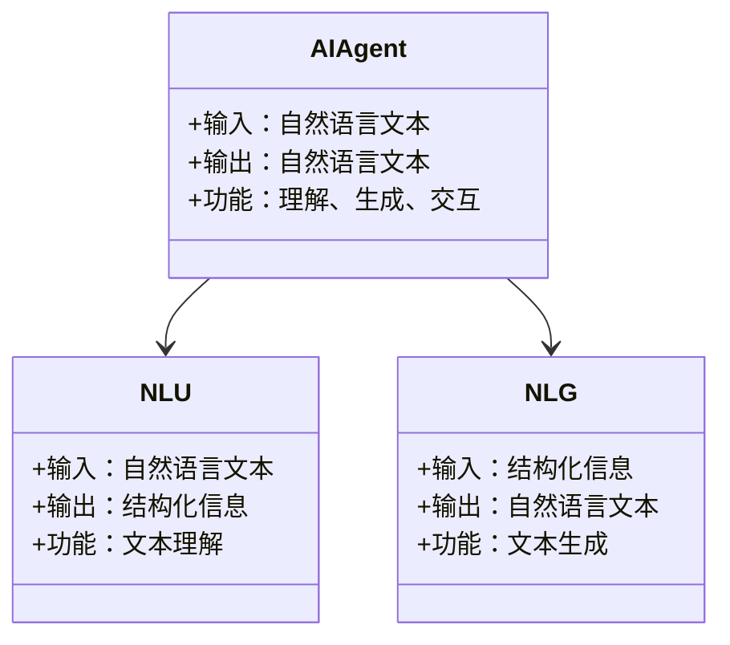
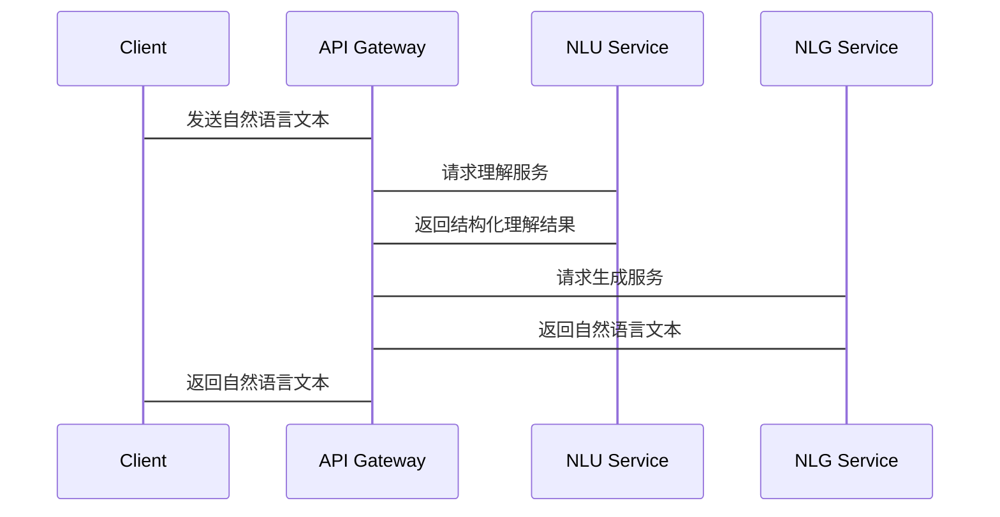

                 


# 开发具有自然语言生成与理解能力的AI Agent

> 关键词：自然语言生成，自然语言理解，AI Agent，深度学习，对话系统

> 摘要：本文详细探讨了开发具有自然语言生成与理解能力的AI Agent的关键技术与实现方法。通过分析自然语言生成与理解的核心概念、算法原理、系统架构设计及实际应用案例，为读者提供了从理论到实践的全面指导。

---

## 第一章: AI Agent的定义与背景

### 1.1 AI Agent的基本概念
#### 1.1.1 什么是AI Agent
AI Agent（人工智能代理）是指能够感知环境并采取行动以实现特定目标的智能系统。AI Agent可以通过自然语言处理（NLP）技术与人类用户进行交互，理解用户意图并生成自然语言响应。

#### 1.1.2 AI Agent的核心特征
- **自主性**：能够在没有外部干预的情况下独立运行。
- **反应性**：能够根据环境变化动态调整行为。
- **目标导向**：具备明确的目标，并采取行动以实现这些目标。
- **交互能力**：能够通过语言或其它方式与用户或环境进行交互。

#### 1.1.3 自然语言生成与理解在AI Agent中的作用
自然语言生成（NLG）和自然语言理解（NLU）是AI Agent实现人机交互的核心技术。NLU负责将用户输入的自然语言转换为系统可理解的结构化信息，而NLG则负责将系统处理后的信息转换为自然语言输出。

### 1.2 自然语言处理的背景与发展
#### 1.2.1 自然语言处理的定义与目标
自然语言处理（NLP）是研究如何让计算机理解和生成人类语言的科学。其目标是实现人机交互的自然化，使计算机能够像人类一样理解和生成语言。

#### 1.2.2 自然语言处理的关键技术
- **分词**：将连续的文本分割成有意义的词汇或短语。
- **词性标注**：为每个词分配其词性。
- **句法分析**：分析句子的语法结构。
- **语义理解**：理解文本的深层含义。
- **文本生成**：基于输入生成自然语言文本。

#### 1.2.3 自然语言生成与理解的演变
从基于规则的简单生成到基于深度学习的复杂模型，自然语言生成与理解技术经历了从简单到复杂的演变过程。当前，预训练大模型（如GPT、BERT）的出现显著提升了生成与理解的性能。

### 1.3 AI Agent的应用场景
#### 1.3.1 智能客服与对话系统
AI Agent可以替代传统的人工客服，提供24/7的在线支持，解决用户的问题并提供个性化的服务。

#### 1.3.2 信息抽取与知识问答
AI Agent可以通过自然语言理解从文本中提取关键信息，并基于这些信息回答用户的问题。

#### 1.3.3 个性化推荐与内容生成
AI Agent可以根据用户的语言输入生成个性化的内容推荐或自动生成相关内容。

---

## 第二章: 自然语言生成与理解的核心概念

### 2.1 自然语言生成
#### 2.1.1 生成式模型的基本原理
生成式模型的目标是根据输入生成自然语言文本。常见的生成式模型包括基于循环神经网络（RNN）的序列生成模型和基于Transformer的生成模型。

#### 2.1.2 基于概率的生成方法
生成式模型通常基于概率分布进行生成。例如，给定一个输入序列，生成模型会预测下一个词的概率分布，并根据该分布生成输出。

#### 2.1.3 现代生成模型的创新
现代生成模型（如GPT、BERT）采用了预训练+微调的模式，通过大量数据的预训练提升模型的通用性，再针对具体任务进行微调。

### 2.2 自然语言理解
#### 2.2.1 基于规则的自然语言理解
早期的自然语言理解技术基于手工编写规则，这种方式在处理复杂语义时存在较大限制。

#### 2.2.2 统计模型与深度学习模型
统计模型（如n-gram模型）通过统计语言学的方法进行理解，而深度学习模型（如LSTM、Transformer）通过学习词向量和上下文关系进行理解。

#### 2.2.3 预训练模型的优势
预训练模型（如BERT）通过在大规模数据上的预训练，掌握了语言的通用特征，可以在多种任务上进行微调，显著提升理解能力。

### 2.3 生成与理解的结合
#### 2.3.1 生成与理解的协同工作
生成与理解是两个相互关联的过程。理解是生成的基础，生成是理解的反馈。

#### 2.3.2 基于上下文的交互
现代AI Agent通过维护上下文信息，能够进行多轮对话，生成连贯且符合语境的回复。

#### 2.3.3 动态调整的生成策略
根据对话历史和用户反馈，生成模型可以动态调整生成策略，以更好地满足用户需求。

---

## 第三章: 自然语言生成与理解的算法原理

### 3.1 生成式模型的算法流程
#### 3.1.1 基于RNN的生成模型
RNN（循环神经网络）通过处理序列数据，生成一个词一个词地构建文本。

#### 3.1.2 Transformer架构的生成模型
Transformer模型通过自注意力机制捕捉全局语义信息，生成高质量的文本。

#### 3.1.3 深度学习的生成模型对比
对比不同生成模型的优缺点，分析其适用场景。

### 3.2 理解式模型的算法流程
#### 3.2.1 基于词嵌入的理解模型
通过词嵌入（如Word2Vec）将文本转换为向量表示。

#### 3.2.2 基于预训练模型的理解方法
利用预训练模型（如BERT）进行文本理解，通过微调适应具体任务。

#### 3.2.3 模型调优与优化策略
通过调整模型参数、优化训练策略等方式提升理解精度。

### 3.3 生成与理解的联合优化
#### 3.3.1 联合训练的策略
同时训练生成与理解模型，提升两者的协同性能。

#### 3.3.2 跨模态学习的应用
结合视觉、听觉等多模态信息，进一步提升生成与理解能力。

#### 3.3.3 端到端优化的实现
通过端到端的训练方式，优化生成与理解的联合性能。

---

## 第四章: 自然语言生成与理解的数学模型

### 4.1 生成式模型的数学基础
#### 4.1.1 概率生成模型的公式推导
生成模型通常基于最大似然估计进行训练，目标是最小化生成文本的条件概率的负对数似然。

$$ \text{损失函数} = -\sum_{i=1}^{n} \log P(y_i|x_{<i}) $$

#### 4.1.2 变量之间的关系与依赖
生成模型需要处理输入与输出之间的依赖关系，可以通过条件概率建模。

$$ P(y|x) $$

#### 4.1.3 模型的损失函数与优化目标
生成模型的损失函数通常是对生成样本的概率分布与真实分布之间的差异的度量。

$$ \text{损失函数} = \text{KL散度或JS散度} $$

### 4.2 理解式模型的数学基础
#### 4.2.1 词向量的表示方法
通过词嵌入模型（如Word2Vec）将词语表示为向量。

$$ \text{向量长度} = d $$

#### 4.2.2 模型的注意力机制
注意力机制通过计算输入序列中每个位置的重要性权重，决定模型的输出。

$$ \text{注意力权重} = \text{softmax}(QK^T/\sqrt{d}) $$

#### 4.2.3 预训练模型的数学框架
预训练模型通过自监督学习目标（如掩码语言模型）进行预训练。

$$ \text{预训练目标} = \text{预测被掩码的词} $$

---

## 第五章: 系统分析与架构设计

### 5.1 问题场景介绍
AI Agent需要实现自然语言生成与理解功能，支持多轮对话交互。

### 5.2 项目介绍
开发一个基于深度学习的AI Agent系统，支持文本生成与理解。

### 5.3 系统功能设计（领域模型）


### 5.4 系统架构设计（架构图）


### 5.5 系统接口设计
- **NLU接口**：接收文本输入，返回结构化理解结果。
- **NLG接口**：接收结构化输入，返回自然语言文本。

### 5.6 系统交互（序列图）


---

## 第六章: 项目实战

### 6.1 环境安装
- 安装Python、TensorFlow、Keras等深度学习框架。
- 安装NLP相关库（如spaCy、transformers）。

### 6.2 核心代码实现

#### 6.2.1 NLU实现
```python
import spacy

nlp = spacy.load("en_core_web_sm")

def nlu_pipeline(text):
    doc = nlp(text)
    return {
        "entities": [(ent.text, ent.start, ent.end) for ent in doc.ents],
        "tokens": [token.text for token in doc]
    }
```

#### 6.2.2 NLG实现
```python
from transformers import AutoModelForCausalLM, AutoTokenizer

tokenizer = AutoTokenizer.from_pretrained("gpt2")
model = AutoModelForCausalLM.from_pretrained("gpt2")

def nlg_pipeline(prompt):
    inputs = tokenizer.encode(prompt, return_tensors="pt")
    outputs = model.generate(inputs, max_length=50)
    return tokenizer.decode(outputs[0], skip_special_tokens=True)
```

### 6.3 代码解读与分析
- **NLU部分**：使用spaCy进行文本理解，提取实体信息。
- **NLG部分**：基于GPT-2模型生成自然语言文本。

### 6.4 实际案例分析
- **案例1**：用户输入“预订酒店”，系统理解需求后生成回复。
- **案例2**：用户输入“天气如何”，系统理解意图后生成天气预报。

### 6.5 项目小结
通过实际项目实现，验证了自然语言生成与理解技术在AI Agent中的应用可行性。

---

## 第七章: 最佳实践

### 7.1 小结
本文详细介绍了开发具有自然语言生成与理解能力的AI Agent的关键技术与实现方法。

### 7.2 注意事项
- 数据质量对模型性能影响巨大，需确保训练数据的多样性和代表性。
- 模型调优需要结合具体任务进行微调，避免过拟合或欠拟合。

### 7.3 拓展阅读
- 《Deep Learning》
- 《Natural Language Processing with PyTorch》
- 《Transformers: State-of-the-art Natural Language Processing》

---

## 总结
通过本文的学习，读者可以掌握AI Agent开发中的自然语言生成与理解技术，理解其背后的算法原理，并通过实际项目实现相关功能。希望本文能为读者在开发AI Agent系统时提供有价值的指导与参考。

