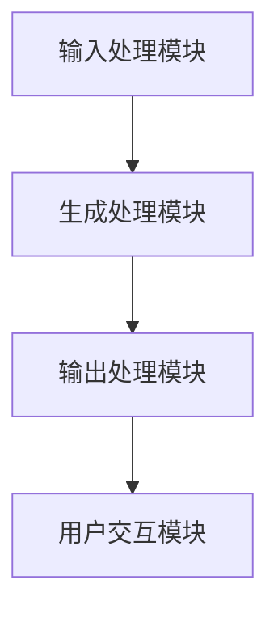
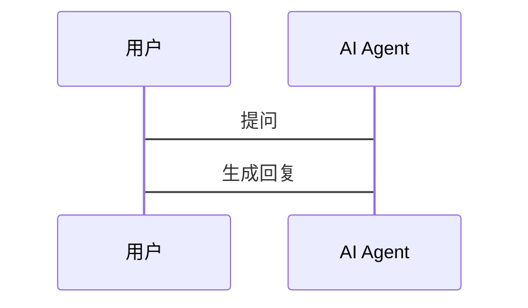

                 


# 开发具有自然语言生成能力的AI Agent

> 关键词：自然语言生成，AI Agent，预训练模型，解码器，系统架构

> 摘要：本文详细探讨了开发具有自然语言生成能力的AI Agent所需的关键技术与方法。从自然语言生成的核心概念到AI Agent的设计原则，从预训练模型的实现到系统的架构设计，本文提供了全面的分析与指导。通过实际案例分析和代码实现，帮助读者掌握如何构建具备自然语言生成能力的智能代理。

---

## 第1章 自然语言生成与AI Agent概述

### 1.1 自然语言生成的核心概念

自然语言生成（Natural Language Generation, NLG）是指将结构化数据或信息转化为自然流畅的文本输出的过程。它结合了语言学、机器学习和计算机科学，是人机交互和智能系统中的核心技术。

#### 1.1.1 自然语言生成的定义与特点
- **定义**：自然语言生成是通过算法生成符合语法和语义的自然语言文本的过程。
- **特点**：
  - **准确性**：生成的内容必须符合上下文和用户意图。
  - **多样性**：能够生成多种表达方式，避免重复。
  - **流畅性**：文本需自然流畅，避免机械化的表达。

#### 1.1.2 自然语言生成的关键技术
- **预训练模型**：如GPT、BERT等，通过大规模数据训练，具备强大的生成能力。
- **解码器**：基于预训练模型的解码器，用于生成目标文本。
- **上下文理解**：通过理解上下文，生成更相关的文本。

#### 1.1.3 自然语言生成的应用场景
- **智能客服**：通过NLG生成自然的对话回复。
- **内容生成**：自动生成新闻、报告等文本。
- **教育辅助**：为学生提供个性化的学习反馈。

### 1.2 AI Agent的基本概念

AI Agent（人工智能代理）是一种能够感知环境、自主决策并执行任务的智能系统。它是实现人机交互的重要桥梁。

#### 1.2.1 AI Agent的定义与分类
- **定义**：AI Agent是一种智能系统，能够通过感知环境、理解用户需求并执行任务，提供相应的服务。
- **分类**：
  - **简单Agent**：基于规则的决策。
  - **复杂Agent**：基于机器学习模型的决策。
  - **协作Agent**：能够与其他Agent或人类协作完成任务。

#### 1.2.2 AI Agent的核心功能与能力
- **感知能力**：通过传感器或接口获取环境信息。
- **决策能力**：基于获取的信息做出决策。
- **执行能力**：通过执行机构完成任务。
- **交互能力**：与用户或环境进行自然语言交流。

#### 1.2.3 自然语言生成在AI Agent中的作用
- **提升交互性**：通过生成自然语言，使AI Agent能够与用户进行更流畅的对话。
- **增强用户体验**：生成个性化、多样化的回复，提升用户满意度。
- **扩展功能**：通过生成文本，AI Agent可以执行更多任务，如信息查询、内容生成等。

### 1.3 自然语言生成与AI Agent的结合

#### 1.3.1 自然语言生成在AI Agent中的应用场景
- **智能对话系统**：生成自然语言对话，提升用户体验。
- **任务型AI Agent**：通过生成文本指令，执行复杂任务。
- **个性化推荐**：根据用户需求生成个性化的推荐内容。

#### 1.3.2 自然语言生成对AI Agent能力的提升
- **增强表达能力**：通过生成自然语言，AI Agent能够更好地表达意图和信息。
- **提升用户体验**：生成多样化的回复，使交互更加人性化。
- **扩展功能边界**：通过生成文本，AI Agent可以执行更多类型的任务。

#### 1.3.3 自然语言生成在AI Agent中的挑战与解决方案
- **挑战**：
  - **生成准确性**：如何确保生成的文本准确无误。
  - **生成多样性**：如何生成多样化的表达方式。
  - **上下文理解**：如何处理复杂多变的上下文。
- **解决方案**：
  - **优化模型**：通过改进预训练模型，提升生成能力。
  - **引入外部知识库**：结合外部知识库，提高生成准确性。
  - **人机协作**：通过人机协作，提升生成效果。

## 1.4 本章小结

本章介绍了自然语言生成的核心概念和AI Agent的基本概念，重点分析了自然语言生成在AI Agent中的作用和应用场景。通过本章的学习，读者可以理解自然语言生成与AI Agent结合的重要性和基本方法。

---

## 第2章 预训练语言模型与自然语言生成

### 2.1 预训练语言模型概述

预训练语言模型（Pre-trained Language Model, PLM）是自然语言生成的核心技术之一。通过大规模数据的预训练，模型能够理解语言的结构和语义。

#### 2.1.1 预训练语言模型的定义与特点
- **定义**：预训练语言模型是通过大规模数据预训练得到的，能够理解和生成自然语言的模型。
- **特点**：
  - **大规模数据**：通过训练大规模数据，模型具备强大的语言理解能力。
  - **通用性**：预训练模型可以在不同任务中进行微调，适应多种应用场景。
  - **高效性**：通过预训练，模型可以在较短时间内完成特定任务的微调。

#### 2.1.2 预训练语言模型的训练方法
- **自监督学习**：通过预测下一个词或填补空缺词，模型学习语言的结构。
- **对比学习**：通过对比正样本和负样本，模型学习语言的表示。
- **生成对抗网络**：通过生成器和判别器的对抗训练，提升生成能力。

#### 2.1.3 预训练语言模型的应用领域
- **自然语言生成**：如GPT系列模型。
- **文本分类**：如BERT模型。
- **问答系统**：如RoBERTa模型。

### 2.2 自然语言生成的解码器

解码器（Decoder）是自然语言生成的核心组件，负责将输入的编码信息转化为自然语言文本。

#### 2.2.1 解码器的基本原理
- **输入**：编码器输出的隐藏层表示。
- **输出**：生成目标语言的文本序列。
- **过程**：通过自注意力机制和前馈网络，生成每个词的预测概率。

#### 2.2.2 解码器的实现方式
- **基于Transformer的解码器**：通过自注意力机制和前馈网络，生成目标文本。
- **基于RNN的解码器**：通过循环神经网络，逐步生成目标文本。
- **混合解码器**：结合Transformer和RNN的优势，提升生成效果。

#### 2.2.3 解码器的优化方法
- **引入位置编码**：通过位置编码，模型可以更好地理解词的顺序。
- **使用交叉注意力**：通过引入交叉注意力机制，模型可以更好地利用输入信息。
- **引入温度参数**：通过调整温度参数，控制生成的多样性和确定性。

### 2.3 自然语言生成的评估指标

评估指标是衡量自然语言生成质量的重要工具，常用的指标包括：

#### 2.3.1 常见的评估指标
- **BLEU**：基于编辑距离的评估指标。
- **ROUGE**：基于召回率的评估指标。
- **METEOR**：结合准确率和流畅度的评估指标。

#### 2.3.2 评估指标的优缺点
- **BLEU**：优点是计算简单，缺点是可能低估生成文本的流畅度。
- **ROUGE**：优点是能够捕捉到文本的语义信息，缺点是可能忽略生成文本的语法错误。
- **METEOR**：优点是综合考虑了准确率和流畅度，缺点是计算复杂度较高。

#### 2.3.3 如何选择合适的评估指标
- **任务需求**：根据具体任务需求选择合适的评估指标。
- **数据规模**：根据数据规模选择适合的评估方法。
- **模型类型**：根据模型类型选择适合的评估指标。

### 2.4 本章小结

本章详细介绍了预训练语言模型和自然语言生成的解码器，分析了自然语言生成的评估指标。通过本章的学习，读者可以理解预训练语言模型在自然语言生成中的重要性，以及如何通过解码器和评估指标优化生成效果。

---

## 第3章 AI Agent的设计与架构

### 3.1 AI Agent的设计原则

设计AI Agent需要遵循一定的原则，以确保系统的高效性和可靠性。

#### 3.1.1 设计AI Agent的核心原则
- **明确的目标与功能**：确保AI Agent的目标明确，功能清晰。
- **用户需求的深度理解**：通过用户调研和需求分析，确保AI Agent的设计符合用户需求。
- **可扩展性与可维护性**：确保系统的可扩展性和可维护性，方便后续优化和升级。

#### 3.1.2 自然语言生成在AI Agent中的设计要点
- **生成内容的准确性与自然性**：确保生成的文本准确无误，表达自然流畅。
- **生成内容的多样性与创造性**：通过多样化的生成方式，提升用户体验。
- **生成内容的上下文相关性**：根据上下文生成相关的文本，避免生成无关内容。

### 3.2 自然语言生成在AI Agent中的设计

#### 3.2.1 系统功能设计
- **对话系统**：通过自然语言生成实现对话功能。
- **任务执行**：通过自然语言生成生成任务指令，执行特定任务。
- **内容生成**：通过自然语言生成生成新闻、报告等文本。

#### 3.2.2 系统架构设计
- **输入层**：接收用户的输入，如文本、语音等。
- **处理层**：对输入进行处理，生成自然语言输出。
- **输出层**：将生成的文本输出给用户。

#### 3.2.3 系统接口设计
- **输入接口**：用户输入的接口，如文本框、语音输入等。
- **输出接口**：生成文本的输出接口，如对话框、文本框等。
- **交互接口**：用户与AI Agent之间的交互接口，如按钮、菜单等。

### 3.3 本章小结

本章重点分析了AI Agent的设计原则和自然语言生成在AI Agent中的设计要点。通过本章的学习，读者可以理解如何设计一个具备自然语言生成能力的AI Agent，并掌握系统的功能设计和架构设计。

---

## 第4章 自然语言生成算法的实现

### 4.1 自然语言生成的算法原理

自然语言生成的算法原理是基于预训练模型的解码器，通过生成概率模型生成目标文本。

#### 4.1.1 基于预训练模型的生成算法
- **GPT模型**：通过预训练生成文本，具备强大的生成能力。
- **BERT模型**：通过预训练生成文本，具备强大的上下文理解能力。
- **其他预训练模型**：如RoBERTa、DistilBERT等。

#### 4.1.2 解码器的实现细节
- **自注意力机制**：通过自注意力机制，模型可以更好地理解输入的上下文信息。
- **前馈网络**：通过前馈网络，模型可以生成目标文本的预测概率。
- **温度参数**：通过调整温度参数，控制生成的多样性和确定性。

#### 4.1.3 数学模型与公式

自然语言生成的数学模型可以表示为：

$$ P(y|x) = \prod_{i=1}^{n} P(y_i | x, y_{<i}) $$

其中，$x$ 是输入序列，$y$ 是生成的输出序列，$y_{<i}$ 表示生成序列中前面的词。

通过最大似然估计，模型可以学习生成概率分布，从而生成最优的输出文本。

### 4.2 自然语言生成的代码实现

以下是一个基于Python的自然语言生成算法的实现示例：

```python
import torch
import torch.nn as nn
import torch.optim as optim

class NLGModel(nn.Module):
    def __init__(self, vocab_size, embedding_dim, hidden_dim):
        super(NLGModel, self).__init__()
        self.embedding = nn.Embedding(vocab_size, embedding_dim)
        self.lstm = nn.LSTM(embedding_dim, hidden_dim, batch_first=True)
        self.fc = nn.Linear(hidden_dim, vocab_size)
    
    def forward(self, input, hidden=None):
        embeds = self.embedding(input)
        output, hidden = self.lstm(embeds, hidden)
        output = self.fc(output[:, -1, :])
        return output, hidden

# 初始化模型和优化器
vocab_size = 10000
embedding_dim = 256
hidden_dim = 512
model = NLGModel(vocab_size, embedding_dim, hidden_dim)
optimizer = optim.Adam(model.parameters(), lr=0.001)
criterion = nn.CrossEntropyLoss()

# 训练过程
for epoch in range(num_epochs):
    for batch in dataloader:
        input_seq, target_seq = batch
        outputs, _ = model(input_seq, None)
        loss = criterion(outputs, target_seq)
        optimizer.zero_grad()
        loss.backward()
        optimizer.step()
```

### 4.3 本章小结

本章详细介绍了自然语言生成的算法原理和代码实现。通过本章的学习，读者可以理解自然语言生成的核心算法，并掌握如何通过代码实现生成模型。

---

## 第5章 AI Agent的系统分析与架构设计

### 5.1 系统分析

#### 5.1.1 问题场景介绍
- **用户需求**：用户希望与AI Agent进行自然语言对话，获取相关信息和服务。
- **系统功能需求**：系统需要具备自然语言生成能力，能够生成多样化的回复。
- **系统性能需求**：系统需要具备高响应速度和高准确性。

#### 5.1.2 项目介绍
- **项目目标**：开发一个具备自然语言生成能力的AI Agent。
- **项目范围**：包括需求分析、系统设计、实现、测试和部署。
- **项目计划**：分为需求分析、设计、实现、测试和部署五个阶段。

#### 5.1.3 系统功能设计
- **领域模型设计**：通过领域模型，明确系统的核心功能和模块。
- **功能模块**：包括输入处理、生成处理、输出处理和用户交互模块。

### 5.2 系统架构设计

#### 5.2.1 系统架构图

以下是系统的架构图：



#### 5.2.2 系统接口设计
- **输入接口**：用户输入的接口，如文本框、语音输入等。
- **输出接口**：生成文本的输出接口，如对话框、文本框等。
- **交互接口**：用户与AI Agent之间的交互接口，如按钮、菜单等。

#### 5.2.3 系统交互设计

以下是系统的交互流程图：



### 5.3 本章小结

本章详细分析了AI Agent的系统分析与架构设计，通过系统的架构图和交互流程图，明确了系统的功能模块和交互流程。

---

## 第6章 项目实战

### 6.1 环境安装

#### 6.1.1 安装Python和相关库
```bash
python --version
pip install torch
pip install transformers
```

### 6.2 系统核心实现

#### 6.2.1 自然语言生成实现
```python
from transformers import AutoModelForCausalLM, AutoTokenizer

model_name = "gpt2"
tokenizer = AutoTokenizer.from_pretrained(model_name)
model = AutoModelForCausalLM.from_pretrained(model_name)

def generate_text(prompt, max_length=50):
    inputs = tokenizer.encode(prompt, return_tensors="pt")
    outputs = model.generate(inputs, max_length=max_length, do_sample=True)
    return tokenizer.decode(outputs[0], skip_special_tokens=True)

print(generate_text("Hello, how are you?"))
```

#### 6.2.2 AI Agent实现
```python
class AI_Agent:
    def __init__(self, model_name):
        self.tokenizer = AutoTokenizer.from_pretrained(model_name)
        self.model = AutoModelForCausalLM.from_pretrained(model_name)
    
    def generate_response(self, input_text, max_length=50):
        inputs = self.tokenizer.encode(input_text, return_tensors="pt")
        outputs = self.model.generate(inputs, max_length=max_length, do_sample=True)
        return self.tokenizer.decode(outputs[0], skip_special_tokens=True)

agent = AI_Agent("gpt2")
print(agent.generate_response("What's your name?"))
```

### 6.3 代码应用解读与分析

#### 6.3.1 代码功能分析
- **自然语言生成实现**：通过预训练模型生成目标文本。
- **AI Agent实现**：通过AI Agent类封装自然语言生成功能，提供接口供用户调用。

#### 6.3.2 代码优化建议
- **性能优化**：通过批处理和并行计算，提升生成速度。
- **模型优化**：通过模型剪枝和量化，减少模型大小，提升运行效率。
- **用户体验优化**：通过引入用户反馈机制，优化生成效果。

### 6.4 实际案例分析

#### 6.4.1 案例背景
- **用户需求**：用户希望与AI Agent进行自然语言对话，获取天气信息。
- **系统功能**：AI Agent需要根据用户输入生成天气预报。

#### 6.4.2 实现步骤
1. **获取天气数据**：通过API获取天气数据。
2. **生成天气预报**：根据天气数据生成自然语言的天气预报。
3. **返回结果**：将生成的天气预报返回给用户。

### 6.5 本章小结

本章通过实际案例分析和代码实现，展示了如何开发一个具备自然语言生成能力的AI Agent。通过本章的学习，读者可以掌握项目实战中的关键步骤和注意事项。

---

## 第7章 总结与展望

### 7.1 总结

本文详细探讨了开发具有自然语言生成能力的AI Agent所需的关键技术与方法。从自然语言生成的核心概念到AI Agent的设计原则，从预训练模型的实现到系统的架构设计，本文提供了全面的分析与指导。

### 7.2 展望

随着自然语言生成技术的不断发展，AI Agent的能力将更加智能化和人性化。未来的研究方向包括：
- **更强大的预训练模型**：通过更大规模的数据和更复杂的模型结构，提升生成能力。
- **多模态生成**：结合视觉、听觉等多种模态信息，实现更全面的生成能力。
- **人机协作**：通过人机协作，进一步提升AI Agent的生成效果和用户体验。

---

## 附录

### 附录A: 代码实现

#### 附录A.1 自然语言生成代码实现
```python
# 代码实现部分
```

#### 附录A.2 AI Agent代码实现
```python
# 代码实现部分
```

### 附录B: 进一步阅读

- **推荐书籍**：
  - 《Deep Learning》
  - 《Natural Language Processing with PyTorch》
- **推荐论文**：
  - "Attention Is All You Need"
  - "Generating High-Quality Text with Fewer Parameters"
- **推荐工具**：
  - Hugging Face Transformers
  - PyTorch

---

通过本文的详细分析与指导，读者可以系统地掌握开发具有自然语言生成能力的AI Agent的关键技术与方法，为未来的实际应用打下坚实的基础。

