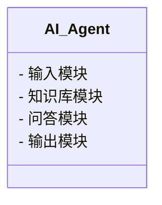

                 


# 开发具有自然语言问答能力的AI Agent

## 关键词：
AI Agent, 自然语言处理, 问答系统, 深度学习, 生成模型, 检索模型

## 摘要：
本文详细介绍了开发具有自然语言问答能力的AI Agent的全过程，涵盖自然语言处理基础、问答系统算法、系统架构设计以及项目实战等内容。通过理论与实践相结合的方式，读者将掌握从零开始构建一个智能问答系统的技能。

---

# 第一部分：引言

## 第1章：AI Agent与自然语言问答概述

### 1.1 AI Agent的基本概念
AI Agent（智能代理）是指能够感知环境并采取行动以实现目标的智能体。在自然语言处理领域，AI Agent通常需要理解人类语言并进行交互。

#### 1.1.1 AI Agent的定义与特点
- **定义**：AI Agent是能够执行任务的智能体，通常具备感知和行动能力。
- **特点**：
  - 自主性：能够独立决策。
  - 反应性：能实时感知环境并做出反应。
  - 社交能力：能与人类或其他系统进行交互。

#### 1.1.2 自然语言处理在AI Agent中的作用
NLP使AI Agent能够理解人类语言，从而实现智能问答、信息检索等功能。

### 1.2 自然语言问答系统的分类
问答系统主要分为三类：基于规则、基于检索和基于生成。

#### 1.2.1 基于规则的问答系统
通过预定义规则匹配问题，提供标准答案。适用于简单问题，但扩展性差。

#### 1.2.2 基于检索的问答系统
从预存文档中检索最相关的段落作为答案，依赖于强大的文本匹配算法。

#### 1.2.3 基于生成的问答系统
利用深度学习模型生成答案，灵活性高，但实现复杂。

### 1.3 开发AI Agent的意义与挑战
- **意义**：提升用户体验，实现人机交互的智能化。
- **挑战**：数据获取、模型训练、实时性等问题。

---

# 第二部分：自然语言处理基础

## 第2章：自然语言处理（NLP）基础

### 2.1 NLP的核心任务
NLP包括分词、词性标注、句法分析等任务。

#### 2.1.1 分词
将连续文本分割成有意义的词或短语。

##### 代码示例
```python
import nltk
text = "Hello world, how are you?"
tokens = nltk.word_tokenize(text)
print(tokens)
```

#### 2.1.2 词性标注
为每个词标注其词性。

##### 代码示例
```python
from nltk import pos_tag
text = "The cat is on the mat."
tokens = pos_tag(text.split())
print(tokens)
```

### 2.2 常见的NLP工具与库
介绍常用的NLP工具如NLTK、spaCy和Stanford NLP工具。

---

# 第三部分：问答系统的核心算法

## 第4章：基于检索的问答系统

### 4.1 检索式问答系统的工作原理
通过计算问题与候选答案之间的相似度，选择最匹配的答案。

#### 4.1.1 基于向量空间模型的检索
将文本表示为向量，计算余弦相似度。

##### 数学公式
$$ \text{相似度} = \frac{\vec{q} \cdot \vec{a}}{|\vec{q}| \cdot |\vec{a}|} $$

### 第5章：基于生成的问答系统

#### 5.1 基于生成模型的问答系统
利用Transformer模型生成回答。

##### 案例分析
使用Seq2Seq模型训练问答数据，生成回答。

---

# 第四部分：AI Agent的系统架构设计

## 第6章：AI Agent的系统架构

### 6.1 系统模块划分
- **输入处理模块**：接收用户输入。
- **知识库模块**：存储和管理知识。
- **问答模块**：处理和生成回答。
- **输出模块**：将回答返回给用户。

#### Mermaid类图


### 6.2 系统架构设计
使用分层架构，明确各模块之间的交互关系。

#### Mermaid架构图
```mermaid
containerDiagram
    container 网络层 {
        AI_Agent
    }
    container 应用层 {
        输入模块
        问答模块
        输出模块
    }
```

---

# 第五部分：项目实战

## 第7章：构建一个简单的问答系统

### 7.1 环境安装
安装必要的库如Python、TensorFlow、Keras。

### 7.2 问答系统核心代码
实现一个简单的检索式问答系统。

#### 代码示例
```python
import numpy as np
from sklearn.metrics.pairwise import cosine_similarity

def get_closest_answer(questions, answers, question):
    question_vec = vectorize(question)
    similarities = cosine_similarity([question_vec], [answers_vec])[0]
    return answers[np.argmax(similarities)]
```

### 7.3 案例分析
分析一个实际案例，展示如何从数据预处理到模型训练。

---

# 第六部分：高级主题与优化

## 第8章：对话管理与上下文理解

### 8.1 对话管理
管理多轮对话，保持上下文一致性。

### 8.2 上下文理解
利用序列模型捕捉对话中的上下文信息。

#### 案例分析
使用LSTM处理多轮对话，提升回答准确性。

---

# 第七部分：总结与展望

## 第9章：总结与未来展望

### 9.1 总结
回顾全文，强调开发AI Agent的关键点。

### 9.2 未来展望
讨论AI Agent的发展趋势，如多模态交互、边缘计算等。

---

通过以上结构，读者可以系统地学习从基础到高级的AI Agent开发知识，逐步掌握自然语言问答系统的开发技能。

