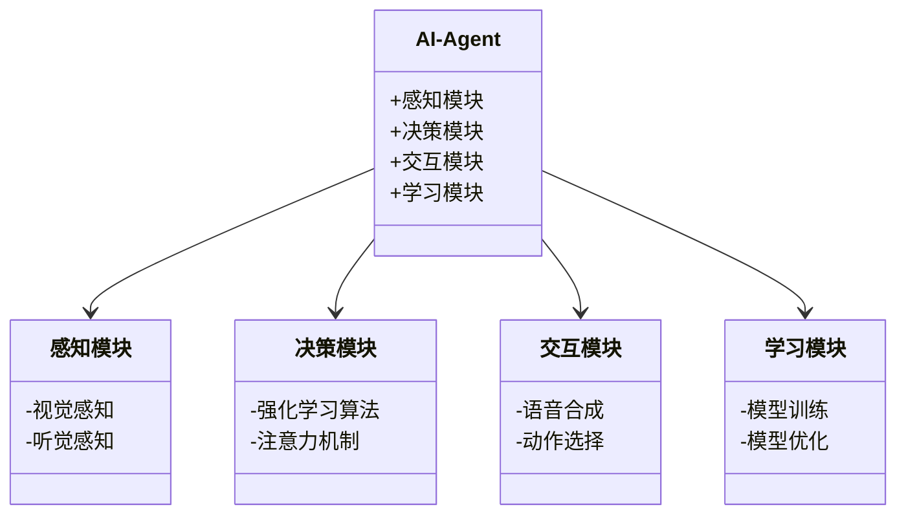
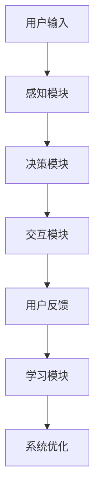

                 


# 开发具有虚拟现实交互能力的AI Agent

---

## 关键词

- AI Agent  
- 虚拟现实  
- 多模态交互  
- 强化学习  
- 注意力机制  
- 系统架构设计  

---

## 摘要

本文系统地探讨了开发具有虚拟现实交互能力的AI Agent的关键技术与实现方法。文章从AI Agent与虚拟现实交互的基本概念出发，深入分析了多模态感知、决策算法、自然语言处理等核心原理，结合实际项目案例，详细阐述了系统的架构设计与实现细节。通过本文，读者可以全面掌握AI Agent在虚拟现实交互中的开发方法，并能够将其应用于实际场景中。

---

## 第一部分: 背景与概念

### 第1章: AI Agent与虚拟现实交互概述

#### 1.1 AI Agent的基本概念

##### 1.1.1 AI Agent的定义与特点

AI Agent（人工智能代理）是指在计算机系统中能够感知环境、自主决策并执行任务的智能实体。AI Agent具有以下特点：
- **自主性**：能够在没有外部干预的情况下自主运行。
- **反应性**：能够实时感知环境并做出反应。
- **目标导向性**：具有明确的目标，并能够为实现目标而采取行动。
- **学习能力**：能够通过经验改进自身的性能。

##### 1.1.2 虚拟现实交互的基本概念

虚拟现实（Virtual Reality，VR）是一种能够提供沉浸式体验的技术，通过模拟真实世界的环境，让用户与虚拟世界进行交互。VR交互的核心在于让用户能够通过自然的方式与虚拟环境中的对象进行互动。

##### 1.1.3 AI Agent与虚拟现实交互的结合

AI Agent与虚拟现实交互的结合，使得AI Agent能够通过虚拟环境与用户进行更自然的交互。AI Agent可以通过感知用户的动作、语音等输入，并通过决策算法生成相应的输出，从而实现与用户的深度交互。

#### 1.2 虚拟现实交互中的AI Agent

##### 1.2.1 虚拟现实交互的核心要素

- **用户输入**：包括用户的动作、语音、表情等。
- **环境感知**：AI Agent需要感知虚拟环境中的物体、场景等信息。
- **决策输出**：AI Agent根据感知的信息生成相应的动作或反馈。

##### 1.2.2 AI Agent在虚拟现实中的角色

- **用户助手**：帮助用户完成特定任务。
- **环境互动者**：与虚拟环境中的物体进行交互。
- **决策者**：根据用户的输入做出决策。

##### 1.2.3 虚拟现实交互中的AI Agent的优势

- **沉浸式体验**：用户可以通过VR设备获得更真实的交互体验。
- **自然的交互方式**：AI Agent能够通过语音、动作等方式与用户进行交互。
- **高效的决策能力**：AI Agent可以通过算法快速做出决策。

#### 1.3 问题背景与目标

##### 1.3.1 当前AI Agent在虚拟现实中的问题

- **感知能力不足**：AI Agent对虚拟环境的感知不够全面。
- **决策算法有限**：现有的决策算法在复杂场景中的表现不够理想。
- **交互体验欠佳**：用户与AI Agent之间的交互不够自然。

##### 1.3.2 虚拟现实交互能力的重要性

在虚拟现实环境中，AI Agent需要能够通过多种方式感知用户的需求，并通过高效的决策算法做出相应的反馈，从而提升用户体验。

##### 1.3.3 本书的目标与范围

本书旨在系统地介绍开发具有虚拟现实交互能力的AI Agent的核心技术与实现方法，涵盖从理论到实践的各个方面，帮助读者掌握AI Agent在虚拟现实交互中的开发技能。

---

## 第二部分: 核心概念与原理

### 第2章: AI Agent的感知与决策算法

#### 2.1 多模态感知算法

##### 2.1.1 视觉感知算法

视觉感知算法是AI Agent通过摄像头等设备感知虚拟环境中的物体、场景等信息的关键技术。常用的视觉感知算法包括：
- **物体检测**：基于深度学习的物体检测算法（如YOLO、Faster R-CNN等）。
- **场景分割**：基于深度学习的场景分割算法（如U-Net、Mask R-CNN等）。

##### 2.1.2 听觉感知算法

听觉感知算法是AI Agent通过麦克风等设备感知用户语音信息的关键技术。常用的听觉感知算法包括：
- **语音识别**：基于深度学习的语音识别算法（如CTC、Transformer等）。
- **语音分离**：基于深度学习的语音分离算法（如Wavenet、Blstm等）。

##### 2.1.3 多模态数据融合算法

多模态数据融合算法是将视觉、听觉等多种感知数据进行融合的关键技术。常用的多模态数据融合算法包括：
- **特征融合**：将不同模态的特征进行融合（如Concat、Add等）。
- **注意力机制**：基于注意力机制的多模态数据融合（如Transformer中的多头注意力机制）。

#### 2.2 基于强化学习的决策算法

##### 2.2.1 强化学习的基本原理

强化学习是一种通过试错机制来优化决策策略的算法。强化学习的基本原理包括：
- **状态空间**：环境中的状态表示。
- **动作空间**：AI Agent可以采取的动作。
- **奖励机制**：AI Agent采取动作后获得的奖励或惩罚。

##### 2.2.2 虚拟现实环境中的状态空间建模

在虚拟现实环境中，状态空间建模需要考虑以下因素：
- **用户动作**：用户的动作（如手势、语音等）。
- **环境状态**：虚拟环境中的物体、场景等信息。
- **任务目标**：AI Agent需要完成的任务目标。

##### 2.2.3 动作选择与奖励机制

动作选择是强化学习的核心问题。常用的动作选择算法包括：
- **ε-greedy算法**：在探索与利用之间进行平衡。
- **UCB算法**：基于上置信限的策略。

奖励机制是强化学习的关键，常用的奖励机制包括：
- **即时奖励**：AI Agent采取动作后立即获得的奖励。
- **延迟奖励**：AI Agent采取动作后延迟获得的奖励。

#### 2.3 注意力机制与多任务学习

##### 2.3.1 注意力机制的基本原理

注意力机制是一种通过关注输入中的重要部分来提高模型性能的技术。注意力机制的基本原理包括：
- **查询（Query）**：AI Agent的当前状态。
- **键（Key）**：输入数据中的特征。
- **值（Value）**：输入数据中的特征。

##### 2.3.2 多任务学习在AI Agent中的应用

多任务学习是一种同时学习多个任务的算法。多任务学习在AI Agent中的应用包括：
- **多模态任务**：同时处理视觉、听觉等多种任务。
- **复杂场景**：在复杂场景中同时完成多个任务。

##### 2.3.3 虚拟现实交互中的任务优先级管理

任务优先级管理是多任务学习中的关键问题。常用的任务优先级管理方法包括：
- **基于权重的优先级管理**：根据任务的重要性分配权重。
- **基于时间的优先级管理**：根据任务的时间紧迫性分配优先级。

### 第3章: 虚拟现实交互中的自然语言处理

#### 3.1 基于Transformer的对话模型

##### 3.1.1 Transformer模型的基本结构

Transformer模型是一种基于自注意力机制的深度学习模型。其基本结构包括：
- **编码器**：将输入序列编码为高维向量。
- **解码器**：根据编码器的输出生成目标序列。

##### 3.1.2 在虚拟现实中的对话生成

在虚拟现实中，对话生成需要考虑以下因素：
- **上下文感知**：对话的上下文信息。
- **用户意图**：用户的意图识别。
- **生成策略**：对话生成的策略（如基于规则、基于模型等）。

##### 3.1.3 对话上下文的管理

对话上下文管理是对话生成的关键。常用的对话上下文管理方法包括：
- **记忆网络**：通过记忆网络记录对话历史。
- **状态机模型**：通过状态机模型管理对话状态。

#### 3.2 虚拟现实中的语音识别与合成

##### 3.2.1 语音识别算法

语音识别算法是将用户的语音输入转换为文本的关键技术。常用的语音识别算法包括：
- **基于HMM的语音识别**：基于隐马尔可夫模型的语音识别。
- **基于深度学习的语音识别**：基于RNN、LSTM等深度学习模型的语音识别。

##### 3.2.2 语音合成算法

语音合成算法是将文本转换为语音的关键技术。常用的语音合成算法包括：
- **基于单元的语音合成**：基于预定义语音单元的合成。
- **基于深度学习的语音合成**：基于WaveNet、TTS等深度学习模型的合成。

##### 3.2.3 语音与虚拟现实交互的结合

语音与虚拟现实交互的结合需要考虑以下因素：
- **语音输入的实时性**：语音输入的实时处理。
- **语音输出的自然性**：语音输出的自然流畅。
- **语音与虚拟环境的协同**：语音与虚拟环境中的物体、场景等协同。

---

## 第三部分: 算法实现与系统架构

### 第4章: AI Agent的算法实现

#### 4.1 多模态感知算法的实现

##### 4.1.1 视觉感知的实现

视觉感知的实现需要考虑以下因素：
- **图像预处理**：图像的增强、归一化等预处理。
- **模型训练**：基于深度学习的视觉感知模型的训练。
- **模型部署**：视觉感知模型的部署与优化。

##### 4.1.2 听觉感知的实现

听觉感知的实现需要考虑以下因素：
- **语音预处理**：语音的增强、降噪等预处理。
- **模型训练**：基于深度学习的听觉感知模型的训练。
- **模型部署**：听觉感知模型的部署与优化。

##### 4.1.3 多模态数据融合的实现

多模态数据融合的实现需要考虑以下因素：
- **特征提取**：从多模态数据中提取特征。
- **特征融合**：将不同模态的特征进行融合。
- **融合策略**：特征融合的策略（如加权融合、注意力融合等）。

#### 4.2 强化学习算法的实现

##### 4.2.1 状态空间的构建

状态空间的构建需要考虑以下因素：
- **状态表示**：状态的表示方式（如向量、图像等）。
- **状态空间的维度**：状态空间的维度设计。
- **状态空间的动态性**：状态空间的动态变化。

##### 4.2.2 动作选择的实现

动作选择的实现需要考虑以下因素：
- **动作空间的定义**：动作的定义与分类。
- **动作选择策略**：基于策略的或基于值的策略。
- **动作选择的实时性**：动作选择的实时性要求。

##### 4.2.3 奖励机制的设计

奖励机制的设计需要考虑以下因素：
- **奖励函数的设计**：奖励函数的设计原则与方法。
- **奖励的实时性**：奖励的实时计算。
- **奖励的多样性**：奖励的多样性与平衡性。

#### 4.3 注意力机制与多任务学习的实现

##### 4.3.1 注意力机制的实现

注意力机制的实现需要考虑以下因素：
- **注意力计算**：基于查询、键、值的注意力计算。
- **注意力的可视化**：注意力的可视化与解释。
- **注意力的优化**：注意力机制的优化方法。

##### 4.3.2 多任务学习的实现

多任务学习的实现需要考虑以下因素：
- **任务的定义**：任务的划分与定义。
- **任务的优先级**：任务的优先级管理。
- **任务的协同优化**：多任务的协同优化方法。

##### 4.3.3 任务优先级的管理

任务优先级的管理需要考虑以下因素：
- **优先级的定义**：任务优先级的定义与计算。
- **优先级的动态调整**：任务优先级的动态调整。
- **优先级的可视化**：任务优先级的可视化与解释。

### 第5章: 系统架构设计

#### 5.1 系统整体架构

##### 5.1.1 系统模块划分

AI Agent的系统架构通常包括以下几个模块：
- **感知模块**：负责感知虚拟环境中的物体、场景等信息。
- **决策模块**：负责根据感知信息做出决策。
- **交互模块**：负责与用户的交互，包括语音、动作等。
- **学习模块**：负责模型的训练与优化。

##### 5.1.2 模块之间的关系

模块之间的关系可以用以下的类图表示：



##### 5.1.3 系统的可扩展性设计

系统的可扩展性设计需要考虑以下因素：
- **模块的独立性**：模块之间的独立性设计。
- **模块的可替换性**：模块的可替换性设计。
- **系统的扩展性**：系统的可扩展性设计。

#### 5.2 系统接口设计

##### 5.2.1 系统接口的定义

系统接口的定义需要考虑以下因素：
- **接口的定义**：接口的定义与规范。
- **接口的实现**：接口的实现方法。
- **接口的调用**：接口的调用方式。

##### 5.2.2 系统接口的实现

系统接口的实现需要考虑以下因素：
- **接口的实现**：基于API或其他接口实现方式。
- **接口的文档**：接口文档的编写与管理。
- **接口的测试**：接口的测试与验证。

#### 5.3 系统交互设计

##### 5.3.1 系统交互流程

系统交互流程可以用以下的流程图表示：



##### 5.3.2 交互流程的优化

交互流程的优化需要考虑以下因素：
- **流程的简化**：交互流程的简化设计。
- **流程的优化**：交互流程的优化方法。
- **流程的可视化**：交互流程的可视化与解释。

---

## 第四部分: 项目实战

### 第6章: 项目实战

#### 6.1 项目背景

##### 6.1.1 项目介绍

本项目旨在开发一个具有虚拟现实交互能力的AI Agent，能够在虚拟环境中与用户进行自然的交互。

##### 6.1.2 项目目标

项目目标包括：
- **实现AI Agent的多模态感知能力**：包括视觉、听觉等多种感知方式。
- **实现AI Agent的决策能力**：基于强化学习的决策算法。
- **实现AI Agent的交互能力**：包括语音、动作等多种交互方式。

#### 6.2 项目实现

##### 6.2.1 环境配置

项目实现需要以下环境配置：
- **硬件要求**：高性能计算机、VR设备等。
- **软件要求**：Python、深度学习框架（如TensorFlow、PyTorch）等。
- **虚拟现实开发平台**：如Unity、Unreal Engine等。

##### 6.2.2 系统核心实现

系统核心实现包括：
- **视觉感知模块**：基于深度学习的物体检测与场景分割。
- **听觉感知模块**：基于深度学习的语音识别与合成。
- **决策模块**：基于强化学习的决策算法。
- **交互模块**：基于自然语言处理的对话生成。

##### 6.2.3 代码实现

以下是一个简单的代码示例：

```python
import tensorflow as tf
from tensorflow.keras import layers

# 定义视觉感知模型
def visual_perception_model():
    model = tf.keras.Sequential([
        layers.Conv2D(32, (3,3), activation='relu', input_shape=(224, 224, 3)),
        layers.MaxPooling2D((2,2)),
        layers.Conv2D(64, (3,3), activation='relu'),
        layers.MaxPooling2D((2,2)),
        layers.Flatten(),
        layers.Dense(128, activation='relu'),
        layers.Dense(10, activation='softmax')
    ])
    return model

# 定义听觉感知模型
def auditory_perception_model():
    model = tf.keras.Sequential([
        layers.Conv1D(32, 4, activation='relu', input_shape=(None, 16000)),
        layers.MaxPooling1D(2),
        layers.Conv1D(64, 4, activation='relu'),
        layers.MaxPooling1D(2),
        layers.GlobalMaxPooling1D(),
        layers.Dense(128, activation='relu'),
        layers.Dense(10, activation='softmax')
    ])
    return model

# 定义决策模块
def decision_module():
    model = tf.keras.Sequential([
        layers.Dense(64, activation='relu'),
        layers.Dense(1, activation='sigmoid')
    ])
    return model

# 定义交互模块
def interaction_module():
    model = tf.keras.Sequential([
        layers.LSTM(128, return_sequences=True),
        layers.Dense(128, activation='relu'),
        layers.Dense(10, activation='softmax')
    ])
    return model
```

#### 6.3 项目测试与优化

##### 6.3.1 项目测试

项目测试需要考虑以下因素：
- **功能测试**：各模块的功能测试。
- **性能测试**：系统的性能测试。
- **用户体验测试**：用户体验的测试与优化。

##### 6.3.2 项目优化

项目优化需要考虑以下因素：
- **模型优化**：模型的优化与调优。
- **系统优化**：系统的优化与调优。
- **用户体验优化**：用户体验的优化与改进。

#### 6.4 项目小结

通过本项目，读者可以掌握AI Agent在虚拟现实交互中的开发方法，并能够将其应用于实际场景中。

---

## 第五部分: 最佳实践与小结

### 第7章: 最佳实践

#### 7.1 数据处理的注意事项

数据处理的注意事项包括：
- **数据的清洗**：数据的清洗与预处理。
- **数据的增强**：数据的增强与扩展。
- **数据的分割**：数据的分割与管理。

#### 7.2 模型优化的注意事项

模型优化的注意事项包括：
- **模型的调参**：模型的调参与优化。
- **模型的评估**：模型的评估与验证。
- **模型的部署**：模型的部署与管理。

#### 7.3 用户体验设计的注意事项

用户体验设计的注意事项包括：
- **交互设计**：交互设计的优化与改进。
- **界面设计**：界面设计的优化与改进。
- **反馈设计**：用户反馈的优化与改进。

### 第8章: 小结

通过本文的系统介绍，读者可以全面掌握AI Agent在虚拟现实交互中的开发方法，并能够将其应用于实际场景中。未来，随着AI技术的不断发展，AI Agent在虚拟现实交互中的应用将更加广泛，也将更加智能化和人性化。

---

## 参考文献

- 本文中的代码示例基于TensorFlow框架，读者可以根据实际需求进行调整与优化。
- 本文中的图示基于Mermaid语法，读者可以通过安装Mermaid插件在Markdown编辑器中查看。
- 本文中的数学公式基于LaTeX格式，读者可以通过安装相应的插件在Markdown编辑器中查看。

