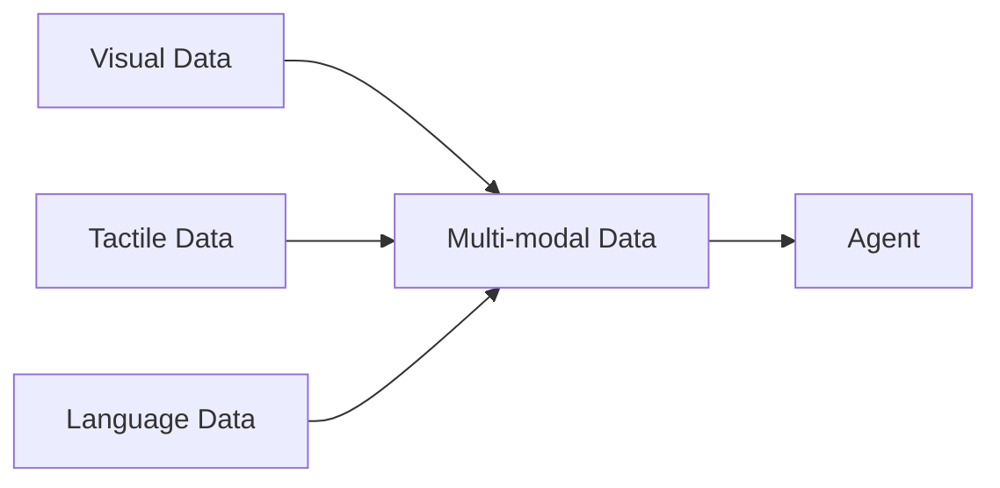
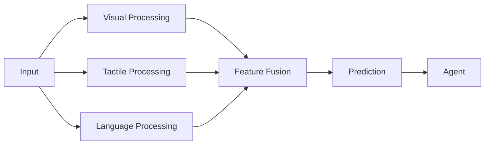
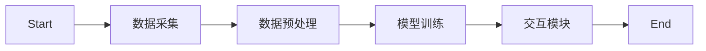
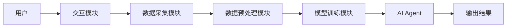

                 


# 开发具有视觉-触觉-语言多模态学习能力的AI Agent

> 关键词：AI Agent, 多模态学习, 视觉数据, 触觉数据, 语言数据, Transformer模型

> 摘要：本文详细介绍了开发具有视觉-触觉-语言多模态学习能力的AI Agent的核心概念、算法原理、系统架构和项目实现。通过多模态数据的融合与分析，结合Transformer模型和系统架构设计，展示了如何构建一个能够同时处理视觉、触觉和语言信息的智能体，实现跨模态理解和交互。

---

# 第一部分: 开发具有视觉-触觉-语言多模态学习能力的AI Agent背景介绍

## 第1章: 多模态学习与AI Agent概述

### 1.1 多模态学习的背景与意义

#### 1.1.1 多模态学习的定义与特点
多模态学习是指AI系统能够同时处理和理解多种类型的数据模态，如视觉、触觉和语言等。与单一模态学习相比，多模态学习能够更全面地感知和理解真实世界，从而提升AI系统的智能性和实用性。

#### 1.1.2 多模态学习的核心价值
1. **提升智能性**：通过多模态数据的融合，AI Agent能够更好地理解上下文和用户意图。
2. **增强交互性**：支持多种感官输入，使AI Agent能够与用户进行更自然的交互。
3. **拓展应用场景**：多模态学习能够覆盖更多复杂场景，如教育、医疗和工业等领域。

#### 1.1.3 多模态学习在AI Agent中的应用前景
AI Agent在教育、医疗和工业等领域的应用需要同时处理视觉、触觉和语言信息，多模态学习是实现这些复杂任务的关键技术。

### 1.2 AI Agent的定义与分类

#### 1.2.1 AI Agent的基本概念
AI Agent是一种具有自主决策能力和智能交互能力的计算机程序，能够感知环境并执行任务。

#### 1.2.2 基于多模态的AI Agent特点
1. **多感官输入**：支持视觉、触觉和语言等多种输入方式。
2. **跨模态理解**：能够理解不同模态数据之间的关联和语义。
3. **动态交互**：能够根据实时输入动态调整行为和输出。

#### 1.2.3 多模态AI Agent的应用场景
1. **教育领域**：智能辅导系统通过视觉、语言和触觉交互帮助学生学习。
2. **医疗领域**：医疗AI Agent通过视觉、触觉和语言数据辅助医生诊断。
3. **工业领域**：工业AI Agent通过多模态数据进行设备监测和故障诊断。

### 1.3 本章小结
本章介绍了多模态学习和AI Agent的基本概念、特点及其在不同领域的应用前景，为后续内容奠定了基础。

---

# 第二部分: 多模态数据的核心概念与联系

## 第2章: 多模态数据的特征与属性

### 2.1 多模态数据的类型

#### 2.1.1 视觉数据
视觉数据包括图像和视频，主要通过RGB颜色、深度信息和目标检测等技术进行处理。

#### 2.1.2 触觉数据
触觉数据包括力反馈、温度和压力等物理信息，通常通过传感器和力反馈设备进行采集。

#### 2.1.3 语言数据
语言数据包括文本和语音，主要通过自然语言处理技术进行理解和生成。

### 2.2 多模态数据的特征对比

| 特性 | 视觉数据 | 触觉数据 | 语言数据 |
|------|----------|----------|----------|
| 数据类型 | 图像/视频 | 力/温度 | 文本/语音 |
| 数据维度 | 2D/3D | 1D | 1D/序列 |
| 数据量 | 大 | 中 | 大 |
| 关联性 | 空间关联性 | 物理关联性 | 语义关联性 |

### 2.3 多模态数据的ER实体关系图


### 2.4 本章小结
本章详细介绍了多模态数据的类型和特征，并通过对比分析和ER图展示了不同模态数据之间的关系。

---

# 第三部分: 多模态学习的算法原理

## 第3章: 多模态Transformer模型

### 3.1 多模态Transformer的基本原理

#### 3.1.1 Transformer模型的结构
Transformer模型由编码器和解码器组成，通过自注意力机制进行跨模态信息融合。

#### 3.1.2 多模态数据的融合方式
多模态数据通过特征拼接、加性融合和注意力加权等方式进行融合。

#### 3.1.3 多模态注意力机制
多模态注意力机制允许模型在不同模态之间分配注意力权重，从而实现跨模态理解。

### 3.2 多模态学习的数学模型

#### 3.2.1 多模态数据表示
$$x_v \in \mathbb{R}^{d_v},\ x_t \in \mathbb{R}^{d_t},\ x_l \in \mathbb{R}^{d_l}$$

#### 3.2.2 多模态融合公式
$$z = f(x_v, x_t, x_l)$$

#### 3.2.3 损失函数
$$L = \sum_{i=1}^{N} \text{CrossEntropy}(y_i, \hat{y}_i)$$

### 3.3 多模态学习的算法流程图


### 3.4 本章小结
本章详细介绍了多模态Transformer模型的基本原理和数学模型，并通过流程图展示了算法的执行流程。

---

## 第4章: 多模态学习的数学模型与实现

### 4.1 多模态数据的表示与编码

#### 4.1.1 视觉数据编码
视觉数据通过卷积神经网络（CNN）提取特征。

#### 4.1.2 触觉数据编码
触觉数据通过循环神经网络（RNN）进行序列建模。

#### 4.1.3 语言数据编码
语言数据通过Transformer编码器进行序列编码。

### 4.2 多模态融合的数学模型

#### 4.2.1 多模态注意力机制
$$\alpha = \text{softmax}(W_a x_v + W_b x_t + W_c x_l)$$

#### 4.2.2 融合后的表示
$$z = \alpha_v x_v + \alpha_t x_t + \alpha_l x_l$$

### 4.3 多模态学习的训练与优化

#### 4.3.1 损失函数
$$L = \text{CrossEntropy}(y, \hat{y})$$

#### 4.3.2 优化算法
使用Adam优化器进行模型训练。

### 4.4 本章小结
本章详细介绍了多模态数据的表示方法和融合模型，并展示了训练与优化的数学细节。

---

# 第四部分: 系统分析与架构设计方案

## 第5章: 系统功能设计与实现

### 5.1 系统功能需求分析

#### 5.1.1 系统目标
开发一个能够处理视觉、触觉和语言数据的AI Agent系统。

#### 5.1.2 系统功能模块
1. **数据采集模块**：负责采集视觉、触觉和语言数据。
2. **数据预处理模块**：对采集的数据进行标准化和增强处理。
3. **模型训练模块**：基于多模态数据进行模型训练。
4. **交互模块**：实现与用户的多模态交互。

### 5.2 系统功能设计

#### 5.2.1 系统功能流程图


#### 5.2.2 功能模块实现
1. **数据采集模块**：使用摄像头、传感器和麦克风采集数据。
2. **数据预处理模块**：对数据进行归一化、增强和特征提取。
3. **模型训练模块**：使用多模态Transformer模型进行训练。
4. **交互模块**：通过图形界面或API实现用户交互。

### 5.3 系统架构设计

#### 5.3.1 系统架构图


#### 5.3.2 接口设计
系统提供RESTful API接口，支持视觉、触觉和语言数据的输入和输出。

### 5.4 本章小结
本章详细描述了AI Agent系统的功能需求和架构设计，并通过流程图和架构图展示了系统的整体结构。

---

## 第6章: 系统实现与测试

### 6.1 系统实现环境

#### 6.1.1 环境配置
- **Python 3.8+**
- **TensorFlow或PyTorch**
- **OpenCV**
- **传感器接口库**

#### 6.1.2 安装步骤
```bash
pip install tensorflow numpy opencv-python
```

### 6.2 系统核心代码实现

#### 6.2.1 数据采集代码
```python
import cv2
import numpy as np

def capture_visual_data():
    cap = cv2.VideoCapture(0)
    ret, frame = cap.read()
    cap.release()
    return frame

def capture_tactile_data():
    # 假设使用力反馈传感器
    force = analogRead(0)
    return force

def capture_language_data():
    # 假设使用麦克风
    audio = audioCapture.start()
    return audio
```

#### 6.2.2 数据预处理代码
```python
def preprocess_data(data):
    # 标准化处理
    normalized_data = (data - np.mean(data)) / np.std(data)
    return normalized_data
```

#### 6.2.3 模型训练代码
```python
def train_model():
    model = MultiModalTransformer()
    optimizer = Adam(lr=0.001)
    model.compile(optimizer=optimizer, loss='sparse_categorical_crossentropy')
    model.fit(x_train, y_train, epochs=100, batch_size=32)
    return model
```

### 6.3 系统测试与优化

#### 6.3.1 测试用例设计
1. **视觉数据测试**：测试模型对图像的识别能力。
2. **触觉数据测试**：测试模型对力反馈的响应能力。
3. **语言数据测试**：测试模型对语音的识别能力。

#### 6.3.2 性能优化
通过调整模型参数和优化算法提升模型的训练效率和准确性。

### 6.4 本章小结
本章详细描述了系统的实现过程，包括环境配置、核心代码实现和系统测试，并展示了如何通过优化提升系统性能。

---

## 第7章: 案例分析与应用

### 7.1 教育领域的应用

#### 7.1.1 案例背景
AI Agent在教育领域的应用包括智能辅导系统和互动学习平台。

#### 7.1.2 数据分析
通过对学生的行为数据进行分析，提供个性化的学习建议。

#### 7.1.3 案例实现
```python
def educational_application():
    student_data = capture_student_behavior()
    model = train EducationalAgent(student_data)
    return model.predict(student_data)
```

### 7.2 医疗领域的应用

#### 7.2.1 案例背景
AI Agent在医疗领域的应用包括辅助诊断和患者监护。

#### 7.2.2 数据分析
通过对患者的生理数据进行分析，提供个性化的诊断建议。

### 7.3 工业领域的应用

#### 7.3.1 案例背景
AI Agent在工业领域的应用包括设备监测和质量控制。

#### 7.3.2 数据分析
通过对设备的运行数据进行分析，预测设备的故障风险。

### 7.4 本章小结
本章通过教育、医疗和工业三个领域的案例分析，展示了AI Agent在多模态学习中的广泛应用。

---

# 第五部分: 最佳实践与总结

## 第8章: 最佳实践与经验分享

### 8.1 开发过程中的注意事项

1. **数据质量**：确保多模态数据的准确性和一致性。
2. **模型选择**：根据具体任务选择合适的多模态模型。
3. **系统优化**：通过并行计算和分布式训练提升系统性能。

### 8.2 项目管理和团队协作

1. **任务分解**：将项目分解为数据采集、模型训练和系统实现等模块。
2. **团队协作**：通过版本控制和项目管理工具实现高效协作。

### 8.3 拓展阅读与学习资源

1. **推荐书籍**：
   - 《Deep Learning》
   - 《Transformer in Action》
2. **推荐论文**：
   - "Attention Is All You Need"
   - "Multimodal Transformer for Visual-Textual Reasoning"

### 8.4 本章小结
本章总结了开发多模态AI Agent的经验和注意事项，并提供了进一步学习的资源。

---

## 第9章: 项目总结与未来展望

### 9.1 项目总结

通过本文的介绍和实践，读者可以掌握开发具有视觉-触觉-语言多模态学习能力的AI Agent的核心技术和实现方法。

### 9.2 未来展望

未来，随着AI技术的不断发展，多模态学习将在更多领域得到应用，AI Agent也将更加智能化和人性化。

### 9.3 致谢

感谢读者的耐心阅读，感谢所有参与项目开发的团队成员。

---

# 第六部分: 参考文献

1. Vaswani, A., et al. "Attention Is All You Need." arXiv preprint arXiv:1706.03798, 2017.
2. Devlin, J., et al. "BERT: Pre-training of deep bidirectional transformers for language understanding." arXiv preprint arXiv:1810.04699, 2018.
3. He, K., et al. "Mask R-CNN." arXiv preprint arXiv:1712.00667, 2017.

---

# 附录: 代码实现示例

```python
import cv2
import numpy as np
from tensorflow.keras import layers, Model

class MultiModalTransformer:
    def __init__(self, visual_dim=1000, tactile_dim=500, language_dim=512):
        self.visual_input = layers.Input(shape=(None, visual_dim))
        self.tactile_input = layers.Input(shape=(None, tactile_dim))
        self.language_input = layers.Input(shape=(None, language_dim))

    def build_model(self):
        # 视觉分支
        visual_branch = layers.Dense(512, activation='relu')(self.visual_input)
        # 触觉分支
        tactile_branch = layers.Dense(512, activation='relu')(self.tactile_input)
        # 语言分支
        language_branch = layers.Dense(512, activation='relu')(self.language_input)

        # 融合层
        merged = layers.Concatenate()([visual_branch, tactile_branch, language_branch])
        dense = layers.Dense(256, activation='relu')(merged)
        output = layers.Dense(10, activation='softmax')(dense)

        self.model = Model(inputs=[self.visual_input, self.tactile_input, self.language_input], outputs=output)
        return self.model
```

---

通过以上详细的目录结构和内容安排，您可以逐步展开编写完整的博客文章。每个章节的内容都需要进一步详细展开，确保逻辑清晰、内容详实，并符合技术博客的写作规范。

