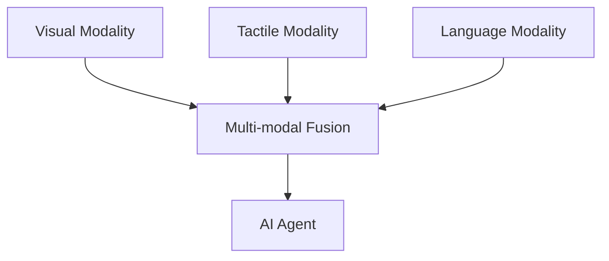
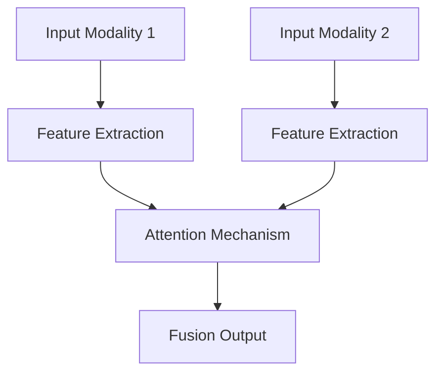
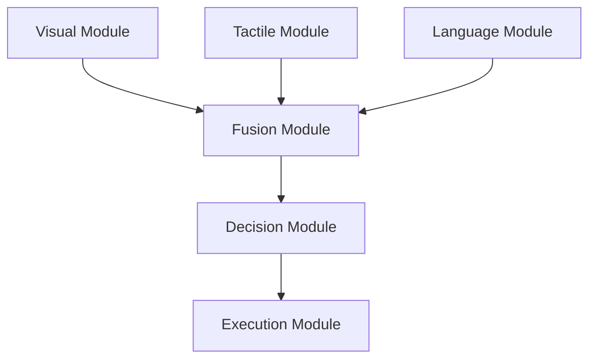
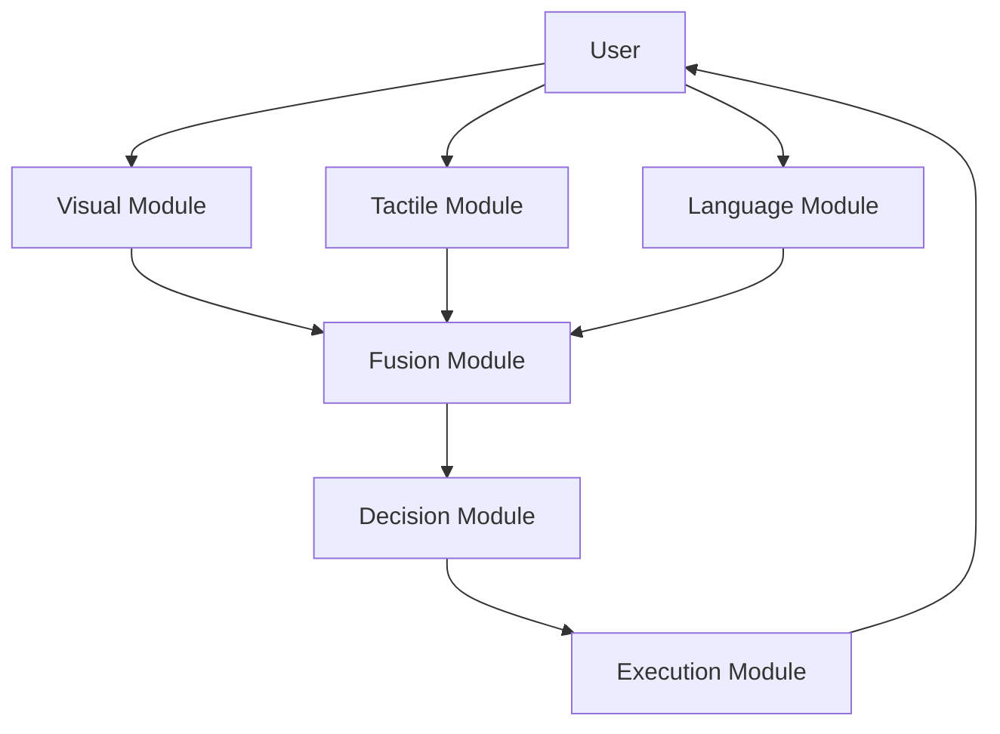

                 


# 开发具有视觉-触觉-语言多模态融合能力的AI Agent

---

## 关键词：多模态AI，视觉模态，触觉模态，语言模态，模态融合，AI Agent

---

## 摘要

本文详细探讨了开发具有视觉、触觉和语言多模态融合能力的AI Agent的关键技术。从背景概念到算法实现，从系统架构到实际案例，全面解析了多模态AI Agent的核心原理和实现方法。通过分析多模态数据融合的挑战与解决方案，结合数学模型和实际代码，深入讲解了如何构建一个高效、智能的AI Agent，为相关领域的研究和应用提供了理论与实践的双重指导。

---

# 第一部分：多模态AI Agent的背景与核心概念

---

## 第1章：多模态AI Agent的背景介绍

### 1.1 多模态AI Agent的基本概念

#### 1.1.1 多模态AI的定义

多模态AI（Multi-modal AI）是指能够处理和融合多种感官数据（如视觉、听觉、触觉、语言等）的智能系统。与单一模态AI（仅处理一种类型的数据）不同，多模态AI能够通过整合不同模态的信息，实现更全面的理解和更智能的决策。

#### 1.1.2 多模态AI Agent的核心要素

- **视觉模态**：处理图像、视频等视觉信息。
- **触觉模态**：感知物理世界中的触感、力度、材质等。
- **语言模态**：理解和生成自然语言。
- **融合模态**：将不同模态的数据进行对齐、融合，生成统一的语义表示。

#### 1.1.3 多模态AI Agent与单一模态AI的区别

| 特性 | 单一模态AI | 多模态AI |
|------|------------|----------|
| 数据来源 | 单一类型 | 多种类型 |
| 信息处理 | 单一维度 | 多维度融合 |
| 应用场景 | 简单交互 | 复杂交互 |
| 决策能力 | 有限 | 更强 |

### 1.2 多模态AI Agent的应用场景

#### 1.2.1 视觉-触觉-语言融合的实际需求

在现实场景中，单一模态的信息往往不足以支撑复杂的决策。例如，在智能机器人领域，仅依靠视觉信息无法完全理解物体的形状和材质，结合触觉信息可以提供更准确的物体识别。类似地，结合语言信息可以实现更自然的人机交互。

#### 1.2.2 多模态AI Agent在智能交互中的优势

- 提高信息处理的全面性。
- 增强系统的语境理解和推理能力。
- 实现更自然、更流畅的人机交互。

#### 1.2.3 多模态AI Agent的边界与外延

- 多模态AI Agent的核心是多模态数据的融合，但其边界可能延伸到与其他系统的接口设计和数据安全问题。

### 1.3 多模态AI Agent的核心问题

#### 1.3.1 多模态数据的融合挑战

- **数据异构性**：不同模态的数据格式和特征空间差异较大。
- **语义对齐**：如何将不同模态的数据对齐到相同的语义空间。
- **信息冗余与噪声**：如何有效提取有用信息并去除噪声。

#### 1.3.2 不同模态数据的语义对齐问题

语义对齐是多模态数据融合的关键步骤。例如，在视觉和语言模态中，如何将图像中的物体识别与语言描述中的物体名称对齐，需要通过特征匹配或注意力机制实现。

#### 1.3.3 多模态AI Agent的可解释性问题

多模态数据的融合可能导致决策过程的不透明性，如何提高系统的可解释性是当前研究的热点问题。

---

## 第2章：多模态AI Agent的核心概念原理

### 2.1 视觉、触觉和语言模态的原理

#### 2.1.1 视觉模态的处理流程

- **图像采集**：通过摄像头获取图像数据。
- **特征提取**：使用CNN等模型提取图像特征。
- **目标识别**：基于特征进行目标识别或语义分割。

#### 2.1.2 触觉模态的感知机制

- **传感器数据采集**：通过力反馈传感器获取触觉信息。
- **特征提取**：将触觉信号转换为可计算的特征（如力、压力分布）。
- **触觉理解**：通过机器学习模型学习触觉特征，实现物体识别或分类。

#### 2.1.3 语言模态的语义理解

- **自然语言处理**：使用NLP技术理解输入的文本。
- **语义表示**：将文本转换为向量表示，如BERT模型。
- **对话生成**：基于语义理解生成自然语言回复。

#### 2.1.4 模态的异构性与互补性

不同模态的数据在特征空间和语义表达上存在差异，但它们互补性强。例如，视觉信息可以提供物体的外观信息，语言信息可以提供物体的语义信息，触觉信息可以提供物体的物理属性信息。

### 2.2 多模态数据融合的原理

#### 2.2.1 模态对齐的定义与方法

**模态对齐**（Modality Alignment）是指将不同模态的数据映射到相同的语义空间，以便进行有效的融合。常用的方法包括：

- **特征对齐**：将不同模态的特征向量对齐到相同的空间。
- **注意力机制**：通过注意力权重来对齐不同模态的信息。
- **联合学习**：在同一个模型中同时学习多种模态的数据，实现自动对齐。

#### 2.2.2 多模态特征的表示方式

- **独立表示**：每种模态单独表示，不考虑其他模态。
- **联合表示**：将多种模态的信息融合到一个统一的表示中。
- **多模态注意力表示**：通过注意力机制关注不同模态的重要信息。

#### 2.2.3 多模态融合的层次结构

多模态融合可以分为以下几个层次：

1. **低级融合**：在特征层面进行融合，如将视觉和触觉的特征向量进行线性组合。
2. **中级融合**：在语义层面进行融合，如将视觉和语言的语义向量进行加权融合。
3. **高级融合**：在决策层面进行融合，如根据多模态信息进行最终的决策。

### 2.3 多模态AI Agent的实体关系图



图中展示了视觉、触觉和语言三种模态如何通过多模态融合模块（C）共同作用于AI Agent（E）。

### 2.4 本章小结

本章详细介绍了多模态AI Agent的核心概念，包括视觉、触觉和语言模态的处理原理，以及多模态数据融合的原理和方法。通过模态对齐和融合，AI Agent能够更全面地理解和处理环境中的信息。

---

# 第三部分：多模态AI Agent的算法原理

---

## 第3章：多模态数据融合的算法原理

### 3.1 多模态数据融合的方法

#### 3.1.1 基于特征对齐的融合方法

- **特征对齐**：通过将不同模态的特征映射到相同的语义空间，实现特征的融合。
- **融合方式**：可以采用加权融合、拼接融合或注意力机制融合。

#### 3.1.2 基于注意力机制的融合方法

注意力机制在多模态融合中起到了关键作用。通过注意力机制，模型可以自动关注到不同模态中的重要信息，从而提高融合效果。

#### 3.1.3 基于生成模型的融合方法

生成模型（如GAN、VAE）可以用于多模态数据的生成和融合，例如通过生成模型同时生成视觉和语言描述。

### 3.2 多模态注意力机制的算法流程



图中展示了多模态注意力机制的基本流程：输入两种模态的数据，经过特征提取后，通过注意力机制进行融合，生成最终的融合输出。

### 3.3 多模态融合的数学模型

#### 3.3.1 多模态注意力机制的公式推导

$$
\alpha_i = \text{softmax}(\frac{q_i^T k_i}{\|q_i\| \|k_i\|})
$$

其中，$\alpha_i$ 表示第i个模态的注意力权重，$q_i$ 是查询向量，$k_i$ 是键向量。

#### 3.3.2 多模态特征融合的数学表达

$$
f_{\text{fusion}}(x_1, x_2) = \sum_{i=1}^{n} \alpha_i x_i
$$

其中，$\alpha_i$ 是注意力权重，$x_i$ 是第i个模态的特征向量。

### 3.4 本章小结

本章详细讲解了多模态数据融合的算法原理，包括基于特征对齐、注意力机制和生成模型的融合方法，并通过数学公式和流程图展示了多模态注意力机制的基本原理。

---

## 第4章：多模态AI Agent的系统架构设计

### 4.1 问题场景介绍

本章将从实际应用场景出发，设计一个多模态AI Agent的系统架构。假设我们开发一个智能机器人，该机器人能够通过视觉识别物体、触觉感知物体属性，并通过语言与人类进行交互。

### 4.2 系统功能设计

#### 4.2.1 系统组成模块

- **视觉处理模块**：负责图像采集、特征提取和目标识别。
- **触觉处理模块**：负责触觉传感器数据采集、特征提取和触觉理解。
- **语言处理模块**：负责自然语言理解、对话生成和语言输出。
- **多模态融合模块**：负责不同模态数据的对齐和融合，生成统一的语义表示。
- **决策与执行模块**：根据融合后的语义信息，做出决策并执行动作。

### 4.3 系统架构设计



图中展示了AI Agent的系统架构：视觉、触觉和语言模块分别将数据传递给融合模块，融合模块生成语义表示，决策模块根据语义表示做出决策，并通过执行模块执行动作。

### 4.4 系统接口设计

- **输入接口**：摄像头、触觉传感器、麦克风。
- **输出接口**：显示器、扬声器、执行器。
- **内部接口**：各模块之间的数据交互接口。

### 4.5 系统交互流程图



图中展示了用户与AI Agent的交互流程：用户通过视觉、触觉和语言模块与AI Agent互动，AI Agent通过融合模块处理信息，并通过执行模块做出响应。

### 4.6 本章小结

本章通过实际案例，详细设计了多模态AI Agent的系统架构，包括各模块的功能设计、系统架构图和交互流程图，为后续的实现提供了清晰的指导。

---

## 第5章：多模态AI Agent的项目实战

### 5.1 环境安装与配置

#### 5.1.1 开发工具安装

- **Python**：推荐使用Python 3.8及以上版本。
- **深度学习框架**：如TensorFlow或PyTorch。
- **自然语言处理库**：如BERT、spaCy。
- **计算机视觉库**：如OpenCV、TensorFlow/Keras。
- **触觉传感器库**：根据具体传感器选择相应的库，如ROS（机器人操作系统）。

#### 5.1.2 数据集准备

- **视觉数据集**：如ImageNet、COCO。
- **语言数据集**：如文本语料库、对话数据集。
- **触觉数据集**：如力反馈传感器数据集。

### 5.2 核心代码实现

#### 5.2.1 视觉处理模块的实现

```python
import cv2
import numpy as np

def process_image(image_path):
    # 读取图像
    image = cv2.imread(image_path)
    # 转换为RGB格式
    image = cv2.cvtColor(image, cv2.COLOR_BGR2RGB)
    # 提取特征（示例：使用预训练模型）
    feature = model_extract_feature(image)
    return feature
```

#### 5.2.2 触觉处理模块的实现

```python
import numpy as np

def process_tactile(sensor_data):
    # 提取触觉特征
    feature = np.mean(sensor_data, axis=1)
    return feature
```

#### 5.2.3 语言处理模块的实现

```python
from transformers import BertTokenizer, BertModel

def process_language(text):
    # 分词
    tokenizer = BertTokenizer.from_pretrained('bert-base-uncased')
    inputs = tokenizer(text, return_tensors='np')
    # 提取语义向量
    model = BertModel.from_pretrained('bert-base-uncased')
    outputs = model(**inputs)
    feature = outputs.last_hidden_state[:, 0, :]
    return feature.numpy()
```

#### 5.2.4 多模态融合模块的实现

```python
def multi_modal_fusion(feature_vis, feature_tac, feature_lang):
    # 注意力机制融合
    attention_vis = np.exp(feature_vis) / (np.exp(feature_vis) + np.exp(feature_tac) + np.exp(feature_lang))
    attention_tac = np.exp(feature_tac) / (np.exp(feature_vis) + np.exp(feature_tac) + np.exp(feature_lang))
    attention_lang = np.exp(feature_lang) / (np.exp(feature_vis) + np.exp(feature_tac) + np.exp(feature_lang))
    
    fused_feature = attention_vis * feature_vis + attention_tac * feature_tac + attention_lang * feature_lang
    return fused_feature
```

#### 5.2.5 决策与执行模块的实现

```python
def decision_making(fused_feature):
    # 假设决策模块根据融合特征做出动作选择
    action = np.argmax(fused_feature)
    return action
```

### 5.3 代码应用解读与分析

- **视觉处理模块**：负责将图像数据转换为特征向量，可以使用预训练的CNN模型提取特征。
- **触觉处理模块**：将触觉传感器的数据转换为特征向量，例如计算压力的平均值。
- **语言处理模块**：使用BERT模型提取文本的语义向量。
- **多模态融合模块**：通过注意力机制将视觉、触觉和语言特征进行加权融合，生成最终的融合特征。
- **决策与执行模块**：根据融合特征做出决策，并通过执行模块执行动作。

### 5.4 实际案例分析

假设我们的AI Agent是一个智能机器人，用户通过触觉传感器与机器人交互，同时提供视觉和语言指令。机器人需要理解用户的意图，并根据多模态信息做出正确的动作。

### 5.5 项目小结

本章通过具体案例，详细讲解了多模态AI Agent的开发过程，包括环境配置、核心代码实现和系统模块的交互流程。通过实际编码实现，读者可以更好地理解多模态数据融合的实现方法。

---

## 第六部分：多模态AI Agent的最佳实践与注意事项

---

## 第6章：最佳实践与注意事项

### 6.1 最佳实践

#### 6.1.1 模态数据的预处理

- 对不同模态的数据进行标准化处理，确保数据格式统一。
- 处理图像数据时，注意图像分辨率和色彩空间的统一。
- 处理触觉数据时，确保传感器的校准和数据的准确性。

#### 6.1.2 模态融合的优化

- 使用注意力机制提高融合效果。
- 在模型训练中，采用多任务学习，同时优化多种模态的损失函数。
- 通过数据增强技术，增加数据的多样性和鲁棒性。

#### 6.1.3 系统的实时性与稳定性

- 优化代码性能，确保系统的实时性。
- 采用分布式架构，提高系统的扩展性和稳定性。
- 做好异常处理和错误恢复机制，确保系统的健壮性。

### 6.2 注意事项

#### 6.2.1 数据隐私与安全

- 处理用户数据时，确保数据的隐私和安全，遵守相关法律法规。
- 避免数据泄露，采用数据加密和匿名化处理。

#### 6.2.2 模型的可解释性

- 在设计模型时，尽量提高模型的可解释性，便于调试和优化。
- 使用可解释性模型（如线性模型）或提供可视化工具，帮助理解模型的决策过程。

#### 6.2.3 多模态数据的异构性

- 处理不同模态的数据时，注意它们的异构性，采用合适的对齐方法。
- 通过预处理和特征提取，降低数据异构性的影响。

### 6.3 本章小结

本章总结了开发多模态AI Agent的最佳实践和注意事项，包括数据预处理、模型优化、系统实时性与稳定性等方面的内容，为读者提供了宝贵的开发经验。

---

## 第七部分：总结与展望

---

## 第7章：总结与展望

### 7.1 总结

本文详细探讨了开发具有视觉-触觉-语言多模态融合能力的AI Agent的关键技术，从背景概念到算法实现，从系统架构到实际案例，全面解析了多模态AI Agent的核心原理和实现方法。通过分析多模态数据融合的挑战与解决方案，结合数学模型和实际代码，深入讲解了如何构建一个高效、智能的AI Agent，为相关领域的研究和应用提供了理论与实践的双重指导。

### 7.2 未来展望

随着人工智能技术的不断发展，多模态AI Agent将朝着以下几个方向发展：

1. **更强大的模态融合能力**：通过更先进的注意力机制和生成模型，进一步提高多模态数据的融合效果。
2. **更高的系统实时性**：通过优化算法和硬件加速，提高系统的实时性和响应速度。
3. **更广泛的应用场景**：多模态AI Agent将应用于更多领域，如医疗、教育、娱乐等，为人类提供更智能化的服务。
4. **更强的可解释性**：通过设计更透明的模型和提供可视化工具，提高系统的可解释性，增强用户的信任感。

---

## 结语

开发具有视觉-触觉-语言多模态融合能力的AI Agent是一项具有挑战性但又充满机遇的 task。通过不断的研究和实践，我们可以构建出更智能、更全面的AI系统，为人类社会的发展带来更多的便利和可能性。

