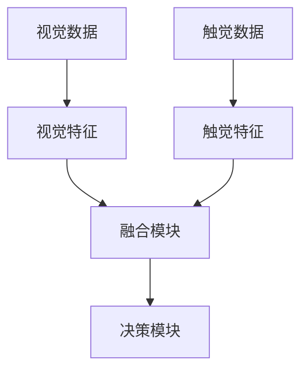
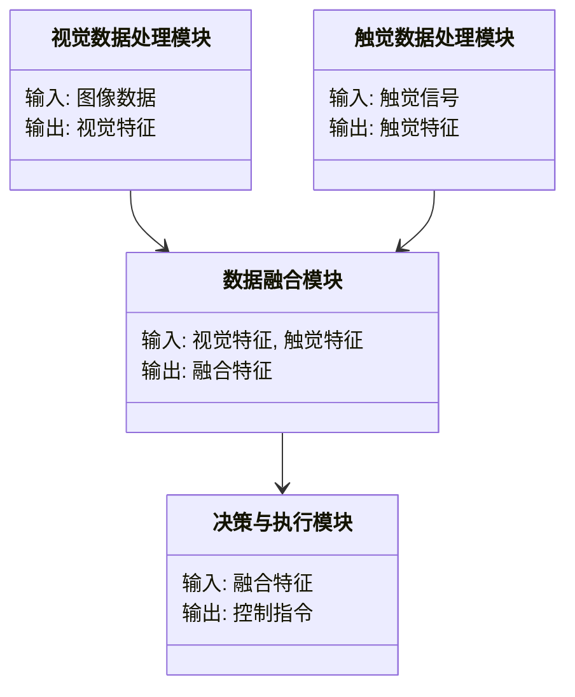
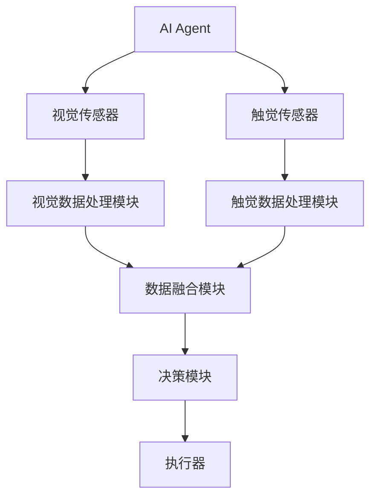

                 


# 开发具有视觉-触觉融合能力的AI Agent

## 关键词：AI Agent, 视觉-触觉融合, 多模态感知, 深度学习, 机器人控制

## 摘要：本文系统地探讨了开发具有视觉-触觉融合能力的AI Agent的技术要点，从背景分析、核心概念、算法原理到系统架构设计，结合实际项目案例，全面解析了如何实现多模态数据的高效融合与智能决策。

---

## 第一部分: 背景介绍

### 第1章: 视觉-触觉融合AI Agent的背景与概念

#### 1.1 问题背景
- **当前AI Agent的发展现状**: 当前AI Agent主要依赖单一模态的数据进行感知和决策，如视觉或触觉，难以应对复杂环境中的多模态信息处理。
- **视觉与触觉感知的局限性**: 单一模态感知存在信息不完整的问题，例如仅依赖视觉难以处理表面触感信息，仅依赖触觉难以定位物体。
- **融合视觉与触觉的必要性**: 融合视觉和触觉数据可以提高AI Agent对环境的理解能力，使其能够更准确地进行决策和执行操作。

#### 1.2 问题描述
- **视觉与触觉数据的异同点**: 视觉数据是高维的图像数据，触觉数据是低维的力/位移信号；视觉数据处理需要大量计算资源，触觉数据处理对实时性要求高。
- **视觉-触觉融合的目标**: 实现多模态数据的高效融合，提升AI Agent的环境感知和决策能力。
- **当前技术的痛点与挑战**: 数据异构性、实时性要求高、融合方法的有效性等问题。

#### 1.3 问题解决思路
- **融合视觉与触觉数据的方法**: 基于深度学习的多模态融合、基于物理模型的融合等。
- **多模态数据处理的技术路线**: 数据采集、预处理、特征提取、融合、决策与执行。
- **基于深度学习的融合策略**: 使用卷积神经网络（CNN）处理视觉数据，触觉神经网络（TNN）处理触觉数据，然后通过融合模块（如加权融合、注意力机制）进行数据融合。

#### 1.4 边界与外延
- **视觉-触觉融合的边界条件**: 数据采集的实时性、传感器的精度、计算资源的限制等。
- **相关技术的外延与区别**: 与单一模态感知、传统机器人控制的区别。
- **应用场景的限制与扩展**: 在工业机器人、智能家居、医疗机器人等领域的应用。

#### 1.5 概念结构与核心要素
- **视觉数据处理模块**: 负责处理图像数据，提取视觉特征。
- **触觉数据处理模块**: 负责处理触觉信号，提取触觉特征。
- **数据融合模块**: 负责将视觉和触觉特征进行融合，生成综合特征。
- **决策与执行模块**: 基于融合后的特征，生成决策并执行操作。

---

## 第二部分: 核心概念与联系

### 第2章: 视觉与触觉数据处理原理

#### 2.1 视觉数据处理
- **图像采集与预处理**: 使用摄像头采集图像，进行降噪、增强等预处理。
- **基于CNN的图像特征提取**: 使用卷积神经网络提取图像的高层次特征，如使用ResNet、VGG等网络结构。
- **多目标检测与跟踪**: 使用目标检测算法（如YOLO、Faster R-CNN）检测物体，并使用目标跟踪算法（如SORT、FairMOT）进行实时跟踪。

#### 2.2 触觉数据处理
- **触觉传感器类型与信号采集**: 常见的触觉传感器包括力传感器、位移传感器等，采集触觉信号。
- **基于TNN的触觉特征提取**: 使用触觉神经网络（TNN）提取触觉信号的特征，如时间序列分析、频域分析等。
- **力反馈与触觉信号分析**: 分析触觉信号中的力反馈信息，用于控制机器人执行器。

---

### 第3章: 视觉与触觉数据融合方法

#### 3.1 数据融合

**融合方法对比表格**:

| 融合方法       | 优缺点 | 适用场景 |
|----------------|--------|----------|
| 早期融合       | 融合早，信息互补性好 | 适用于需要实时性强的场景 |
| 晚期融合       | 精度高，但可能牺牲实时性 | 适用于对精度要求高的场景 |
| 混合融合       | 结合早期和晚期融合优点 | 适用于复杂场景 |

**实体关系图**:



---

## 第三部分: 算法原理

### 第4章: 视觉与触觉融合算法原理

#### 4.1 视觉数据处理算法
- **卷积神经网络(CNN)**: 用于图像特征提取，公式如下：
  $$ f(x) = \sigma(W \cdot x + b) $$
  其中，$W$ 是卷积核，$x$ 是输入，$b$ 是偏置，$\sigma$ 是激活函数。

#### 4.2 触觉数据处理算法
- **触觉神经网络(TNN)**: 用于触觉信号处理，公式如下：
  $$ g(x) = \text{LSTM}(W \cdot x + b) $$
  其中，$\text{LSTM}$ 是长短期记忆网络。

#### 4.3 融合策略
- **加权融合**: 根据视觉和触觉特征的重要性进行加权，公式如下：
  $$ y = \alpha \cdot v + (1-\alpha) \cdot t $$
  其中，$v$ 是视觉特征，$t$ 是触觉特征，$\alpha$ 是权重系数。
- **注意力机制**: 使用自注意力机制对视觉和触觉特征进行加权，公式如下：
  $$ \alpha_i = \frac{\exp(a_i)}{\sum_j \exp(a_j)} $$
  其中，$a_i$ 是注意力得分。

---

## 第四部分: 系统分析与架构设计

### 第5章: 视觉-触觉融合系统分析

#### 5.1 系统架构设计
- **领域模型**:


- **系统架构设计**:


---

## 第五部分: 项目实战

### 第6章: 视觉-触觉融合项目实战

#### 6.1 环境安装
- 安装Python、深度学习框架（如TensorFlow、PyTorch）以及相关库。

#### 6.2 核心代码实现
- **数据预处理代码**:
  ```python
  import cv2
  def preprocess_image(image):
      # 图像降噪
      denoised = cv2.fastNlMeansFilter(image, h=10, templateSize=5)
      return denoised
  ```

- **模型训练代码**:
  ```python
  import tensorflow as tf
  def build_cnn_model():
      model = tf.keras.Sequential([
          tf.keras.layers.Conv2D(32, (3,3), activation='relu'),
          tf.keras.layers.MaxPooling2D((2,2)),
          tf.keras.layers.Conv2D(64, (3,3), activation='relu'),
          tf.keras.layers.MaxPooling2D((2,2)),
          tf.keras.layers.Flatten(),
          tf.keras.layers.Dense(64, activation='relu'),
          tf.keras.layers.Dense(10, activation='softmax')
      ])
      return model
  ```

---

### 总结

本文详细介绍了开发具有视觉-触觉融合能力的AI Agent的技术要点，从背景分析到系统设计，结合实际项目案例，全面解析了多模态数据的高效融合与智能决策。通过本文的学习，读者可以掌握视觉与触觉数据处理的核心算法，理解系统架构设计的关键点，并能够实际动手实现一个简单的视觉-触觉融合项目。

--- 

以上是文章的完整大纲和部分内容，希望对您有所帮助！

