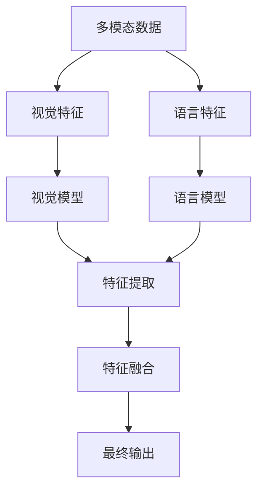
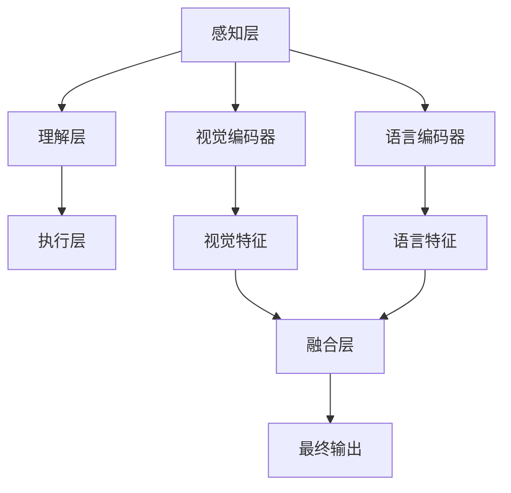

                 


# 开发具有视觉-语言多模态理解能力的AI Agent

## 关键词：多模态AI，AI Agent，视觉语言理解，深度学习，多模态融合

## 摘要：  
本文将深入探讨如何开发具有视觉-语言多模态理解能力的AI Agent。从基础概念到复杂算法，从系统设计到项目实战，我们将逐步解析这一技术的核心原理和实现方法。通过详细分析视觉和语言模态的理解机制，结合多模态融合的技术，我们展示如何构建一个能够处理复杂场景的AI Agent系统。本文将涵盖从理论到实践的完整开发流程，为读者提供系统的指导和深度的技术见解。

---

# 第1章: 背景与概念

## 1.1 问题背景

### 1.1.1 多模态AI的发展趋势  
随着人工智能技术的快速发展，单一模态的AI系统逐渐暴露出其局限性。在现实场景中，信息往往以多种形式存在，例如图像、文本、语音等。单一模态的处理能力无法满足复杂场景的需求，因此，多模态AI成为研究的热点。视觉-语言多模态理解是其中的重要方向，能够帮助AI Agent更好地理解和处理现实世界中的信息。

### 1.1.2 当前AI Agent的局限性  
传统的AI Agent通常依赖于单一模态的数据进行处理，例如文本或图像。这种单一模态的处理方式在某些场景下表现良好，但在复杂场景中往往力不从心。例如，在客服机器人中，单纯依赖文本交互无法有效理解用户的情绪和意图，而结合视觉信息（如用户面部表情）可以显著提升交互体验。

### 1.1.3 视觉-语言多模态理解的必要性  
视觉-语言多模态理解能够将图像和文本信息结合起来，帮助AI Agent更全面地理解用户的需求和意图。例如，在电子商务场景中，结合商品图像和用户评论，AI Agent可以更准确地推荐商品或解决问题。这种多模态的理解能力是实现更智能、更自然人机交互的关键。

## 1.2 问题描述

### 1.2.1 多模态数据的复杂性  
多模态数据通常包含不同类型的信息，例如图像、文本、语音等。这些信息不仅在形式上差异较大，而且在语义上也有复杂的关联。如何有效地整合和理解这些信息是多模态AI的核心挑战。

### 1.2.2 AI Agent需要处理的多任务挑战  
AI Agent在处理多模态任务时，需要同时完成多种任务，例如图像识别、文本理解、意图识别等。这些任务之间往往存在复杂的依赖关系，需要通过高效的算法和系统架构来实现。

### 1.2.3 视觉与语言理解的协同需求  
视觉和语言信息在语义上有很强的关联性。例如，图像中的物体可以被描述为文本，而文本中的描述也可以对应图像中的物体。这种协同关系使得视觉-语言多模态理解成为可能，并能够显著提升AI Agent的智能水平。

## 1.3 问题解决

### 1.3.1 多模态模型的基本思路  
多模态模型的核心思想是将不同模态的信息进行编码，并通过某种方式将这些编码融合起来，以实现对多模态数据的共同理解。例如，可以通过将图像特征和文本特征分别编码为向量，然后通过融合层将这些向量结合起来。

### 1.3.2 AI Agent的架构设计  
AI Agent的架构通常包括感知层、理解层和执行层。感知层负责从多模态数据中提取特征，理解层负责对这些特征进行语义理解和关联，执行层则根据理解和需求执行相应的操作。

### 1.3.3 视觉-语言协同的理解机制  
视觉-语言协同理解的核心是通过某种机制，将视觉信息和语言信息进行关联和融合。例如，可以通过注意力机制来捕捉图像和文本之间的关联关系，并通过融合层来生成最终的语义表示。

## 1.4 边界与外延

### 1.4.1 多模态AI的边界  
多模态AI的核心目标是理解多种模态的信息，但并不意味着必须同时处理所有类型的模态数据。在实际应用中，通常会根据具体需求选择性地处理特定模态的数据。

### 1.4.2 AI Agent的适用场景  
AI Agent适用于需要多模态信息处理的场景，例如智能客服、智能家居、自动驾驶等。在这些场景中，AI Agent需要同时处理多种类型的信息，以提供更智能、更个性化的服务。

### 1.4.3 视觉-语言理解的局限性  
尽管视觉-语言多模态理解在许多场景中表现出色，但仍然存在一些局限性。例如，对于复杂的视觉场景，模型可能难以准确理解图像中的所有细节；对于模糊的文本描述，模型可能无法准确捕捉语义信息。

## 1.5 概念结构与核心要素

### 1.5.1 多模态数据的构成  
多模态数据通常包括图像、文本、语音等多种形式的数据。这些数据在形式和语义上存在差异，但可以通过编码和融合的方式进行统一处理。

### 1.5.2 AI Agent的核心功能  
AI Agent的核心功能包括感知、理解和执行。感知层负责从多模态数据中提取特征，理解层负责对这些特征进行语义理解，执行层则根据理解和需求执行相应的操作。

### 1.5.3 视觉-语言理解模型的构成  
视觉-语言理解模型通常包括视觉编码器、语言编码器和融合层。视觉编码器负责将图像转换为视觉特征，语言编码器负责将文本转换为语言特征，融合层则将这些特征结合起来，生成最终的语义表示。

---

# 第2章: 多模态AI的核心概念与联系

## 2.1 多模态AI的基本原理

### 2.1.1 多模态数据的表示方法  
多模态数据可以通过多种方式表示，例如图像可以通过卷积神经网络（CNN）提取特征向量，文本可以通过词嵌入（如Word2Vec）表示为向量。

### 2.1.2 多模态模型的特征提取  
特征提取是多模态AI的关键步骤。视觉特征通常通过CNN提取，语言特征可以通过词嵌入或Transformer模型提取。

### 2.1.3 多模态信息的融合机制  
融合机制是多模态AI的核心，通常包括逐点加法、注意力机制和门控机制等方法。这些方法可以有效地将不同模态的特征结合起来，生成更丰富的语义表示。

## 2.2 视觉与语言的理解机制

### 2.2.1 视觉特征的提取与编码  
视觉特征提取通常通过CNN完成，例如使用ResNet提取图像的深层特征。这些特征可以表示图像中的物体、场景等信息。

### 2.2.2 语言特征的提取与编码  
语言特征提取可以通过词嵌入（如Word2Vec）或Transformer模型（如BERT）完成。这些模型能够捕捉文本中的语义信息，并生成语言特征向量。

### 2.2.3 视觉与语言特征的关联  
视觉和语言特征的关联可以通过注意力机制实现。例如，可以计算图像特征和文本特征之间的相似性，然后通过注意力机制生成关联权重。

## 2.3 多模态AI的核心要素对比

### 2.3.1 多模态数据的特征对比  
| 特征 | 图像 | 文本 |
|------|------|------|
| 信息类型 | 视觉信息 | 语义信息 |
| 表示方式 | 特征向量 | 词向量或序列 |
| 语义关联 | 通过视觉特征关联 | 通过语义关联关联 |

### 2.3.2 多模态模型的性能对比  
| 模型 | 参数量 | 计算复杂度 | 适用场景 |
|------|--------|------------|----------|
| 单模态模型 | 少 | 低 | 简单场景 |
| 多模态模型 | 多 | 高 | 复杂场景 |

### 2.3.3 不同模态信息的权重分配  
模态信息的权重分配可以通过注意力机制实现。例如，可以根据任务需求动态调整视觉和语言特征的权重。

## 2.4 ER实体关系图



---

# 第3章: 多模态AI的算法原理

## 3.1 多模态编码器

### 3.1.1 多模态编码器的结构  
多模态编码器通常包括视觉编码器和语言编码器。视觉编码器负责将图像转换为视觉特征，语言编码器负责将文本转换为语言特征。

### 3.1.2 多模态编码器的实现  
以视觉编码器为例，可以使用ResNet提取图像的深层特征，然后通过全连接层将特征向量投影到一个共享的特征空间。

### 3.1.3 代码示例  
```python
import torch
import torch.nn as nn

# 视觉编码器
class VisualEncoder(nn.Module):
    def __init__(self, input_dim, output_dim):
        super(VisualEncoder, self).__init__()
        self.fc = nn.Linear(input_dim, output_dim)

    def forward(self, x):
        return self.fc(x)

# 语言编码器
class TextEncoder(nn.Module):
    def __init__(self, vocab_size, embedding_dim, output_dim):
        super(TextEncoder, self).__init__()
        self.embedding = nn.Embedding(vocab_size, embedding_dim)
        self.fc = nn.Linear(embedding_dim, output_dim)

    def forward(self, x):
        embed = self.embedding(x)
        return self.fc(embed)
```

### 3.1.4 数学模型  
视觉编码器的数学模型可以表示为：
$$
f_v(x_v) = W_v x_v + b_v
$$
其中，$x_v$ 是输入的视觉数据，$W_v$ 和 $b_v$ 是视觉编码器的参数。

语言编码器的数学模型可以表示为：
$$
f_l(x_l) = W_l x_l + b_l
$$
其中，$x_l$ 是输入的语言数据，$W_l$ 和 $b_l$ 是语言编码器的参数。

### 3.1.5 代码应用解读  
上述代码定义了视觉编码器和语言编码器的结构，并通过全连接层将输入数据映射到共享的特征空间。

## 3.2 注意力机制

### 3.2.1 注意力机制的原理  
注意力机制是一种有效的特征融合方法，可以用于捕捉图像和文本之间的关联关系。

### 3.2.2 注意力机制的实现  
注意力机制可以通过计算图像特征和文本特征之间的相似性来生成关联权重。

### 3.2.3 代码示例  
```python
import torch
import torch.nn as nn

# 注意力机制
class Attention(nn.Module):
    def __init__(self, input_dim):
        super(Attention, self).__init__()
        self.weight = nn.Parameter(torch.randn(input_dim, input_dim))

    def forward(self, x):
        attention = torch.mm(x, self.weight)
        attention = torch.softmax(attention, dim=-1)
        return attention
```

### 3.2.4 数学模型  
注意力机制的数学模型可以表示为：
$$
\text{attention}(x) = \text{softmax}(x W)
$$
其中，$W$ 是注意力权重矩阵。

### 3.2.5 代码应用解读  
上述代码定义了一个简单的注意力机制，通过矩阵乘法计算注意力权重，并通过Softmax函数生成关联权重。

## 3.3 损失函数与优化

### 3.3.1 损失函数的选择  
多模态AI的损失函数通常包括交叉熵损失、均方误差损失等。

### 3.3.2 优化算法的选择  
常用的优化算法包括随机梯度下降（SGD）、Adam优化器等。

### 3.3.3 代码示例  
```python
# 损失函数
criterion = nn.CrossEntropyLoss()

# 优化器
optimizer = torch.optim.Adam(model.parameters(), lr=0.001)

# 训练循环
for epoch in range(num_epochs):
    model.train()
    for batch_x, batch_y in train_loader:
        outputs = model(batch_x)
        loss = criterion(outputs, batch_y)
        loss.backward()
        optimizer.step()
        optimizer.zero_grad()
```

### 3.3.4 数学模型  
损失函数的数学模型可以表示为：
$$
L = -\sum_{i=1}^{n} y_i \log(p_i) + (1 - y_i) \log(1 - p_i)
$$
其中，$y_i$ 是真实标签，$p_i$ 是预测概率。

### 3.3.5 代码应用解读  
上述代码定义了损失函数和优化器，并展示了训练循环的基本结构。

---

# 第4章: 系统分析与架构设计

## 4.1 系统架构设计

### 4.1.1 系统功能设计  
AI Agent系统需要具备感知、理解和执行三大功能。感知层负责从多模态数据中提取特征，理解层负责对这些特征进行语义理解，执行层负责根据理解和需求执行相应的操作。

### 4.1.2 系统架构图  


### 4.1.3 系统接口设计  
系统接口通常包括输入接口和输出接口。输入接口负责接收多模态数据，输出接口负责输出理解和结果。

### 4.1.4 系统交互流程  
系统交互流程通常包括数据输入、特征提取、语义理解和结果输出四个步骤。

## 4.2 系统实现

### 4.2.1 环境安装  
需要安装PyTorch、TensorFlow、OpenCV等库。

### 4.2.2 系统核心实现  
AI Agent的核心实现包括感知层、理解层和执行层的实现。

### 4.2.3 代码示例  
```python
import torch
import torch.nn as nn

# 感知层
class PerceptionLayer(nn.Module):
    def __init__(self, input_dim, output_dim):
        super(PerceptionLayer, self).__init__()
        self.fc = nn.Linear(input_dim, output_dim)

    def forward(self, x):
        return self.fc(x)

# 理解层
class UnderstandingLayer(nn.Module):
    def __init__(self, input_dim, output_dim):
        super(UnderstandingLayer, self).__init__()
        self.fc = nn.Linear(input_dim, output_dim)

    def forward(self, x):
        return self.fc(x)

# 执行层
class ExecutionLayer(nn.Module):
    def __init__(self, input_dim, output_dim):
        super(ExecutionLayer, self).__init__()
        self.fc = nn.Linear(input_dim, output_dim)

    def forward(self, x):
        return self.fc(x)
```

### 4.2.4 交互流程  
数据输入 → 特征提取 → 语义理解 → 结果输出。

---

# 第5章: 项目实战

## 5.1 项目介绍

### 5.1.1 项目目标  
开发一个多模态问答系统，能够结合图像和文本信息，提供更智能的问答服务。

### 5.1.2 项目需求  
系统需要具备图像识别和文本理解能力，能够根据用户的问题和提供的图像信息，生成准确的回答。

## 5.2 项目实现

### 5.2.1 环境安装  
需要安装PyTorch、TensorFlow、OpenCV等库。

### 5.2.2 核心实现  
```python
import torch
import torch.nn as nn

# 图像编码器
class ImageEncoder(nn.Module):
    def __init__(self, input_dim, output_dim):
        super(ImageEncoder, self).__init__()
        self.fc = nn.Linear(input_dim, output_dim)

    def forward(self, x):
        return self.fc(x)

# 文本编码器
class TextEncoder(nn.Module):
    def __init__(self, vocab_size, embedding_dim, output_dim):
        super(TextEncoder, self).__init__()
        self.embedding = nn.Embedding(v

