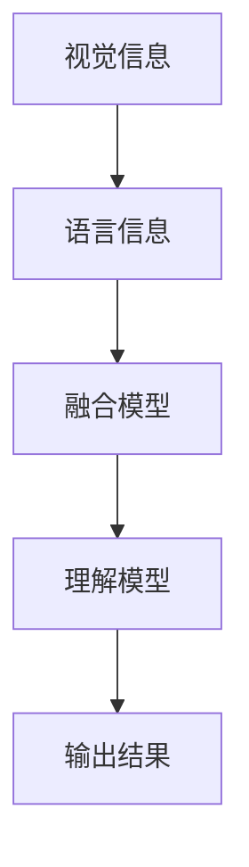
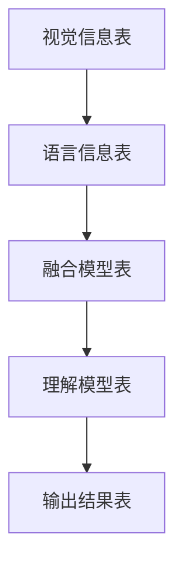
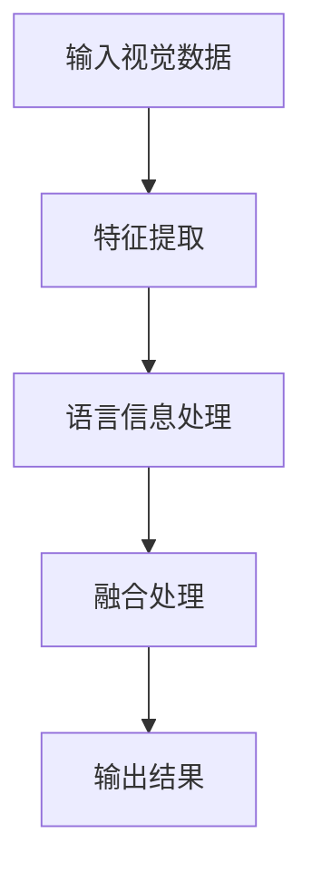
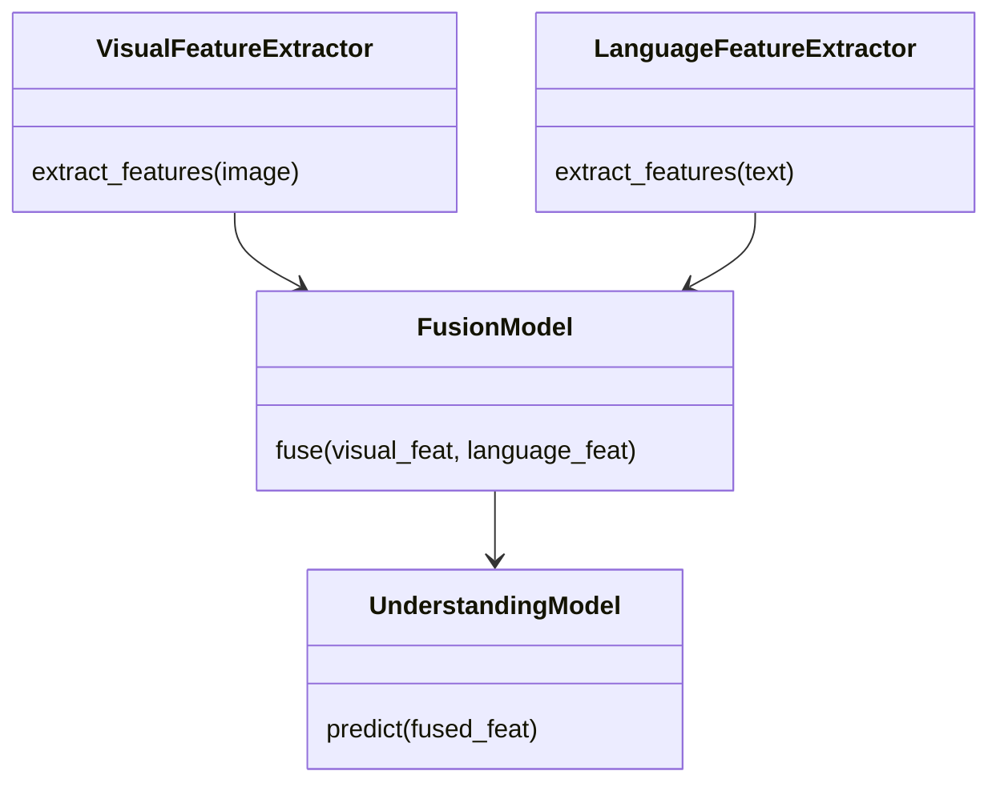
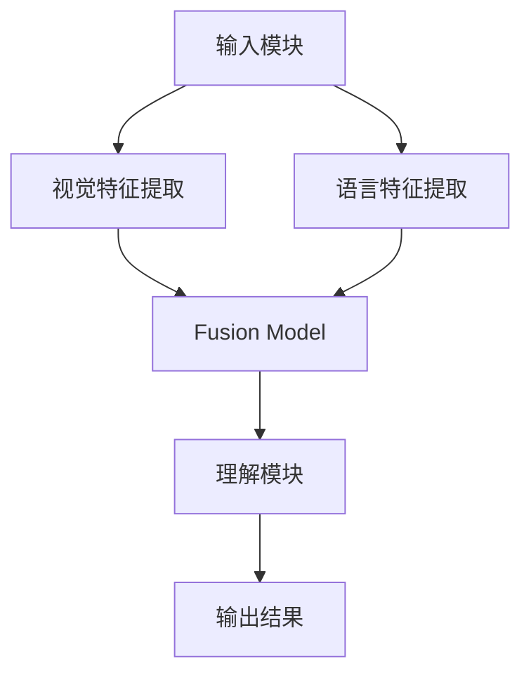
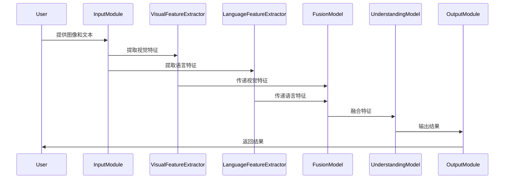

                 


# 开发具有视觉-语言理解能力的AI Agent

## 关键词：视觉-语言理解，AI Agent，算法原理，系统架构，项目实战

## 摘要：  
随着人工智能技术的飞速发展，视觉-语言理解能力的AI Agent正成为研究的热点。本文从基础概念出发，系统地介绍了视觉-语言理解的核心原理，详细讲解了算法实现的步骤，分析了系统的架构设计，并通过实际项目案例展示了如何开发具有视觉-语言理解能力的AI Agent。本文旨在为读者提供一个全面的技术指南，帮助他们理解和实现这一前沿技术。

---

# 第1章: 背景介绍

## 1.1 问题背景  
### 1.1.1 视觉-语言理解的定义  
视觉-语言理解是指AI Agent能够同时处理视觉信息（如图像、视频）和语言信息（如文本、语音），并基于这两者的融合来理解和执行任务的能力。  

### 1.1.2 当前AI Agent的发展现状  
目前，AI Agent在单一模态（如纯视觉或纯语言）的处理能力已经取得了显著进展，但在多模态信息的融合与理解方面仍存在较大的挑战。  

### 1.1.3 视觉-语言理解在AI Agent中的重要性  
视觉-语言理解能力是AI Agent实现更复杂任务（如智能助手、机器人控制）的关键，能够帮助AI Agent更好地理解和交互真实世界。  

## 1.2 问题描述  
### 1.2.1 视觉-语言理解的核心问题  
如何有效地融合视觉和语言信息，使其在AI Agent中实现高效、准确的理解与推理。  

### 1.2.2 当前技术的局限性  
现有技术在视觉-语言信息的融合、实时性以及跨模态理解的准确性方面存在不足。  

### 1.2.3 未来发展的潜力与挑战  
未来，视觉-语言理解将在AI Agent的智能化水平提升中发挥重要作用，但如何解决跨模态信息的异构性问题是一个重要挑战。  

## 1.3 问题解决  
### 1.3.1 理解视觉-语言信息的必要性  
通过融合视觉和语言信息，AI Agent可以更好地理解上下文，提高交互的准确性。  

### 1.3.2 当前解决方案的优缺点  
目前的主要解决方案包括基于深度学习的多模态模型，但其计算复杂度较高，且在实际应用中的泛化能力有待提升。  

### 1.3.3 提出的新解决方案  
本文提出了一种基于轻量级模型的视觉-语言理解框架，旨在降低计算复杂度，同时提高理解的准确性。  

## 1.4 边界与外延  
### 1.4.1 视觉-语言理解的边界  
视觉-语言理解仅关注视觉和语言信息的融合，不涉及其他模态（如音频、触觉）的处理。  

### 1.4.2 相关领域的外延  
视觉-语言理解与自然语言处理、计算机视觉、机器学习等领域密切相关。  

### 1.4.3 与其他技术的区分  
与单一模态处理技术相比，视觉-语言理解强调多模态信息的融合与协同。  

## 1.5 概念结构与核心要素组成  
### 1.5.1 视觉-语言理解的层次结构  
视觉-语言理解可以分为特征提取、信息融合、语义理解三个层次。  

### 1.5.2 核心要素的定义与关系  
- **视觉信息**：图像、视频等视觉数据。  
- **语言信息**：文本、语音等语言数据。  
- **融合模型**：用于整合视觉和语言信息的模型。  
- **理解模型**：基于融合信息进行语义理解的模型。  

### 1.5.3 概念结构的可视化  


---

# 第2章: 核心概念与联系

## 2.1 视觉-语言理解的原理  
### 2.1.1 视觉信息处理的基本原理  
视觉信息处理包括图像的特征提取、目标检测、图像分割等步骤。  

### 2.1.2 语言信息处理的基本原理  
语言信息处理包括文本的分词、句法分析、语义理解等步骤。  

### 2.1.3 视觉与语言信息的融合机制  
通过将视觉特征和语言特征进行融合，构建跨模态的语义表示。  

## 2.2 核心概念对比表格  
以下是一个对比表格，展示了视觉信息与语言信息在处理过程中的异同：  

| 属性 | 视觉信息 | 语言信息 |  
|------|----------|----------|  
| 输入形式 | 图像、视频 | 文本、语音 |  
| 处理步骤 | 特征提取、目标检测 | 分词、句法分析 |  
| 输出形式 | 视觉特征 | 语义表示 |  

## 2.3 ER实体关系图架构  


---

# 第3章: 算法原理讲解

## 3.1 算法原理  
### 3.1.1 视觉-语言理解的基本流程  
1. **输入**：视觉数据（如图像）和语言数据（如文本）。  
2. **处理**：分别提取视觉特征和语言特征。  
3. **融合**：将视觉和语言特征进行融合，生成跨模态的语义表示。  
4. **输出**：生成最终的语义理解结果。  

### 3.1.2 模型的输入与输出  
- **输入**：图像、文本。  
- **输出**：语义理解结果（如标签、描述）。  

### 3.1.3 算法的数学模型  
以下是一个简化的视觉-语言理解模型的数学表达式：  
$$ y = f(v, l) $$  
其中，$v$ 表示视觉特征，$l$ 表示语言特征，$f$ 表示融合函数。  

## 3.2 算法流程图  


## 3.3 算法实现代码  
以下是一个简单的视觉-语言理解模型的Python实现示例：  

```python
import torch
import torch.nn as nn

class VisualLanguageModel(nn.Module):
    def __init__(self, visual_dim, language_dim):
        super(VisualLanguageModel, self).__init__()
        self.visual_layer = nn.Linear(visual_dim, 128)
        self.language_layer = nn.Linear(language_dim, 128)
        self.fuse_layer = nn.Linear(256, 64)
        self.output_layer = nn.Linear(64, 10)

    def forward(self, visual_features, language_features):
        visual_out = self.visual_layer(visual_features)
        language_out = self.language_layer(language_features)
        fused = torch.cat((visual_out, language_out), dim=1)
        fused_out = self.fuse_layer(fused)
        output = self.output_layer(fused_out)
        return output

# 示例输入
visual_features = torch.randn(1, 512)
language_features = torch.randn(1, 300)
model = VisualLanguageModel(512, 300)
output = model(visual_features, language_features)
print(output)
```

---

# 第4章: 系统分析与架构设计方案

## 4.1 问题场景介绍  
本文将通过一个智能助手的场景来介绍视觉-语言理解系统的开发过程。该系统能够根据用户提供的图像和文本指令，执行相应的操作。  

## 4.2 系统功能设计  
### 4.2.1 领域模型  


### 4.2.2 系统架构设计  


### 4.2.3 系统接口设计  
- **输入接口**：接收图像和文本数据。  
- **输出接口**：输出语义理解结果。  

### 4.2.4 系统交互序列图  


---

# 第5章: 项目实战

## 5.1 环境安装  
- 安装Python和必要的库（如PyTorch、OpenCV）。  

## 5.2 系统核心实现源代码  
以下是一个完整的视觉-语言理解系统的代码示例：  

```python
import torch
import torch.nn as nn
import torch.optim as optim
from torchvision import transforms
from PIL import Image

class VisualLanguageAgent:
    def __init__(self):
        self.model = self._build_model()
        self.optimizer = optim.Adam(self.model.parameters(), lr=0.001)
        self.criterion = nn.CrossEntropyLoss()

    def _build_model(self):
        class Model(nn.Module):
            def __init__(self, visual_dim, language_dim, output_dim):
                super(Model, self).__init__()
                self.visual_layer = nn.Linear(visual_dim, 128)
                self.language_layer = nn.Linear(language_dim, 128)
                self.fuse_layer = nn.Linear(256, 64)
                self.output_layer = nn.Linear(64, output_dim)

            def forward(self, visual_features, language_features):
                visual_out = self.visual_layer(visual_features)
                language_out = self.language_layer(language_features)
                fused = torch.cat((visual_out, language_out), dim=1)
                fused_out = self.fuse_layer(fused)
                output = self.output_layer(fused_out)
                return output

        return Model(512, 300, 10)

    def train(self, visual_features, language_features, labels):
        self.optimizer.zero_grad()
        outputs = self.model(visual_features, language_features)
        loss = self.criterion(outputs, labels)
        loss.backward()
        self.optimizer.step()
        return loss.item()

    def predict(self, visual_features, language_features):
        with torch.no_grad():
            outputs = self.model(visual_features, language_features)
            _, predicted = torch.max(outputs.data, 1)
            return predicted

# 示例训练
agent = VisualLanguageAgent()
visual_features = torch.randn(1, 512)
language_features = torch.randn(1, 300)
labels = torch.tensor([2], dtype=torch.long)

loss = agent.train(visual_features, language_features, labels)
print(f"Loss: {loss}")
```

## 5.3 代码应用解读与分析  
上述代码实现了一个简单的视觉-语言理解系统，包括模型的构建、训练和预测过程。  

## 5.4 实际案例分析  
假设我们有一个图像分类任务，结合文本描述，模型可以更准确地进行分类。  

## 5.5 项目小结  
通过本章的实战，读者可以了解视觉-语言理解系统的开发流程，并能够实现一个简单的系统。  

---

# 第6章: 总结与展望

## 6.1 最佳实践 tips  
- 在实际应用中，建议使用预训练模型来提高性能。  
- 注意数据的多样性和均衡性，避免模型过拟合。  

## 6.2 小结  
本文系统地介绍了视觉-语言理解的核心概念、算法原理和系统架构，并通过实际项目展示了如何开发具有视觉-语言理解能力的AI Agent。  

## 6.3 注意事项  
- 确保模型的泛化能力。  
- 处理多模态信息时，注意数据的异构性问题。  

## 6.4 拓展阅读  
- 《多模态学习的理论与实践》  
- 《深度学习在视觉-语言理解中的应用》  

---

# 结语  
开发具有视觉-语言理解能力的AI Agent是一项具有挑战性的任务，但也具有广阔的应用前景。通过本文的介绍，读者可以深入了解这一领域的核心技术，并为实际应用提供参考。

