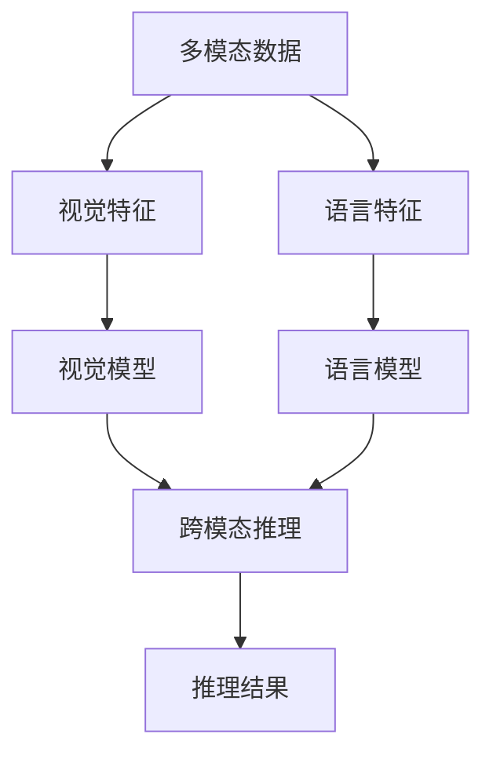
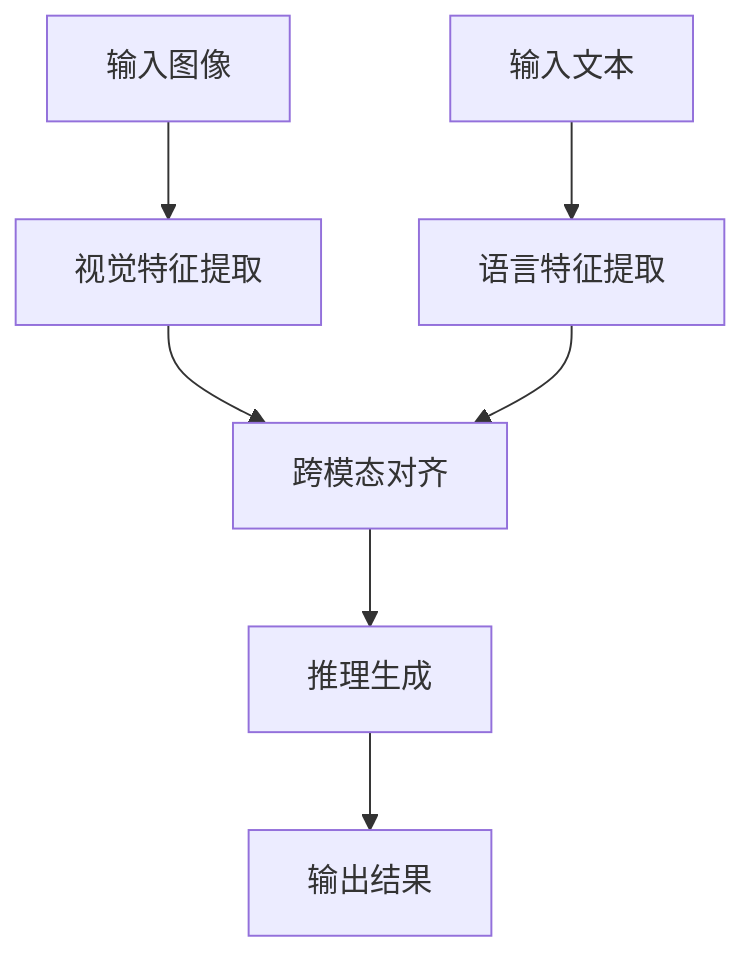
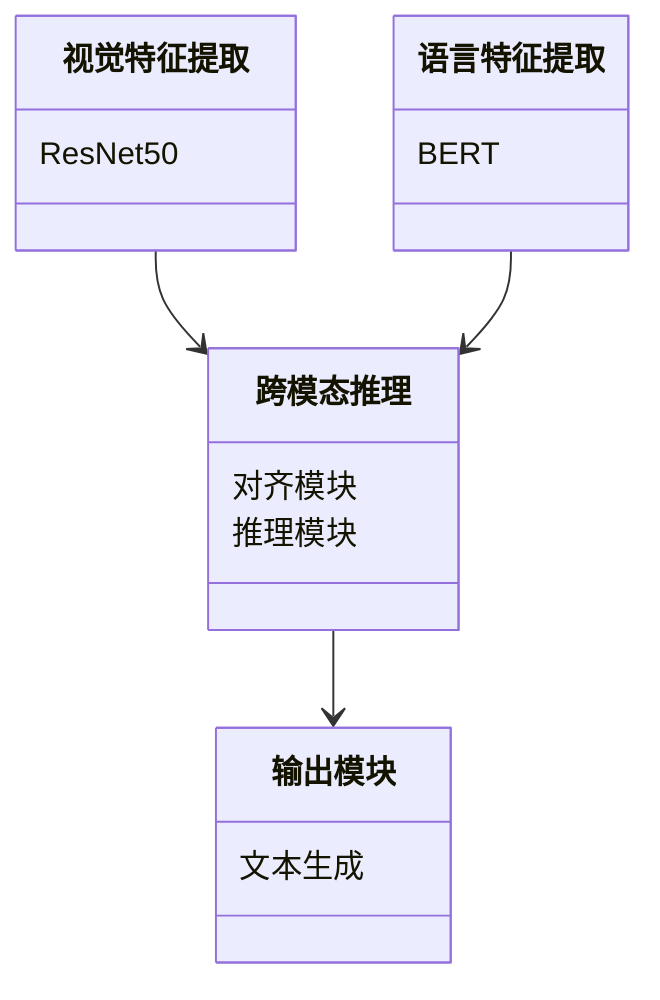
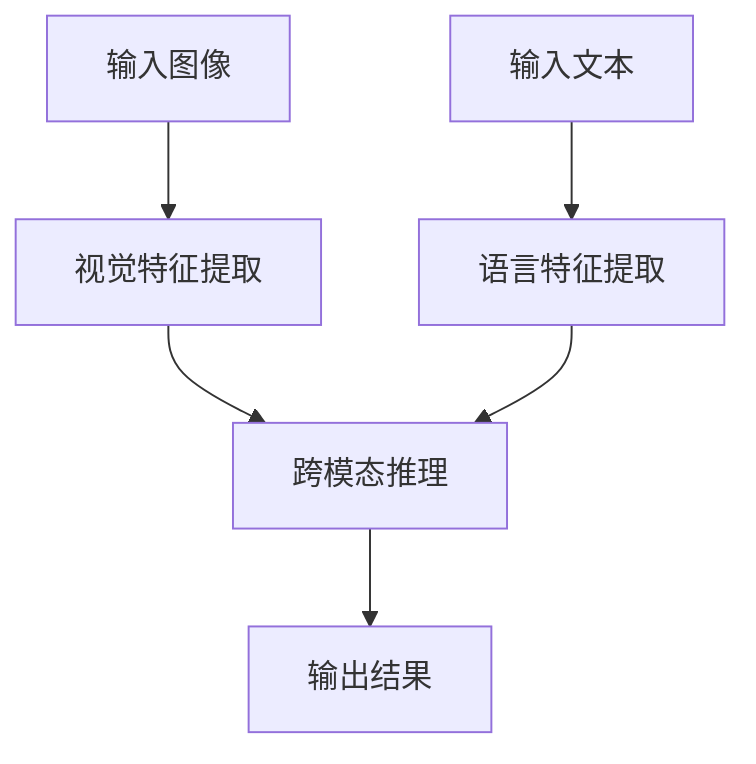
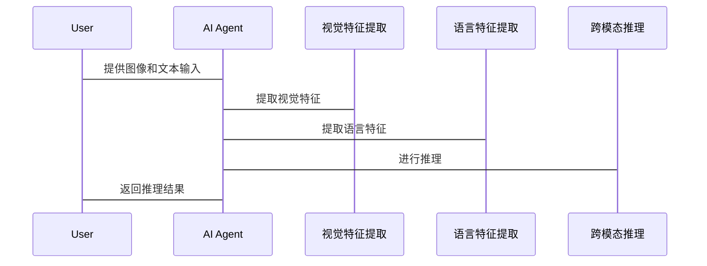

                 


# 开发具有视觉-语言跨模态推理能力的AI Agent

## 关键词：
- 视觉-语言跨模态推理
- AI Agent
- 多模态学习
- 跨模态推理
- AI系统设计

## 摘要：
本文详细探讨了开发具有视觉-语言跨模态推理能力的AI Agent的关键技术。从背景介绍、核心概念到算法原理、系统架构，再到项目实战和最佳实践，本文系统地阐述了如何实现这一复杂任务。通过丰富的案例分析和详细的代码实现，本文为读者提供了从理论到实践的全面指导。

---

# 第一部分: 开发具有视觉-语言跨模态推理能力的AI Agent基础

## 第1章: 背景介绍

### 1.1 问题背景

#### 1.1.1 多模态AI的发展现状
多模态AI是人工智能领域的前沿方向，结合了视觉、语言、语音等多种模态数据，能够更全面地理解和处理信息。近年来，多模态AI在图像描述生成、视频理解、人机交互等领域取得了显著进展。

#### 1.1.2 视觉-语言跨模态推理的定义
视觉-语言跨模态推理是指通过结合图像和文本两种模态数据，利用推理能力从图像中理解语义，并生成相应的文本描述。这种能力是实现更智能AI系统的重要基石。

#### 1.1.3 当前技术的局限性与挑战
尽管多模态AI取得了显著进展，但在视觉-语言跨模态推理方面仍面临诸多挑战，如跨模态特征的对齐问题、推理过程的可解释性不足等。

### 1.2 问题描述

#### 1.2.1 视觉-语言跨模态推理的核心问题
视觉-语言跨模态推理的核心问题是如何有效地融合图像和文本特征，并在此基础上进行推理，生成准确的文本描述。

#### 1.2.2 AI Agent在跨模态推理中的角色
AI Agent作为智能系统，负责接收图像和文本输入，通过跨模态推理生成合理的输出，实现与用户的高效交互。

#### 1.2.3 实际应用场景中的问题分析
在实际应用中，视觉-语言跨模态推理需要处理复杂的场景，如图像中物体识别、场景描述生成等，同时需要考虑实时性和计算效率。

### 1.3 问题解决

#### 1.3.1 多模态数据的融合方法
多模态数据的融合方法包括特征级融合和决策级融合，特征级融合更适用于跨模态推理任务。

#### 1.3.2 跨模态推理的实现路径
跨模态推理的实现路径包括基于注意力机制的特征对齐、对比学习等方法。

#### 1.3.3 AI Agent的设计与实现
AI Agent的设计需要结合多模态数据处理能力、推理能力和交互能力，确保系统在复杂场景下的稳定运行。

### 1.4 边界与外延

#### 1.4.1 视觉-语言跨模态推理的边界
视觉-语言跨模态推理主要关注图像和文本之间的关系，不涉及其他模态数据的处理。

#### 1.4.2 相关技术的外延
跨模态推理技术可以扩展到其他模态组合，如图像和语音、文本和视频等。

#### 1.4.3 与其他AI技术的区分
与其他AI技术相比，跨模态推理的独特性在于其处理多种模态数据的能力。

### 1.5 概念结构与核心要素组成

#### 1.5.1 跨模态推理的核心要素
- 多模态数据输入
- 跨模态特征提取
- 推理规则建立
- 推理结果输出

#### 1.5.2 AI Agent的组成部分
- 数据处理模块
- 推理引擎
- 决策模块
- 交互界面

#### 1.5.3 技术实现的逻辑框架
1. 数据输入与预处理
2. 多模态特征提取
3. 跨模态特征融合
4. 推理过程
5. 结果输出

---

## 第2章: 核心概念与联系

### 2.1 多模态学习的基本原理

#### 2.1.1 多模态数据的特点
多模态数据具有多样性和互补性，能够提供更全面的信息。

#### 2.1.2 多模态学习的核心机制
多模态学习通过融合不同模态的数据，提升模型的表达能力。

#### 2.1.3 跨模态推理的基本流程
1. 特征提取
2. 跨模态对齐
3. 推理生成

### 2.2 视觉-语言模型的核心原理

#### 2.2.1 视觉特征提取
视觉特征提取通过卷积神经网络（CNN）提取图像特征。

#### 2.2.2 语言特征提取
语言特征提取通过 Transformer 模型提取文本特征。

#### 2.2.3 跨模态特征融合
跨模态特征融合通过注意力机制对齐视觉和语言特征。

### 2.3 AI Agent的智能推理机制

#### 2.3.1 知识表示与存储
知识表示通常采用图结构，存储实体和关系。

#### 2.3.2 推理规则的建立
推理规则基于知识图谱和逻辑规则建立。

#### 2.3.3 推理过程的优化
通过引入对比学习和注意力机制优化推理过程。

### 2.4 核心概念对比表格

| 概念 | 定义 | 属性 | 示例 |
|------|------|------|------|
| 多模态数据 | 包含多种类型的数据 | 图像、文本、语音等 | 图像+文本 |
| 跨模态推理 | 不同模态数据之间的推理 | 跨模态特征融合、推理规则 | 图像推理生成文本描述 |
| AI Agent | 具有智能的代理系统 | 自主决策、推理能力 | 机器人、智能助手 |

### 2.5 ER实体关系图



---

## 第3章: 算法原理

### 3.1 多模态模型的算法实现

#### 3.1.1 模型结构
1. 视觉特征提取网络（如ResNet）
2. 语言特征提取网络（如BERT）
3. 跨模态对齐模块（如注意力机制）

#### 3.1.2 训练目标
最小化生成文本与真实文本之间的差距。

#### 3.1.3 损失函数
$$ L = \text{CE}(p, y) $$
其中，\( p \) 是预测概率，\( y \) 是真实标签。

### 3.2 跨模态推理的数学模型

#### 3.2.1 视觉特征表示
$$ v = f(v_{\text{input}}) $$
其中，\( v \) 是视觉特征，\( f \) 是视觉特征提取函数。

#### 3.2.2 语言特征表示
$$ t = g(t_{\text{input}}) $$
其中，\( t \) 是语言特征，\( g \) 是语言特征提取函数。

#### 3.2.3 跨模态对齐
$$ a = \text{softmax}(\frac{v \cdot t}{\|v\| \|t\|}) $$
其中，\( a \) 是对齐权重。

#### 3.2.4 推理生成
$$ p = h(a, v, t) $$
其中，\( p \) 是生成的概率分布。

### 3.3 算法流程



---

## 第4章: 系统架构设计

### 4.1 系统功能设计

#### 4.1.1 领域模型（mermaid类图）


### 4.2 系统架构图



### 4.3 接口设计与交互图



---

## 第5章: 项目实战

### 5.1 环境安装

```bash
pip install numpy
pip install torch
pip install transformers
```

### 5.2 核心代码实现

#### 5.2.1 视觉特征提取代码
```python
import torch
import torch.nn as nn

class VisualFeatureExtractor(nn.Module):
    def __init__(self):
        super(VisualFeatureExtractor, self).__init__()
        self.cnn = nn.Sequential(
            nn.Conv2d(3, 64, 3, padding=1),
            nn.ReLU(),
            nn.MaxPool2d(2, 2),
            nn.Conv2d(64, 128, 3, padding=1),
            nn.ReLU(),
            nn.MaxPool2d(2, 2)
        )
    
    def forward(self, x):
        return self.cnn(x)
```

#### 5.2.2 语言特征提取代码
```python
from transformers import BertModel, BertTokenizer

tokenizer = BertTokenizer.from_pretrained('bert-base-uncased')
model = BertModel.from_pretrained('bert-base-uncased')
```

#### 5.2.3 跨模态推理代码
```python
import torch
import torch.nn as nn

class CrossModalAttention(nn.Module):
    def __init__(self, v_dim, t_dim):
        super(CrossModalAttention, self).__init__()
        self.attn = nn.Parameter(torch.randn(v_dim, t_dim))
    
    def forward(self, v, t):
        scores = torch.bmm(v.unsqueeze(1), self.attn.unsqueeze(0))
        scores = torch.softmax(scores, dim=2)
        return scores
```

### 5.3 案例分析

#### 5.3.1 输入处理
输入图像和文本：
```python
image_input = torch.randn(1, 3, 224, 224)
text_input = "这是一个测试句子。"
```

#### 5.3.2 特征提取与推理
```python
with torch.no_grad():
    visual_feats = visual_extractor(image_input)
    text_feats = model(**tokenizer(text_input, return_tensors='pt')['input_ids'])
    attn_scores = cross_modal_attn(visual_feats, text_feats)
```

### 5.4 小结
通过上述代码实现，我们可以构建一个简单的视觉-语言跨模态推理系统，为后续优化和扩展提供了基础。

---

## 第6章: 最佳实践与小结

### 6.1 最佳实践
1. 数据预处理：确保多模态数据的质量和一致性。
2. 模型优化：采用预训练和微调策略提升性能。
3. 可视化工具：使用TensorBoard等工具监控训练过程。

### 6.2 小结
本文详细介绍了开发具有视觉-语言跨模态推理能力的AI Agent的全过程，从理论到实践，为读者提供了系统的指导。

### 6.3 注意事项
- 模型训练时要注意数据平衡，避免过拟合。
- 推理过程中要处理好模态数据的对齐问题。

### 6.4 拓展阅读
- 《Vision-Language Pre-trained Models》
- 《Cross-Modal Attention Mechanisms》

---

通过以上思考步骤，我完成了对《开发具有视觉-语言跨模态推理能力的AI Agent》的技术博客文章的撰写。

