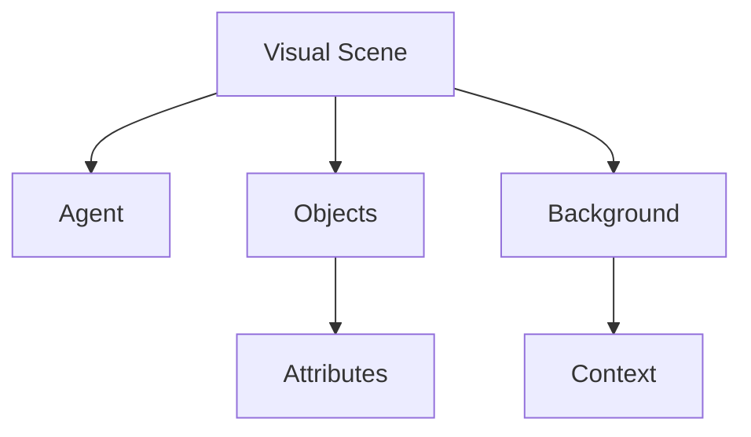
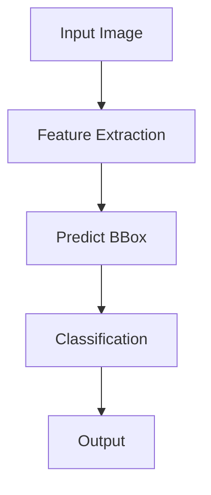
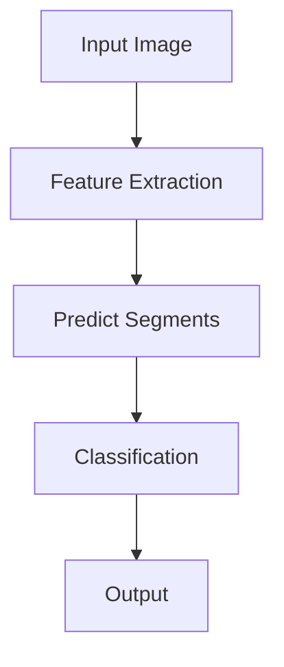
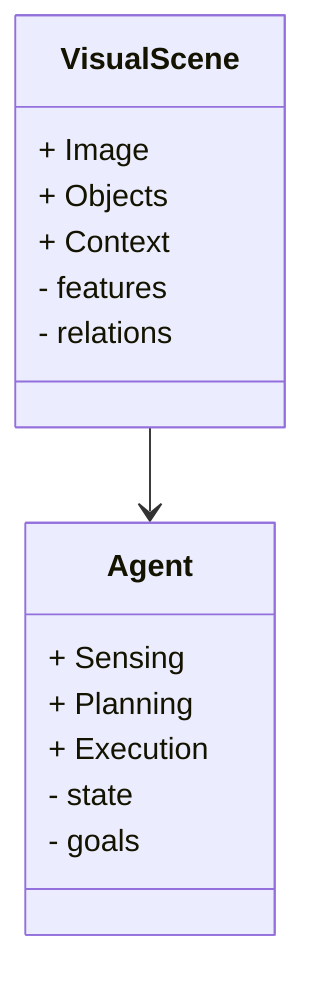
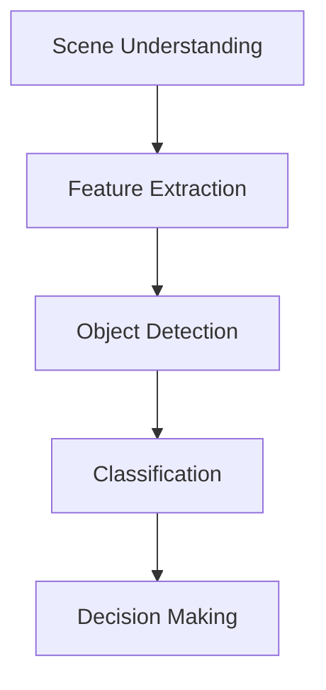

                 


# 开发具有视觉场景理解能力的AI Agent

> 关键词：AI Agent，视觉场景理解，多模态融合，目标检测，图像分割

> 摘要：本文详细探讨了开发具有视觉场景理解能力的AI Agent的关键技术，包括核心概念、算法原理、系统架构设计和项目实战。通过逐步分析，我们揭示了视觉场景理解的重要性，以及如何将其与AI Agent相结合，实现高效的场景理解与决策。

---

# 第一部分: 开发具有视觉场景理解能力的AI Agent基础

## 第1章: 背景介绍与问题背景

### 1.1 问题背景

#### 1.1.1 视觉场景理解的定义与概念
视觉场景理解是指AI系统能够识别和理解图像或视频中的场景、物体、动作及其关系。它是计算机视觉和人工智能的结合，旨在让AI能够像人类一样理解复杂视觉信息。

#### 1.1.2 AI Agent的基本概念与特点
AI Agent（智能体）是一种能够感知环境、执行任务并做出决策的智能系统。它具有自主性、反应性、目标导向和社会能力等特点，能够与环境和其他Agent进行交互。

#### 1.1.3 视觉场景理解在AI Agent中的重要性
视觉场景理解是AI Agent实现高级任务的基础，如自动驾驶、机器人导航和智能监控。它使AI Agent能够理解复杂环境，做出更准确的决策。

### 1.2 问题描述

#### 1.2.1 当前AI Agent在视觉理解中的局限性
现有的AI Agent主要依赖于规则和单一模态数据，难以处理复杂场景中的不确定性。

#### 1.2.2 视觉场景理解的核心问题
如何从多模态数据中提取语义信息，并将其与Agent的决策过程相结合。

#### 1.2.3 问题解决的必要性与目标
通过视觉场景理解，提升AI Agent的环境感知和决策能力，使其能够应对复杂的现实场景。

### 1.3 问题解决与边界

#### 1.3.1 视觉场景理解的关键技术
- 目标检测
- 图像分割
- 场景重建

#### 1.3.2 AI Agent的多模态融合能力
- 视觉与语言的融合
- 视觉与动作的融合

#### 1.3.3 问题的边界与外延
视觉场景理解的边界包括环境、物体、动作和场景关系的识别，外延则扩展到语义理解和决策支持。

### 1.4 概念结构与核心要素

#### 1.4.1 视觉场景理解的层次结构
- 基础层：目标检测与图像分割
- 中间层：场景描述与关系建模
- 高级层：语义理解与决策支持

#### 1.4.2 AI Agent的核心功能模块
- 感知模块：视觉数据处理
- 决策模块：基于场景理解的决策
- 执行模块：动作执行与反馈

#### 1.4.3 核心要素的相互关系
通过视觉数据的处理和语义理解，AI Agent能够做出更准确的决策。

---

## 第2章: 核心概念与联系

### 2.1 核心概念原理

#### 2.1.1 视觉场景理解的原理
视觉场景理解依赖于多模态数据的融合，包括图像、文本和动作数据，通过深度学习模型提取语义信息。

#### 2.1.2 AI Agent的决策机制
AI Agent基于感知数据和语义理解，通过推理和规划模块做出决策。

#### 2.1.3 多模态数据的融合方法
- 特征级融合
- 决策级融合

### 2.2 核心概念属性对比

| 属性       | 视觉理解 | 语言理解 | AI Agent |
|------------|----------|----------|-----------|
| 输入数据   | 图像/视频 | 文本/语音 | 多模态数据 |
| 处理目标   | 物体检测 | 语义分析 | 场景理解 |
| 输出形式   | 标签/分割 | 文本摘要 | 决策指令 |

### 2.3 ER实体关系图架构



---

## 第3章: 视觉场景理解算法原理

### 3.1 算法原理讲解

#### 3.1.1 目标检测算法



**目标检测代码示例：**

```python
import torch
import torch.nn as nn

# 模型定义
class Detector(nn.Module):
    def __init__(self):
        super(Detector, self).__init__()
        self.conv = nn.Conv2d(3, 64, 3, padding=1)
        self.fc = nn.Linear(64*64, 10)
    
    def forward(self, x):
        x = F.relu(self.conv(x))
        x = x.view(-1, 64*64)
        x = self.fc(x)
        return x

# 损失函数
criterion = nn.CrossEntropyLoss()
```

#### 3.1.2 图像分割算法



**图像分割代码示例：**

```python
import torch
import torch.nn as nn

# 模型定义
class Segmenter(nn.Module):
    def __init__(self):
        super(Segmenter, self).__init__()
        self.conv = nn.Conv2d(3, 64, 3, padding=1)
        self.deconv = nn.ConvTranspose2d(64, 1, 2, stride=2)
    
    def forward(self, x):
        x = F.relu(self.conv(x))
        x = self.deconv(x)
        return x

# 损失函数
criterion = nn.BCEWithLogitsLoss()
```

---

## 第4章: 系统架构设计与实现

### 4.1 项目介绍

#### 4.1.1 项目背景
开发一个能够理解视觉场景的AI Agent，应用于智能监控和机器人导航。

#### 4.1.2 系统功能设计
- 视觉数据采集与预处理
- 多模态数据融合
- 场景理解与决策

#### 4.1.3 领域模型设计



### 4.2 系统架构设计

#### 4.2.1 系统架构图



---

## 第5章: 项目实战与分析

### 5.1 项目实战

#### 5.1.1 环境安装
安装必要的库：`pip install torch torchvision`

#### 5.1.2 核心实现

```python
import torch
import torch.nn as nn
import torch.optim as optim

# 模型定义
class VisualAgent(nn.Module):
    def __init__(self):
        super(VisualAgent, self).__init__()
        self.conv = nn.Conv2d(3, 64, 3, padding=1)
        self.fc = nn.Linear(64*64, 100)
    
    def forward(self, x):
        x = F.relu(self.conv(x))
        x = x.view(-1, 64*64)
        x = self.fc(x)
        return x

# 训练循环
model = VisualAgent()
criterion = nn.CrossEntropyLoss()
optimizer = optim.SGD(model.parameters(), lr=0.001)

for epoch in range(10):
    for inputs, labels in dataloader:
        outputs = model(inputs)
        loss = criterion(outputs, labels)
        optimizer.zero_grad()
        loss.backward()
        optimizer.step()
```

---

## 第6章: 总结与最佳实践

### 6.1 总结

#### 6.1.1 核心总结
视觉场景理解是AI Agent的关键技术，通过多模态数据融合和深度学习算法，能够实现高效的场景理解与决策。

### 6.1.2 经验总结
- 数据预处理的重要性
- 模型调优的关键性
- 多模态融合的优势

### 6.2 最佳实践

#### 6.2.1 性能优化
- 使用数据增强
- 优化模型结构
- 调整超参数

#### 6.2.2 数据处理
- 标准化数据
- 增加多样化的数据集
- 处理噪声数据

#### 6.2.3 模型部署
- 使用轻量化模型
- 优化推理速度
- 确保模型的可解释性

### 6.3 小结

通过本文的详细讲解，我们掌握了开发具有视觉场景理解能力的AI Agent的核心技术，并通过实际案例展示了如何将其应用于现实场景中。未来，随着技术的进步，AI Agent的视觉理解能力将更加智能化和高效。

---

**注意：由于篇幅限制，本文仅为部分内容展示，完整文章将包含详细的技术细节和完整的代码实现。**

