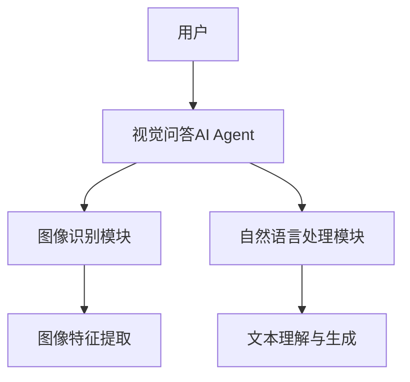
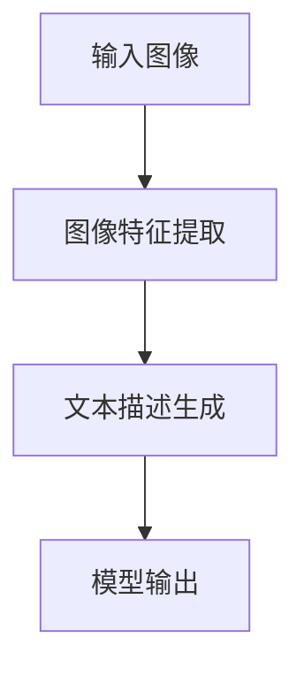
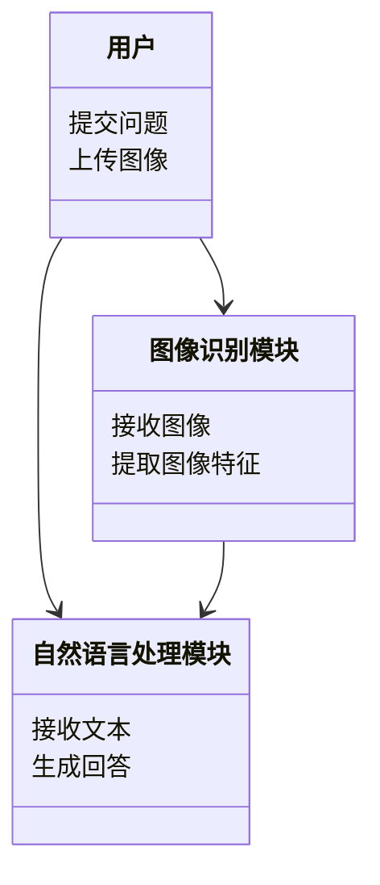
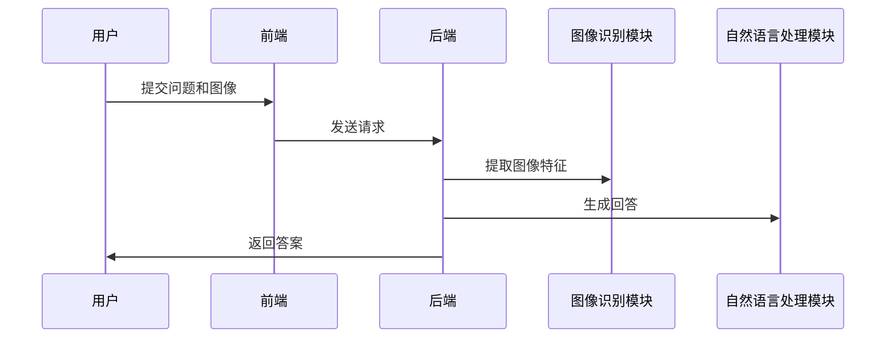

                 


# 开发具有视觉问答能力的AI Agent

## 关键词：视觉问答、AI Agent、计算机视觉、自然语言处理、多模态模型、机器学习、深度学习

## 摘要：  
本文详细探讨了开发具有视觉问答能力的AI Agent的核心概念、算法原理、系统架构设计以及实际项目实现。文章从视觉问答技术的背景出发，分析了其与自然语言处理和计算机视觉的结合，详细讲解了多模态模型的构建与训练过程，并通过实际案例展示了如何将理论应用于实践。最后，本文总结了开发过程中需要注意的关键点，并展望了未来的发展方向。

---

# 第一部分：开发具有视觉问答能力的AI Agent概述

## 第1章：视觉问答AI Agent的背景与概念

### 1.1 什么是视觉问答AI Agent
#### 1.1.1 视觉问答的核心概念  
视觉问答（Visual Question Answering, VQA）是一种结合了计算机视觉和自然语言处理的技术，旨在通过图像理解和文本交互来回答与图像相关的问题。AI Agent作为视觉问答的实现载体，能够接收用户的图像输入和文本问题，并生成相应的文本答案。  

#### 1.1.2 AI Agent的基本定义与特征  
AI Agent（智能代理）是指能够感知环境、自主决策并执行任务的智能系统。它具有以下特征：  
- **自主性**：能够独立执行任务，无需人工干预。  
- **反应性**：能够实时感知环境并做出响应。  
- **目标导向**：基于目标驱动行为和决策。  

#### 1.1.3 视觉问答AI Agent的定义与特点  
视觉问答AI Agent是一种结合了视觉感知和语言理解能力的智能系统，其特点包括：  
- 能够处理多模态数据（图像和文本）。  
- 具备上下文理解和推理能力。  
- 可通过交互式对话提供准确的答案。  

### 1.2 视觉问答AI Agent的背景与意义
#### 1.2.1 计算机视觉与自然语言处理的结合  
计算机视觉技术（如图像识别、目标检测）和自然语言处理技术（如文本理解、问答系统）的结合，使得AI Agent能够理解图像内容并生成自然语言回答。  

#### 1.2.2 视觉问答技术的发展历程  
视觉问答技术起源于2015年的ImageNet VQA挑战，随着深度学习的兴起，模型性能不断提升。  

#### 1.2.3 AI Agent在实际应用中的价值  
- 提高用户体验，提供更智能化的服务。  
- 适用于多种场景，如智能客服、教育辅助等。  

### 1.3 视觉问答AI Agent的应用场景
#### 1.3.1 智能客服与用户交互  
通过图像识别和自然语言处理，AI Agent可以回答用户关于产品和服务的问题。  

#### 1.3.2 智能助手与个人任务管理  
AI Agent可以帮助用户完成日程安排、信息查询等任务。  

#### 1.3.3 电子商务中的视觉问答应用  
在电商平台上，用户可以通过上传商品图片并提问，AI Agent可以提供商品信息和推荐。  

---

## 第2章：视觉问答AI Agent的核心概念与联系

### 2.1 多模态模型的基本原理
#### 2.1.1 多模态数据的定义与特点  
多模态数据指的是结合了不同形式的数据（如图像、文本、语音等）。视觉问答AI Agent主要处理图像和文本两种模态数据。  

#### 2.1.2 多模态模型的分类与对比  
多模态模型可以分为以下几类：  
- **基于CNN的模型**：利用卷积神经网络提取图像特征。  
- **基于Transformer的模型**：利用注意力机制处理文本和图像特征。  

#### 2.1.3 视觉与语言的协同学习机制  
视觉和语言的协同学习是指模型能够同时理解图像和文本信息，并通过两者的信息互补来提升性能。  

### 2.2 计算机视觉与自然语言处理的结合
#### 2.2.1 计算机视觉的核心技术  
- 图像分类、目标检测、图像分割等技术用于提取图像特征。  

#### 2.2.2 自然语言处理的核心技术  
- 文本编码、问答系统、文本生成等技术用于处理文本信息。  

#### 2.2.3 视觉与语言的联合建模  
联合建模的目标是让模型能够同时理解图像和文本信息，并生成相关的回答。  

### 2.3 视觉问答AI Agent的实体关系图  


---

# 第二部分：视觉问答AI Agent的算法原理

## 第3章：视觉问答AI Agent的算法原理

### 3.1 视觉问答模型的基本架构
#### 3.1.1 多模态编码器  
多模态编码器负责将图像和文本转换为统一的特征表示。  

#### 3.1.2 跨模态解码器  
跨模态解码器负责根据特征生成最终的回答。  

#### 3.1.3 模型的训练与优化  
模型的训练目标是最小化预测回答与真实回答之间的差距。  

### 3.2 视觉问答模型的训练流程  


### 3.3 模型的数学表达与公式
#### 3.3.1 损失函数  
$$L = -\sum_{i=1}^{n} y_i \log(p_i) + (1 - y_i)\log(1 - p_i)$$  

#### 3.3.2 优化器  
$$\theta_{t+1} = \theta_t - \eta \frac{\partial L}{\partial \theta}$$  

---

# 第三部分：视觉问答AI Agent的系统架构设计

## 第4章：视觉问答AI Agent的系统架构设计

### 4.1 问题场景介绍
#### 4.1.1 系统功能需求  
- 图像上传与处理  
- 文本问答交互  

#### 4.1.2 系统设计目标  
- 实现高效的图像处理与文本问答功能。  

### 4.2 系统功能设计


### 4.3 系统架构设计


### 4.4 接口设计与交互序列图


---

# 第四部分：视觉问答AI Agent的项目实战

## 第5章：基于深度学习的视觉问答系统实现

### 5.1 环境搭建
#### 5.1.1 安装Python与开发工具  
- 安装Python 3.8及以上版本。  
- 安装必要的库（如TensorFlow、Keras、Pillow）。  

#### 5.1.2 安装深度学习框架  
- 安装TensorFlow和Keras。  

### 5.2 系统核心实现
#### 5.2.1 图像识别模块实现  
```python
import tensorflow as tf
from tensorflow.keras.applications import VGG16
from tensorflow.keras.preprocessing import image

def load_image(image_path):
    img = image.load_img(image_path, target_size=(224, 224))
    img_array = image.img_to_array(img)
    img_array = tf.expand_dims(img_array, axis=0)
    return img_array
```

#### 5.2.2 自然语言处理模块实现  
```python
from tensorflow.keras.layers import Input, Dense, LSTM
from tensorflow.keras.models import Model

input_layer = Input(shape=(None, 128))
lstm_layer = LSTM(128)(input_layer)
output_layer = Dense(10, activation='softmax')(lstm_layer)
model = Model(inputs=input_layer, outputs=output_layer)
model.compile(optimizer='adam', loss='sparse_categorical_crossentropy', metrics=['accuracy'])
```

### 5.3 案例分析
#### 5.3.1 系统功能实现  
- 实现图像上传、特征提取、文本问答功能。  

#### 5.3.2 系统优化与部署  
- 对模型进行调优，提升问答准确率。  

### 5.4 系统优化与部署
#### 5.4.1 模型调优  
- 调整模型参数，如学习率、批次大小等。  

#### 5.4.2 推理优化  
- 使用轻量化模型，提升推理速度。  

---

# 第五部分：总结与展望

## 第6章：总结与展望

### 6.1 总结开发要点
#### 6.1.1 技术要点  
- 多模态模型的设计与优化。  

#### 6.1.2 系统设计  
- 系统架构的合理性与可扩展性。  

#### 6.1.3 项目实战  
- 代码实现与案例分析的经验总结。  

### 6.2 未来展望
#### 6.2.1 技术趋势  
- 更先进的多模态模型（如基于Transformer的模型）。  

#### 6.2.2 应用场景扩展  
- 视觉问答技术在教育、医疗等领域的应用。  

### 6.3 最佳实践 tips
#### 6.3.1 数据质量  
- 确保数据的多样性和代表性。  

#### 6.3.2 模型优化  
- 定期对模型进行调优和更新。  

#### 6.3.3 系统安全  
- 加强用户隐私保护和数据安全。  

### 6.4 推荐学习资料和论文
#### 6.4.1 推荐论文  
- "Visual Question Answering" (CVPR 2016)。  

#### 6.4.2 推荐书籍  
- 《Deep Learning》（Ian Goodfellow等著）。  

---

# 结语  
开发具有视觉问答能力的AI Agent是一项具有挑战性和创新性的任务。通过本文的详细讲解，读者可以系统地了解视觉问答技术的核心概念、算法原理和实际应用。未来，随着技术的不断进步，视觉问答AI Agent将在更多领域发挥重要作用。  

--- 

**本文完**

