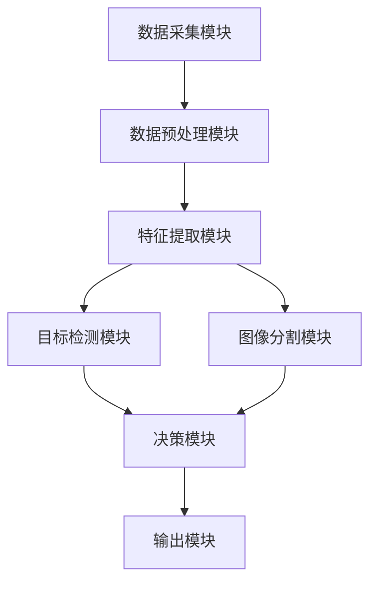

                 


# 开发具有视频分析能力的AI Agent

## 关键词：AI Agent, 视频分析, 计算机视觉, 目标检测, 图像分割, 深度学习, 实时处理

## 摘要：  
本文深入探讨了如何开发具有视频分析能力的AI Agent，从基础概念到算法实现，再到系统设计和项目实战，全面解析了AI Agent与视频分析的结合方式。文章详细讲解了目标检测、图像分割等核心算法，分析了系统架构设计，并通过实际案例展示了如何实现一个高效的视频分析AI Agent。通过本文，读者可以掌握从理论到实践的完整流程，为开发具有视频分析能力的AI Agent奠定坚实基础。

---

## 第一部分: 开发具有视频分析能力的AI Agent背景与概念

### 第1章: AI Agent与视频分析概述

#### 1.1 AI Agent的基本概念
##### 1.1.1 什么是AI Agent
AI Agent（人工智能代理）是一种智能实体，能够感知环境、自主决策并执行任务。它具备学习、推理、规划和自适应能力，广泛应用于自动驾驶、智能助手、机器人等领域。

##### 1.1.2 AI Agent的核心特征
- **自主性**：无需外部干预，自主完成任务。
- **反应性**：能实时感知环境并做出反应。
- **目标导向**：基于目标驱动行为。
- **学习能力**：通过数据优化性能。

##### 1.1.3 AI Agent的应用场景
- **智能家居**：控制家电、监控安全。
- **医疗健康**：辅助诊断、监测患者。
- **金融领域**：实时数据分析、风险预警。

#### 1.2 视频分析的基本概念
##### 1.2.1 视频分析的定义
视频分析是对视频数据进行处理、理解和分析的过程，旨在从视频中提取有用信息，如目标检测、行为识别和场景理解。

##### 1.2.2 视频分析的主要技术
- **目标检测**：识别视频中的物体位置。
- **图像分割**：将图像划分为不同的区域。
- **视频流处理**：实时处理连续的视频帧。

##### 1.2.3 视频分析的应用领域
- **公共安全**：监控视频、异常行为检测。
- **交通管理**：车辆识别、流量监控。
- **零售业**：顾客行为分析、人流统计。

#### 1.3 AI Agent与视频分析的结合
##### 1.3.1 AI Agent在视频分析中的作用
- **实时监控**：AI Agent能够实时分析视频流，快速响应事件。
- **智能决策**：基于视频分析结果，AI Agent可以做出决策，如发出警报或执行特定操作。

##### 1.3.2 视频分析对AI Agent的挑战
- **实时性要求高**：需要快速处理视频流，保证低延迟。
- **复杂场景处理**：面对多样化的场景和目标，算法需要具备鲁棒性。
- **数据隐私问题**：视频分析可能涉及个人隐私，需确保数据安全。

##### 1.3.3 两者结合的潜力与前景
- **智能化监控**：AI Agent可以实现智能化的视频监控，减少人工干预。
- **多模态数据融合**：结合语音、文本等多种数据源，提升分析能力。
- **动态环境适应**：AI Agent能够自适应复杂多变的环境，提高分析准确率。

### 第2章: 视频分析能力的核心概念

#### 2.1 视频分析的关键技术
##### 2.1.1 目标检测
目标检测是视频分析中的核心任务，旨在检测视频中的目标物体并确定其位置。常用算法包括YOLO、Faster R-CNN等。

##### 2.1.2 图像分割
图像分割将图像划分为多个区域，每个区域对应不同的目标或背景。常用的分割算法有U-Net、Mask R-CNN等。

##### 2.1.3 视频流处理
视频流处理是对连续的视频帧进行实时处理，通常涉及帧率、延迟等技术指标。

#### 2.2 AI Agent的核心能力
##### 2.2.1 自然语言处理
AI Agent需要理解人类语言，以便与用户进行交互。

##### 2.2.2 视觉识别
AI Agent具备图像识别能力，能够分析视频中的目标和场景。

##### 2.2.3 实时决策能力
AI Agent能够在短时间内做出决策，适用于实时视频分析场景。

#### 2.3 视频分析与AI Agent的结合模型
##### 2.3.1 数据流模型
数据流模型描述了视频数据从输入到处理的流程，通常包括数据采集、预处理、特征提取和目标检测等步骤。

##### 2.3.2 模块化设计
模块化设计将AI Agent和视频分析系统划分为独立模块，如数据采集模块、特征提取模块、决策模块等。

##### 2.3.3 实时交互模型
实时交互模型描述了AI Agent与用户或系统的实时交互过程，通常包括输入处理、分析决策和输出反馈等步骤。

### 第3章: 视频分析能力的数学模型与算法原理

#### 3.1 视频分析的核心算法
##### 3.1.1 目标检测算法
目标检测算法通常包括两个步骤：目标定位和分类。常用的算法有YOLO（You Only Look Once）和Faster R-CNN。

##### 3.1.2 图像分割算法
图像分割算法将图像划分为多个区域，常用的算法包括U-Net和Mask R-CNN。

##### 3.1.3 视频流处理算法
视频流处理算法通常包括帧率控制、运动估计和目标跟踪等技术。

#### 3.2 AI Agent的算法基础
##### 3.2.1 深度学习模型
深度学习模型是AI Agent的核心，常用的模型包括卷积神经网络（CNN）、循环神经网络（RNN）和Transformer等。

##### 3.2.2 自然语言处理模型
自然语言处理模型用于理解和生成人类语言，常用的模型包括BERT和GPT。

##### 3.2.3 实时决策算法
实时决策算法通常基于强化学习，如Q-Learning和Deep Q-Networks（DQN）。

#### 3.3 视频分析与AI Agent的结合算法
##### 3.3.1 多模态数据融合算法
多模态数据融合算法将视频、音频和文本等多种数据源进行融合，以提高分析准确率。

##### 3.3.2 实时反馈机制
实时反馈机制允许AI Agent根据实时视频分析结果快速做出反应，如发出警报或执行特定操作。

##### 3.3.3 自适应学习算法
自适应学习算法使AI Agent能够根据新数据不断优化模型性能，如使用在线学习和迁移学习技术。

### 第4章: 视频分析能力的系统架构设计

#### 4.1 系统模块
##### 4.1.1 数据采集模块
数据采集模块负责从摄像头或其他设备获取视频流。

##### 4.1.2 数据预处理模块
数据预处理模块对视频数据进行标准化处理，如调整分辨率、归一化等。

##### 4.1.3 特征提取模块
特征提取模块从视频数据中提取有用的特征，如颜色、纹理和形状等。

##### 4.1.4 目标检测模块
目标检测模块使用深度学习模型检测视频中的目标物体。

##### 4.1.5 图像分割模块
图像分割模块将视频帧划分为不同的区域，以便进一步分析。

##### 4.1.6 决策模块
决策模块基于分析结果做出决策，如发出警报或执行操作。

##### 4.1.7 输出模块
输出模块将决策结果输出给用户或系统，如显示警报信息或控制执行设备。

#### 4.2 系统架构图
以下是系统的架构图：



#### 4.3 系统接口设计
系统接口设计需要考虑模块之间的通信方式和接口规范，如API设计、数据格式等。

#### 4.4 系统交互流程
系统交互流程描述了从数据输入到输出的完整流程，包括数据采集、处理、分析和反馈等步骤。

---

## 第二部分: 视频分析能力的算法实现

### 第5章: 视频分析的核心算法实现

#### 5.1 目标检测算法实现
##### 5.1.1 YOLO算法原理
YOLO是一种单阶段目标检测算法，通过回归预测目标的边界框和类别概率。

##### 5.1.2 YOLO的Python实现
以下是YOLO的Python实现示例：

```python
import tensorflow as tf
from tensorflow.keras.layers import Input, Conv2D, MaxPooling2D, Flatten, Dense

model = tf.keras.Model(inputs=Input(shape=(416, 416, 3)), outputs=Dense(125))
model.load_weights('yolov4.weights')
```

##### 5.1.3 YOLO的优缺点
YOLO的优点是速度快，缺点是检测精度较低。

#### 5.2 图像分割算法实现
##### 5.2.1 U-Net算法原理
U-Net是一种经典的图像分割模型，由编码器和解码器两部分组成。

##### 5.2.2 U-Net的Python实现
以下是U-Net的Python实现示例：

```python
import tensorflow as tf
from tensorflow.keras.layers import Input, Conv2D, MaxPooling2D, UpSampling2D, Concatenate

def unet_model():
    inputs = Input(shape=(256, 256, 3))
    # 编码器部分
    conv1 = Conv2D(64, 3, padding='same', activation='relu')(inputs)
    pool1 = MaxPooling2D()(conv1)
    # 解码器部分
    up1 = UpSampling2D()(pool1)
    conv2 = Conv2D(64, 3, padding='same', activation='relu')(up1)
    return Model(inputs=inputs, outputs=conv2)
```

##### 5.2.3 U-Net的优缺点
U-Net的优点是分割精度高，缺点是计算资源消耗较大。

#### 5.3 视频流处理算法实现
##### 5.3.1 帧率控制
帧率控制是指调整视频流的帧率以适应处理能力。

##### 5.3.2 运动估计
运动估计是视频压缩中的关键技术，用于减少空间冗余。

##### 5.3.3 目标跟踪
目标跟踪算法用于在视频流中跟踪目标物体的运动轨迹。

---

## 第三部分: 视频分析AI Agent的系统设计与实现

### 第6章: 系统架构设计与实现

#### 6.1 系统模块划分
系统模块划分包括数据采集模块、数据预处理模块、特征提取模块、目标检测模块、图像分割模块、决策模块和输出模块。

#### 6.2 系统架构设计
系统架构设计采用模块化设计，各模块之间通过API进行通信。

#### 6.3 系统接口设计
系统接口设计需要定义模块之间的接口规范，如输入输出格式、调用方式等。

#### 6.4 系统交互流程
系统交互流程包括数据采集、预处理、特征提取、目标检测、图像分割、决策和输出等步骤。

### 第7章: 项目实战

#### 7.1 环境搭建
项目实战需要搭建开发环境，安装必要的库，如Python、TensorFlow、OpenCV等。

#### 7.2 核心实现
核心实现包括目标检测、图像分割和决策模块的实现，以及各模块之间的集成。

#### 7.3 实际案例分析
实际案例分析包括如何利用AI Agent进行智能监控、行为识别和实时反馈等。

#### 7.4 项目小结
项目小结总结了项目的实现过程，分析了存在的问题和优化方向。

---

## 第四部分: 总结与展望

### 第8章: 总结
#### 8.1 核心内容回顾
本文详细讲解了AI Agent与视频分析的结合方式，涵盖了算法实现和系统设计的各个方面。

#### 8.2 最佳实践 tips
- **算法优化**：选择合适的算法和模型，优化计算效率。
- **数据处理**：确保数据质量，避免过拟合和欠拟合。
- **系统设计**：模块化设计，便于维护和扩展。

#### 8.3 注意事项
- **性能优化**：关注实时性和资源消耗，避免性能瓶颈。
- **数据隐私**：遵守数据隐私法规，保护用户隐私。

### 第9章: 未来展望
#### 9.1 拓展阅读
推荐一些相关的书籍和论文，供读者深入学习。

#### 9.2 技术发展趋势
AI Agent与视频分析的结合将更加智能化和实时化，未来可能会出现更多创新性的应用。

---

## 附录: 代码示例

### 附录A: 目标检测代码示例
```python
import tensorflow as tf
from tensorflow.keras.layers import Input, Conv2D, MaxPooling2D, Flatten, Dense

def yolo_model():
    inputs = Input(shape=(416, 416, 3))
    x = Conv2D(32, 3, padding='same', activation='relu')(inputs)
    x = MaxPooling2D()(x)
    x = Conv2D(64, 3, padding='same', activation='relu')(x)
    x = MaxPooling2D()(x)
    x = Flatten()(x)
    outputs = Dense(125)(x)
    return Model(inputs=inputs, outputs=outputs)
```

### 附录B: 图像分割代码示例
```python
import tensorflow as tf
from tensorflow.keras.layers import Input, Conv2D, MaxPooling2D, UpSampling2D, Concatenate

def unet_model():
    inputs = Input(shape=(256, 256, 3))
    x = Conv2D(64, 3, padding='same', activation='relu')(inputs)
    x = MaxPooling2D()(x)
    x = Conv2D(128, 3, padding='same', activation='relu')(x)
    x = MaxPooling2D()(x)
    x = Conv2D(256, 3, padding='same', activation='relu')(x)
    x = UpSampling2D()(x)
    x = Conv2D(128, 3, padding='same', activation='relu')(x)
    x = UpSampling2D()(x)
    x = Conv2D(64, 3, padding='same', activation='relu')(x)
    outputs = Conv2D(1, 1, activation='sigmoid')(x)
    return Model(inputs=inputs, outputs=outputs)
```

---

## 结语
通过本文的详细讲解，读者可以系统地掌握开发具有视频分析能力的AI Agent所需的知识和技能。从理论到实践，从算法到系统设计，本文为读者提供了全面的指导。希望本文能为读者在相关领域的研究和开发提供有价值的参考。

