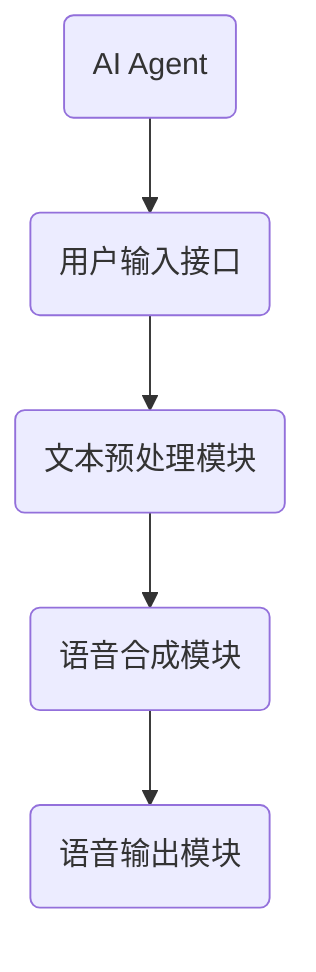

                 


# 《开发具有语音合成能力的AI Agent》

---

## 关键词：
AI Agent, 语音合成, 语音合成技术, AI Agent 开发, 人工智能, 自然语言处理

---

## 摘要：
本文详细探讨了如何开发一个具有语音合成能力的AI Agent。文章首先介绍了AI Agent和语音合成技术的基本概念及其重要性，然后从算法原理、系统架构设计、项目实战等角度深入分析了开发过程。通过理论与实践相结合的方式，本文为读者提供了从基础到实战的完整指南，帮助读者掌握开发具有语音合成能力的AI Agent的核心技术和方法。

---

# 第一部分: 背景介绍

## 第1章: AI Agent与语音合成技术概述

### 1.1 AI Agent的概念与定义
AI Agent（人工智能代理）是一种能够感知环境、自主决策并执行任务的智能实体。它可以以软件或硬件的形式存在，广泛应用于自然语言处理、语音交互、自动化控制等领域。

### 1.2 语音合成技术的现状与挑战
语音合成技术（Text-to-Speech, TTS）的目标是将文本转换为自然流畅的语音。当前，基于深度学习的语音合成技术取得了显著进展，但仍面临声音自然度、多语种支持、实时性等方面的挑战。

### 1.3 AI Agent与语音合成的结合
将语音合成能力集成到AI Agent中，可以使其具备更强大的人机交互能力。用户可以通过语音指令与AI Agent交互，AI Agent也能通过语音反馈与用户进行更自然的对话。

---

# 第二部分: 核心概念与联系

## 第2章: 核心概念与系统架构

### 2.1 AI Agent的核心功能
- **感知环境**：通过传感器或API获取输入信息（如文本、语音、图像）。
- **决策与推理**：基于输入信息进行分析、推理并生成输出。
- **执行操作**：根据推理结果执行相应的动作（如生成语音、发送指令）。

### 2.2 语音合成技术的核心组件
- **文本预处理**：包括分词、句法分析、情感分析等。
- **声学模型**：将文本转换为语音的数学模型，通常基于深度神经网络。
- **语音生成**：通过声学模型生成语音信号，并进行音频处理和优化。

### 2.3 AI Agent与语音合成的协同工作流程
1. 用户通过语音或文本向AI Agent发出指令。
2. AI Agent解析指令，生成相应的文本响应。
3. AI Agent调用语音合成模块，将文本转换为语音。
4. 语音合成模块生成音频信号并播放。

### 2.4 实体关系图（ER图）
```mermaid
erDiagram
    agent(AI Agent) {
        <<类>>
        + id: integer
        + name: string
        + state: string
    }
    voice_synthesis(语音合成模块) {
        <<类>>
        + model: string
        + language: string
        + speaker: string
    }
    agent --> voice_synthesis : 调用语音合成服务
```

---

# 第三部分: 算法原理

## 第3章: 语音合成算法原理

### 3.1 基于深度学习的语音合成技术
- **模型框架**：通常使用Tacotron、FastSpeech等模型。
- **输入**：文本或文本特征（如音调、停顿）。
- **输出**：语音波形或中间表示（如Mel谱图）。

### 3.2 声学模型的数学公式
声学模型的目标是将文本特征映射到语音特征。以Tacotron为例，模型结构如下：
$$
\text{输入：文本序列} \rightarrow \text{输出：Mel谱图和声调}
$$

### 3.3 语音生成流程
1. 文本预处理：将输入文本转换为字符或嵌入表示。
2. 声学模型生成语音特征（如Mel谱图）。
3. vocoder将语音特征转换为语音波形。

### 3.4 代码实现示例
```python
import tensorflow as tf
from tensorflow_tts.inference import TFFastSpeech

# 加载语音合成模型
model = TFFastSpeech()

# 文本输入
text = "今天天气很好"

# 调用语音合成接口
audio = model.text_to_audio(text)

# 播放生成的语音
audio.save("output.mp3")
```

---

# 第四部分: 系统架构设计

## 第4章: AI Agent的整体架构设计

### 4.1 系统功能设计
- **用户输入接口**：支持文本和语音输入。
- **核心逻辑处理**：解析输入、生成响应文本。
- **语音合成模块**：将文本转换为语音。

### 4.2 系统架构图


### 4.3 接口设计
- **输入接口**：`/api/v1/agent/speak`
- **输出接口**：`/api/v1/agent/audio`

### 4.4 交互流程
1. 用户通过语音或文本向AI Agent发送指令。
2. AI Agent解析指令并生成响应文本。
3. 语音合成模块将文本转换为语音。
4. 语音输出模块播放生成的语音。

---

# 第五部分: 项目实战

## 第5章: 项目实战

### 5.1 环境安装
```bash
pip install tensorflow-tts
pip install pyaudio
pip install librosa
```

### 5.2 核心实现代码
```python
from tensorflow_tts.inference import TFFastSpeech
from tensorflow_tts.inference import TFVocoder

# 加载语音合成模型
model = TFFastSpeech()
vocoder = TFVocoder()

# 文本输入
text = "今天天气很好"

# 合成语音
mel = model(text)
audio = vocoder(mel)

# 播放语音
audio.save("output.mp3")
```

### 5.3 代码解读
- **文本输入**：`text` 是用户输入的文本。
- **声学模型处理**：`model(text)` 生成Mel谱图。
- **语音生成**：`vocoder(mel)` 将Mel谱图转换为语音波形。
- **音频输出**：生成的语音保存为 `output.mp3` 文件。

### 5.4 案例分析
假设用户输入的文本是“明天天气会更晴朗”，AI Agent将生成对应的语音并播放。

---

# 第六部分: 总结与展望

## 第6章: 总结与展望

### 6.1 总结
本文详细介绍了如何开发一个具有语音合成能力的AI Agent，包括核心概念、算法原理、系统架构设计和项目实战等内容。通过理论与实践的结合，读者可以全面掌握开发AI Agent所需的各项技术。

### 6.2 技术展望
- **实时性优化**：进一步提升语音合成的实时性。
- **多模态交互**：结合视觉、触觉等多模态信息，提升交互体验。
- **个性化定制**：支持不同用户的声音定制。

### 6.3 最佳实践 Tips
- 在开发过程中，建议先从简单的语音合成功能入手，逐步完善功能。
- 确保数据质量和模型训练数据的多样性，以提升语音合成的自然度。
- 及时优化代码结构，避免功能耦合度过高。

---

# 结语

开发具有语音合成能力的AI Agent是一项复杂的系统工程，需要综合运用自然语言处理、深度学习和语音合成等技术。通过本文的指导，读者可以逐步掌握相关技术，并在实际项目中灵活运用。未来，随着AI技术的不断发展，AI Agent的语音合成能力将更加智能化和个性化，为人类带来更便捷的交互体验。

