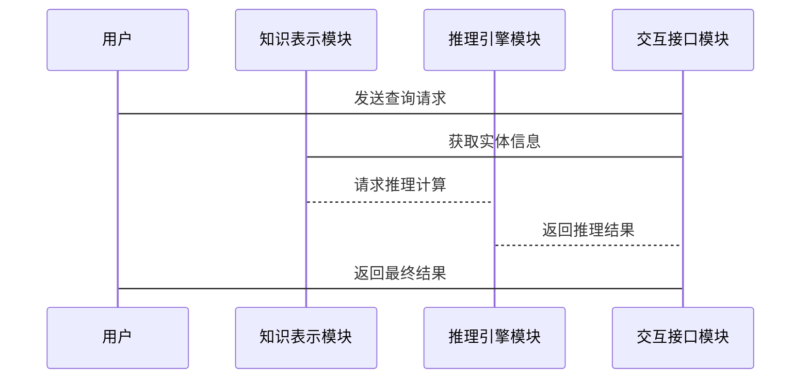

                 


# 开发具有跨域知识推理能力的AI Agent

---

## 关键词：
跨域知识推理、AI Agent、知识图谱、多领域推理、知识表示、推理算法、深度学习

---

## 摘要：
本文深入探讨了开发具有跨域知识推理能力的AI Agent的关键技术。首先，我们从问题背景出发，详细解释了跨域知识推理的必要性及其应用场景。接着，我们分析了跨域知识推理的核心原理，包括知识表示和推理逻辑的多样性。随后，我们详细讲解了实现跨域知识推理的算法原理，包括知识表示的学习与推理算法的设计。通过数学模型和公式，我们进一步阐述了跨域知识推理的实现机制。最后，我们从系统架构、接口设计和交互流程等方面，详细讨论了AI Agent的实现方案，并通过项目实战展示了如何构建一个具备跨域知识推理能力的AI Agent。本文旨在为开发者提供从理论到实践的全面指导，帮助他们更好地理解和实现跨域知识推理技术。

---

## 目录：
1. [背景介绍](#背景介绍)
2. [核心概念与联系](#核心概念与联系)
3. [算法原理讲解](#算法原理讲解)
4. [数学模型与公式](#数学模型与公式)
5. [系统分析与架构设计方案](#系统分析与架构设计方案)
6. [项目实战](#项目实战)
7. [总结与展望](#总结与展望)

---

## 1. 背景介绍

### 1.1 问题背景

AI技术的发展正在改变我们的生活方式和工作方式。然而，现有的AI系统在处理跨领域问题时常常显得力不从心。例如，一个医疗领域的AI系统可能无法有效理解与法律或金融相关的上下文信息。这种局限性限制了AI技术在复杂现实场景中的应用。因此，开发具有跨域知识推理能力的AI Agent成为了一个重要课题。

### 1.2 问题描述

跨域知识推理指的是AI系统能够理解并结合不同领域知识的能力。例如，一个医疗AI Agent可能需要结合医学知识和法律知识来处理复杂的医疗纠纷问题。这种能力要求AI系统不仅具备单领域的知识储备，还需要能够跨越不同领域进行推理和决策。

### 1.3 问题解决

为了解决跨域知识推理的问题，我们需要综合运用知识图谱、多领域推理算法和深度学习等技术。通过构建跨领域的知识图谱，我们可以将不同领域的知识有机地结合起来。同时，设计高效的推理算法能够帮助AI系统在跨域场景中做出准确的推理和决策。

### 1.4 边界与外延

跨域知识推理的边界在于其应用场景的复杂性和跨领域知识的深度。外延则包括AI系统在不同领域中的应用能力，例如医疗、法律、金融等多个领域。需要注意的是，跨域知识推理并不等同于简单的信息检索，而是需要真正理解和结合不同领域的知识。

---

## 2. 核心概念与联系

### 2.1 核心概念原理

跨域知识推理的核心在于知识表示和推理逻辑的设计。知识表示需要能够涵盖不同领域的实体、关系和属性。推理逻辑则需要能够跨越不同领域进行有效的推理和关联。

### 2.2 概念属性特征对比

通过对比跨域知识推理与其他推理方式的特征，我们可以更好地理解其独特性。下表展示了跨域知识推理与其他推理方式在知识来源、推理复杂度和应用场景等方面的对比：

| 特性                 | 跨域知识推理               | 单领域推理             | 多领域推理             |
|----------------------|--------------------------|-----------------------|-----------------------|
| 知识来源             | 多领域                   | 单领域               | 多领域               |
| 推理复杂度           | 高                       | 中                   | 中                   |
| 应用场景             | 复杂跨领域问题           | 简单领域问题         | 中等复杂度问题       |

### 2.3 实体关系图

通过Mermaid流程图，我们可以清晰地展示跨域知识推理中的实体关系：


---

## 3. 算法原理讲解

### 3.1 知识表示

知识表示是跨域知识推理的基础。我们使用知识图谱来表示跨领域的知识。知识图谱由实体、关系和属性组成，可以表示为三元组（头实体，关系，尾实体）。

### 3.2 推理算法

我们采用基于图的推理算法，包括路径搜索和图嵌入方法。路径搜索用于寻找实体之间的关联路径，图嵌入方法用于将图结构转化为低维向量表示。

### 3.3 实现步骤

1. **知识图谱构建**：从多个领域中收集和整理知识，构建跨领域的知识图谱。
2. **推理算法设计**：设计高效的推理算法，能够跨越不同领域进行推理。
3. **模型训练**：使用训练数据对推理模型进行训练，优化模型性能。

### 3.4 代码实现

```python
import networkx as nx

def build_knowledge_graph():
    G = nx.DiGraph()
    G.add_edge("疾病", "症状", label="导致")
    G.add_edge("症状", "诊断", label="基于")
    G.add_edge("诊断", "治疗方案", label="决定")
    return G

knowledge_graph = build_knowledge_graph()
```

---

## 4. 数学模型与公式

### 4.1 知识图谱表示

知识图谱可以表示为一个图结构，其中节点表示实体，边表示关系。图的表示可以使用邻接矩阵或邻接列表。

### 4.2 推理公式

基于图的推理可以使用路径查找算法，例如广度优先搜索（BFS）：

$$
\text{找到从节点 } s \text{ 到节点 } t \text{ 的所有路径}
$$

通过BFS算法，我们可以找到实体之间的关联路径，从而实现跨域推理。

---

## 5. 系统分析与架构设计方案

### 5.1 系统架构设计

AI Agent的系统架构包括知识表示模块、推理引擎模块和交互接口模块。各模块之间的关系如下：


### 5.2 接口设计

系统接口设计包括知识查询接口和推理结果返回接口。知识查询接口用于获取实体的相关信息，推理结果返回接口用于返回推理结果。

### 5.3 交互流程

交互流程包括用户输入、知识查询、推理计算和结果返回四个步骤：



---

## 6. 项目实战

### 6.1 环境安装

安装所需的库：

```bash
pip install networkx
pip install matplotlib
```

### 6.2 核心代码实现

实现跨域知识推理的核心代码：

```python
from networkx import *
from matplotlib import pyplot as plt

def plot_graph(G):
    plt.figure(figsize=(8,8))
    pos = graphviz_layout(G, prog='dot')
    draw(G, pos)
    plt.show()

G = build_knowledge_graph()
plot_graph(G)
```

### 6.3 案例分析

以医疗和法律领域的跨域推理为例，构建知识图谱并进行推理：

1. 知识图谱构建：整合医疗和法律领域的知识。
2. 推理计算：寻找医疗实体与法律实体之间的关联路径。
3. 结果分析：输出推理结果并进行验证。

---

## 7. 总结与展望

### 7.1 总结

本文详细探讨了开发具有跨域知识推理能力的AI Agent的关键技术，包括背景介绍、核心概念、算法原理、系统架构和项目实战。通过理论分析和实际案例，我们展示了如何实现跨域知识推理。

### 7.2 展望

未来的研究方向包括优化推理算法、提升知识图谱的构建效率以及扩展跨领域的应用场景。随着技术的发展，跨域知识推理将在更多领域发挥重要作用。

---

## tips：

- **最佳实践**：在实际开发中，建议先构建小规模的知识图谱，逐步扩展到更大规模。
- **注意事项**：确保知识图谱的质量和准确性，避免推理错误。
- **拓展阅读**：推荐阅读关于知识图谱和深度学习的相关文献，进一步了解跨域知识推理的最新进展。

---

通过本文的详细讲解，读者可以系统地理解和实现具有跨域知识推理能力的AI Agent。

