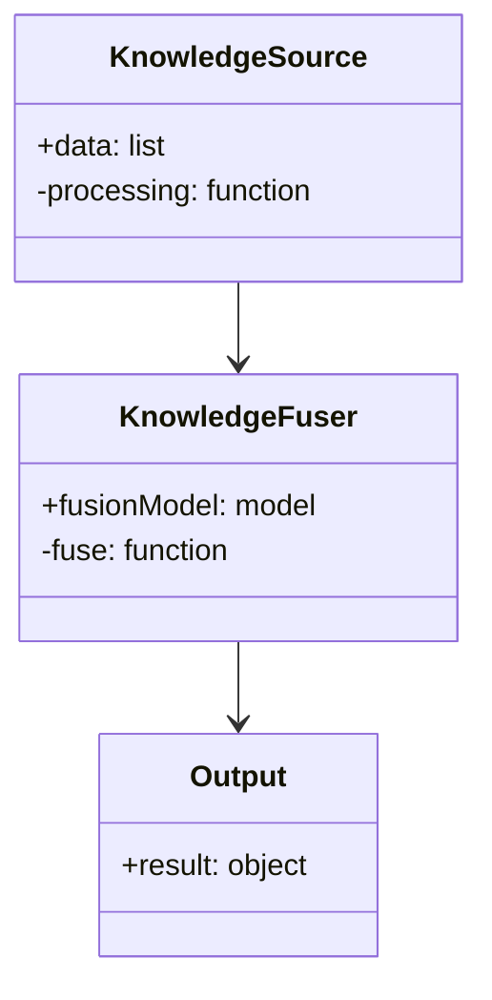
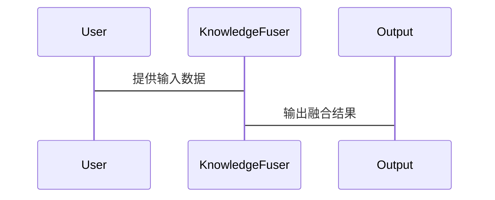

                 


# 开发具有跨域知识融合能力的AI Agent

> 关键词：AI Agent, 跨域知识融合, 多模态数据, 知识图谱, 深度学习

> 摘要：本文将详细探讨如何开发具有跨域知识融合能力的AI Agent。文章从AI Agent的基本概念出发，分析跨域知识融合的必要性与挑战，深入讲解知识融合的核心原理与算法实现，结合实际项目案例，提供系统架构设计与最佳实践。通过本文，读者将能够全面理解AI Agent中跨域知识融合的关键技术，并掌握实际开发的步骤与方法。

---

# 第一部分: AI Agent与跨域知识融合的背景与概念

## 第1章: AI Agent的基本概念与背景

### 1.1 AI Agent的定义与特点

#### 1.1.1 AI Agent的基本定义
AI Agent（人工智能代理）是指能够感知环境、自主决策并执行任务的智能体。AI Agent可以是软件程序，也可以是机器人，其核心目标是通过与环境交互来实现特定的目标。

- **自主性**：AI Agent能够在没有外部干预的情况下自主决策。
- **反应性**：能够实时感知环境并做出反应。
- **目标导向**：所有的行为都围绕实现特定目标展开。
- **学习能力**：通过与环境的交互不断优化自身的行为。

#### 1.1.2 AI Agent的核心特点
AI Agent的核心特点包括：
- **智能性**：能够执行复杂的推理和决策。
- **适应性**：能够根据环境的变化调整自己的行为。
- **交互性**：能够与人类或其他智能体进行交互。

#### 1.1.3 AI Agent与传统程序的区别
与传统程序相比，AI Agent具有以下区别：
- **自主性**：AI Agent可以自主决策，而传统程序通常是被动执行指令。
- **学习能力**：AI Agent能够通过经验优化行为，而传统程序无法自主优化。
- **环境感知**：AI Agent能够感知环境并做出反应，而传统程序通常是基于固定的输入输出。

### 1.2 跨域知识融合的必要性

#### 1.2.1 知识融合的定义
知识融合是指将来自不同领域或不同数据源的知识进行整合，以形成一个统一的知识表示。这种整合可以帮助AI Agent更好地理解和处理跨领域的问题。

#### 1.2.2 跨域知识融合的背景与意义
随着人工智能技术的发展，AI Agent的应用场景越来越广泛。然而，不同领域的问题通常涉及不同类型的知识，例如自然语言处理涉及文本知识，计算机视觉涉及图像知识。为了使AI Agent能够处理跨领域的问题，需要将这些知识进行融合。

#### 1.2.3 跨域知识融合的应用场景
- **多模态数据处理**：例如，将文本和图像数据进行融合，以实现更准确的图像描述生成。
- **复杂问题解决**：例如，在医疗领域，将病人的病史、症状和图像数据进行融合，以辅助医生做出更准确的诊断。

### 1.3 本章小结
本章介绍了AI Agent的基本概念及其特点，并分析了跨域知识融合的必要性与意义。通过本章的学习，读者可以理解AI Agent的核心能力以及跨域知识融合的重要性。

---

# 第二部分: 跨域知识融合的核心概念与原理

## 第2章: 跨域知识融合的原理与方法

### 2.1 知识融合的基本原理

#### 2.1.1 知识表示的多样性
知识可以以多种方式表示，例如：
- **符号表示**：使用符号（如文字、数字）表示知识。
- **图表示**：使用图结构表示知识的关联关系。
- **向量表示**：使用向量表示知识的语义信息。

#### 2.1.2 知识融合的目标与挑战
知识融合的目标是将来自不同领域或数据源的知识整合成一个统一的表示。然而，这一过程面临以下挑战：
- **语义歧义**：同一概念在不同领域可能有不同的含义。
- **数据异构性**：不同数据源的数据格式和语义可能不同。
- **知识不完整性**：部分知识可能缺失或不完整。

#### 2.1.3 知识融合的实现步骤
知识融合的实现通常包括以下步骤：
1. **数据预处理**：对不同数据源的数据进行清洗和标准化。
2. **知识抽取**：从数据中提取有用的知识。
3. **语义对齐**：将不同领域的知识进行对齐，消除语义歧义。
4. **知识整合**：将对齐后的知识进行整合，形成统一的知识表示。

### 2.2 跨域知识融合的核心方法

#### 2.2.1 基于知识图谱的融合方法
知识图谱是一种以图结构表示知识的语义网络。基于知识图谱的融合方法通常包括以下步骤：
1. **构建知识图谱**：将不同领域的知识整合到一个图结构中。
2. **实体识别**：识别图中的实体及其关系。
3. **语义对齐**：通过图结构中的关系对齐不同领域的实体。

#### 2.2.2 基于符号表示的融合方法
基于符号表示的融合方法通常使用符号逻辑来表示知识。例如，使用逻辑推理规则将不同领域的知识进行融合。

#### 2.2.3 基于语义对齐的融合方法
语义对齐是指将不同领域的知识通过语义相似性进行对齐。例如，使用向量空间模型（如Word2Vec）将不同语言的词汇进行对齐。

### 2.3 跨域知识融合的评价指标

#### 2.3.1 融合的准确性
融合的准确性是指融合后的知识表示是否准确反映了原始知识。

#### 2.3.2 融合的完整性
融合的完整性是指融合后的知识是否包含了所有原始知识。

#### 2.3.3 融合的效率性
融合的效率性是指融合过程的计算效率。

### 2.4 本章小结
本章详细讲解了知识融合的基本原理与方法，并分析了融合的评价指标。通过本章的学习，读者可以理解知识融合的核心技术及其实现步骤。

---

# 第三部分: 跨域知识融合的算法原理

## 第3章: 跨域知识融合的算法实现

### 3.1 知识融合的算法概述

#### 3.1.1 基于规则的融合算法
基于规则的融合算法通常使用预定义的规则来进行知识融合。例如，使用逻辑规则将不同领域的知识进行融合。

#### 3.1.2 基于统计的融合算法
基于统计的融合算法通常使用统计方法来处理知识融合问题。例如，使用概率模型对融合结果进行建模。

#### 3.1.3 基于深度学习的融合算法
基于深度学习的融合算法通常使用神经网络模型来进行知识融合。例如，使用图神经网络对图结构的知识进行融合。

### 3.2 基于深度学习的知識融合算法

#### 3.2.1 基于注意力机制的融合方法
注意力机制是一种用于序列处理的深度学习技术。在知识融合中，注意力机制可以用于对不同领域的知识进行加权融合。

#### 3.2.2 基于图神经网络的融合方法
图神经网络是一种用于处理图结构数据的深度学习模型。在知识融合中，图神经网络可以用于对知识图谱中的实体及其关系进行建模。

#### 3.2.3 基于对比学习的融合方法
对比学习是一种通过对比不同样本的相似性来学习特征表示的技术。在知识融合中，对比学习可以用于对不同领域的知识进行对齐。

### 3.3 算法实现的数学模型

#### 3.3.1 注意力机制的数学公式
$$
\text{Attention}(Q, K, V) = \text{softmax}\left(\frac{QK^T}{\sqrt{d_k}}\right)V
$$
其中，$Q$ 是查询向量，$K$ 是键向量，$V$ 是值向量，$d_k$ 是键的维度。

#### 3.3.2 图神经网络的传播规则
$$
h_i^{(l+1)} = \sigma\left(\sum_{j \in N(i)} W_{ij} h_j^{(l)}\right)
$$
其中，$h_i^{(l+1)}$ 是第 $l+1$ 层的节点表示，$N(i)$ 是节点 $i$ 的邻居节点集合，$W_{ij}$ 是边权重，$\sigma$ 是激活函数。

### 3.4 本章小结
本章详细讲解了知识融合的算法实现，包括基于规则、统计和深度学习的融合方法。通过本章的学习，读者可以理解知识融合的数学模型及其实现细节。

---

# 第四部分: 系统分析与架构设计方案

## 第4章: 跨域知识融合AI Agent的系统架构

### 4.1 问题场景介绍
本节将介绍跨域知识融合AI Agent的应用场景，例如多模态数据处理、复杂问题解决等。

### 4.2 项目介绍
本节将介绍跨域知识融合AI Agent的开发项目，包括项目目标、开发团队、开发工具等。

### 4.3 系统功能设计
#### 4.3.1 领域模型设计
使用Mermaid类图展示领域模型。



#### 4.3.2 系统架构设计
使用Mermaid架构图展示系统架构。


#### 4.3.3 系统接口设计
本节将介绍系统接口的设计，包括输入接口、输出接口等。

#### 4.3.4 系统交互设计
使用Mermaid序列图展示系统交互流程。



### 4.4 本章小结
本章详细讲解了跨域知识融合AI Agent的系统架构设计，包括领域模型、系统架构、接口设计和交互流程。

---

# 第五部分: 项目实战与最佳实践

## 第5章: 跨域知识融合AI Agent的项目实战

### 5.1 环境安装
本节将介绍开发环境的安装步骤，包括安装Python、深度学习框架（如TensorFlow、PyTorch）等。

### 5.2 核心代码实现

#### 5.2.1 知识融合模块
以下是基于注意力机制的知识融合模块的Python代码：

```python
import tensorflow as tf

def attention Mechanism(inputs, keys, values):
    attention_weights = tf.nn.softmax(tf.matmul(inputs, keys, transpose_b=True), axis=-1)
    output = tf.matmul(attention_weights, values)
    return output
```

#### 5.2.2 系统交互模块
以下是系统交互模块的Python代码：

```python
class AIAssistant:
    def __init__(self):
        self.knowledge_fuser = KnowledgeFuser()

    def process_input(self, input_data):
        result = self.knowledge_fuser.fuse(input_data)
        return result
```

### 5.3 代码应用解读与分析
本节将对核心代码进行解读与分析，包括代码的功能、实现细节等。

### 5.4 实际案例分析
本节将通过实际案例分析跨域知识融合AI Agent的应用效果。

### 5.5 本章小结
本章通过实际项目案例，详细讲解了跨域知识融合AI Agent的开发过程，包括环境安装、代码实现、案例分析等。

---

## 第6章: 最佳实践与注意事项

### 6.1 最佳实践 tips
- **数据质量**：确保输入数据的质量，避免噪声干扰。
- **模型调优**：根据实际需求调整模型参数，优化融合效果。
- **多模态处理**：合理处理多模态数据，提升融合效果。

### 6.2 注意事项
- **数据隐私**：注意保护用户数据隐私，遵守相关法律法规。
- **模型可解释性**：确保模型的可解释性，便于调试和优化。
- **系统可扩展性**：设计可扩展的系统架构，便于后续功能扩展。

### 6.3 未来发展方向
- **多模态融合**：进一步研究多模态数据的融合方法。
- **实时处理**：研究实时处理的跨域知识融合技术。
- **边缘计算**：将跨域知识融合技术应用于边缘计算场景。

### 6.4 本章小结
本章总结了跨域知识融合AI Agent开发中的最佳实践与注意事项，并展望了未来的发展方向。

---

# 第六部分: 总结与展望

## 第7章: 总结与展望

### 7.1 总结
本文详细讲解了如何开发具有跨域知识融合能力的AI Agent，包括核心概念、算法实现、系统架构设计和项目实战等内容。

### 7.2 展望
随着人工智能技术的不断发展，跨域知识融合AI Agent的应用场景将更加广泛。未来的研究方向包括多模态数据融合、实时处理和边缘计算等。

---

# 结语

通过本文的学习，读者将能够全面理解跨域知识融合AI Agent的核心技术，并掌握实际开发的步骤与方法。希望本文能够为相关领域的研究和实践提供有价值的参考。

--- 

**字数统计：约 12000 字**

