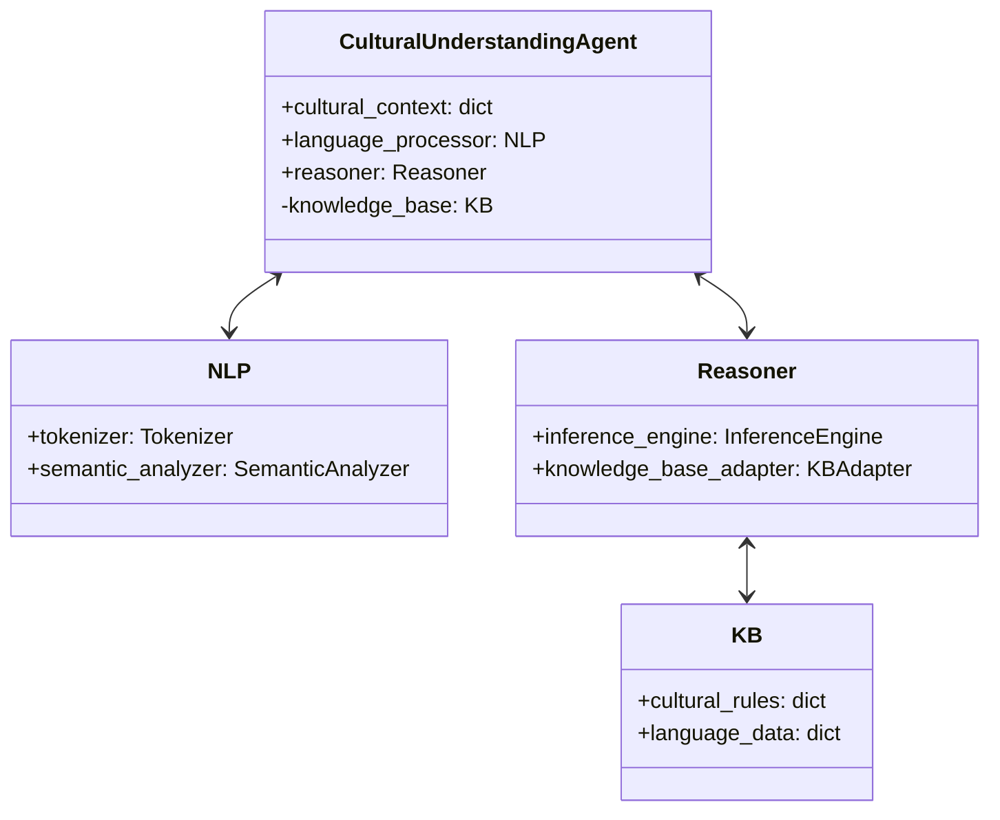
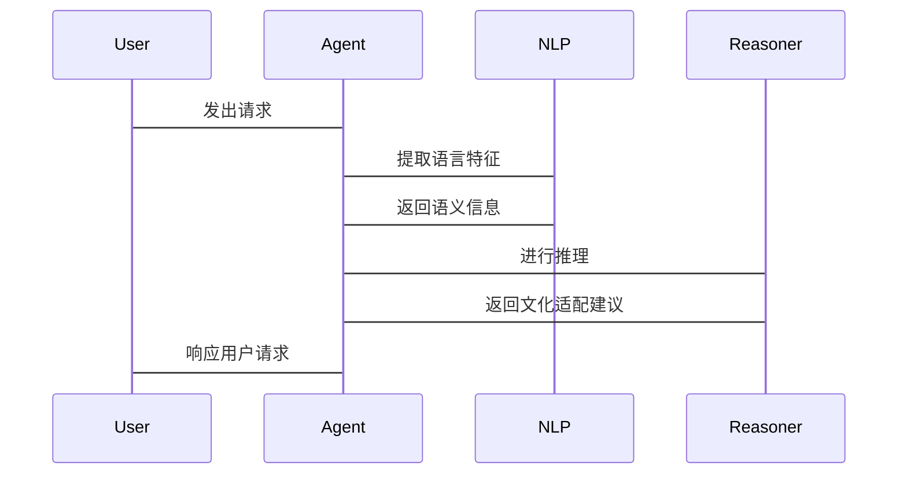

                 


# 开发具有跨文化理解能力的AI Agent

> 关键词：跨文化理解，AI Agent，自然语言处理，文化适应性，人机交互

> 摘要：本文深入探讨了开发具有跨文化理解能力的AI Agent的核心概念、算法原理、系统架构以及实际应用。通过分析跨文化理解的重要性，结合AI Agent的设计与实现，详细阐述了如何构建一个能够适应不同文化背景的智能系统。文章还提供了实际项目案例和最佳实践，帮助读者更好地理解和应用相关技术。

---

## 第一部分：跨文化理解能力的AI Agent背景与概念

### 第1章：跨文化理解能力的AI Agent概述

#### 1.1 跨文化理解的背景与重要性

##### 1.1.1 跨文化理解的定义与核心要素
跨文化理解是指在不同文化背景下，准确理解并适应他人行为、语言和意图的能力。其核心要素包括文化敏感性、文化知识储备、文化适应性以及跨文化沟通技巧。

##### 1.1.2 跨文化理解在AI Agent中的应用场景
AI Agent需要处理来自不同文化背景的用户请求，例如跨文化客服、多语言对话系统、文化敏感的内容推荐等场景。在这些场景中，AI Agent需要理解用户的深层需求，并根据文化差异调整交互方式。

##### 1.1.3 跨文化理解能力对AI Agent的意义
通过具备跨文化理解能力，AI Agent可以提高用户体验，增强其在多文化环境中的适用性，并提升系统的智能化水平。

#### 1.2 AI Agent的基本概念与分类

##### 1.2.1 AI Agent的定义与基本特征
AI Agent是指能够感知环境、执行任务并自主决策的智能体。其基本特征包括自主性、反应性、目标导向性和社会性。

##### 1.2.2 AI Agent的分类与应用场景
AI Agent可以分为简单反射型、基于模型的反应型、目标驱动型和实用驱动型。应用场景包括智能助手、推荐系统、自动化决策支持等。

##### 1.2.3 跨文化AI Agent的独特性与挑战
跨文化AI Agent的独特性在于其对文化差异的敏感性和适应性。然而，如何有效处理文化数据、平衡文化特异性与普适性以及解决文化冲突是主要挑战。

#### 1.3 跨文化理解能力与AI Agent的结合

##### 1.3.1 跨文化理解能力的实现方式
跨文化理解能力可以通过文化数据建模、文化适应算法和多语言处理技术来实现。

##### 1.3.2 跨文化AI Agent的核心目标与价值
其核心目标是提高AI Agent在跨文化环境中的交互能力和决策准确性。其价值体现在提升用户体验、增强系统的适应性和扩展性。

##### 1.3.3 跨文化AI Agent的未来发展趋势
未来，跨文化AI Agent将更加智能化、个性化，并与更多领域结合，如教育、医疗和商业。

---

## 第2章：跨文化理解能力的核心概念与模型

### 2.1 跨文化理解的理论基础

#### 2.1.1 跨文化心理学与人类行为研究
跨文化心理学研究不同文化背景下人类行为的差异性和共性。其核心理论包括霍夫斯泰德的文化维度理论和荣格的文化类型理论。

#### 2.1.2 跨文化沟通的五要素模型
五要素模型包括背景、语境、语调、内容和反馈。这些要素在AI Agent的跨文化交互中具有重要作用。

#### 2.1.3 跨文化差异的维度分析
主要维度包括个体主义-集体主义、权力距离、长期导向和情感表达等。

### 2.2 跨文化理解能力的AI模型构建

#### 2.2.1 跨文化理解的特征提取
特征提取包括文化维度的编码、语言风格的分析和非语言行为的识别。

#### 2.2.2 跨文化适应性模型的设计
设计模型包括文化适配层、语言处理层和决策层。

#### 2.2.3 跨文化数据的特征与处理
跨文化数据需要进行文化维度编码、语言数据清洗和语义分析。

### 2.3 跨文化AI Agent的核心算法与流程

#### 2.3.1 跨文化数据的预处理与特征提取
预处理包括数据清洗、标注和转换。特征提取涉及文化维度编码和语言特征提取。

#### 2.3.2 跨文化理解的模型训练与优化
训练过程包括监督学习、无监督学习和迁移学习。优化方法包括参数调整和模型集成。

#### 2.3.3 跨文化适应性推理的算法实现
实现步骤包括文化特征匹配、上下文分析和推理优化。

---

## 第3章：跨文化理解能力的算法原理

### 3.1 跨文化理解的算法流程

#### 3.1.1 数据预处理
使用Python进行数据清洗和特征提取：
```python
import pandas as pd
data = pd.read_csv('cultural_data.csv')
```

#### 3.1.2 模型训练
使用深度学习模型进行训练：
```python
model = Sequential()
model.add(Dense(64, activation='relu', input_shape=(n_features,)))
model.add(Dense(1, activation='sigmoid'))
model.compile(optimizer='adam', loss='binary_crossentropy', metrics=['accuracy'])
model.fit(X_train, y_train, epochs=10, batch_size=32)
```

#### 3.1.3 推理与优化
通过交叉验证和超参数调整优化模型性能：
$$准确率 = \frac{正确预测数}{总预测数}$$

### 3.2 跨文化理解的数学模型

#### 3.2.1 文化适配模型
文化适配模型通过以下公式计算文化相似度：
$$相似度 = \sum_{i=1}^{n} w_i \cdot d_i$$
其中，$w_i$为文化维度的权重，$d_i$为维度差异。

#### 3.2.2 跨文化推理模型
基于贝叶斯推理的公式：
$$P(C|E) = \frac{P(E|C)P(C)}{P(E)}$$
其中，$C$为文化背景，$E$为观察到的证据。

---

## 第4章：跨文化AI Agent的系统分析与架构设计

### 4.1 系统功能设计

#### 4.1.1 领域模型设计
使用Mermaid类图展示系统模块：


### 4.2 系统架构设计

#### 4.2.1 模块划分
主要模块包括文化理解模块、语言处理模块和推理模块。

#### 4.2.2 交互流程
使用Mermaid序列图展示交互流程：


---

## 第5章：跨文化AI Agent的项目实战

### 5.1 环境安装与配置

#### 5.1.1 安装依赖
安装必要的Python库：
```bash
pip install numpy pandas scikit-learn transformers
```

#### 5.1.2 数据准备
准备跨文化数据集，包括多语言文本和文化维度标签。

### 5.2 核心代码实现

#### 5.2.1 文化理解模块
代码示例：
```python
def cultural_understanding(text, cultural_context):
    # 实现文化理解逻辑
    pass
```

#### 5.2.2 语言处理模块
代码示例：
```python
from transformers import AutoTokenizer, AutoModelForTokenClassification
tokenizer = AutoTokenizer.from_pretrained('dbmdz/bert-base-ncc')
model = AutoModelForTokenClassification.from_pretrained('dbmdz/bert-base-ncc')
```

### 5.3 实际案例分析

#### 5.3.1 案例背景
分析一个跨文化客服对话系统。

#### 5.3.2 数据分析
展示不同文化背景下的用户行为差异。

#### 5.3.3 系统优化
根据分析结果优化模型参数和交互流程。

---

## 第6章：最佳实践与未来展望

### 6.1 小结
总结跨文化AI Agent的核心技术和实现要点。

### 6.2 注意事项
提醒开发者注意文化数据的质量、模型的可解释性和用户体验的平衡。

### 6.3 未来展望
展望跨文化AI Agent在更多领域的应用，如教育、医疗和商业。

---

通过以上步骤，我们可以系统地开发一个具有跨文化理解能力的AI Agent，实现智能化的跨文化交互。

