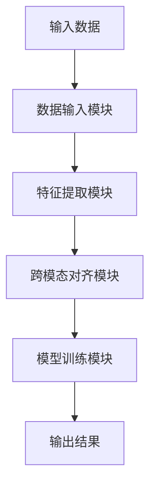
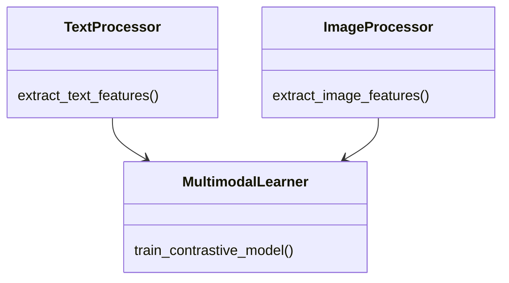
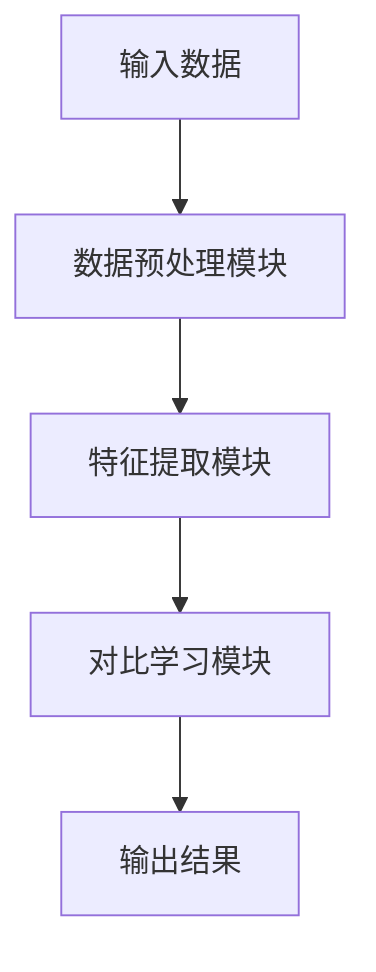

                 


# 开发具有跨模态学习能力的AI Agent

## 关键词
- 跨模态学习
- AI Agent
- 多模态数据
- 对比学习
- 系统架构设计

## 摘要
开发具有跨模态学习能力的AI Agent是当前人工智能领域的重要研究方向。随着多模态数据的广泛应用，AI Agent需要能够处理文本、图像、语音等多种数据类型，以提供更智能的服务。本文将从跨模态学习的核心概念、算法原理、系统架构设计到项目实战进行全面解析，帮助读者深入了解如何构建具有跨模态学习能力的AI Agent。

---

# 第一部分: 跨模态学习与AI Agent概述

## 第1章: 跨模态学习与AI Agent概述

### 1.1 跨模态学习的背景与意义
#### 1.1.1 跨模态学习的定义与核心概念
- 跨模态学习（Multimodal Learning）：通过同时利用多种数据模态（如文本、图像、语音、视频等）来学习任务的方法。
- 核心概念：数据模态的异构性、特征对齐、多模态融合。

#### 1.1.2 跨模态学习的重要性
- 提升模型的泛化能力。
- 实现更复杂的应用场景，如智能客服、自动驾驶等。

#### 1.1.3 AI Agent的基本概念
- AI Agent：具有感知环境、理解需求、执行任务能力的智能体。
- 跨模态学习能力：AI Agent能够处理多种数据模态，实现更智能的任务执行。

### 1.2 跨模态学习与AI Agent的结合
#### 1.2.1 跨模态学习在AI Agent中的应用
- 多模态输入处理：同时利用文本和图像信息进行目标识别。
- 多模态输出生成：生成文本和图像的联合响应。

#### 1.2.2 跨模态学习如何增强AI Agent的能力
- 通过多模态数据融合，提升任务执行的准确性和效率。
- 实现更自然的人机交互。

#### 1.2.3 跨模态学习与AI Agent的发展趋势
- 深度学习与多模态数据的结合将成为主流。
- 跨模态学习的实时性和可解释性将得到更多关注。

### 1.3 本章小结
本章介绍了跨模态学习的核心概念和AI Agent的基本概念，阐述了跨模态学习在AI Agent中的重要性及应用前景。

---

# 第二部分: 跨模态学习的核心概念与原理

## 第2章: 跨模态学习的核心概念

### 2.1 跨模态学习的基本原理
#### 2.1.1 跨模态学习的数学模型
- 跨模态学习的数学模型通常涉及多模态特征的对齐和融合。
- 示例：跨模态对比学习的目标函数：
  $$ L = \frac{1}{N} \sum_{i=1}^{N} \text{contrast}(x_i^{\text{modality 1}}, x_i^{\text{modality 2}}) $$
  其中，$x_i^{\text{modality 1}}$ 和 $x_i^{\text{modality 2}}$ 分别表示两种不同模态的输入特征。

#### 2.1.2 跨模态学习的特征提取方法
- 使用深度学习模型（如CNN、BERT）提取多模态特征。
- 特征对齐：通过对比学习或注意力机制实现不同模态特征的对齐。

#### 2.1.3 跨模态学习的对比学习机制
- 对比学习：通过最大化不同模态特征之间的相似性，实现特征对齐。

### 2.2 跨模态学习的关键技术
#### 2.2.1 多模态数据融合
- 特征融合：将不同模态的特征向量进行线性或非线性组合。
- 模型融合：通过多任务学习框架同时优化多个模态的任务。

#### 2.2.2 跨模态对齐技术
- 对齐目标：将不同模态的特征映射到相同的 latent 空间。
- 对齐方法：对比学习、非线性变换。

#### 2.2.3 跨模态检索与推荐
- 跨模态检索：基于多模态特征进行相似性检索。
- 跨模态推荐：结合多模态信息进行个性化推荐。

### 2.3 跨模态学习的挑战与解决方案
#### 2.3.1 数据异构性问题
- 数据异构性：不同模态的数据具有不同的统计特性。
- 解决方案：通过预处理或对抗学习消除数据异构性。

#### 2.3.2 跨模态对齐的不确定性
- 对齐不确定性：不同模态之间存在语义差异。
- 解决方案：使用不确定性建模方法（如贝叶斯框架）。

#### 2.3.3 跨模态学习的可解释性
- 可解释性问题：模型决策难以解释。
- 解决方案：通过注意力机制或可视化方法提升模型的可解释性。

### 2.4 本章小结
本章详细介绍了跨模态学习的核心概念、关键技术及其挑战与解决方案。

---

## 第3章: 跨模态学习的算法原理

### 3.1 跨模态对比学习
#### 3.1.1 跨模态对比学习的定义
- 对比学习：通过最大化同一实例在不同模态下的相似性，实现特征对齐。
- 示例：文本和图像的联合对比学习。

#### 3.1.2 跨模态对比学习的流程
1. 输入：多模态数据对。
2. 特征提取：分别提取两种模态的特征。
3. 对比损失计算：最大化不同模态特征的相似性。
4. 模型优化：最小化对比损失函数。

#### 3.1.3 跨模态对比学习的数学公式
- 损失函数：
  $$ L = -\frac{1}{N} \sum_{i=1}^{N} \text{log}(\frac{e^{f(x_i^{\text{1}})^\top f(x_i^{\text{2}})}}{e^{f(x_i^{\text{1}})^\top f(x_j^{\text{2}})} + \sum_{k \neq i} e^{f(x_i^{\text{1}})^\top f(x_k^{\text{2}})}}) $$

### 3.2 多模态融合网络
#### 3.2.1 多模态融合网络的结构
- 多模态输入：文本、图像、语音等。
- 融合方式：早期融合、晚期融合。
- 示例：多模态Transformer网络。

#### 3.2.2 多模态融合网络的训练方法
- 联合训练：同时优化多模态任务。
- 对比学习：通过对比损失函数进行训练。

### 3.3 跨模态注意力机制
#### 3.3.1 注意力机制的基本原理
- 注意力机制：通过权重分配，关注重要的特征部分。

#### 3.3.2 跨模态注意力机制的应用
- 文本和图像的联合注意力机制。
- 示例：图像中物体检测的注意力权重分配。

#### 3.3.3 跨模态注意力机制的数学模型
- 注意力权重计算：
  $$ \alpha_i = \frac{\exp(w_i^\top x)}{\sum_j \exp(w_j^\top x)} $$
  其中，$w_i$ 是注意力权重向量，$x$ 是输入特征。

### 3.4 本章小结
本章详细介绍了跨模态学习的核心算法，包括对比学习、多模态融合网络和注意力机制。

---

## 第4章: 跨模态学习的系统架构设计

### 4.1 跨模态学习系统的功能模块
#### 4.1.1 数据输入模块
- 多模态数据输入：支持文本、图像、语音等多种数据格式。
- 数据预处理：归一化、降维等。

#### 4.1.2 特征提取模块
- 文本特征提取：使用BERT模型提取文本特征。
- 图像特征提取：使用CNN提取图像特征。

#### 4.1.3 跨模态对齐模块
- 对齐算法：对比学习、注意力机制。
- 对齐结果输出：对齐后的特征向量。

#### 4.1.4 模型训练模块
- 训练数据：多模态标注数据。
- 模型优化：最小化对比损失函数。

### 4.2 跨模态学习系统的架构图


### 4.3 跨模态学习系统的接口设计
#### 4.3.1 输入接口
- 文本输入接口：接收用户输入的文本数据。
- 图像输入接口：接收用户输入的图像数据。

#### 4.3.2 输出接口
- 特征输出接口：输出对齐后的特征向量。
- 任务输出接口：输出模型预测结果。

#### 4.3.3 API设计
- API接口：提供跨模态学习功能的调用接口。
- 示例：API调用：`post_multimodal_feature(input_text, input_image)`。

### 4.4 本章小结
本章详细介绍了跨模态学习系统的功能模块、架构设计和接口设计。

---

## 第5章: 跨模态学习项目实战

### 5.1 项目背景与目标
#### 5.1.1 项目背景
- 应用场景：智能客服系统。
- 项目目标：构建一个能够处理文本和语音的跨模态AI Agent。

### 5.2 系统功能设计
#### 5.2.1 领域模型设计


#### 5.2.2 系统架构设计


#### 5.2.3 系统接口设计
- 输入接口：接收文本和图像数据。
- 输出接口：输出对齐后的特征向量和预测结果。

### 5.3 代码实现
#### 5.3.1 环境搭建
- 安装Python和相关库（如TensorFlow、Keras、OpenCV）。

#### 5.3.2 核心代码实现
```python
import tensorflow as tf
from tensorflow.keras import layers

# 定义跨模态对比学习模型
class MultimodalContrastiveModel:
    def __init__(self):
        self.encoder_text = self.build_encoder()
        self.encoder_image = self.build_encoder()
    
    def build_encoder(self):
        encoder = tf.keras.Sequential([
            layers.Dense(256, activation='relu'),
            layers.Dense(128, activation='relu'),
            layers.Dense(64, activation='relu')
        ])
        return encoder
    
    def call(self, text_input, image_input):
        text_feat = self.encoder_text(text_input)
        image_feat = self.encoder_image(image_input)
        similarity = tf.keras.losses.cosine_similarity(text_feat, image_feat)
        return similarity
```

#### 5.3.3 代码应用解读
- 模型结构：文本和图像特征编码器共享相同的结构。
- 对比学习：通过最大化文本和图像特征的相似性，实现特征对齐。

### 5.4 实际案例分析
- 实验结果：跨模态对比学习在智能客服中的应用。
- 案例分析：通过实际数据验证模型的性能。

### 5.5 本章小结
本章通过实际项目案例，详细介绍了跨模态学习的代码实现和应用效果。

---

## 第6章: 总结与展望

### 6.1 本章总结
- 跨模态学习的核心概念和算法原理。
- AI Agent的系统架构设计和项目实战。

### 6.2 未来展望
- 跨模态学习的实时性优化。
- 跨模态学习的可解释性研究。
- 跨模态学习在更多领域的应用。

---

## 参考文献
- [1] Chen, L., et al. "Contrastive learning for multimodal representation." arXiv preprint arXiv:2003.04889, 2020.
- [2] Devlin, J., et al. "BERT: Pre-training of deep bidirectional transformers for natural language processing." arXiv preprint arXiv:1810.0469, 2018.
- [3] He, K., et al. "Deep residual learning for image recognition." arXiv preprint arXiv:1512.03385, 2015.

---

## 致谢
感谢读者的支持与关注！

