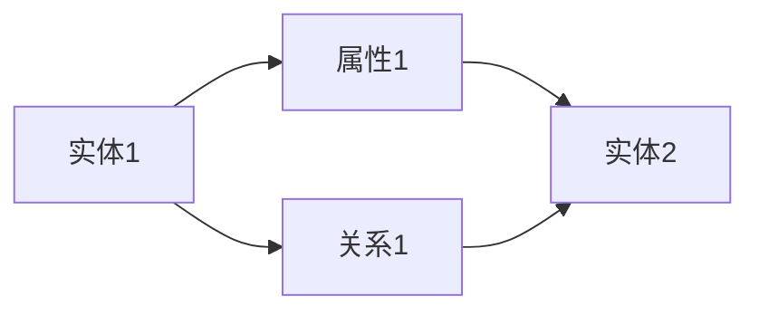
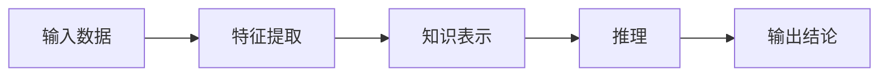
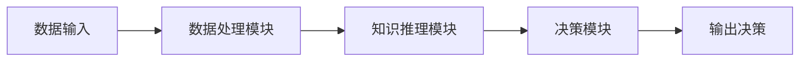

                 


# 开发具有跨模态知识推理与决策能力的AI Agent

> **关键词**：跨模态知识推理，决策能力，AI Agent，深度学习，知识图谱，多模态数据

> **摘要**：  
本文深入探讨了开发具有跨模态知识推理与决策能力的AI Agent的关键技术与实现方法。文章首先介绍了跨模态知识推理与决策的背景与核心概念，然后从算法原理、系统架构设计、项目实战等多个角度详细分析了AI Agent的开发过程。通过结合实际案例，本文展示了如何利用深度学习、知识图谱等技术实现跨模态数据的融合、推理与决策，并提出了具体的实现方案与优化建议。

---

## 第一部分: 背景与核心概念

### 第1章: 背景介绍

#### 1.1 问题背景
跨模态数据指的是来自不同感知模态（如文本、图像、语音、视频等）的数据。随着人工智能技术的发展，AI Agent需要能够处理和理解多种模态的数据，并基于这些数据进行知识推理与决策。然而，跨模态数据的异质性、多样性和复杂性带来了巨大的挑战。

#### 1.2 问题描述
AI Agent需要具备以下能力：
1. **跨模态数据的理解**：能够从多种模态数据中提取有用的信息。
2. **知识推理**：基于提取的知识进行逻辑推理。
3. **决策能力**：根据推理结果做出最优决策。

#### 1.3 问题解决思路
- **跨模态数据融合**：通过将不同模态的数据进行融合，提取统一的语义表示。
- **知识表示与推理**：利用知识图谱等技术，构建可推理的知识结构。
- **决策模型设计**：结合推理结果和环境信息，设计高效的决策机制。

#### 1.4 边界与外延
- **边界**：AI Agent的决策能力仅限于其知识库和推理能力所覆盖的范围。
- **外延**：跨模态知识推理与决策技术可以应用于多个领域，如智能客服、自动驾驶、智能医疗等。

### 第2章: 核心概念与联系

#### 2.1 跨模态知识推理的基本原理
- **知识表示**：通过符号逻辑或嵌入向量表示知识。
- **推理机制**：基于逻辑推理或概率推理，从已知事实中推导出新结论。

#### 2.2 跨模态数据的属性对比
| 属性 | 文本 | 图像 | 语音 |
|------|-----|------|-----|
| 表示方式 | 符号化 | 像素化 | 振幅与频率 |
| 处理难度 | 中等 | 较高 | 中等 |
| 应用场景 | NLP任务 | 图像识别 | 语音助手 |

#### 2.3 实体关系图


---

## 第二部分: 算法原理

### 第3章: 知识表示与推理算法

#### 3.1 知识表示
- **符号逻辑表示**：如谓词逻辑。
- **嵌入向量表示**：如Word2Vec、Graph Embedding。

#### 3.2 推理算法
- **符号逻辑推理**：基于规则的前向推理或反向推理。
- **概率推理**：如马尔可夫逻辑网络（MLN）。
- **深度学习推理**：如基于Transformer的推理模型。

#### 3.3 算法实现


#### 3.4 代码实现
```python
import numpy as np

# 知识图谱构建
class KnowledgeGraph:
    def __init__(self):
        self.nodes = {}
        self.edges = {}

    def add_node(self, node_id, properties):
        self.nodes[node_id] = properties

    def add_edge(self, node1, node2, relation):
        self.edges[(node1, node2)] = relation

# 推理算法实现
class ReasoningAlgorithm:
    def __init__(self, knowledge_graph):
        self.kg = knowledge_graph

    def forward_reasoning(self):
        # 前向推理逻辑
        pass
```

---

### 第4章: 决策模型的设计与实现

#### 4.1 决策模型的核心要素
- **状态空间**：AI Agent所处的环境状态。
- **动作空间**：AI Agent可以执行的动作。
- **奖励函数**：衡量决策优劣的标准。

#### 4.2 决策算法
- **基于规则的决策**：根据预定义的规则进行决策。
- **基于模型的决策**：如马尔可夫决策过程（MDP）。
- **基于深度学习的决策**：如强化学习（RL）。

#### 4.3 强化学习实现
```python
import numpy as np

class DecisionModel:
    def __init__(self, state_space, action_space):
        self.state_space = state_space
        self.action_space = action_space
        self.Q_table = np.zeros((state_space, action_space))

    def choose_action(self, state, epsilon=0.1):
        if np.random.random() < epsilon:
            return np.random.randint(self.action_space)
        return np.argmax(self.Q_table[state])

    def update_Q(self, state, action, reward, alpha=0.1):
        self.Q_table[state, action] = (1 - alpha) * self.Q_table[state, action] + alpha * reward
```

---

## 第三部分: 系统架构与实现

### 第5章: 系统分析与架构设计

#### 5.1 问题场景
AI Agent需要处理多模态数据，并在复杂环境中做出决策。

#### 5.2 系统功能设计
- **数据处理模块**：负责多种模态数据的输入与预处理。
- **知识推理模块**：进行跨模态数据的融合与推理。
- **决策模块**：基于推理结果做出决策。

#### 5.3 系统架构设计


---

## 第四部分: 项目实战与优化

### 第6章: 项目实战

#### 6.1 环境安装
- 安装必要的库：如TensorFlow、Keras、networkx等。

#### 6.2 核心代码实现
```python
# 知识图谱构建
from networkx import Graph

def build_knowledge_graph(data):
    g = Graph()
    for item in data:
        g.add_edge(item['head'], item['tail'], relation=item['relation'])
    return g

# 推理与决策
def make_decision(graph, state):
    # 简单的决策逻辑
    if state in graph.nodes:
        return graph.nodes[state]['preferred_action']
    else:
        return 'default_action'
```

#### 6.3 案例分析
- **案例1**：文本与图像的联合推理。
- **案例2**：语音与文本的联合决策。

---

## 第五部分: 总结与展望

### 第7章: 总结与展望

#### 7.1 最佳实践
- **数据质量**：确保输入数据的准确性和完整性。
- **模型优化**：不断优化推理与决策算法，提升性能。

#### 7.2 小结
本文详细介绍了开发具有跨模态知识推理与决策能力的AI Agent的关键技术与实现方法，为后续研究提供了理论基础和实践指导。

#### 7.3 注意事项
- **数据隐私**：注意数据的安全与隐私保护。
- **模型泛化能力**：确保模型具有良好的泛化能力。

#### 7.4 拓展阅读
推荐阅读相关领域的最新论文和书籍，如《Deep Learning》、《Artificial Intelligence: A Modern Approach》等。

---

通过以上思考步骤，我们可以系统地开发具有跨模态知识推理与决策能力的AI Agent，并在实际应用中不断优化和改进。

