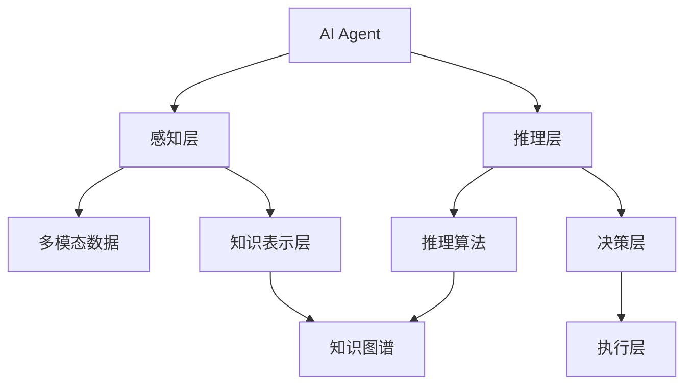
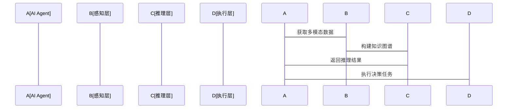

                 


# 开发具有跨模态知识推理能力的AI Agent

## 关键词：跨模态知识推理，AI Agent，多模态数据处理，知识图谱，智能系统设计

## 摘要：  
本文详细探讨了开发具有跨模态知识推理能力的AI Agent的关键技术与实现方法。从问题背景、核心概念、算法原理到系统架构设计，再到项目实战，系统性地阐述了跨模态知识推理在AI Agent中的应用与实现。通过具体的案例分析和代码实现，展示了如何构建一个能够处理多种模态数据并进行知识推理的智能系统。

---

## 第一部分: 背景介绍

### 第1章: 跨模态知识推理与AI Agent概述

#### 1.1 背景与问题背景  
跨模态知识推理是指在处理多种数据模态（如文本、图像、语音等）时，通过结合不同模态的信息进行知识表示和推理的过程。AI Agent（智能体）是一种能够感知环境、执行任务并做出决策的智能系统。随着人工智能技术的快速发展，跨模态知识推理在AI Agent中的应用越来越重要。  

当前，AI Agent广泛应用于自然语言处理、计算机视觉、机器人控制等领域。然而，现有AI Agent在处理复杂任务时，往往受限于单一模态的数据处理能力，难以充分利用多模态信息进行深层次的知识推理。因此，开发具有跨模态知识推理能力的AI Agent成为了一个重要的研究方向。

#### 1.2 问题描述与目标  
本文旨在解决以下问题：  
1. 如何有效地整合多种模态数据，构建跨模态知识表示模型？  
2. 如何设计高效的推理算法，实现跨模态知识推理？  
3. 如何将跨模态知识推理技术应用于实际的AI Agent系统中，提升其智能性和任务执行能力？  

通过解决上述问题，本文的目标是开发一个能够处理多种模态数据、具备跨模态知识推理能力的AI Agent系统。

#### 1.3 问题解决思路  
为实现跨模态知识推理，本文采用以下思路：  
1. **数据整合**：通过多模态数据融合技术，将文本、图像、语音等多种模态数据整合为统一的知识表示形式。  
2. **知识表示**：构建跨模态知识图谱，将不同模态的数据通过语义关联进行连接，形成语义网络。  
3. **推理算法设计**：基于概率图模型和符号逻辑推理，设计跨模态知识推理算法，实现从多模态数据中推导出新的知识。  
4. **系统实现**：将上述技术整合到AI Agent系统中，设计高效的系统架构和接口，实现跨模态知识推理功能。

#### 1.4 边界与外延  
跨模态知识推理的边界在于如何处理不同模态数据之间的关联性。本文主要关注文本、图像和语音三种模态的数据处理，不涉及其他模态（如视频、传感器数据等）。AI Agent的应用场景主要集中在智能助手、机器人控制和智能客服等领域，本文将重点分析这些场景中的跨模态推理需求。

#### 1.5 核心概念与结构  
跨模态知识推理的核心概念包括：  
1. **多模态数据**：指多种数据形式，如文本、图像、语音等。  
2. **知识表示**：通过知识图谱等结构化形式表示知识。  
3. **推理算法**：基于概率图模型和符号逻辑的推理方法。  

AI Agent的结构包括感知层、推理层和执行层，跨模态知识推理主要在推理层中实现。

---

## 第二部分: 跨模态知识推理的核心概念与联系

### 第2章: 跨模态知识推理原理

#### 2.1 跨模态数据处理  
跨模态数据处理的目标是将不同模态的数据整合为统一的表示形式。常用的方法包括：  
1. **模态对齐**：通过特征提取和对齐技术，将不同模态的数据映射到同一个特征空间。  
2. **模态融合**：将多种模态的数据进行融合，形成更丰富的语义表示。  

例如，对于图像和文本的跨模态数据，可以通过图像特征提取和文本嵌入对齐，构建统一的语义表示。

#### 2.2 知识表示与推理  
知识表示的核心是构建知识图谱。知识图谱由节点（实体）和边（关系）组成，能够表示复杂的语义关系。跨模态知识推理的目标是通过推理算法，从知识图谱中推导出新的知识。

#### 2.3 跨模态推理的数学模型  
跨模态推理可以基于概率图模型或符号逻辑推理实现。例如，基于概率图模型的推理可以通过贝叶斯网络进行条件概率计算。符号逻辑推理则可以通过谓词逻辑表达知识，并通过逻辑推理规则进行推导。

#### 2.4 跨模态推理与AI Agent的关系  
跨模态推理是AI Agent的核心能力之一，能够提升其理解和决策能力。通过跨模态推理，AI Agent可以更好地理解复杂场景，并做出更智能的决策。

---

## 第三部分: 跨模态知识推理的算法原理

### 第3章: 跨模态知识推理算法

#### 3.1 跨模态数据融合算法  
跨模态数据融合算法包括：  
1. **多模态对齐**：通过深度学习模型（如多模态对比学习）对齐不同模态的特征。  
2. **融合策略**：如加权融合、注意力机制等，将不同模态的信息进行综合。  

例如，多模态对比学习可以通过对比损失函数将不同模态的数据对齐到同一个特征空间。

#### 3.2 知识推理算法  
知识推理算法包括：  
1. **基于概率图模型的推理**：如贝叶斯网络，用于计算条件概率。  
2. **基于符号逻辑的推理**：如谓词逻辑推理，用于推导逻辑关系。  

例如，谓词逻辑推理可以通过规则库和推理规则，从知识图谱中推导出新的事实。

#### 3.3 跨模态推理算法的实现  
跨模态推理算法的实现步骤包括：  
1. 数据预处理：对不同模态的数据进行特征提取和对齐。  
2. 知识图谱构建：将特征表示和语义关系整合到知识图谱中。  
3. 推理推理：基于推理算法，从知识图谱中推导出新的知识。  

---

## 第四部分: 跨模态知识推理系统的架构设计

### 第4章: 系统架构设计

#### 4.1 系统功能设计  
AI Agent的系统功能包括：  
1. **数据感知**：通过传感器或接口获取多模态数据。  
2. **知识表示**：将多模态数据整合到知识图谱中。  
3. **推理推理**：通过推理算法进行跨模态知识推理。  
4. **决策执行**：根据推理结果做出决策并执行任务。  

#### 4.2 系统架构图  


#### 4.3 系统接口设计  
系统接口包括：  
1. 数据接口：用于获取多模态数据。  
2. 知识图谱接口：用于构建和查询知识图谱。  
3. 推理接口：用于执行跨模态推理。  

#### 4.4 系统交互流程  


---

## 第五部分: 项目实战

### 第5章: 项目实战

#### 5.1 项目介绍  
本项目旨在开发一个多模态智能助手，能够处理文本、图像和语音三种模态的数据，并通过跨模态知识推理实现智能问答和任务执行。

#### 5.2 环境安装  
项目依赖：Python 3.8及以上，TensorFlow 2.0及以上，NLTK，OpenCV。

#### 5.3 系统核心实现  
1. **数据处理**：实现多模态数据的预处理和对齐。  
2. **知识图谱构建**：将多模态数据整合到知识图谱中。  
3. **推理算法实现**：实现基于概率图模型的推理算法。  

#### 5.4 代码实现  
```python
import tensorflow as tf
import numpy as np

# 多模态对齐示例代码
def modal_alignment(text_data, image_data):
    text_embedder = TextEmbedder()
    image_embedder = ImageEmbedder()
    text_embeddings = text_embedder.embed(text_data)
    image_embeddings = image_embedder.embed(image_data)
    aligned_embeddings = align(text_embeddings, image_embeddings)
    return aligned_embeddings

# 知识图谱构建示例代码
class KnowledgeGraph:
    def __init__(self):
        self.nodes = {}
        self.edges = {}
    
    def add_node(self, node_id, label):
        self.nodes[node_id] = label
    
    def add_edge(self, node1, node2, relation):
        self.edges[(node1, node2)] = relation

# 推理算法实现示例代码
def cross_modal_reasoning(kg, query):
    # 基于概率图模型的推理
    pass
```

#### 5.5 案例分析  
通过具体的案例分析，展示跨模态知识推理在智能问答中的应用。例如，用户输入一个文本问题和相关图像，系统通过跨模态推理生成答案。

---

## 第六部分: 总结与展望

### 第6章: 总结与展望

#### 6.1 最佳实践  
1. 数据预处理是跨模态推理的关键，建议采用深度学习模型进行特征对齐。  
2. 知识图谱的构建需要考虑语义关联，可以通过领域专家知识进行优化。  
3. 推理算法的选择应根据具体任务需求进行调整，如概率图模型适用于不确定性推理，符号逻辑推理适用于确定性推理。  

#### 6.2 小结  
本文详细探讨了开发具有跨模态知识推理能力的AI Agent的关键技术与实现方法。通过理论分析和项目实战，展示了如何构建一个高效的跨模态推理系统。

#### 6.3 注意事项  
1. 数据隐私问题需要注意，尤其是在处理多模态数据时。  
2. 系统架构设计需要考虑扩展性，以便未来增加新的模态数据或推理算法。  

#### 6.4 拓展阅读  
1. 《Probabilistic Graphical Models》  
2. 《Knowledge Representation and Reasoning》  

---

以上是《开发具有跨模态知识推理能力的AI Agent》的完整目录和文章内容大纲，涵盖了从背景介绍到项目实战的各个方面。

