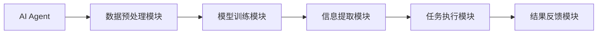
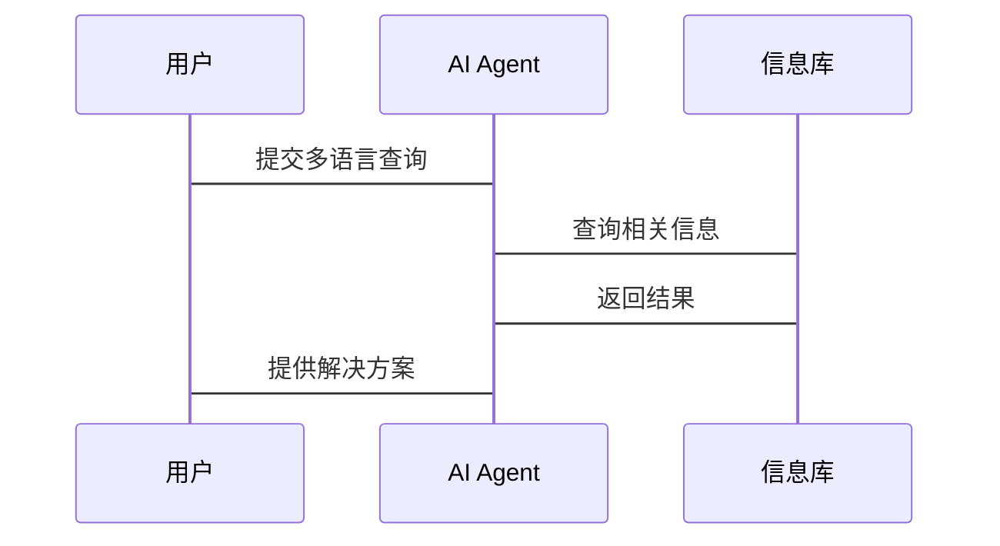

                 


# 开发具有跨语言信息提取能力的AI Agent

> 关键词：跨语言信息提取，AI Agent，自然语言处理，多语言模型，深度学习

> 摘要：本文详细探讨了开发具有跨语言信息提取能力的AI Agent的关键技术与实现方法。通过分析跨语言信息提取的核心问题，结合AI Agent的功能架构，介绍了多语言模型的训练流程、算法实现、系统设计及项目实战。文章内容涵盖背景介绍、核心概念、算法原理、系统架构、项目实战、最佳实践等，旨在为读者提供全面的技术指导。

---

## 第一部分：跨语言信息提取与AI Agent概述

### 第1章：背景介绍

#### 1.1 问题背景
跨语言信息提取是指在多种语言环境下，从文本中提取特定信息的过程。随着全球化的发展，跨语言信息处理的需求日益增加，尤其是在客服、电子商务、多语言文档处理等领域。AI Agent作为智能助手，需要能够理解并处理多种语言的信息，以提供高效的服务。

#### 1.2 问题描述
AI Agent的核心功能包括信息提取、语义理解、任务执行等。在跨语言场景下，AI Agent需要能够处理不同语言的文本，提取关键信息并进行后续处理。然而，不同语言的语法结构、文化差异等因素增加了信息提取的难度。

#### 1.3 核心概念与联系
跨语言信息提取的核心概念包括：
1. 多语言模型：能够处理多种语言的自然语言处理模型。
2. 信息提取：从文本中抽取特定实体或关系的过程。
3. AI Agent：具备智能决策和执行能力的软件系统。

通过对比单语言模型和多语言模型，可以发现多语言模型在资源利用率和通用性方面具有优势，但性能可能略逊于专精某一语言的模型。

### 第2章：核心概念与联系

#### 2.1 跨语言信息提取模型对比
| 模型类型 | 优缺点 | 适用场景 |
|---------|--------|----------|
| 单语言模型 | 专精某一语言，准确率高 | 单语言任务 |
| 多语言模型 | 通用性强，资源利用率高 | 跨语言任务 |

#### 2.2 AI Agent的功能架构
AI Agent的功能模块包括：
1. 自然语言处理模块：负责文本的理解和分析。
2. 跨语言信息提取模块：提取多语言文本中的关键信息。
3. 任务执行模块：根据提取的信息执行相应任务。
4. 结果反馈模块：将处理结果反馈给用户。

### 第3章：跨语言信息提取算法原理

#### 3.1 算法原理概述
多语言模型的训练流程包括预处理、特征提取和模型预测。预处理阶段对多语言文本进行清洗和标注，特征提取阶段利用深度学习模型提取文本特征，模型预测阶段基于训练好的模型进行信息提取。

#### 3.2 算法实现代码示例
以下是使用Python实现的多语言文本预处理代码：

```python
import pandas as pd
from sklearn.preprocessing import LabelEncoder

# 加载数据
data = pd.read_csv('multilingual_data.csv')

# 标签编码
label_encoder = LabelEncoder()
data['label'] = label_encoder.fit_transform(data['label'])

# 文本预处理
def preprocess(text):
    import re
    # 去除特殊字符
    text = re.sub(r'[^\w\s]', '', text)
    return text

data['preprocessed_text'] = data['text'].apply(preprocess)
```

#### 3.3 数学模型与公式
多语言模型的损失函数通常采用交叉熵损失：

$$ L = -\frac{1}{N}\sum_{i=1}^{N} \sum_{j=1}^{M} y_{ij} \log(p_{ij}) $$

其中，$N$ 是样本数量，$M$ 是类别数量，$y_{ij}$ 是标签，$p_{ij}$ 是预测概率。

---

## 第二部分：系统分析与架构设计

### 第4章：系统分析与架构设计

#### 4.1 问题场景介绍
跨语言信息提取的场景包括多语言客服支持、跨语言文档处理等。以客服支持为例，AI Agent需要能够理解用户的问题，并提取关键信息（如问题类型、关键词）以提供解决方案。

#### 4.2 系统功能设计
系统功能模块包括：
1. 数据预处理模块：清洗和标注多语言文本。
2. 模型训练模块：训练多语言信息提取模型。
3. 信息提取模块：从输入文本中提取关键信息。
4. 任务执行模块：根据提取的信息执行任务。

#### 4.3 系统架构设计
系统架构采用模块化设计，各模块之间通过接口进行通信。以下是系统架构图：



#### 4.4 接口设计与交互流程图
以下是系统交互流程图：



---

## 第三部分：项目实战

### 第5章：项目实战

#### 5.1 环境安装
开发跨语言信息提取系统需要安装以下环境：
- Python 3.8+
- TensorFlow 2.5+
- scikit-learn 0.24+
- NLTK 3.6+

#### 5.2 系统核心实现

以下是核心代码示例：

```python
import tensorflow as tf
from tensorflow.keras import layers

# 定义多语言模型
def build_model(num_classes):
    model = tf.keras.Sequential([
        layers.Embedding(input_dim=10000, output_dim=16),
        layers.LSTM(64, return_sequences=False),
        layers.Dense(num_classes, activation='softmax')
    ])
    return model

# 训练模型
model = build_model(num_classes=5)
model.compile(optimizer='adam', loss='sparse_categorical_crossentropy', metrics=['accuracy'])
model.fit(X_train, y_train, epochs=10, batch_size=32)
```

#### 5.3 代码解读与分析
- `build_model`函数定义了多语言模型的结构，包括嵌入层、LSTM层和全连接层。
- `model.fit`进行模型训练，使用Adam优化器和交叉熵损失函数。
- 模型训练完成后，可以用于多语言文本的信息提取。

#### 5.4 实际案例分析
以客服支持为例，AI Agent需要从用户的多语言查询中提取关键词并提供解决方案。例如，用户提交的西班牙语查询“Mi pedido no ha llegado”，AI Agent需要提取关键词“pedido”并提供解决方案。

#### 5.5 项目小结
通过项目实战，读者可以掌握跨语言信息提取系统的开发流程，包括环境搭建、模型训练和系统部署。

---

## 第四部分：最佳实践与总结

### 第6章：最佳实践

#### 6.1 小结
跨语言信息提取的开发需要结合深度学习和自然语言处理技术，同时注重模型的泛化能力和处理效率。

#### 6.2 注意事项
- 数据预处理阶段需要考虑多语言文本的特殊性。
- 模型训练时需要平衡不同语言的数据分布。
- 系统设计时要注重模块化和可扩展性。

#### 6.3 未来趋势
未来，跨语言信息提取将更加依赖大模型和微调技术，同时在多模态信息处理方面有更大的发展空间。

#### 6.4 拓展阅读
推荐阅读《Deep Learning for NLP》和《Multi-Language Natural Language Processing》等书籍。

---

## 第五部分：总结

### 第7章：总结

跨语言信息提取是AI Agent开发中的重要技术，通过本文的讲解，读者可以系统地掌握开发流程和实现方法。从背景介绍到系统设计，再到项目实战，本文为读者提供了全面的技术指导。未来，随着技术的发展，跨语言信息提取将更加智能化和高效化。

---

通过以上步骤，您可以逐步完成《开发具有跨语言信息提取能力的AI Agent》这篇文章的撰写。

