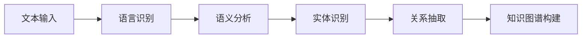
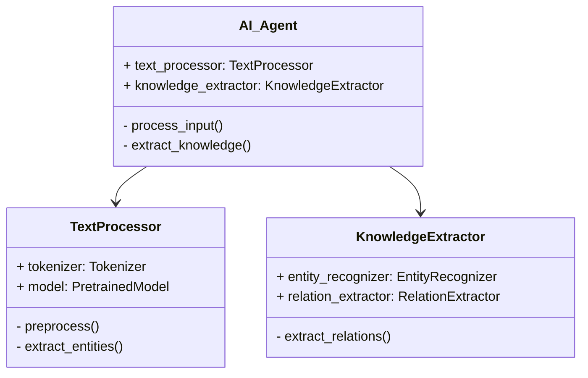
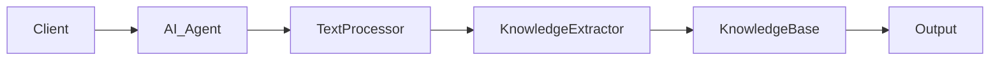
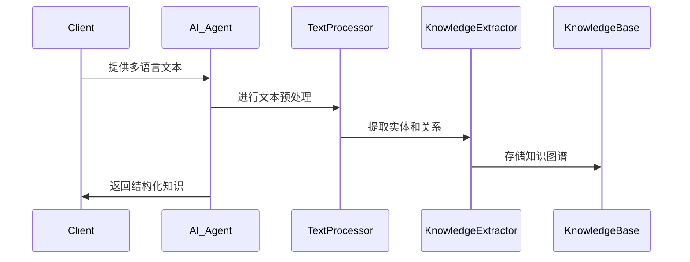

                 


# 开发具有跨语言知识抽取能力的AI Agent

## 关键词：跨语言知识抽取，AI Agent，自然语言处理，知识图谱，多语言模型

## 摘要：  
本文探讨如何开发一种能够处理多种语言的AI Agent，专注于从跨语言文本中提取知识。通过分析跨语言知识抽取的核心原理、算法实现和系统架构，结合实际案例，为读者提供从理论到实践的全面指导，帮助构建高效、准确的跨语言知识抽取系统。

---

# 第一部分: 背景介绍

## 第1章: 问题背景

### 1.1 多语言信息处理的需求  
在当今全球化背景下，信息呈现多语言化趋势，跨语言知识抽取成为解决信息孤岛的重要手段。AI Agent需要能够处理多种语言的文本，提取其中的知识，以支持跨语言信息处理和决策。

### 1.2 知识抽取的挑战  
跨语言知识抽取面临语言差异、文化差异和语义复杂性等挑战。不同语言的语法结构、词汇差异以及文化背景会影响知识抽取的准确性。

### 1.3 AI Agent的定义与目标  
AI Agent是一种智能代理，能够感知环境、理解任务需求，并通过执行一系列操作完成目标。其目标是实现跨语言知识抽取的自动化和高效性。

---

## 第2章: 问题描述

### 2.1 跨语言知识抽取的核心问题  
如何从多种语言的文本中准确提取知识，并构建统一的知识图谱？  
- 解决方案：利用预训练多语言模型和跨语言迁移学习技术。

### 2.2 AI Agent在跨语言场景中的角色  
AI Agent作为协调者，负责接收跨语言任务、调用知识抽取模块，并将结果整合输出。  
- 例如：处理多语言客服请求，自动提取关键信息。

### 2.3 当前技术的局限性  
- 数据稀疏性：某些语言的标注数据不足。  
- 跨语言模型的适应性：如何在低资源语言中保持准确性？  
- 知识抽取的可解释性：跨语言抽取结果需具备可解释性。

---

## 第3章: 问题解决思路

### 3.1 跨语言模型的应用场景  
- 多语言文本分类、命名实体识别（NER）、关系抽取。  
- 实例：从多语言社交媒体数据中提取情感分析结果。

### 3.2 知识抽取的实现方法  
- 基于规则：利用语言学规则提取实体。  
- 基于统计：利用模式匹配和机器学习模型。  
- 基于深度学习：利用预训练模型如BERT、Marian-NMT进行跨语言抽取。

### 3.3 AI Agent的架构设计  
- 模块化设计：知识抽取模块、自然语言理解模块、推理模块。  
- 跨语言接口：支持多种语言输入输出。

---

# 第二部分: 跨语言知识抽取的核心概念与联系

## 第4章: 跨语言知识抽取原理

### 4.1 跨语言模型的工作原理  
- 多语言模型的训练机制：联合训练多语言任务，共享语言特征。  
- 跨语言迁移学习：利用一种或几种语言的数据，迁移到其他语言。  
- 预训练模型的适应性调整：微调模型以适应目标语言。

### 4.2 知识抽取方法对比  
| 方法 | 描述 | 优缺点 |  
|------|------|--------|  
| 基于规则 | 使用语言学规则提取实体 | 易维护，但规则难以覆盖所有场景 |  
| 基于统计 | 利用模式匹配和机器学习 | 效率高，但依赖数据质量 |  
| 基于深度学习 | 利用预训练模型 | 高准确性，但需要大量数据 |  

### 4.3 跨语言抽取的实体关系图  


---

## 第5章: AI Agent的核心概念

### 5.1 AI Agent的定义与功能  
- 定义：智能代理，感知环境、理解需求、执行任务。  
- 核心功能：知识抽取、推理、决策、交互。  

### 5.2 跨语言能力对AI Agent的影响  
- 任务处理：支持多语言输入输出，提升用户体验。  
- 系统架构：需要设计多语言接口和跨语言处理模块。  

### 5.3 跨语言知识抽取与AI Agent的结合  
- 知识抽取是AI Agent的核心能力，支持跨语言任务处理。  
- 例如：从多语言文档中提取关键信息，辅助决策。

---

# 第三部分: 跨语言知识抽取的算法实现

## 第6章: 算法原理

### 6.1 算法选择  
选择基于深度学习的跨语言知识抽取算法，如利用多语言预训练模型进行微调。  

### 6.2 算法流程  


### 6.3 算法实现代码  
```python
import transformers
from transformers import AutoTokenizer, AutoModelForMaskedLM

# 加载预训练的多语言模型
model_name = "bert-base-multilingual-cased"
tokenizer = AutoTokenizer.from_pretrained(model_name)
model = AutoModelForMaskedLM.from_pretrained(model_name)

# 示例文本
text = "Le chatbot est une innovation révolutionnaire."
inputs = tokenizer(text, return_tensors="pt")

# 提取隐藏层表示
outputs = model(**inputs)
hidden_states = outputs.last_hidden_state
```

### 6.4 数学模型  
注意力机制公式：  
$$\text{Attention}(Q, K, V) = \text{softmax}\left(\frac{QK^T}{\sqrt{d_k}}\right)V$$  
其中，$Q$、$K$、$V$分别为查询、键、值向量，$d_k$为键的维度。

---

## 第7章: 系统架构设计

### 7.1 问题场景介绍  
设计一个支持多语言知识抽取的AI Agent系统，用于从多种语言的文档中提取实体和关系。

### 7.2 领域模型设计  


### 7.3 系统架构设计  


### 7.4 接口设计  
- 输入接口：接受多种语言的文本输入。  
- 输出接口：提供结构化知识输出，如JSON格式。  

### 7.5 交互设计  


---

## 第8章: 项目实战

### 8.1 环境安装  
安装必要的库：  
```bash
pip install transformers
pip install mermaid
```

### 8.2 核心代码实现  
```python
# 安装多语言模型
from transformers import pipeline

# 初始化实体识别 pipeline
ner_pipeline = pipeline("ner", model="dbmdz/bert-base-nl", tokenizer="dbmdz/bert-base-nl")

# 处理多语言文本
text_en = "The company was founded in 2020."
text_es = "La empresa fue fundada en 2020."

# 提取实体
result_en = ner_pipeline(text_en)
result_es = ner_pipeline(text_es)
```

### 8.3 代码解读与分析  
- 使用预训练的多语言模型进行实体识别。  
- 返回提取的实体及其标签。

### 8.4 实际案例分析  
案例：从中文和英文新闻中提取公司名称和成立时间。  
- 输入文本：中文和英文新闻。  
- 输出结果：提取的实体信息。

### 8.5 项目小结  
通过实际案例，展示了AI Agent在跨语言知识抽取中的应用，验证了系统的可行性和准确性。

---

## 第9章: 最佳实践与注意事项

### 9.1 小结  
本文详细介绍了开发具有跨语言知识抽取能力的AI Agent的过程，包括背景、核心概念、算法实现和系统架构。

### 9.2 注意事项  
- 数据质量：确保输入数据的多样性和质量。  
- 模型选择：根据任务需求选择合适的预训练模型。  
- 系统优化：优化算法性能，提升抽取效率。

### 9.3 拓展阅读  
- 《Multilingual Sequence-to-Sequence Models》  
- 《Cross-Language Transfer of Pretrained NLP Models》  

---

通过以上步骤，我们可以系统地开发出一个具有跨语言知识抽取能力的AI Agent，为多语言信息处理提供高效解决方案。

