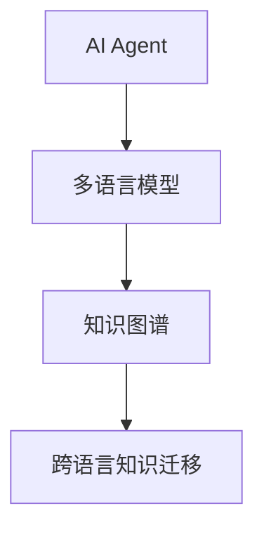
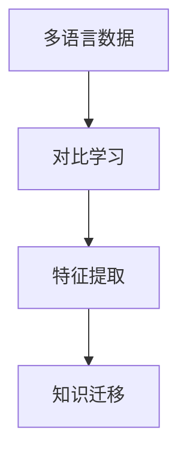
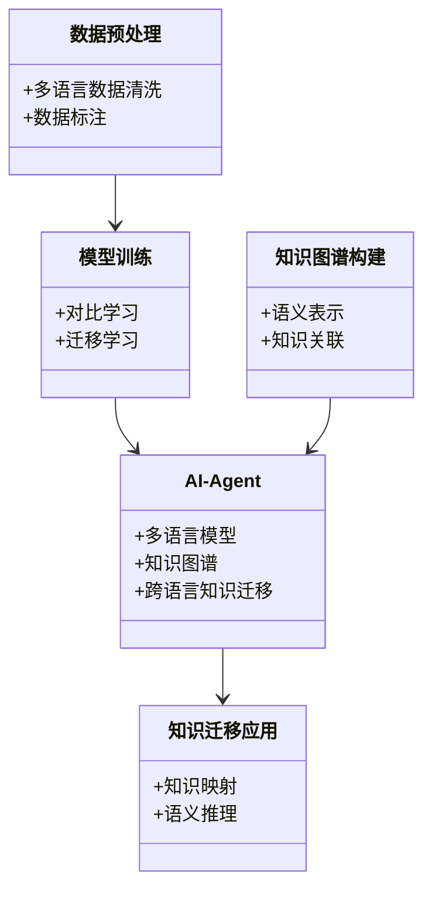
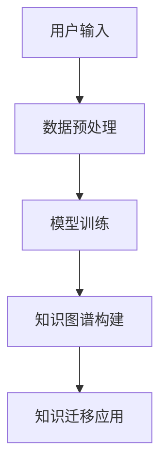

                 


# 开发具有跨语言知识迁移能力的AI Agent

## 关键词：跨语言知识迁移、AI Agent、多语言模型、知识图谱、迁移学习

## 摘要：本文详细探讨了开发具有跨语言知识迁移能力的AI Agent的理论与实践。从背景介绍到核心概念，从算法原理到系统架构设计，再到项目实战，系统地阐述了实现跨语言知识迁移的关键步骤和技术。通过案例分析和代码示例，帮助读者理解如何构建一个能够有效迁移知识的多语言AI Agent，并展望了未来的发展方向。

---

## 第一部分：背景介绍

### 第1章：跨语言知识迁移的背景与问题

#### 1.1 问题背景

在多语言环境下，AI Agent需要具备处理多种语言信息的能力。然而，不同语言之间的语义差异和表达方式使得知识迁移变得复杂。传统的单语言模型难以适应多语言场景，限制了AI Agent的应用范围。因此，开发具有跨语言知识迁移能力的AI Agent成为当前研究的热点。

#### 1.2 问题描述

跨语言知识迁移的核心问题在于如何在不同语言之间建立有效的知识映射，确保AI Agent能够在多语言环境中准确理解和应用知识。这涉及到语言模型的构建、语义分析以及知识图谱的构建与应用。

#### 1.3 问题解决

通过引入知识图谱和迁移学习技术，AI Agent可以在多语言环境中实现知识的高效迁移。知识图谱提供了跨语言的语义表示，而迁移学习则帮助模型在不同语言之间共享知识。

#### 1.4 跨语言知识迁移的边界与外延

跨语言知识迁移的边界在于其适用的语言范围和知识领域。外延则扩展到如何将跨语言知识迁移技术应用于更广泛的应用场景，如自然语言处理、机器翻译和智能问答系统。

---

## 第二部分：核心概念与联系

### 第2章：跨语言知识迁移的核心概念

#### 2.1 核心概念原理

跨语言知识迁移依赖于多语言模型和知识图谱的结合。多语言模型能够处理多种语言的信息，而知识图谱则提供了语义表示和知识关联的基础。

#### 2.2 概念属性对比表

| 概念 | 单语言模型 | 多语言模型 |
|------|------------|------------|
| 语言支持 | 单一语言   | 多种语言   |
| 训练数据 | 单一语言数据 | 多语言数据 |
| 性能 | 适用于特定语言 | 适用于多种语言 |

#### 2.3 ER实体关系图

Mermaid流程图：



---

## 第三部分：算法原理讲解

### 第3章：跨语言知识迁移的算法原理

#### 3.1 多语言模型的训练方法

多语言模型的训练通常采用对比学习和迁移学习。对比学习通过对比不同语言的数据，提取共同特征；迁移学习则将一个语言的知识迁移到另一个语言。

Mermaid流程图：



Python代码示例：

```python
import torch
import torch.nn as nn

class MultiLanguageModel(nn.Module):
    def __init__(self, vocab_size):
        super().__init__()
        self.embedding = nn.Embedding(vocab_size, 100)
        self.fc = nn.Linear(100, 10)

    def forward(self, x):
        embeds = self.embedding(x)
        out = self.fc(embeds)
        return out

# 初始化模型
vocab_size = 10000
model = MultiLanguageModel(vocab_size)

# 训练过程
optimizer = torch.optim.Adam(model.parameters(), lr=0.01)
criterion = nn.CrossEntropyLoss()

for batch_input, batch_label in dataloader:
    outputs = model(batch_input)
    loss = criterion(outputs, batch_label)
    loss.backward()
    optimizer.step()
```

---

## 第四部分：系统分析与架构设计

### 第4章：跨语言知识迁移系统的架构设计

#### 4.1 项目背景与目标

开发一个多语言AI Agent，目标是实现跨语言知识迁移，提升AI Agent在多语言环境中的性能。

#### 4.2 系统功能设计

系统功能模块包括数据预处理、模型训练、知识图谱构建和知识迁移应用。

Mermaid类图：



#### 4.3 系统架构设计

Mermaid架构图：



---

## 第五部分：项目实战

### 第5章：跨语言知识迁移的项目实现

#### 5.1 环境安装与配置

安装必要的Python库，如PyTorch、Transformers和networkx。

```bash
pip install torch transformers networkx
```

#### 5.2 核心功能实现

实现知识图谱构建和跨语言知识迁移的核心模块。

```python
from transformers import AutoTokenizer, AutoModel
from sentence_transformers import SentenceTransformer

# 加载预训练模型
tokenizer = AutoTokenizer.from_pretrained('bert-base-multilingual')
model = AutoModel.from_pretrained('bert-base-multilingual')

# 构建知识图谱
from networkx import Graph

graph = Graph()
graph.add_node('concept1')
graph.add_node('concept2')
graph.add_edge('concept1', 'concept2', weight=0.8)
```

#### 5.3 代码应用解读与分析

解释代码的功能和实现细节，展示如何在实际项目中应用这些技术。

#### 5.4 案例分析和详细讲解

通过具体案例，分析跨语言知识迁移在实际应用中的效果和挑战。

---

## 第六部分：总结与展望

### 第6章：总结与未

跨语言知识迁移的实现依赖于多语言模型、知识图谱和迁移学习技术的结合。本文系统地介绍了开发具有跨语言知识迁移能力的AI Agent的背景、核心概念、算法原理、系统架构设计和项目实战。未来的发展方向包括优化知识图谱的构建方法和提升迁移学习的效率。

---

## 结语

开发具有跨语言知识迁移能力的AI Agent是一项具有挑战性的任务，但也具有广阔的应用前景。通过深入理解核心概念和实践项目，读者可以更好地掌握这一技术，并在实际应用中发挥其潜力。

